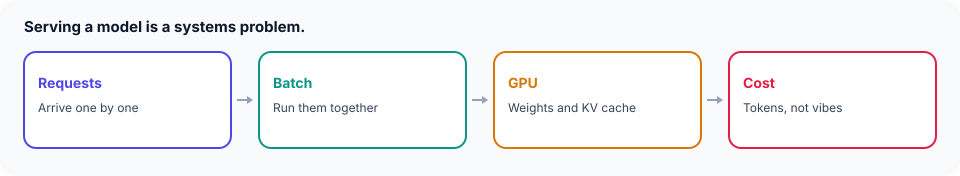

# AI-Native Design

<figure class="academy-figure">
  
</figure>

## Pages in This Section

| Page | Covers |
|------|--------|
| [Model Serving](model-serving.md) | Batching (static vs. continuous), KV cache, GPU autoscaling/cold starts, quantization, cost model |

**Out of scope for this site, by design:** context windows, scheduling, routing/gateways, RAG, hybrid search, reranking, embeddings, vector DBs, tools/agents, evals, guardrails, hallucination mitigation. That material lives in a dedicated AI engineering resource: [sanketn26.github.io/AIEngineering](https://sanketn26.github.io/AIEngineering/).

This section stays narrow on purpose — [Model Serving](model-serving.md) covers the systems/infra side of running models (batching, KV cache, autoscaling, cost) because that's squarely a distributed-systems problem, which is this site's lane. Application-layer AI engineering is a different discipline with its own resource.

**Next:** [Model Serving →](model-serving.md)
