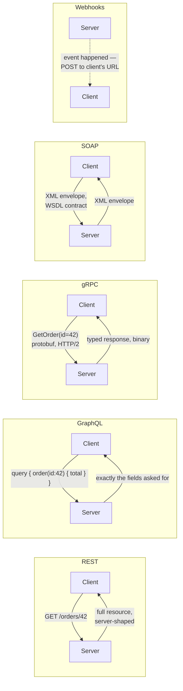
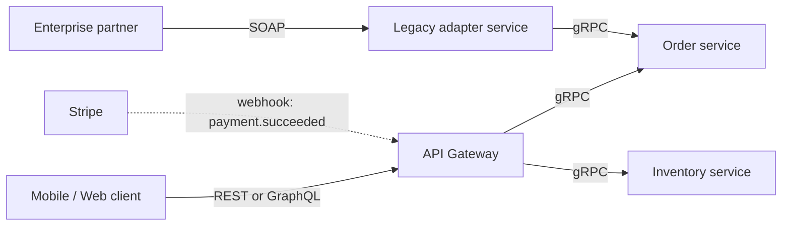

# API Architectural Styles — REST, GraphQL, gRPC, SOAP, Webhooks

**Prerequisites:** [API Design](../foundations/api-design.md), [Microservices Communication](microservices-communication.md)

[← Architecture Patterns](index.md)

---

## Why This Exists

[API Design](../foundations/api-design.md) covers REST and GraphQL in depth — verb contracts, idempotency, over/under-fetching. [Microservices Communication](microservices-communication.md) covers *when to go synchronous vs. async* and picks gRPC as the synchronous internal default. Neither page puts all five styles you'll actually encounter — REST, GraphQL, gRPC, SOAP, and webhooks — side by side and asks the question an interviewer actually asks: **"you have five options, why this one, for this caller?"**

This page is that comparison. It doesn't re-derive REST or GraphQL mechanics (see [API Design](../foundations/api-design.md) for that) — it's the decision layer on top, plus the two styles that page doesn't cover at all: **SOAP**, which you'll meet at any company with a 15-year-old enterprise integration, and **webhooks**, which every notification/payment/CI system in this repo already assumes exist but nothing has explained as a pattern with its own failure modes.

!!! tip "Mental Model"
    Every style answers one question: **who initiates, and how much does the client get to shape the response?**
    REST: client asks for a resource, server decides the shape.
    GraphQL: client asks for a resource, client decides the shape.
    gRPC: client calls a typed function, server executes it — not a resource model at all.
    SOAP: client calls a typed function too, but wrapped in a rigid, self-describing contract (WSDL) built for interop between organizations that don't trust each other's tooling.
    Webhooks: nobody "calls" anything — the **server** initiates, pushing to a client-provided URL when something happens.

---

## The Five Styles



### REST — resources, standard verbs

Model the API as nouns (`/orders/42`) manipulated by a fixed HTTP verb set, each with a promised meaning (GET is safe, PUT is idempotent). Full mechanics, the PUT-vs-POST idempotency line, and idempotency keys are in [API Design](../foundations/api-design.md#rest-resources-verbs-and-the-contract-they-imply) — this page assumes that and moves straight to "when do I pick it."

**Best for:** public APIs, CRUD-shaped resources, anywhere a browser, a third party, or a CDN/cache needs to reason about a stable URL.

### GraphQL — one endpoint, client-shaped queries

One endpoint; the client's query specifies exactly the fields it wants across possibly many related resources in one round trip. Full cost breakdown (N+1, cache loss, query-depth limiting) is in [API Design](../foundations/api-design.md#graphql-one-query-shape-not-one-endpoint-per-view).

**Best for:** clients with diverse, evolving data shapes hitting the same backend — mobile and web pulling different subsets of the same domain model, where the REST alternative is either chronic over-fetching or a proliferating set of bespoke endpoints per screen.

### gRPC — typed RPC for service-to-service

Not a resource model at all — the client calls a strongly-typed remote function (`GetOrder(OrderRequest) → OrderResponse`), defined in a `.proto` schema, serialized as compact binary Protocol Buffers over HTTP/2. Covered as the synchronous-internal default in [Microservices Communication](microservices-communication.md#synchronous-requestresponse).

**Best for:** internal service-to-service calls at scale, where both ends are your own code (or a partner willing to adopt `.proto`), and payload size / latency actually matter. Weak fit for anything a browser calls directly — browser gRPC support requires a proxy layer (grpc-web), and you lose `curl`-and-eyeball debuggability.

### SOAP — protocol-level contract, XML envelope

A message is an XML "envelope" with a strict, machine-readable contract (WSDL) describing every operation, parameter, and fault. Built in an era (and for an audience — banks, insurers, government, healthcare) where **two organizations that don't trust each other's engineering practices** needed a contract rigid enough that neither side could accidentally break it, plus first-class support for things REST leaves to convention: transactional messaging (WS-AtomicTransaction), formal security tokens (WS-Security), and guaranteed delivery (WS-ReliableMessaging).

```xml
<soap:Envelope xmlns:soap="http://schemas.xmlsoap.org/soap/envelope/">
  <soap:Header>
    <auth:Token xmlns:auth="...">eyJhbGciOi...</auth:Token>
  </soap:Header>
  <soap:Body>
    <GetOrder xmlns="http://example.com/orders">
      <OrderId>42</OrderId>
    </GetOrder>
  </soap:Body>
</soap:Envelope>
```

**Best for:** you almost never *choose* SOAP for a new system in 2026 — you inherit it. The realistic scenario is integrating with an enterprise partner (a bank's payment rail, an insurance clearinghouse, a government API) whose only exposed contract is a WSDL file, and the interview-relevant skill is recognizing "we need to wrap this behind an internal REST or gRPC facade" rather than letting SOAP's verbosity leak into the rest of the system.

**Why it's heavier, concretely:** every SOAP message carries the full envelope/namespace overhead regardless of payload size; there's no lightweight variant. WSDL gives you compile-time-checked clients (genuinely valuable for high-stakes B2B integration) at the cost of a toolchain most teams no longer maintain.

### Webhooks — the server initiates

Inverted control flow: instead of the client polling "did anything happen yet?", the client registers a URL, and the **server pushes** an HTTP POST to that URL the moment an event occurs — a payment settled, a CI build finished, a form was submitted.

```
1. Client registers: POST https://api.example.com/webhooks
     { "url": "https://myapp.com/hooks/stripe", "events": ["payment.succeeded"] }
2. Time passes.
3. Event happens on the SERVER's side (payment settles).
4. Server-initiated: POST https://myapp.com/hooks/stripe
     { "event": "payment.succeeded", "id": "evt_123", "data": {...} }
5. Client's endpoint must respond 2xx quickly, or the sender retries —
   often with backoff, for hours, per its own retry policy.
```

**This is not free of the problems every other async pattern in this repo has** — it's at-least-once delivery over HTTP, wearing a different name:

| Concern | Why it bites | Mitigation |
|---|---|---|
| **Duplicate delivery** | Sender's retry policy re-sends if it didn't see your 2xx (including if your 2xx itself got lost in transit) | Idempotency: dedupe on the event's own id, same discipline as [API Design](../foundations/api-design.md#idempotency-keys-making-post-safe-to-retry)'s idempotency keys |
| **Out-of-order delivery** | Two events for the same resource can race across independent HTTP deliveries and retries | Include a version/sequence number in the payload; reject or reorder stale ones, don't just apply-in-received-order |
| **Spoofed requests** | Your endpoint is a public URL — anyone who finds it can POST fake events | Verify a signature header (HMAC of the payload with a shared secret) before trusting the body at all |
| **Receiver downtime** | Your endpoint is down when the event fires | Sender-side retry with backoff (bounded — most providers give up after N hours) + a reconciliation job that polls for anything a lost webhook might have missed |
| **Slow receiver blocks sender's queue** | If your handler does real work synchronously, you risk timing out the sender's retry budget | Return 2xx immediately after durably enqueueing; do the real work async off that queue |

**Best for:** exactly the notification-system and payment-processing shapes this repo already builds elsewhere — third-party integrations, "notify me when X happens" without polling. It is a **push notification pattern**, not a request/response style, which is why it doesn't fit the same table as the other four without a caveat: there's no synchronous "response" to a webhook in the way REST/GraphQL/gRPC/SOAP all have one — success is "the receiver's 2xx," nothing more.

---

## Comparison

| Style | Communication model | Data format | Strengths | Trade-offs |
|---|---|---|---|---|
| REST | Request-response | JSON (usually) | Simple, universally supported, cacheable per-URL | Over/under-fetching; no built-in schema contract |
| GraphQL | Request-response | JSON | Client-shaped queries, single endpoint | N+1 resolver risk, harder to cache, needs query-cost limits |
| gRPC | RPC (unary or streaming) | Protobuf (binary) | Fast, compact, strongly typed, HTTP/2 streaming | Weak browser support, needs tooling to debug (`grpcurl`, not `curl`) |
| SOAP | Request-response | XML | Strict contracts (WSDL), built-in security/transaction/reliability standards | Verbose, heavy tooling, rarely chosen new — inherited from partners |
| Webhooks | Event-driven push | Usually JSON | Real-time, no polling, loosely coupled | Delivery is at-least-once — duplicate/out-of-order/spoofing all need handling on the receiver |

---

## Decision Framework

```
Who's the caller, and what do they need?

Public API, third parties, browsers, "just needs to work everywhere"
  → REST

Internal or first-party client with diverse, evolving screen/data shapes
  → GraphQL

Internal service-to-service, high volume, latency-sensitive, both ends yours
  → gRPC

Integrating with an enterprise/gov/financial partner whose only contract is a WSDL
  → SOAP (wrap it behind an internal REST/gRPC facade immediately)

"Notify me when X happens" instead of polling
  → Webhooks (with signature verification + idempotent receiver, non-negotiably)

Real system: usually more than one of the above, at different boundaries
  → REST at the edge, gRPC internally, GraphQL for a specific
    diverse-client BFF layer, webhooks for outbound async notification —
    see the Hybrid Reality section below
```

!!! note "Interview Insight 🎯"
    A weak answer picks one style "because it's modern." A strong answer names the **caller** for each boundary in the system and matches style to caller: "Public REST API for partners, because they need stable cacheable URLs and can't be expected to adopt gRPC tooling. Internally, gRPC between our own services because we control both ends and care about latency. We accept inbound Stripe webhooks for payment events, which means our webhook handler has to be idempotent and verify Stripe's signature header before trusting anything in the body." That's four styles in one system, each justified by who's on the other end — which is the realistic shape of every nontrivial platform.

---

## Hybrid Reality

Nearly every system in this repo's [system-design-exercises](../system-design-exercises/index.md) already does this without naming it:



The public edge and the internal mesh are almost never the same protocol on purpose — see [Microservices Communication](microservices-communication.md#putting-it-together) for the gateway-does-protocol-translation pattern (public REST/GraphQL in, internal gRPC out) that makes this combination coherent instead of accidental.

---

## Interview Questions

=== "Foundation"
    **Q: What's the core difference between REST and GraphQL, and when would you pick each?**

    "REST models the API as resources with a fixed verb set — the server decides the shape of what comes back for a given URL. GraphQL exposes one endpoint where the client's query specifies exactly the fields it wants, which fixes over-fetching and under-fetching for clients with diverse needs. I'd pick REST as the default for a public API or anything that benefits from per-URL caching and universal tooling support. I'd reach for GraphQL when I have client-shape diversity that's real and ongoing — several front-ends pulling different slices of the same domain model — not just because REST feels chatty once."

=== "Senior"
    **Q: A partner's only integration option is a SOAP/WSDL endpoint. How do you fit that into a system that's otherwise REST and gRPC internally?**

    "I wouldn't let SOAP's verbosity or tooling leak past the boundary. I'd build a thin adapter service whose only job is to speak SOAP to the partner and translate to/from our internal gRPC or REST contract — the rest of the system never sees XML envelopes. That isolates the WSDL toolchain and the WS-* complexity to one small, well-tested surface, and if the partner ever modernizes their API, only that adapter changes."

=== "Staff"
    **Q: Your team is building inbound payment-event handling via webhooks from a PSP. What do you insist is non-negotiable in the design?**

    "Three things, because I've seen each one cause a real incident. First, signature verification on every inbound webhook before touching the body — it's a public URL, and an unverified webhook handler is an unauthenticated write path into billing state. Second, idempotency keyed on the provider's own event id, because at-least-once delivery means duplicates are guaranteed, not hypothetical — a double-processed 'payment.succeeded' can double-credit an account. Third, the handler returns 2xx immediately after durably enqueueing the event and does the real work asynchronously, because if we do synchronous work in the handler and it's ever slow, we risk the PSP's retry logic firing duplicate deliveries on top of a request that was actually still in flight. I'd also want a reconciliation job that polls the PSP's API periodically for anything a webhook we never received (network blip, our endpoint down) might have missed — webhooks are an optimization over polling, not a replacement for the ability to recover without one."

---

## Key Takeaways

!!! success "Remember"
    1. Every style answers "who initiates, and who shapes the response" — REST/GraphQL/gRPC/SOAP are all pull (client asks); webhooks are push (server initiates).
    2. REST and GraphQL trade cacheability/simplicity for client-side query flexibility — see [API Design](../foundations/api-design.md) for the full mechanics of both.
    3. gRPC is the internal, typed, high-throughput default when you control both ends — see [Microservices Communication](microservices-communication.md) for where it fits against async patterns.
    4. SOAP is inherited, not chosen — isolate it behind an adapter the moment you integrate with a partner who requires it.
    5. Webhooks are at-least-once HTTP delivery with a different name — duplicate delivery, ordering, and spoofing are real concerns, not edge cases, and the fixes are the same idempotency/signature discipline used everywhere else in this repo.
    6. Real systems combine several of these at different boundaries — matching style to *caller*, not adopting one style everywhere, is the signal that separates a senior answer from a recall answer.

**Previous:** [Architecture Patterns](index.md) | **Related:** [API Design](../foundations/api-design.md), [Microservices Communication](microservices-communication.md)
