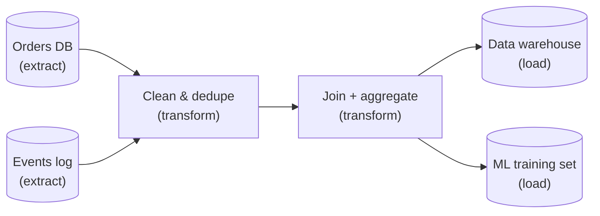
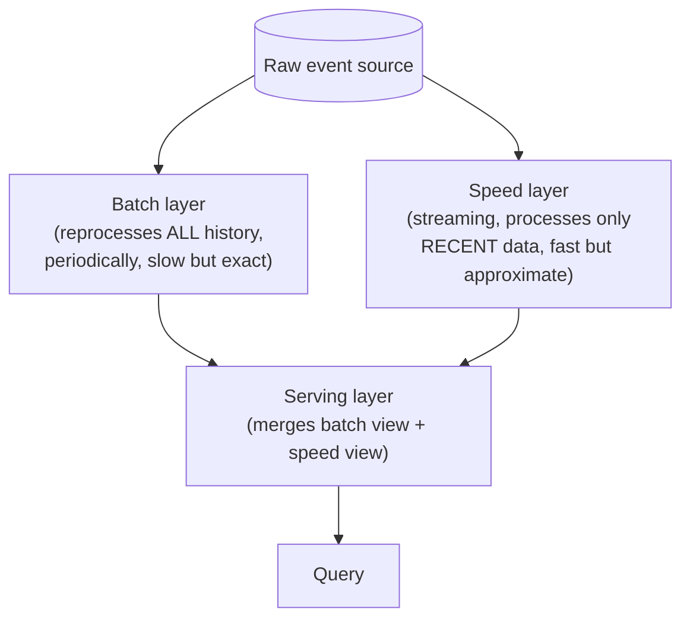
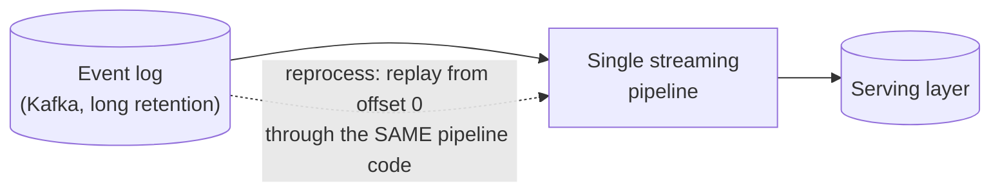

# Batch/ETL & Lambda vs. Kappa Architecture

**Prerequisites:** [Architecture Patterns](index.md), [Stream Processing](stream-processing.md)

[← Back to Patterns](index.md)

---

## Why This Exists

[Stream Processing](stream-processing.md) makes the case for computing continuously over unbounded data — but most data platforms don't run *only* streaming pipelines, and pretending batch is obsolete is its own mistake. A lot of real analytical work is naturally batch: a finance team's month-end reconciliation, a nightly model retraining job, a data warehouse load that only needs to be correct by 6 a.m. **Batch isn't a worse version of streaming — it's the right tool when latency doesn't matter and you want the operational simplicity of "run it, verify it, done" over the complexity of a system that runs forever.**

The actual design problem most data platforms face is: **you need both** — a low-latency path for the dashboards and alerts that can't wait until tomorrow, and a batch path for the deep, correctness-checked analytics that can. How you combine the two is what Lambda and Kappa architecture are competing answers to.

---

## Batch/ETL: The DAG Model

A batch pipeline is a directed acyclic graph (DAG) of steps — extract data from sources, transform it, load it into a destination — orchestrated to run on a schedule or triggered by an upstream event (a file landing, an upstream job finishing).

- **Orchestration** (Airflow, Dagster, and similar tools) tracks the DAG's dependencies, retries failed steps, and enforces ordering — step 2 doesn't run until step 1 actually succeeded, not just "probably finished by now." This is the piece that turns "a bunch of cron jobs" (which run on a schedule regardless of whether the upstream data was actually ready) into a real pipeline with correctness guarantees about ordering.
- **Idempotent, re-runnable steps** are the same discipline as the idempotency pattern covered for remote calls in [Distributed Systems](../distributed-systems/index.md#idempotency-the-one-tool-that-makes-retries-safe) — a batch step needs to produce the same output whether it runs once or is re-run after a failure halfway through, because "just re-run the DAG" is the standard recovery mechanism, and it only works safely if re-running doesn't double-count or double-load data.
- **Backfills** — reprocessing historical data after a bug fix or a schema change — are a first-class batch operation with no real streaming equivalent: you can rerun last month's DAG runs against corrected logic because the source data is still sitting there, bounded and unchanged. A pure streaming system has already processed and often discarded the raw events by the time a bug is found, which is why even heavily-streaming shops usually keep a batch/backfill path alive.

!!! tip "Batch isn't legacy — it's a latency/complexity trade you make on purpose"
    The failure mode isn't "using batch" — it's using batch for something that actually needs sub-minute freshness (fraud scoring, live inventory) because streaming felt like more effort to build. The design question is always "what does this specific pipeline's freshness requirement actually demand," the same discipline as picking a DR tier by RTO/RPO rather than defaulting to the most sophisticated option.

---

## Lambda Architecture: Batch and Streaming, Side by Side

Lambda architecture is the original answer to "I need both a correct historical view and a low-latency live view": **run the same logic twice, in two separate systems, and merge the results at query time.**

- **Batch layer:** periodically recomputes the complete, correct view over all historical data — slow, but authoritative. This is the source of truth.
- **Speed layer:** a streaming pipeline that covers only the *recent* window not yet reflected in the batch layer's last run — fast, but its output is provisional, superseded once the next batch run catches up and covers that time range with the exact computation.
- **Serving layer:** merges the two — query results combine the batch layer's authoritative older data with the speed layer's fast-but-approximate recent data.

**The problem Lambda architecture is infamous for:** you now have **the same business logic implemented twice, in two different systems (a batch engine and a streaming engine), that have to produce results consistent enough to merge.** Every change to the aggregation logic has to be made and tested in both places, in two different programming models, and the two implementations *will* drift — a rounding difference, an edge case handled differently, a bug fixed in one and forgotten in the other. This dual-implementation cost is the entire reason Kappa architecture was proposed as a reaction to it.

---

## Kappa Architecture: One Path, Reprocessed When Needed

Kappa's premise: **if your stream processing engine can reprocess historical data as fast and as correctly as a batch job can, you don't need a separate batch layer at all — just replay the stream from the beginning (or from a checkpoint) through the same streaming logic.**

This works when the underlying log (Kafka with long retention, or a similarly durable, replayable event store) keeps enough history to replay, and the stream processing engine is genuinely capable of catching up through a large backlog fast enough to matter — which modern engines (Flink, in particular) have gotten good enough at that Kappa is now the more common default for new systems, rather than the exception Lambda was designed to route around.

**What Kappa doesn't remove:** the *operational* need to sometimes reprocess with corrected logic still exists — a bug in the streaming aggregation still needs a "replay from an earlier offset with the fix" operation. Kappa's win is that this reprocessing runs through the *same* code path as live processing, so there's one implementation to maintain and one place bugs get fixed, instead of two.

---

## Choosing Between Them

| | Lambda | Kappa | Pure batch |
|---|---|---|---|
| Implementations to maintain | Two (batch + streaming logic) | One (streaming logic, replayed when needed) | One (batch only) |
| Freshness | Batch layer: hours; speed layer: seconds | Seconds, consistently | Hours to a day |
| Reprocessing history | Native — batch layer already does this | Requires replayable log with sufficient retention | Native — rerun the DAG |
| Consistency risk | Real — two implementations drift | Low — one implementation | N/A |
| When it's the right call | Legacy systems already built this way, or a stream engine genuinely can't reprocess fast enough for your history depth | New systems, when the stream engine and log retention can handle full reprocessing | No sub-hour freshness requirement anywhere in the pipeline — most internal analytics, financial reconciliation, ML training data |

---

## Interview Questions

=== "Foundation"
    **Q: What's the core difference between Lambda and Kappa architecture?**

    "Both solve the same problem — you need a fast, low-latency view of recent data and a correct, complete view of historical data. Lambda solves it by running two separate systems, a batch layer for historical correctness and a streaming speed layer for recent data, merged at query time — which means the same logic is implemented twice and can drift between the two. Kappa solves it with a single streaming pipeline, and handles 'recompute historical data' by replaying the event log from an earlier point through that same pipeline, so there's only one implementation to maintain."

=== "Senior"
    **Q: Your team runs Lambda architecture and just found a metric that disagrees between the batch view and the speed view. How do you debug it, and what does this tell you about the architecture?**

    "First I'd check whether it's expected transient disagreement — the speed layer covers the window the batch layer hasn't caught up to yet, so some divergence right at the boundary is normal and should resolve once the next batch run completes. If it doesn't resolve, the two implementations have actually diverged — different rounding, a different edge case handled inconsistently, or a bug fixed in one codebase and not the other, since they're separately maintained. That's the structural risk Lambda architecture is known for: correctness now depends on keeping two different systems in sync by discipline, not by construction. I'd treat a recurring divergence as a signal to evaluate whether a Kappa-style single pipeline, if the log retention and reprocessing speed can support it, would remove the class of bug entirely rather than just fixing this one instance."

=== "Staff"
    **Q: A platform team wants to migrate from Lambda to Kappa architecture. What would make you push back, and what would make this the right call?**

    "I'd push back if the event log doesn't retain enough history to support full reprocessing, or if the streaming engine can't catch up through that much backlog in an operationally acceptable window — Kappa's entire premise depends on 'replay is fast and complete enough to substitute for batch,' and if that's not true yet, the migration just removes the correctness the batch layer was providing without actually delivering the promised simplification. I'd also check what depends on the batch layer today beyond the merged view — sometimes batch outputs feed things (ML training sets, finance reconciliation) that specifically want a bounded, auditable run, and 'we replay a stream' is a different operational story to explain to an auditor than 'this batch job ran at 2 a.m. and here's its log.'

    Given retention and reprocessing speed are sufficient, I'd support the migration — the dual-implementation drift risk in Lambda is real and recurring, not hypothetical, and consolidating to one pipeline removes an entire category of 'why do these two numbers disagree' incidents. I'd stage it: run Kappa in shadow alongside the existing Lambda system, compare outputs over a real reprocessing cycle, and only cut over once the reprocessed Kappa output has demonstrably matched the batch layer's historical correctness, not just the streaming speed layer's approximate one."

---

## Key Takeaways

!!! success "Remember"
    1. **Batch isn't obsolete — it's the right tool whenever nothing in the pipeline needs sub-hour freshness**, and it comes with genuine advantages streaming doesn't have (native backfills, simpler operational model).
    2. **A batch DAG needs idempotent, re-runnable steps** — the same discipline as idempotent remote calls, applied to pipeline steps instead of API requests.
    3. **Lambda architecture's real cost is maintaining the same logic twice, in two systems, that can silently drift** — not the complexity of running two systems per se.
    4. **Kappa architecture removes the dual-implementation risk by replaying history through the same streaming pipeline** — but it depends on the log retaining enough history and the engine reprocessing fast enough to substitute for batch.
    5. **Neither is a default — pick based on the actual freshness requirement and whether your log/engine can support full reprocessing**, the same "requirement drives the pattern" discipline used everywhere else on this site.

---

**See also:** [Stream Processing](stream-processing.md) for the mechanics (watermarks, windowing, exactly-once) that make the streaming half of either architecture work.

**Previous:** [Stream Processing](stream-processing.md)
