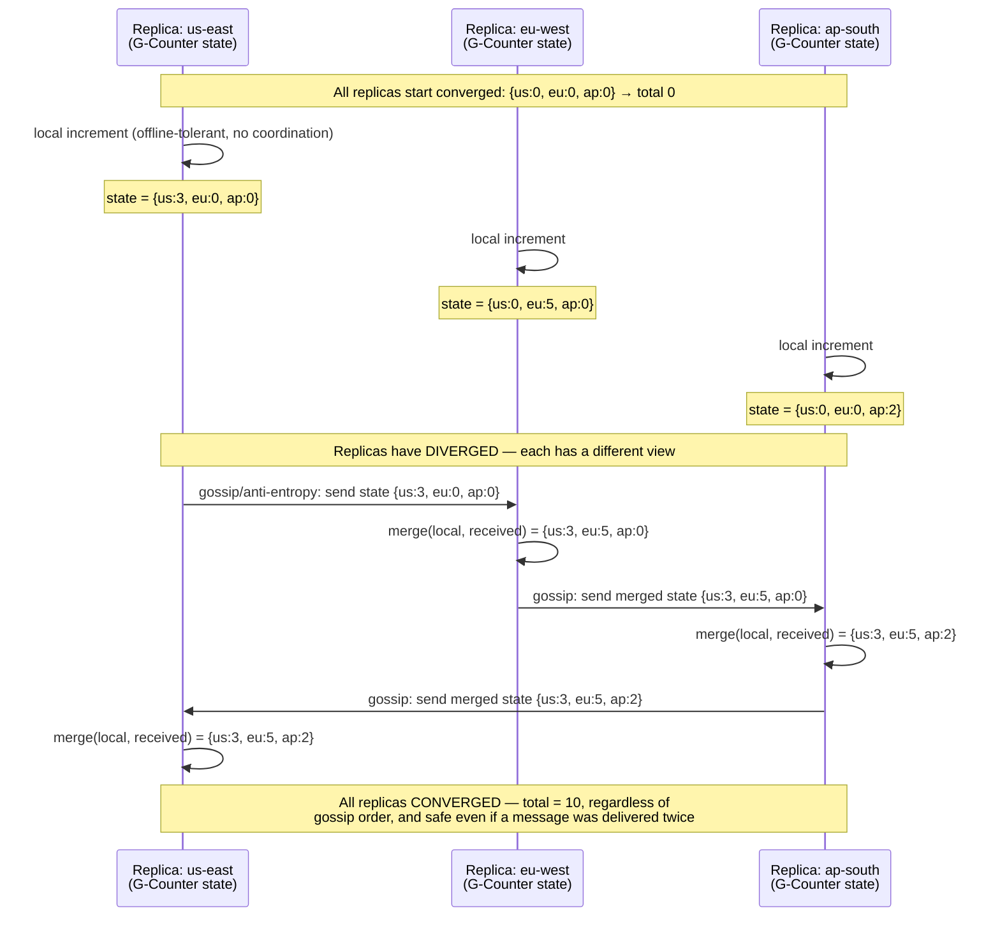
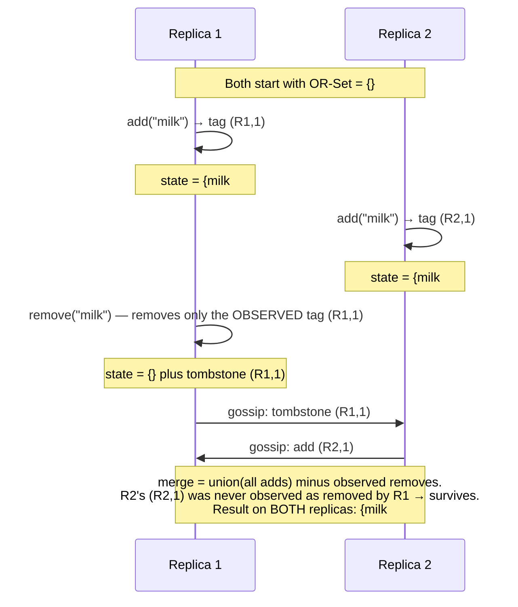

# CRDTs — Conflict-Free Replicated Data Types

**Prerequisites:** [Architecture Patterns](index.md), [DDIA Concepts](../databases/ddia-concepts.md)

[← Back to Patterns](index.md)

---

## Why This Exists

**Problem: multiple writers, no leader, and you still need the data to converge.**

A single-leader database sidesteps the hard multi-writer problem by having exactly one place writes go — conflicts can't happen because there's only ever one writer to agree with. That works until you need writers who can't reach a leader: a laptop that's offline on a flight, a phone in airplane mode, or a genuinely multi-region system where routing every write to one region adds latency you can't afford.

Multi-leader replication (see [DDIA Concepts](../databases/ddia-concepts.md#part-7-conflict-free-replicated-data-types-crdts)) lets each region accept writes locally, but then two regions can concur on different values for the same field, and *something* has to resolve that conflict — last-write-wins, a merge function, or surfacing it to a human (a Git merge conflict). The DDIA page introduces this at a high level: LWW counters and vector clocks as motivating examples of why automatic merge is hard.

**This page goes one level deeper: CRDTs are a family of data structures engineered so that merge is not just automatic, but *mathematically guaranteed to converge* — no matter what order updates are applied in, no matter how many times a message is delivered twice, and without any coordination between replicas at write time.** That guarantee is what makes offline-first apps (Figma's multiplayer cursors, Notion's blocks, Redis CRDTs in Enterprise, Riak's data types) possible without a central arbiter.

---

## Mental Model: Convergent Merge, Not Conflict Resolution

Think of two people independently editing the same shared shopping list on paper, each starting from the same list, unable to talk to each other until they meet up later.

A naive approach ("last person to write wins") means whoever wrote *last* — by clock time — overwrites the other's changes entirely, even if their change was "add butter" and the other's was "add milk." One of those additions is silently lost. That's what LWW-Register does, and the DDIA page's LWW-Counter example shows exactly this failure: Device-B's real increment gets thrown away because Device-A's clock says it wrote later.

A CRDT is designed differently: **the data structure itself is built so that merging two independently-edited copies, in any order, any number of times, produces a result any reasonable person would accept as "both people's edits, combined."** A CRDT counter doesn't store "the count" — it stores "how much *each* replica contributed," and merging just takes the max (or sum) per replica. There's no moment where you decide a winner and a loser; the structure makes "combine both" the *only* possible outcome of a merge.

The formal property that makes this work is that CRDT merge functions are commutative, associative, and idempotent — apply updates in any order (commutative), group them any way (associative), and apply the same update twice with no extra effect (idempotent). Any function with those three properties converges to the same result regardless of delivery order or duplication — which is exactly what an unreliable, unordered network gives you for free.

---

## Architecture: Divergence and Convergence Across Regions



**What this shows:** replicas accept writes independently while partitioned (no coordinator, no blocking), diverge in their local view, and then converge to the identical state once anti-entropy gossip has propagated — no matter which pair talked to which first, and safely even under duplicate delivery, because `merge` (here, per-replica max/sum) is commutative, associative, and idempotent.

---

## How It Works Internally

### State-Based (CvRDT) vs. Operation-Based (CmRDT)

- **State-based (Convergent Replicated Data Type):** each replica periodically ships its *entire current state* to peers; the receiving replica calls a `merge(local, remote)` function that must be commutative, associative, and idempotent. Simple to reason about and tolerant of dropped/duplicated/reordered messages (a missed gossip round is just caught up on the next one), at the cost of transmitting the whole state repeatedly — fine for a counter, expensive for a large set.
- **Operation-based (Commutative Replicated Data Type):** each replica ships only the *operation* (e.g., "add element X") rather than the whole state, which is bandwidth-efficient, but requires a reliable, causally-ordered (or at least exactly-once/duplicate-suppressing) delivery channel — operation-based CRDTs are only guaranteed to converge if the messaging layer guarantees causal delivery and no message is lost. That's a much stronger requirement on the network than state-based CRDTs need, which is why state-based is the more common choice when the transport can't guarantee ordering.

### Concrete CRDT Types

**G-Counter (grow-only counter):** state is a vector of per-replica counts; each replica only increments its own slot. `value()` = sum of all slots. `merge` = element-wise max. Cannot decrement — that needs PN-Counter.

```
Replica A increments 3x, Replica B increments 5x, independently:
  A's state: {A:3, B:0}     B's state: {A:0, B:5}
  merge → element-wise max → {A:3, B:5}     total value = 8
```

**PN-Counter (increment/decrement counter):** two G-Counters internally — one tracking increments (P), one tracking decrements (N). `value()` = sum(P) - sum(N). Solves "can this go negative" by tracking positive and negative separately, each grow-only, so both merge safely with element-wise max.

**G-Set (grow-only set):** elements can be added, never removed. `merge` = set union. Trivially convergent, but useless if you ever need to delete something.

**2P-Set (two-phase set):** a G-Set of added elements plus a G-Set of "tombstoned" (removed) elements; an element is present iff it's in the add-set and not in the remove-set. Problem: once removed, an element can *never be re-added* — the tombstone is permanent, because the merge logic can't tell "never removed" from "removed then re-added" without more information.

**OR-Set (observed-remove set):** the practical answer to 2P-Set's limitation. Each *add* is tagged with a unique ID (not just the value); removal removes only the specific tagged instances the remover has *observed*. This allows "remove X, then add X again" to work correctly — the re-add gets a fresh unique tag, so it isn't confused with the removed instance. This is the set CRDT actually used in production systems (Riak, Redis CRDTs).



**What this shows:** a 2P-Set would have tombstoned "milk" permanently once any replica removed it, so R2's concurrent add would be silently lost forever. OR-Set's per-instance tags mean R1's remove only ever touches the instance R1 actually saw — R2's independently-added instance survives the merge.

**LWW-Register (last-write-wins register):** stores a single value plus a timestamp (physical or logical); merge picks the value with the higher timestamp. Simple, and what the DDIA page's LWW-Counter example is built on — but it silently discards the loser's write entirely, which is the trade-off worth naming explicitly (see Failure Modes).

**RGA (Replicated Growable Array):** the CRDT behind collaborative text editing (ordered sequences — think Google Docs-style character insertion, though Docs itself uses Operational Transformation, not RGA). Each element's unique ID is a `(replica-id, logical-counter)` pair — the replica's own ID plus a counter it increments on every local insert — along with a reference to the ID of its logical predecessor. Concurrent inserts at the same position are ordered deterministically by comparing these IDs (e.g. the insert with the higher replica-id sorts first among ties at the same predecessor), so "type X" and "type Y" at the same cursor position from two users both survive, ordered consistently across all replicas because every replica applies the same comparison rule, rather than one overwriting the other.

---

## Realistic Example

**Offline-first collaborative task list (imagine a lightweight Trello-like tool):**

- Each board is an OR-Set of task cards; each card's title is an LWW-Register; each card's "done" state is a PN-Counter-backed boolean (or a dedicated boolean CRDT); the card list order is an RGA.
- User A is offline on a flight, adds 3 cards, marks 1 done, deletes 1 card. All operations apply locally instantly — no network round trip, no blocking.
- User B, online the whole time, adds 2 cards and edits a title User A also edited (concurrent LWW-Register write — one edit wins by timestamp, the loser's edit is gone unless the app explicitly warns the user or keeps both as a "conflict" surfaced in the UI).
- User A lands, reconnects; anti-entropy sync exchanges state (or a compact operation log) between A's local replica and the server; OR-Set merges (both users' adds/deletes reconcile correctly, including A's delete not resurrecting under B's concurrent unrelated changes); RGA merges (card order is consistent for both users afterward).
- Convergence time: bounded by gossip/sync interval — typically sub-second on reconnect for a board with hundreds of cards, since state-based CRDT payloads for a bounded-size board are small.
- What does NOT reconcile automatically: the LWW-Register title conflict silently picked a winner. A well-built app either surfaces "this was edited by two people, here's both versions" (application-level conflict UI) or accepts the automatic winner and documents that trade-off — the CRDT alone won't tell you which is right for your product.

---

## Failure Modes

### 1. Tombstone Growth in OR-Set

Every removal in an OR-Set (and every 2P-Set) leaves a tombstone marker behind — it has to, so a later gossip round from a replica that hasn't heard about the removal doesn't resurrect the deleted element. If your workload has heavy churn (frequent add/remove of many elements — a chat app's "typing" indicators, a presence set), **tombstones accumulate forever unless actively garbage collected**, and eventually the tombstone set outweighs the live data, bloating storage and slowing merges.

**Mitigation:** causal stability tracking — once every replica has observed a tombstone (confirmed via a vector-clock-like mechanism), it's safe to garbage-collect it. This requires knowing that no replica can still be "behind" in a way that would resurrect the element, which itself requires some coordination — a CRDT's tombstone GC is one of the few places the "no coordination needed" promise gets complicated in practice.

### 2. LWW Silently Drops Concurrent Writes

This is the failure mode the DDIA page's example already flags: LWW resolves a genuine conflict — two people intentionally changed the same field differently — as if it weren't a conflict at all, using clock time as a tiebreaker. If the clocks are skewed (not perfectly synchronized across replicas — the common case), a write that happened *causally later* can lose to a write that happened *causally earlier* but has a larger physical timestamp due to clock drift. **LWW is not "correct," it's "deterministic and simple" — the cost is that a user's real edit can vanish with no error, no conflict notification, nothing.**

**Mitigation:** use a logical clock (Lamport timestamp or hybrid logical clock) instead of raw wall-clock time to at least respect causal ordering; or don't use LWW-Register for anything where silently losing an edit is unacceptable — use a multi-value register (keep both concurrent values, surface the conflict to the application) instead.

### 3. Not a Fit for Invariants Across Replicas

CRDTs guarantee convergence of *the replicated data structure itself*, not arbitrary application-level invariants that span multiple pieces of state. **"Account balance can never go negative" is not expressible as a CRDT invariant** — a PN-Counter can go negative just fine (two replicas each independently authorize a debit that's individually valid against their local view, but the sum overdraws). CRDTs give you convergence, not global correctness; if your invariant requires knowing the *global* state before allowing a local write, you need coordination (consensus, a leader, or a reservation protocol) — that's fundamentally what CRDTs are designed to avoid needing, so they can't also give you the guarantee that requires it.

### 4. Unbounded State Growth for Certain Types

A G-Counter's state size grows with the number of distinct replicas that have ever incremented it, not with the count value — millions of short-lived replicas (e.g., one per mobile session) each incrementing once produces a state vector with millions of entries, most contributing "1" once and never again. This is a design smell: CRDTs assume a relatively stable, bounded set of replica identities, not one identity per ephemeral client.

---

## Production Debugging

**Verifying convergence:**

The core operational question for a CRDT-backed system isn't "is it up," it's "have all replicas actually converged, and if not, why." Convergence isn't instantaneous — it's bounded by however often anti-entropy/gossip runs, and a partition or a stuck gossip peer can leave replicas diverged far longer than expected.

- **Digest/hash comparison:** periodically compute a hash of each replica's merged state (or a Merkle tree over it, as Dynamo-style systems do for anti-entropy) and compare across replicas — a mismatch after the expected sync window means gossip isn't propagating, not that the CRDT math is wrong.
- **Merkle tree anti-entropy repair:** rather than shipping full state on every gossip round, replicas exchange Merkle tree roots first; a mismatch narrows down to the specific diverged subtree, so repair only ships the actually-differing data — this is the same mechanism Dynamo/Cassandra/Riak use for read-repair, applied to CRDT state sync.
- **Tombstone count / GC lag:** track tombstone count as a metric per collection; a steadily growing count with no corresponding GC activity is the tombstone-bloat failure mode surfacing before it becomes a storage incident.
- **Gossip fanout and round latency:** if convergence SLA is "under 5 seconds after reconnect," measure actual gossip round latency and fanout (how many peers each replica talks to per round) — a low fanout in a large cluster means convergence takes many rounds (O(log N) rounds for full propagation with reasonable fanout, more if fanout is too low).

**Decision tree — "replicas disagree, what do I check":**

```
Replicas show different values for the same key/collection
├── Recently reconnected after a partition?
│   → expected transient divergence; check it resolves within
│     the gossip interval; if not, gossip peer selection is stuck
│
├── Consistently diverged, not resolving over time?
│   → check gossip/anti-entropy process is actually running per replica
│   → check for a bug in the merge function (is it actually
│     commutative/associative/idempotent? a subtle bug here
│     breaks the entire convergence guarantee silently)
│
└── One replica has a suspiciously smaller/larger tombstone set?
    → tombstone GC ran inconsistently; check causal-stability
      tracking is seeing all replicas, not just a subset
```

---

## Trade-offs

| | CRDTs | Consensus (Raft/Paxos) | Operational Transformation |
|---|---|---|---|
| Coordination required at write time | None — writes are always local and immediate | Yes — a write needs a majority quorum before it's committed | None for local edits, but transform requires a central server (or agreed order) to sequence operations |
| Availability under partition | Full — every replica accepts writes independently (AP in CAP terms) | Reduced — minority partition can't commit writes (CP in CAP terms) | Depends on implementation; classically server-mediated, so server partition blocks sync |
| Convergence guarantee | Mathematical — guaranteed by commutative/associative/idempotent merge | N/A — there's one agreed history, not a merge of divergent ones | Guaranteed if transform functions are correctly specified (notoriously hard to get right) |
| Best fit | Offline-first apps, multi-region low-latency writes, eventually-consistent counters/sets | Strong consistency needs — leader election, distributed locks, anything requiring a single agreed order | Real-time collaborative text editing with a central coordinating server (Google Docs) |
| Global invariants (e.g. balance ≥ 0) | Not expressible — needs coordination outside the CRDT | Natural fit — the leader can enforce invariants before committing | Not typically the use case |
| Implementation complexity | Moderate — but getting merge functions actually correct (commutative/associative/idempotent) is easy to get subtly wrong | High — correct consensus implementations are famously hard (this is why Raft was designed to be more understandable than Paxos) | High — transform function correctness is a known hard problem, one reason many modern collaborative editors use CRDTs (e.g., RGA-family) instead |

---

## Interview Questions

=== "Foundation"
    **Q: What problem do CRDTs solve that a single-leader database doesn't have?**

    "Multi-writer conflicts without coordination. A single-leader database avoids conflicts by having one place writes go, so there's only ever one writer to agree with. If you need writers that can't reach a leader — offline clients, or multi-region writes where routing everything to one region is too slow — you get concurrent writes to the same data, and something has to merge them. CRDTs are data structures engineered so that merge is automatic and mathematically guaranteed to converge to the same result, regardless of what order the merges happen in."

    **Q: What's the difference between a G-Counter and a PN-Counter?**

    "A G-Counter only grows — each replica tracks its own increments in a vector, and the total is the sum, merged by taking the element-wise max per replica. It can't represent a decrement. A PN-Counter adds decrement support by internally running two G-Counters, one for increments and one for decrements, and the value is the difference — both halves are still grow-only, so both still merge safely."

=== "Senior"
    **Q: Your team built a distributed 'like' counter using LWW-Register per user's like state. Users report their likes sometimes disappear. Why, and what would you use instead?**

    "LWW-Register resolves any conflicting write by keeping only the one with the higher timestamp and discarding the other entirely — that's fine for a field where only one value should ever exist, but wrong for something like/unlike where both users' actions are independently valid events. If two 'like' actions on different replicas race, LWW just picks a winner by clock time and the other vanishes with no error. I'd use a G-Counter or a dedicated boolean/flag CRDT (or model 'liked-by-user-X' as OR-Set membership) instead — something that represents 'both operations happened' rather than 'one operation replaced the other.' The deeper lesson is LWW is the wrong tool whenever the conflicting writes are both individually meaningful rather than one superseding the other."

    **Q: When would you choose CRDTs over Raft-based consensus for a distributed counter?**

    "It depends on whether availability during partition matters more than a single agreed value. CRDTs let every replica accept writes locally even while partitioned — no write ever blocks waiting for a quorum, which matters for offline-first clients or latency-sensitive multi-region writes. Raft requires a majority to commit, so a minority partition can't write at all, but you get one linear history you can reason about with strong guarantees, including things like exact invariants. If I need 'this counter must never show a negative balance' or similarly strict cross-replica invariants, Raft (or a coordinated protocol generally) is the right tool — CRDTs can't express that kind of invariant because enforcing it requires knowing the global state before a write, which is exactly the coordination CRDTs are designed to avoid."

=== "Staff"
    **Q: Design the CRDT-backed sync layer for an offline-first note-taking app supporting concurrent edits across a user's phone, laptop, and web client.**

    "Break it down by data shape, because a single CRDT type won't fit everything. Note text itself needs an ordered, mergeable sequence — I'd use an RGA-family CRDT, where each character (or token) gets a unique `(replica-id, logical-counter)` ID plus a reference to its logical predecessor, so concurrent inserts at the same cursor position from two devices both survive: ties at the same predecessor are broken by comparing IDs (e.g. higher replica-id wins), which every replica applies the same way, giving a deterministic, consistent order on every replica. Note metadata like title could be an LWW-Register if I'm fine with 'last edit wins' for something a user rarely edits concurrently with themselves — but I'd flag that trade-off explicitly rather than assume it, since even self-conflicts across a user's own devices (editing the title on phone and laptop while both were offline) will silently drop one edit. The set of notes in a folder is an OR-Set, so a note deleted on one device and never resurrected by a stale add from another device works correctly, and a note deleted then genuinely re-created gets a fresh identity rather than being confused with the tombstoned original.

    For sync transport, I'd go state-based (CvRDT, full/delta-state shipping) rather than operation-based, because the underlying network (intermittent phone connectivity) can't guarantee ordered, exactly-once delivery, and state-based merge tolerates drops and duplicates without extra machinery. I'd use delta-state CRDTs specifically — shipping only the delta since last sync rather than full state each time — to keep sync payloads small for a note with a long edit history, while keeping the resilience-to-reordering property of state-based sync.

    For tombstone management on the OR-Set of notes and the RGA's deleted characters, I'd track causal stability (has every device's replica observed this delete) before garbage collecting, since a note-taking app with years of history and heavy churn will otherwise accumulate tombstones indefinitely. And I'd explicitly document to the product team which conflicts are silent (LWW fields) versus which are automatically and correctly merged (RGA text, OR-Set membership) versus which need a conflict UI, because 'CRDTs handle it' is not the same claim for every field in the schema."

---

## Key Takeaways

!!! success "Remember"
    1. **CRDTs guarantee convergence, not correctness of arbitrary invariants** — merge functions that are commutative, associative, and idempotent converge regardless of message order or duplication, but "balance can't go negative" needs coordination, not a CRDT.
    2. **State-based (CvRDT) ships full state and tolerates unreliable networks; operation-based (CmRDT) ships only operations but needs reliable, causally-ordered delivery** — pick based on what your transport actually guarantees.
    3. **LWW-Register is the simplest CRDT and the easiest to misuse** — it silently discards the losing concurrent write; use it only where "one value replaces another" is actually correct, not for anything where both concurrent writes are independently meaningful (counters, sets, likes).
    4. **OR-Set (tagged add/remove) is the practical set CRDT** — it fixes 2P-Set's "can never re-add a removed element" limitation, but tombstones need active garbage collection via causal stability tracking or they grow forever.
    5. **CRDTs trade coordination for availability** — every replica writes locally, always, even partitioned; that's the same AP-side trade-off CAP theorem describes, and it's the opposite trade Raft/Paxos-based consensus makes.

---

**See also:** [DDIA Concepts — Part 7: Conflict-Free Replicated Data Types](../databases/ddia-concepts.md#part-7-conflict-free-replicated-data-types-crdts) for how CRDTs fit into the broader replication-topology picture (single-leader, multi-leader, leaderless) and the LWW-counter/vector-clock motivating example this page builds on.

**Previous:** [Serverless vs. Containers](serverless-vs-containers.md)
