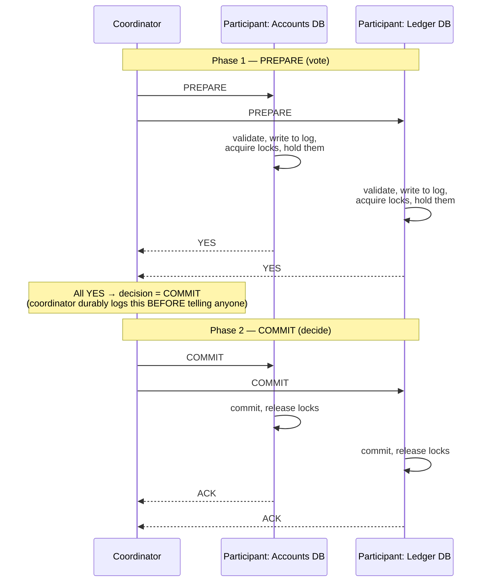

# Distributed Transactions — 2PC, 3PC, TCC

**Prerequisites:** [Architecture Patterns](index.md), local ACID transactions

[← Architecture Patterns](index.md) | [Sagas](sagas.md) covers the practical alternative most systems actually use

---

## Why This Exists

[Sagas](sagas.md) tells you *not* to use two-phase commit for checkout, and moves on to compensations. That's the right call for payments-plus-carrier-APIs — but it skips the mechanics, and "why not 2PC" only lands if you've seen what 2PC actually *is*, what it guarantees, and precisely where it breaks. This page is that: the protocol, the coordinator crash that makes it dangerous, 3PC's attempt to fix it, TCC as the pattern people reach for when they want atomicity without XA, and the narrow set of situations where a distributed transaction is still the right answer.

**The problem, stated precisely:** you have N participants (databases, message brokers, services) and you need **all-or-nothing** across them — not "eventually all-or-nothing after compensations run," but every participant genuinely commits, or every participant genuinely aborts, with no window where the *final outcome* could differ between participants.

**Precisely what this guarantees, and what it doesn't:** 2PC's atomic-commit guarantee is that participants never reach *conflicting* final decisions — it is never the case that participant A ends up committed while participant B, given the same protocol run, ends up aborted. It does **not** mean all participants become visibly committed at the same physical instant. Phase 2 sends the `COMMIT` message to each participant separately, and each executes its own local commit independently, in whatever order messages happen to arrive — participant A can finish committing and become visible to readers milliseconds (or, under a slow network, much longer) before participant B does. An outside observer querying A and B during that window sees exactly the partial-looking state this page's requirements list would seem to rule out: A already reflects the new balance, B still shows the old one — even though both *will* end up committed, and the protocol never risked one committing while the other aborted. Preventing that visibility gap (true global isolation across participants) needs coordination beyond atomic commit itself — e.g. a global lock held until every participant confirms, or routing all reads through a component that knows the transaction hasn't fully settled. 2PC alone buys you consistent *outcomes*; it doesn't buy you simultaneous *visibility*.

```
BEGIN DISTRIBUTED TRANSACTION
  Account service:   debit $100 from Alice
  Ledger service:     credit $100 to Bob
  Audit service:       write "transfer #4471"
COMMIT  -- either all three happen, or none do, full stop
```

A single-database `BEGIN...COMMIT` gives you this for free via the DB's own WAL and locking. Across three databases, you need a protocol that makes participants agree — and that agreement is the entire hard part.

!!! tip "Mental Model"
    2PC is a wedding, not a saga's elopement-with-annulment-on-standby. Everyone stands at the altar (**prepared**, locks held, ready to say "I do") and waits for the officiant (**coordinator**) to ask each in turn, collect every "yes," and only then declare it official. If the officiant collapses mid-ceremony after collecting some "yes"es but before announcing anything, everyone is stuck standing there — legally neither married nor free to leave — until someone revives the officiant or a very awkward protocol kicks in to sort it out.

---

## Two-Phase Commit (2PC)

### Phase 1: Prepare (vote)

The coordinator asks every participant: *"Can you commit this?"* Each participant does everything short of actually committing — validates constraints, writes to its own durable log, **acquires and holds every lock** it would need — then replies `YES` (prepared, promise to commit if told) or `NO` (abort).

### Phase 2: Commit or Abort (decide)

If **all** participants voted `YES`, the coordinator durably logs "commit" and tells everyone to commit. If **any** voted `NO` (or timed out), the coordinator tells everyone to abort. Participants obey unconditionally — a `YES` vote in phase 1 is a binding promise, not a suggestion.



### Where it blocks

```mermaid
sequenceDiagram
    participant C as Coordinator
    participant A as Participant: Accounts DB
    participant L as Participant: Ledger DB

    C->>A: PREPARE
    C->>L: PREPARE
    A-->>C: YES (locks held)
    L-->>C: YES (locks held)
    Note over C: Coordinator CRASHES here —<br/>after collecting votes, before Phase 2

    rect rgb(80, 20, 20)
    Note over A,L: A and L are PREPARED: locks held,<br/>cannot unilaterally commit or abort.<br/>They do not know what the other voted.<br/>They wait. Every row those locks touch<br/>is unavailable until the coordinator recovers.
    end
```



This is **the** defining flaw: a participant that has voted `YES` cannot safely decide anything on its own — committing when the real decision was abort creates a permanent inconsistency, and aborting when the real decision was commit does too. It must wait for the coordinator. If the coordinator is gone for good (disk failure, and its log didn't survive), the participants are stuck **indefinitely**, holding locks, until a human intervenes — this is called the **blocking problem**, and it's why 2PC has a bad reputation for availability.

!!! warning "2PC's core trade"
    2PC buys genuine atomicity across services. It pays for it with **locks held for the duration of a network round-trip to every participant**, and a coordinator single point of failure that can freeze the whole transaction indefinitely if it dies at the wrong instant. Compare a saga: no participant is ever blocked waiting on a remote decision — every local transaction commits or aborts on its own, immediately.

---

## Three-Phase Commit (3PC): the attempted fix

3PC splits phase 2 into **pre-commit** and **commit**, and adds timeouts so participants can make progress without the coordinator:

```
Phase 1: PREPARE       — same as 2PC, collect votes
Phase 2: PRE-COMMIT     — coordinator tells everyone "commit is coming" (not yet final)
Phase 3: COMMIT         — coordinator tells everyone to actually commit
```

The idea: if a participant has reached **pre-commit**, it knows every other participant also voted `YES` (that's *why* pre-commit was sent), so if the coordinator now vanishes, that participant can safely time out and commit on its own — it has enough information to know commit is the only outcome anyone could be waiting for.

**Why it's rarely used in practice:** 3PC assumes the network is not just eventually reliable but **synchronous enough that a timeout reliably distinguishes "coordinator crashed" from "message is just slow."** Under a network partition — the exact condition CAP theorem says you must tolerate — a participant can time out and commit while, on the other side of the partition, the coordinator (still alive) decided to abort. Now you have a split-brain: some participants committed, some aborted, and nobody agrees. 3PC trades the blocking problem for a correctness problem under partitions, which is a worse trade for most systems. It shows up in distributed-systems courses and papers; it does not show up in production stacks the way 2PC (via XA) still occasionally does.

---

## XA: 2PC's real-world plumbing

**XA** is the actual standard (X/Open, adopted by JTA in Java, and supported by Postgres, MySQL, most message brokers) that implements 2PC across heterogeneous resource managers (RMs) — different databases, a DB and a queue, etc. — coordinated by a **transaction manager**.

```
Transaction Manager (coordinator)
   │
   ├── XA RM: PostgreSQL connection   (xa_start, xa_end, xa_prepare, xa_commit)
   ├── XA RM: MySQL connection
   └── XA RM: message broker (JMS)
```

Where XA actually gets used today: mostly **within a single organization's infrastructure**, same datacenter or low-latency LAN, same vendor stack or a small set of XA-compliant resources — think a legacy Java EE app coordinating a DB write and a JMS message send atomically. It essentially never spans **external** services: Stripe will not join your XA transaction, and no SaaS API exposes a `prepare` verb. That's the concrete reason [Sagas](sagas.md) opens with "that option was never real" for payment-plus-warehouse-plus-carrier — XA requires every participant to speak the protocol, and most of the systems you integrate with over the internet simply don't.

---

## TCC (Try-Confirm/Cancel): application-level reservations without locks

TCC approximates 2PC-style atomicity without holding DB locks across the network, by pushing the "reservation" into application logic instead of database row locks — approximates, because as the warning below covers, Confirm is not actually one atomic cross-participant step the way 2PC's phase 2 is:

| Phase | What happens |
|---|---|
| **Try** | Reserve resources tentatively — decrement an "available" counter, not the real balance; hold a soft reservation with a timeout |
| **Confirm** | If every participant's Try succeeded, make it permanent — apply the real debit/credit |
| **Cancel** | If any Try failed, release every reservation made so far |

```
Try:      Accounts:  reserve $100 (available -= 100, but balance unchanged)
          Ledger:    reserve credit slot for Bob
Confirm:  Accounts:  balance -= 100 (release reservation, apply real debit)
          Ledger:    balance += 100
-- or, if Ledger's Try had failed —
Cancel:   Accounts:  release reservation (available += 100, balance untouched)
```

This is genuinely different from 2PC's locks: a "Try" reservation is **application state** (a row saying "$100 reserved, expires in 30s"), not a database lock — other transactions can still see and reason about the account, and an *unconfirmed* reservation expires on its own via TTL instead of blocking forever. The cost: you write **Try/Confirm/Cancel for every operation by hand** — there's no generic driver-level support the way XA gives you for 2PC. It's a real pattern in payments and inventory systems (Alibaba's TCC frameworks, several open-source Seata-style implementations) precisely because "reserve, then confirm" maps naturally onto "authorize, then capture" — which most payment APIs already support as a first-class concept.

!!! warning "TCC is not 2PC-strength atomicity"
    TCC does **not** give you the same all-or-nothing guarantee as 2PC, and describing it that way is the most common mistake made about the pattern. Confirm is not one atomic step across participants — it's N independent local operations the coordinator fires off one at a time, so a real failure mode is: Accounts confirms successfully, then the coordinator crashes or the Ledger service is unreachable *before* Ledger's Confirm lands. Ledger's Try then expires via TTL and is released — but Accounts already confirmed the real debit. Money is gone from Alice's account and never credited to Bob: a permanent inconsistency, not a self-healing one.

    Two things are load-bearing and easy to omit: **Confirm and Cancel must themselves be idempotent** (the coordinator will retry them after a crash, possibly more than once, possibly after the participant already applied them), and **the coordinator must durably log its Confirm/Cancel decision before executing it**, so that on recovery it knows what it already committed to and can retry the specific participants that never acknowledged — rather than guessing, or leaving them stuck. TTL expiry is only safe for reservations nobody has *started* confirming; once Confirm has begun, expiry must not race ahead of it, or you get exactly the split state above. TCC buys you lock-free reservations and a cleaner intermediate state than a saga's "actually happened" — it does not buy you 2PC's atomicity, and still needs a durable, retried, reconciled coordinator to be safe.

!!! note "TCC vs Saga"
    TCC and sagas are close cousins — both are "local steps + explicit undo," and both give up DB-level locking. The difference is **when the resource becomes visible as committed**: a saga's each step commits for real immediately (see the order as PENDING right after step 1), while TCC's Try phase is explicitly non-final — nothing is really committed until every participant's Try has succeeded and Confirm runs. That makes TCC's intermediate state ("reserved, not yet confirmed") a cleaner concept to reason about than a saga's ("really happened, might get undone") — at the cost of needing a Try/Confirm/Cancel implementation for every single operation instead of "just do the write and write a compensation."

---

## Comparison

| | 2PC / XA | 3PC | TCC | Saga |
|--|----------|-----|-----|------|
| Atomicity | Real, across all participants | Real, if network is synchronous | Approximate — Confirm is N independent local ops, not one atomic step; needs idempotent Confirm/Cancel + a durable, retrying coordinator to avoid partial-Confirm inconsistency | None — compensations, not undo |
| Locks held across network | Yes, until phase 2 completes | Yes, shorter window | No — application-level reservations, TTL-bound | No |
| Coordinator crash | Participants block indefinitely | Participants can time out and proceed (but see below) | Unconfirmed reservations expire via TTL; a crash *during* Confirm can strand a partial commit unless the coordinator durably logs and retries | No blocking — each step is already committed or already compensated |
| Partition tolerance | Poor (blocks) | Poor (can split-brain) | Good | Good |
| Works with external/3rd-party APIs (Stripe, carriers) | No — they won't speak XA | No | Sometimes — if the API has authorize/capture | Yes — this is the point |
| Implementation cost | Low if RMs are XA-compliant | Low if RMs support it (rare) | High — hand-write Try/Confirm/Cancel per op | Medium — hand-write compensations per op |
| Fits | Same vendor/LAN, internal systems | Rarely used in production | Payments/inventory with reserve-then-confirm semantics | Cross-service business flows, especially with external APIs |

---

## When a Distributed Transaction Is Still the Right Call

Despite everything above, 2PC/XA is not obsolete — it's just narrowly scoped:

- **Same datacenter, low-latency LAN, small number of participants** — the blocking window is milliseconds, not "however long a flaky carrier API takes," so the risk of a coordinator crash landing in that tiny window is genuinely low.
- **All participants are internal and XA-compliant** — no third-party API in the chain that can't speak the protocol.
- **The business genuinely cannot tolerate a visible intermediate state** — sagas expose `PAID_UNSHIPPED`-style states as real, queryable facts; if literally no consumer of that data can be allowed to see a partial result, 2PC's "nothing is visible until everyone agrees" property is the only one that provides it.
- **A short-lived internal transaction manager already exists in the stack** (e.g., Java EE / Spring's JTA), and adding XA to one more resource is cheap compared to building sagas or TCC compensations for something that rarely needs cross-service atomicity in the first place.

The interview-safe framing: **default to sagas or TCC for anything crossing an organizational or network boundary you don't fully control; reach for 2PC/XA only when every participant is internal, the round-trip is short, and the org already has the transaction-manager infrastructure to run it safely.**

---

## Failure Modes

| Failure | Cause | Fix / mitigation |
|---|---|---|
| All participants stuck holding locks | Coordinator crashed between phase 1 and phase 2 | Coordinator must persist its decision durably *before* phase 2 starts, so it can recover and resume; participants need a **heuristic timeout + manual intervention path** as a last resort |
| Split-brain (some commit, some abort) | 3PC used across a real network partition | Don't use 3PC in production; use 2PC (accept blocking) or a saga (accept compensations) instead |
| Reservation never confirmed or cancelled | TCC coordinator crashed mid-flow, no TTL set on the Try | Every Try **must** have an expiry; a background sweeper cancels expired, unconfirmed reservations |
| Deadlock across two distributed transactions | Two 2PC transactions acquire the same two locks in opposite order across participants | Global lock ordering convention, or timeout + abort + retry — same fix as single-DB deadlocks, just harder to observe |
| "It worked in staging" | XA tested only against XA-compliant internal services, never against the real external dependency (payment gateway) that can't join | Identify every external dependency early; if any can't speak XA, the design can't use 2PC for that boundary, full stop |

---

## Interview Questions

=== "Foundation"
    **Q: Walk me through two-phase commit and explain why it can block indefinitely.**

    "Phase 1, the coordinator asks every participant to prepare — validate, log, acquire and hold locks, then vote yes or no. Phase 2, if everyone voted yes, the coordinator tells everyone to commit; otherwise, abort. The blocking problem is: once a participant votes yes, it's made a binding promise and cannot unilaterally decide anything — if the coordinator crashes after collecting votes but before sending the phase-2 decision, every prepared participant is stuck holding its locks, unable to commit or abort on its own, until the coordinator recovers or a human intervenes."

=== "Senior"
    **Q: Your team wants to use XA across our services and Stripe for checkout. What's wrong with that plan?**

    "Stripe doesn't implement XA — it has no `prepare` verb, no way to hold a tentative charge open while other participants vote. XA fundamentally requires every resource manager to speak the two-phase protocol, and that only works for infrastructure you control, typically same-vendor or same-datacenter. Even if it did work, we'd be holding a lock on inventory and account rows for the full round-trip to Stripe's API, which is not milliseconds — that's a long time to have those rows unavailable to every other transaction. I'd reach for a saga, or TCC if Stripe's authorize/capture flow maps to Try/Confirm, since both let each participant commit locally and don't require Stripe to participate in a protocol it doesn't support."

=== "Staff"
    **Q: When, if ever, would you actually recommend 2PC/XA over a saga in a system you're designing today?**

    "Only inside a boundary I fully control, with a small number of participants on the same network, where the business genuinely cannot tolerate a visible intermediate state — not 'it'd be nicer,' but a real requirement, like a financial ledger posting that must never appear half-done to an auditor. I'd want all participants to already be XA-compliant so I'm not building custom coordination, and I'd want the round-trip latency low enough that the blocking window during a coordinator crash is genuinely small. The moment any participant is external — a third-party API, a different org's service — 2PC is off the table regardless of those other conditions, because that participant can't join the protocol. In practice I've recommended it maybe once, for a same-datacenter ledger-plus-audit-log write; everything crossing a real network or org boundary got a saga or TCC instead."

---

## Key Takeaways

!!! success "Remember"
    1. 2PC gives real atomicity across services, at the cost of holding locks for a network round-trip and a coordinator that can block everyone indefinitely if it crashes at the wrong moment.
    2. 3PC tries to remove the blocking problem with timeouts, but breaks under real network partitions — it's a textbook protocol, not a production one.
    3. XA is 2PC's real-world implementation, and it essentially never spans external/third-party APIs — that's the concrete reason payments-plus-carrier flows use sagas instead.
    4. TCC approximates 2PC-like atomicity without database locks, by making "Try" an application-level, TTL-bound reservation instead of a held lock — but Confirm is N independent local operations, not one atomic step, so it still needs idempotent Confirm/Cancel and a durable, retrying coordinator to avoid a partial-Confirm inconsistency. At the cost of hand-writing Try/Confirm/Cancel for every operation.
    5. Default to sagas or TCC crossing any boundary you don't fully control; 2PC/XA is still correct for small, internal, low-latency, same-organization transactions where an intermediate state truly cannot be visible.

**Previous:** [Architecture Patterns](index.md) | **Next:** [Sagas](sagas.md)
