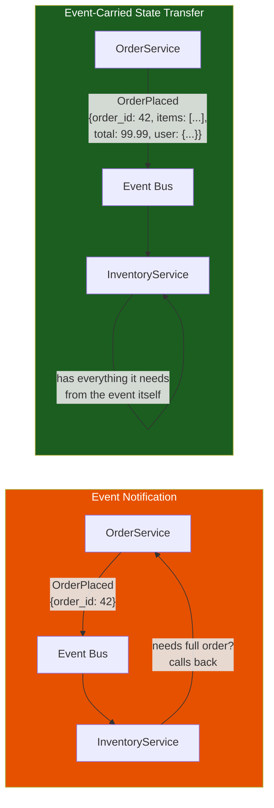
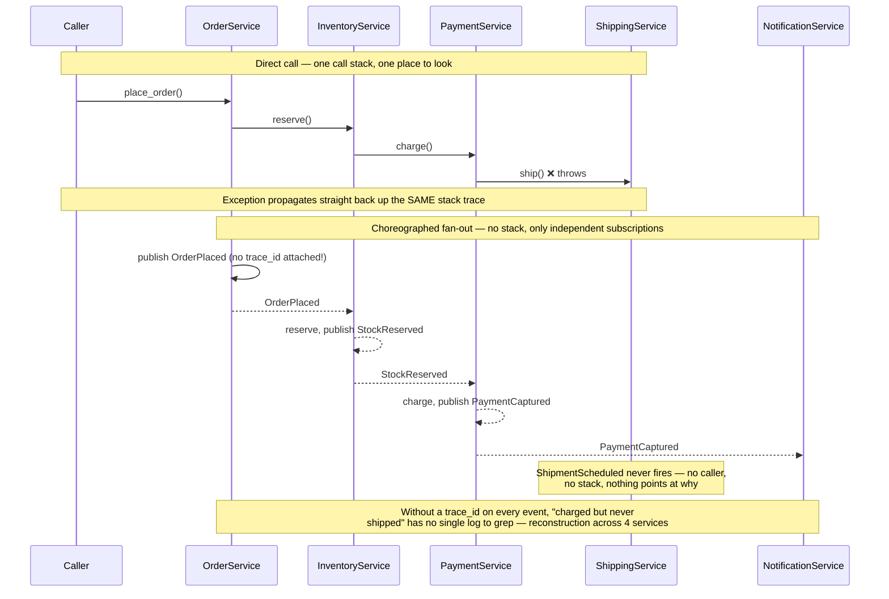
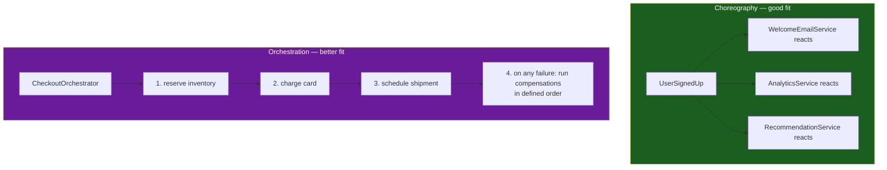

# Event-Driven Architecture

**Prerequisites:** [Message Queue Patterns](../messaging/patterns.md), [Sagas](sagas.md)

[← Architecture Patterns](index.md)

---

## Why This Exists

Start with the request/response version of "a user places an order":

```python
def place_order(order):
    order_service.create(order)
    inventory_service.reserve(order.items)      # direct call
    payment_service.charge(order.total)          # direct call
    shipping_service.schedule(order)             # direct call
    notification_service.send_confirmation(order)  # direct call
```

**This works, and it's the wrong shape at scale.** Every new consumer of "an order happened" requires editing `place_order` — add loyalty points, add fraud scoring, add a warehouse-capacity check, and `order_service` now imports and calls five other services directly. It's coupled in both directions: `order_service` needs to know every consumer that exists, and if `notification_service` is slow or down, `place_order` is slow or down too, even though a delayed confirmation email is not something that should block checkout.

**Event-driven architecture inverts this.** `order_service` doesn't call anyone — it publishes a fact, and anyone who cares subscribes to it.

```python
def place_order(order):
    order_service.create(order)
    event_bus.publish("OrderPlaced", order)
    # order_service is done. It doesn't know or care who's listening.

# Fine for reactions that can be eventually consistent:
notification_service.on("OrderPlaced", lambda e: send_confirmation(e))
fraud_service.on("OrderPlaced", lambda e: score(e))          # added later, zero changes to order_service
loyalty_service.on("OrderPlaced", lambda e: award_points(e))  # added later, zero changes to order_service

# ANTIPATTERN for money: charging on OrderPlaced races inventory and can
# capture payment for stock you never reserved (or charge after a reserve
# that later fails). Charge only after inventory is reserved — an
# orchestrated saga, not a free-floating OrderPlaced handler.
#   inventory_service.on("OrderPlaced", reserve)          # still a choreography choice
#   payment_service.on("StockReserved", charge)           # or a single orchestrator
```

**The trade being made**: `order_service` no longer knows what happens after it publishes. That's the entire point — and it's also the entire cost. You've bought independent deployability and the ability to add new reactions without touching the source. You've paid for it with the one thing that made the request/response version easy to reason about: **you can no longer read the code and see the whole flow.**

---

## Mental Model: Notification vs. State Transfer

Not all events are the same shape, and conflating them is where most event-driven designs go wrong.



**Event Notification**: the event is a thin signal — "something happened, here's an ID, come ask me for details if you need them." Small payloads, but consumers now make a synchronous call back to the publisher to get details, which silently reintroduces the coupling and availability dependency you were trying to remove.

**Event-Carried State Transfer**: the event carries everything a typical consumer needs. No callback required. The cost: the publisher now has to think about what every consumer might need (payload design becomes an API contract), and you're duplicating data across services (the order's total now lives in payment-service's local copy too) — which means you've traded a live coupling for an eventual-consistency problem: what happens when the source updates and the copies don't?

```
✗ Common mistake: mixing both without deciding.
  OrderPlaced carries `total` but not `items`.
  Now half your consumers need a callback to order_service anyway,
  and you've paid the state-transfer cost (payload contract, staleness)
  without getting the state-transfer benefit (no callback needed).

✓ Decide per event: is this a lightweight signal, or does this event's
  payload need to be a complete, versioned contract? Don't drift between
  the two for the same event type.
```

---

## Choreography: The Coordination Problem Event-Driven Systems Inherit

[Sagas](sagas.md) already introduced choreography vs. orchestration for one specific use case (undoing a multi-step transaction). Event-driven architecture is choreography as the *default* coordination style for the whole system, not just failure recovery — which means the same trade-off shows up everywhere, not just in sagas.

```
OrderPlaced → InventoryService reserves stock → StockReserved
  → PaymentService charges card → PaymentCaptured
  → ShippingService schedules → ShipmentScheduled
  → NotificationService emails confirmation
```



**Nobody wrote this sequence down.** It emerged from five services each independently subscribing to the event that precedes their own reaction. This is the architecture's core tension:

```
Benefit: any service can be added, removed, or changed without touching
  the others. InventoryService doesn't know PaymentService exists.

Cost: there is no single place in the codebase that shows this flow.
  To understand "what happens when someone places an order," you
  have to go find every service, grep for what it subscribes to,
  and mentally reconstruct the chain — across repos, across teams,
  sometimes across time zones for who owns what.
```

```python
# The debugging question that exposes this cost:
# "A customer says their order was charged but never shipped. What happened?"

# In a direct-call system: read place_order(), the call stack tells you exactly
# where it failed.

# In a choreographed event system: you need distributed tracing that stitches
# together OrderPlaced -> StockReserved -> PaymentCaptured -> (missing:
# ShipmentScheduled never happened) across FOUR services' logs, correlated
# by a trace ID that had to be threaded through every event's metadata.
def publish(event_type, payload, trace_id):
    # Every event MUST carry the trace_id, or debugging is archaeology.
    event_bus.publish(event_type, {**payload, "trace_id": trace_id})
```

**This is why event-driven systems are non-negotiable about propagating a trace/correlation ID through every event** — without it, "what happened to order 42" has no way to be answered short of manually correlating timestamps across services' logs.

---

## The Antipattern: A Distributed Monolith Wearing an Event Bus

The most common failure mode isn't technical — it's architectural, and it looks like success at first.

```
Month 1: OrderPlaced triggers InventoryService, PaymentService.
         Feels great. Loosely coupled, easy to extend.

Month 6: 40 event types. OrderPlaced, OrderConfirmed, OrderPaid,
         OrderReserved, InventoryReserved, InventoryReservationFailed,
         PaymentAttempted, PaymentCaptured, PaymentFailed...

Month 12: To add a feature, an engineer has to trace through 15 event
          subscriptions across 8 services to understand the current
          behavior before they can safely change anything.
          Nobody can reason about the system from any single vantage point.
          Every service is STILL coupled to every other service's event
          *schema* — they just don't call each other's *functions* anymore.
```

**The tell**: if changing one service's event schema routinely breaks three other teams' consumers, you have all the coupling of a monolith (a schema change ripples everywhere) with none of the benefits (you can't even `grep` for all the call sites — they're runtime subscriptions, invisible until they fail in production).

```
✗ Bad: OrderPlaced payload silently gains a new required field.
  Every consumer that deserializes strictly now breaks, with no compile-time
  warning — the failure surfaces at runtime, in production, per-consumer,
  at whatever rate that service happens to process events.

✓ Good: event schemas are versioned and evolved with the same backward/
  forward-compatibility discipline as any service contract — new fields
  are optional with defaults, consumers ignore fields they don't recognize.
  (This is the exact schema-evolution problem covered in
  [DDIA Concepts, Part 9](../databases/ddia-concepts.md#part-9-encoding-and-schema-evolution) — event payloads are just another wire format
  that old and new code must both tolerate during rollout.)
```

**The fix isn't "use fewer events."** It's treating the event catalog as a first-class, documented contract — every event type has an owning team, a versioned schema, and a discoverable list of who publishes and who subscribes, so "what happens when an order is placed" is answerable by reading a catalog, not archaeology.

---

## When Choreography Breaks Down: Reach for Orchestration

Not every flow should be choreographed. The signal that tells you to switch: **can you state the business process as a single ordered sequence with an owner who's accountable for its outcome?**



```
Choreography fits: independent reactions to a fact, no strict ordering
  between them, no single owner needs to guarantee the whole thing completes.
  "A user signed up" → welcome email, analytics event, recommendation seed.
  These don't depend on each other and nobody needs a global view of all three.

Orchestration fits: a business process with required ordering, explicit
  compensation logic on failure, and someone who needs to answer "is this
  order's checkout complete, and if not, exactly where did it stop?"
  This is precisely the saga-orchestrator case from the Sagas page —
  a state machine that calls each step and knows the whole sequence,
  instead of each step discovering its role via a subscription.
```

**Interview signal**: "I'd choreograph reactions that are independent and don't need central tracking — analytics, notifications, cache invalidation. I'd orchestrate anything where a human or a dashboard needs to answer 'what's the status of this specific business transaction right now' — checkout, an approval workflow, anything with compensations. Mixing both in one system is normal; using choreography for a process that actually needs an owner is the mistake."

---

## Event-Driven Architecture vs. Event Sourcing: Don't Conflate Them

These get bundled together constantly, and they answer different questions.

| | Event-Driven Architecture | Event Sourcing |
|---|---|---|
| What the event is | A notification that something happened, used to trigger a reaction elsewhere | The literal source of truth for a piece of state — there is no other copy |
| What "current state" means | Each service keeps its own current state, updated in reaction to events | Current state is *derived* by replaying events — it doesn't exist independently |
| Can you use one without the other? | Yes — services can react to events while each just does a normal `UPDATE` on its own current-state table | Yes — an event-sourced service can keep its events entirely internal, never publishing them for others to react to |
| Primary cost | Coupling moves from function calls to event schemas; flow becomes hard to trace | Rebuilding state means replaying history; schema evolution of old events is genuinely hard (see [Event Sourcing & CQRS](event-sourcing-cqrs.md)) |

**They compose well together** (a service can be internally event-sourced *and* publish some of those events for others to react to) but neither requires the other. A system can be fully event-driven with every service using plain CRUD internally; a service can be event-sourced and never publish anything externally.

---

## Common Mistakes (Interviews)

### 1. Reaching for Events Because "Decoupled" Sounds Better Than "Coupled"

```
✗ "I'd make everything event-driven for loose coupling" — offered with
  no pressure identified. This is the same failure mode as reaching for
  microservices or CQRS without a stated reason.

✓ Name the actual pressure: "InventoryService and NotificationService
  don't need synchronous consistency with checkout, and a slow email
  provider shouldn't be able to fail an order" — THAT'S the reason to
  make notification/analytics reactions event-driven, not the word "decoupled."
```

### 2. No Correlation ID

```
✗ Events published without a trace/correlation ID threaded through the
  whole chain — debugging "what happened to order 42" becomes manual
  log correlation across services.

✓ Every event in the chain carries the same correlation ID from the
  originating request, propagated automatically by the publishing library,
  not opt-in per developer.
```

### 3. Treating the Event Bus as a Reliable Queue Without Checking

```
✗ Assuming "the event was published" means "every consumer will process
  it exactly once" — depends entirely on the broker's delivery guarantees
  (at-most-once vs at-least-once vs exactly-once) and whether consumers
  are idempotent. See messaging patterns for delivery semantics.

✓ Design every event handler to be safely re-runnable (idempotent) —
  at-least-once delivery is the realistic default, and a handler that
  isn't idempotent will double-charge, double-ship, or double-notify
  on the first redelivered message.
```

### 4. No Event Catalog

```
✗ 40+ event types exist only as strings scattered through code;
  nobody has a list of who publishes what or who's listening.

✓ A discoverable schema registry / catalog: every event type has an
  owner, a versioned schema, and (ideally) an automatically generated
  list of active consumers — so "what happens when X occurs" is a
  lookup, not an investigation.
```

---

## Interview Questions

=== "Foundation"
    **Q: What's the actual trade-off with event-driven architecture, beyond 'it's decoupled'?**

    "You trade the ability to read one function and see the whole flow, for the ability to add new reactions without touching the publisher. Request/response is coupled but traceable — you can read `place_order()` and know everything that happens. Event-driven is decoupled but implicit — 'what happens when an order is placed' is answered by finding every service that subscribes to `OrderPlaced`, not by reading one function. Both are legitimate; the question is whether your system's pressure (many independent reactions to one fact, need for producers to not know their consumers) justifies giving up that traceability."

=== "Senior"
    **Q: A customer's order was charged but never shipped, in a fully event-driven checkout flow. How do you debug this?**

    "First, I need a correlation/trace ID that was threaded through every event from `OrderPlaced` onward — without it this is nearly undebuggable, since there's no single call stack to inspect. With the trace ID, I'd query each service's logs for that ID and reconstruct the actual sequence of events that fired: did `StockReserved` happen? Did `PaymentCaptured` happen? Did `ShipmentScheduled` ever fire, or is that the missing link? If `PaymentCaptured` fired but `ShipmentScheduled` never did, that points to either ShippingService never receiving the event (broker/subscription issue) or receiving it and failing silently (no dead-letter queue, no alerting on handler failures). Longer term, I'd flag that a process this consistency-sensitive — money changed hands — might be a better fit for orchestration with explicit status tracking than pure choreography, precisely because 'is this order complete' needs to be a queryable fact, not a reconstruction exercise."

=== "Staff"
    **Q: Your org has 200 event types across 30 teams and nobody can confidently say what breaks if they change an event's schema. How do you fix this without a rewrite?**

    "This is the distributed-monolith-wearing-an-event-bus failure mode — the coupling never went away, it just became invisible. I wouldn't rewrite; I'd make the coupling visible and governed. First, stand up an event schema registry: every event type gets a versioned schema (Avro/Protobuf, following the same backward/forward-compatibility rules as any API), and publishing an incompatible change is a linted, blocked action, not a runtime surprise. Second, require the registry to also track active consumers — even a lightweight 'who has read this topic in the last 30 days' from the broker gives you a real answer to 'what breaks if I change this,' which today only exists in people's heads. Third, for the highest-traffic or most business-critical events (checkout, payments), consider whether choreography is even the right fit anymore — an orchestrator with an explicit state machine for those specific flows gets you back a traceable source of truth, while leaving genuinely independent reactions (analytics, notifications) as choreographed. The goal isn't eliminating events, it's making the existing coupling visible and versioned instead of implicit and undocumented."

---

## Key Takeaways

!!! success "Remember"
    1. **Event-driven inverts request/response**: instead of the publisher calling every consumer, it publishes a fact and consumers subscribe — the publisher never knows who's listening
    2. **The cost mirrors the benefit exactly**: you gain independent extensibility, you lose the ability to read one place and see the whole flow
    3. **Notification vs. state-transfer events are different contracts** — decide per event type, don't drift between them for the same event
    4. **Choreography (no central owner) fits independent reactions; orchestration (explicit sequence, explicit compensations) fits processes someone needs to track to completion** — checkout is usually orchestration, "send a welcome email" is usually choreography
    5. **A correlation ID threaded through every event is non-negotiable** — without it, debugging a multi-service flow is manual log archaeology
    6. **The distributed-monolith antipattern**: coupling doesn't disappear with events, it moves from function signatures to event schemas — govern it with a versioned schema registry and an event catalog, or you'll have all of a monolith's fragility with none of its traceability
    7. **Event-driven architecture and event sourcing are different, composable concepts** — one is about how services coordinate, the other is about how one service's state is stored; neither requires the other
    8. **"I'd make it event-driven for loose coupling" is not a reason** — name the specific pressure (an unrelated consumer shouldn't block the critical path, a producer shouldn't need to know all its consumers) the same way you'd justify any other pattern in this section

**Previous:** [Sagas](sagas.md) · **Related:** [Event Sourcing & CQRS](event-sourcing-cqrs.md), [Message Queue Patterns](../messaging/patterns.md)
