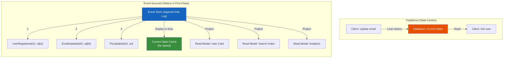
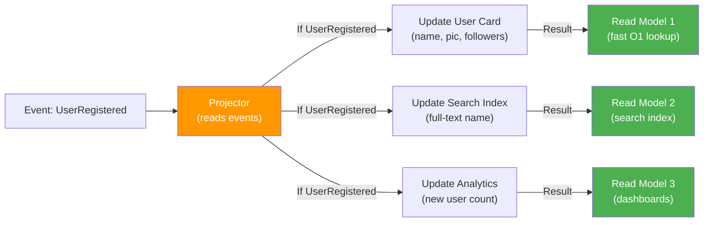
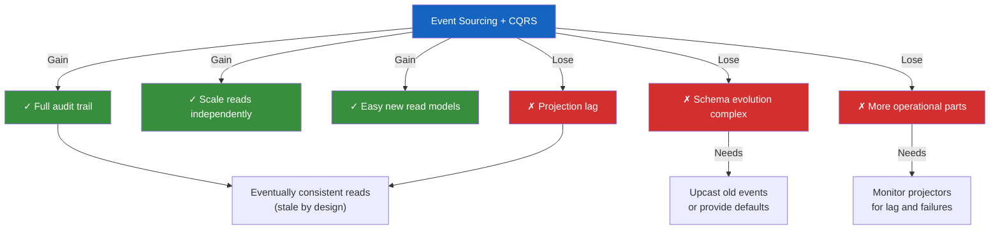
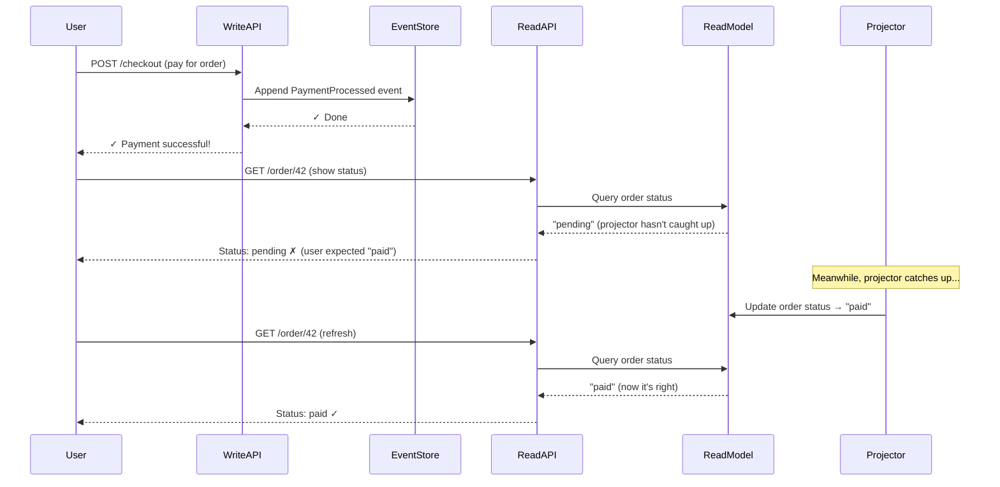
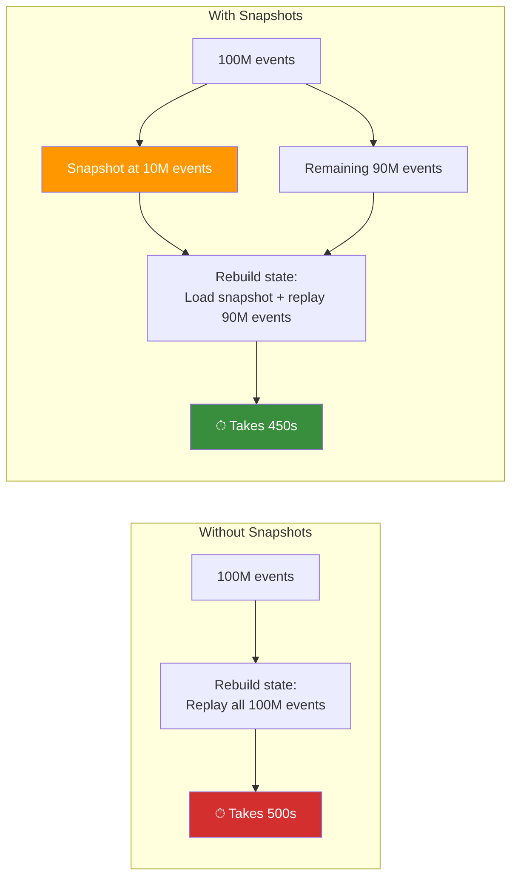
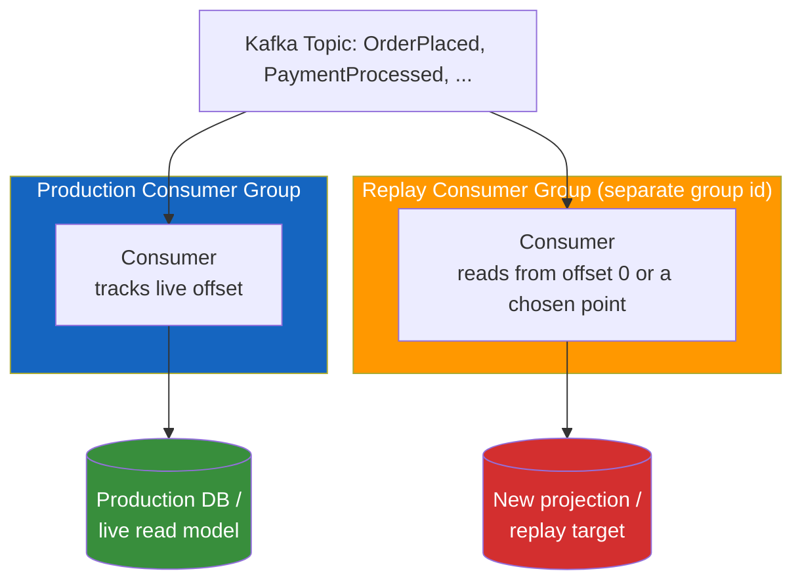
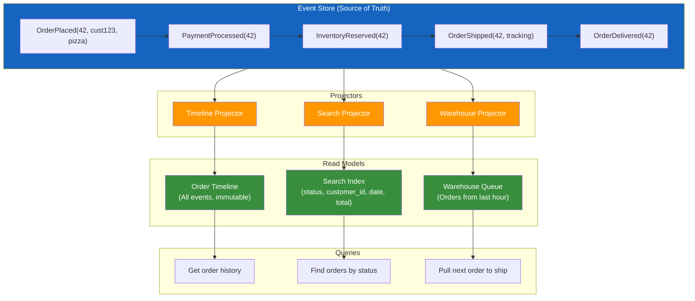

# Event Sourcing & CQRS

**Prerequisites:** [Consistency Models](../distributed-systems/consistency-models.md), [Sagas](sagas.md)

[← Architecture Patterns](index.md)

---

## Why This Exists

**Problem 1: Write and read shapes don't match.**

Your write side: `user.update({email, phone, preferences})` → one Postgres table.  
Your read side: Homepage needs (user ID, name, profile pic, follower count, recent posts, badge). That's a join across 4 tables, and the follower count is expensive to compute. Add real-time search, and you need Elasticsearch denormalization.

One table that optimizes writes breaks reads. A schema that optimizes reads locks you into that read shape — add a new dashboard that needs different fields, and you rewrite migrations.

**Problem 2: State transitions are implicit.**

You see `order.status = "shipped"`. You don't see *why* — did the warehouse process it? Did the customer force a status change via a bug? Did it roll back from shipped to pending? At 3 a.m., you need the history. Postgres has that in WAL and CDC, but it's not in your application's mental model.

**Problem 3: Current state is a lossy projection.**

`user.updated_at = 2025-08-14` tells you *when*, not what changed or why. You can't recompute old reports. You can't debug "the system was consistent at T1 but not at T2" without full audit logs.

---

## Mental Model: Events Are the Source of Truth

Think of it like a bank ledger vs. a balance sheet.

**Ledger (Events):** Every transaction is recorded. You can:
- Audit "what happened"
- Replay from any date
- Answer "how did we get here?"

**Balance Sheet (Current State):** Just the net number. You can:
- See the current balance fast
- Never answer "how did we get here?" without the ledger

Event sourcing says: **the ledger is the source of truth; the balance sheet is just a view.**

### Visual: Traditional vs. Event-Sourced



**What changed?**
- **Write:** Client emits UserEmailUpdated event; event store appends (fast, immutable)
- **Read:** Multiple read models project the event stream for different queries

**Key insight:** Events are immutable, durable, and time-ordered. Current state is a *projection* of events up to now. A different projection (read model) is just a different view of the same event stream.

!!! tip "The model that makes it click"
    Event sourcing = **immutable log**. CQRS = **separate read/write models**. They're orthogonal:
    - You can event-source without CQRS (reads rebuild from the log each time — slow)
    - You can CQRS without event-sourcing (writes update a table, reads use a denormalized cache — loses history)
    - Combined: writes append events; reads serve from pre-built projections. Best of both.

---

## When CQRS Earns Its Complexity

CQRS costs: two data models, eventual consistency windows, projection lag, schema evolution complexity.

### The Intuition

Imagine a pizza restaurant:

```
Without CQRS:
Order placed (write) → Update kitchen list AND update customer menu AND update analytics
(one table = one schema shape; optimize for order-taking, but menus and analytics suffer)

With CQRS:
Order placed (event) → Kitchen sees "order 42: 2 pizzas"; Customer sees "order 42: baking"; 
                        Analytics sees "1 order, $25 revenue"
(three different shapes for three different read needs, all fed by one event stream)
```

**CQRS pays off when read/write shapes are fundamentally different:**

| Scenario | Write shape | Read shape | CQRS worth it? |
|----------|-------------|-----------|---|
| Blog | POST title, body | GET homepage (title + preview + author + comments count + date) | Yes — write is simple, read is expensive join |
| User profile | PUT {email, phone, pic} | GET user card (name + pic + follower count + badge) | Yes — read aggregates across tables/services |
| Payment | POST {amount, account} | GET statement (paginated, filtered by date range, totals) | Yes — write is once, read is many, expensive |
| Simple CRUD | PUT {id, field} | GET {id} | **No** — same shape both ways, added latency for no gain |
| High-volume counter (like/follow) | Increment counter | Read counter | Maybe — if you need latency-free reads, not immediacy |

**Red flags (CQRS will hurt):**
- Read and write shapes are the same (you're just adding staleness)
- Reads need real-time consistency (CQRS adds latency by definition)
- Projection lag breaks your SLO (e.g., payment confirmation must be immediate)
- Your team has never done async projection before (scope creep is real)

---

## Event Sourcing: The Mechanism

### Structure

An **event** is an immutable fact about what happened:

```python
# What changed
class UserRegistered:
    user_id: str
    email: str
    name: str
    created_at: float
    
# Events are immutable; include the "why" as context
class UserEmailUpdated:
    user_id: str
    old_email: str
    new_email: str
    reason: str  # "user request" vs "admin correction" vs "data recovery"
    triggered_by: str  # user ID or system name
    timestamp: float
```

The **event store** is the source of truth:

```python
# Events stored in order, append-only, every write is a new event
event_store = [
    UserRegistered(42, "alice@old.com", "Alice", 1000.0),
    UserEmailUpdated(42, "alice@old.com", "alice@new.com", "user request", "42", 1001.0),
    UserProfilePicUpdated(42, "https://pic.jpg", "user request", "42", 1002.0),
]

# Rebuild the current state by replaying events in order
def rebuild_user(user_id):
    user = User()
    for event in event_store:
        if event.user_id == user_id:
            user.apply(event)
    return user

# Result: same model, but now you have every state at every point in time
```

### Rebuilding State vs. Caching It

**Rebuilding on-demand** (simple, slow):
```python
def get_user(user_id):
    events = event_store.query(user_id=user_id)
    state = User()
    for event in events:
        state.apply(event)
    return state  # ✗ O(N) where N = events for this user
```

**Caching current state** (complex, fast):
```python
# Write side: append event, update cache
def update_user_email(user_id, new_email):
    event = UserEmailUpdated(user_id, ..., new_email, ...)
    event_store.append(event)
    user_cache[user_id].email = new_email  # Write-through cache
    return event

# Read side: serve from cache
def get_user(user_id):
    return user_cache[user_id]  # O(1)
```

The trade-off: **rebuild is consistent but slow; cache is fast but can diverge if not kept in sync.**

Solution: **event-sourced snapshots** (checkpoint every N events):
```python
# Store a snapshot every 100 events
snapshots = {
    42: UserSnapshot(email="alice@new.com", pic="...", timestamp=1000),  # at event 1000
}

def get_user(user_id):
    # Start from the most recent snapshot
    snapshot = snapshots.get(user_id)
    state = snapshot.to_user() if snapshot else User()
    
    # Replay only events after the snapshot
    events = event_store.query(user_id=user_id, after=snapshot.timestamp)
    for event in events:
        state.apply(event)
    return state
```

---

## CQRS: Separate Models

### Write Model (Command Side)

Optimized for correctness:
```python
class UserWriteModel:
    def __init__(self, event_store):
        self.events = event_store
    
    def register_user(self, email, name):
        """Validation happens here (single source)"""
        if self.events.user_with_email_exists(email):
            raise UserAlreadyExists()
        
        event = UserRegistered(
            user_id=str(uuid.uuid4()),
            email=email,
            name=name,
            created_at=time.time(),
        )
        self.events.append(event)
        return event.user_id
    
    def update_email(self, user_id, new_email):
        """Validate before persisting"""
        if not is_valid_email(new_email):
            raise InvalidEmail()
        if self.events.user_with_email_exists(new_email):
            raise EmailTaken()
        
        # Write only what changed
        event = UserEmailUpdated(user_id, new_email=new_email, ...)
        self.events.append(event)
```

### Read Model (Query Side)

Optimized for the shape you actually query:

```python
# Read model 1: User card (for profile page)
class UserCardReadModel:
    # Denormalized: all data needed in one query
    db = {
        42: {
            "user_id": 42,
            "name": "Alice",
            "pic_url": "...",
            "follower_count": 1250,
            "badge": "verified",
            "updated_at": 1002.0,
        }
    }
    
    def get_card(self, user_id):
        return self.db[user_id]  # O(1), no joins

# Read model 2: User search (for Elasticsearch)
class UserSearchReadModel:
    es = {
        "mappings": {
            "properties": {
                "user_id": {"type": "keyword"},
                "name": {"type": "text"},
                "bio": {"type": "text"},
                "follower_count": {"type": "integer"},
            }
        }
    }
    
    def search(self, query):
        return es.search(query)  # Full-text search, no joins
```

### Projection: Keeping Read Models in Sync

A **projector** is like a mail sorter: it takes events and routes them to the right read models.



**Important intuition:** A projector doesn't update every read model for every event. `UserEmailUpdated` updates the write model but maybe not the "User Card" that's shown on the profile page (because your profile page doesn't show email). But it would update the search index if you search by email.

A **projector** subscribes to events and updates read models:

```python
class UserProjector:
    def __init__(self, event_store, write_model, card_model, search_model):
        self.event_store = event_store
        self.write_model = write_model
        self.card_model = card_model
        self.search_model = search_model
    
    def handle_user_registered(self, event):
        """Update all read models when a new user is registered"""
        # Card read model
        self.card_model.db[event.user_id] = {
            "user_id": event.user_id,
            "name": event.name,
            "pic_url": None,
            "follower_count": 0,
            "badge": None,
            "updated_at": event.created_at,
        }
        # Search read model
        self.search_model.es.index(
            index="users",
            id=event.user_id,
            body={
                "user_id": event.user_id,
                "name": event.name,
                "bio": "",
                "follower_count": 0,
            }
        )
    
    def handle_user_email_updated(self, event):
        """Email changed; only write model needs this (search doesn't index email)"""
        # Nothing to update in card or search for this event
        pass
    
    def handle_user_pic_updated(self, event):
        """Update both read models"""
        self.card_model.db[event.user_id]["pic_url"] = event.pic_url
        self.search_model.es.update_by_query(
            index="users",
            query={"match": {"user_id": event.user_id}},
            body={"doc": {"pic": event.pic_url}}
        )
    
    def handle_user_followed_user(self, event):
        """Follower count changed"""
        count = self.event_store.count_followers(event.user_id)
        self.card_model.db[event.user_id]["follower_count"] = count
        self.search_model.es.update_by_query(
            index="users",
            query={"match": {"user_id": event.user_id}},
            body={"doc": {"follower_count": count}}
        )
    
    def project_all(self):
        """Run once to bootstrap; then run continuously on new events"""
        for event in self.event_store.all_events():
            handler_name = f"handle_{event.__class__.__name__}"
            if hasattr(self, handler_name):
                getattr(self, handler_name)(event)
```

The projection is **asynchronous** by default (lag is expected):
```python
# Write succeeds immediately
event = write_model.update_email(42, "new@email.com")  # ✓ Returns immediately

# But read models update a moment later
# (milliseconds to seconds, depending on your infrastructure)
time.sleep(0.5)  # Wait for projection to catch up
user_card = card_model.get_card(42)  # Sees the new email
```

---

## Trade-offs: What You Gain and Lose

### The Graph: What You're Trading



### The Table: What Each Costs

| Aspect | Gain | Cost |
|--------|------|------|
| **Auditability** | Full history, can answer "what changed and why" | Schema evolution (old events may have missing fields) |
| **Consistency** | Write side is always consistent | Read models are stale by a projection lag window |
| **Scalability** | Read and write can scale independently | Projection complexity; one slow read model blocks all |
| **Debuggability** | Replay events from any point; time-travel | More moving parts (event store, projectors, read models) |
| **Schema flexibility** | Add new read models without changing writes | Multiple read models = multiple sources of truth to reconcile |

**The essential trade-off:**
```
You get:  Auditability + independent scaling
You lose: Immediacy (reads lag writes)
You gain: The ability to answer "why is the system like this?"
```

### The Schema Evolution Trap

Old events have old shapes:

```python
# v1: UserRegistered
{"user_id": 42, "email": "alice@old.com", "name": "Alice"}

# v2: Add phone_number
# Problem: old events don't have phone_number
{"user_id": 42, "email": "alice@new.com", "name": "Alice"}
# ^ Missing phone_number; projection breaks

# Solution 1: Upcasting (convert old events on read)
def upcaste_user_registered(event):
    return UserRegistered(
        user_id=event.user_id,
        email=event.email,
        name=event.name,
        phone_number=event.get("phone_number", ""),  # Provide default
    )

# Solution 2: Versioning in the event type
UserRegisteredV1 → UserRegisteredV2 (both handlers in your projector)

# Solution 3: Re-emit as new event (heavy but clean)
# When rebuilding, if you see UserRegisteredV1, emit UserRegisteredV2 + send to event store
```

---

## Failure Modes: When It Goes Wrong

### 1. Projection Lag Breaks SLOs

**The Timeline:**



**Intuition:** Write side answers immediately (event appended). Read side answers from the past (projection not caught up). The lag is a feature of CQRS, not a bug — but it must be within your SLO.

**Mitigation:**
- For critical reads, query the write model directly (sacrifice consistency for immediacy)
- Use strong read-after-write consistency: after a write, client goes to the specific write leader

```python
def update_email(user_id, new_email):
    event = write_model.update_email(user_id, new_email)
    
    # Return the updated state directly from write model
    # Don't make the client poll the read model
    updated_user = write_model.get_current_state(user_id)
    return updated_user
```

### 2. Event Store Bloats

**The Problem:**

```
Year 1: 10M events, rebuild in 10 seconds ✓
Year 2: 50M events, rebuild in 50 seconds ✓
Year 3: 100M events, rebuild in 100 seconds ✗
Year 5: 500M events, rebuild in 500 seconds (8 min) ✗✗

Every read requires replaying ALL events = slow gets slower
```

**Why it matters:** You need to rebuild state when:
- A projector crashes and needs to catch up
- A new read model goes online and needs to bootstrap
- You need to reset a read model due to corruption

**Mitigation:**
- **Snapshots** — checkpoint state every N events, skip events before the snapshot
- **Event compaction** — for events that are superseded (e.g., UserEmailUpdated v1 and v2), keep only the latest
- **Archival** — move old events to cold storage (S3), keep hot events in the database

**How Snapshots Help:**



**Implementation:** Take a checkpoint every N events or every T minutes:

```python
def compact_events():
    """Keep only the last version of each event type per user"""
    for user_id in all_users:
        latest = {}
        for event in events_for_user(user_id):
            event_type = type(event).__name__
            latest[event_type] = event  # Overwrite older version
        
        # Delete old versions, keep latest
        event_store.delete(user_id, keep_only=latest.values())
```

### 3. Eventual Consistency Windows Hide Bugs

Two requests arrive simultaneously:
```
Request 1: Update email to "alice@new.com"
Request 2: Read user email (projection not caught up)
Request 2 gets: old email
User is confused: "I just changed it!"
```

**Mitigation:**
- Explicit staleness contract: "Card view may be up to 1s behind"
- Retry logic: if you just wrote something, keep retrying reads until you see your write
- Write-through: return the fresh state from the write, not from the read model

### 4. Projection Failure Cascades

A single event breaks the projector:
```python
def handle_user_registered(event):
    # Bug: assumes pic_url is always present (it's not in old events)
    picture = Picture(url=event.pic_url)  # KeyError on old events
```

Projector crashes, all read models go stale, no way to recover except replay (which hits the same bug).

**Mitigation:**
- **Idempotent projections** — handle "if already exists" gracefully
- **Dead-letter queue** — skip bad events, log them, alert ops
- **Projector versioning** — run multiple projector versions (v1 and v2) in parallel, switch when v2 is ahead

```python
def handle_user_registered(event):
    pic_url = event.get("pic_url", "")  # Default if missing
    if pic_url:
        picture = Picture(url=pic_url)
    else:
        picture = None  # Handle gracefully
```

### 5. Domain Events Leak Implementation Details

**Wrong:**
```python
# This is a database transaction detail, not a domain event
class UserTableRowInserted:
    table: str = "users"
    columns: dict = {...}
```

**Right:**
```python
# This is what happened in the business domain
class UserRegistered:
    user_id: str
    email: str
    name: str
```

The difference: when you refactor the database schema, you don't emit new events. The domain didn't change; your storage did.

---

## Event Replay vs. Backfilling

Both operations reprocess history through your consumers, but they answer different questions — conflating them is how a "populate the new feature" job turns into a "re-charge every customer" incident.

| Aspect | Replay | Backfill |
|---|---|---|
| Meaning | Re-process events the system already saw | Populate a new field/model using events that predate its existence |
| Purpose | Recover from a bug or rebuild a projection | Support a newly introduced feature or historical calculation |
| Triggered by | A processing bug (correction) | A new requirement (net-new capability) |
| Result | Corrected/rebuilt state in an *existing* shape | A *new* shape, populated for the first time |

**Example:** you ship a `CustomerLifetimeValue` field today, but the events needed to compute it (`OrderPlaced`, `PaymentProcessed`) go back two years. Walking the historical event log to populate `CustomerLifetimeValue` for existing customers is a **backfill** — you're not correcting anything, you're using history to fill something that never existed. Re-running the pricing calculator over the last month of orders because it shipped with a bug is a **replay** — you're correcting a wrong result, not creating a new one.

In both cases, the mechanism is identical (read old events, run them through logic, write a result) — which is exactly why it's worth naming the distinction: it tells you *what* you're allowed to touch. A replay's job is to converge on the state you should have already had; a backfill's job is to create state that never existed. Confusing the two is how you end up mutating an existing read model with logic built for a fresh one, or vice versa.

### Don't Replay Into the Production Path Blindly

The instinct is to point the fixed logic at the same consumer group that serves production. Don't — for two reasons: it disturbs live traffic (the consumer stops making forward progress on new events while it walks history), and any code path with an external side effect (charging a card, sending an email, calling a webhook) re-fires for every historical event, because the event log doesn't know which of those calls already happened in the real world.



Two consumer groups reading the *same* topic independently is normal Kafka — each group tracks its own offsets, so the replay consumer can start from offset 0 (or any earlier point) without touching where the production consumer currently is. Point the replay consumer at a **new projection or a controlled processing path**, validate it, then cut reads over — don't mutate the live read model in place while it's still serving traffic. See [Kafka's mental model](../messaging/kafka.md#mental-model) for how group-level offset tracking works.

### Replay Risk Checklist

Before running any replay or backfill job, check whether the consumer's side effects are safe to re-fire:

- **Duplicate side effects** — emails, SMS, push notifications sent again
- **External API calls** — a payment charge or refund API called a second time
- **Notifications** — Slack/webhook triggers firing for events that already resolved
- **Processing load** — replaying millions of events can saturate downstream systems sized for steady-state traffic, not a burst
- **Out-of-order assumptions** — code that assumes "this is the first time I've seen this event" breaks on replay
- **Schema drift** — old events may not match the current event schema (see [Schema Evolution Trap](#the-schema-evolution-trap) above)

The fix for the first three is the same one covered in [delivery semantics](../messaging/patterns.md#delivery-semantics): a dedup table keyed on event ID, checked before any external call, so replaying an event the consumer already applied is a no-op rather than a repeat. A replay pipeline that can't tell "rebuildable projection state" apart from "irreversible side effect" is the actual failure mode here — not the replay itself.

---

## Real Production Case: E-Commerce Order System

**Requirements:**
- Order status changes (placed → processing → shipped → delivered)
- Search orders by customer/date/status (millions of orders)
- Timeline view: "What happened to my order?" (full event log)
- Warehouse system needs to know "orders placed in last hour" (different shape than customer view)

**The System Architecture:**



**Notice:** One event stream feeds three completely different read models. Each one is optimized for a different query pattern, but they all stay in sync because they all consume the same events.

**Why CQRS + Event Sourcing:**

1. **Write model**: Minimal — `OrderPlaced(id, customer_id, items, total, ts)` plus state machine (validate transitions)
2. **Read model 1** (customer timeline): All events for one order → events sorted by timestamp
3. **Read model 2** (search): Denormalized table (customer_id, status, date, total) for quick filtering
4. **Read model 3** (warehouse): Orders placed in last 1h → query by timestamp range

**Events:**
```python
class OrderPlaced:
    order_id: str
    customer_id: str
    items: list
    total: float
    ts: float

class PaymentProcessed:
    order_id: str
    amount: float
    ts: float

class InventoryReserved:
    order_id: str
    items: list
    ts: float

class OrderShipped:
    order_id: str
    tracking_number: str
    ts: float

class OrderDelivered:
    order_id: str
    delivered_at: float
    ts: float
```

**Projectors:**
```python
class OrderTimelineProjector:
    """Write model: audit log of order state"""
    def project(self, event):
        # Append to timeline; never delete
        timeline[event.order_id].append(event)

class OrderSearchProjector:
    """Read model: fast search by status/date"""
    def project(self, event):
        if isinstance(event, OrderPlaced):
            search_index[event.order_id] = {
                "order_id": event.order_id,
                "customer_id": event.customer_id,
                "status": "placed",
                "date": event.ts,
                "total": event.total,
            }
        elif isinstance(event, OrderShipped):
            search_index[event.order_id]["status"] = "shipped"

class WarehouseProjector:
    """Read model: recent orders for fulfillment"""
    def project(self, event):
        if isinstance(event, OrderPlaced):
            if event.ts > now() - 3600:  # Last hour
                warehouse_queue.append(event.order_id)
```

**Queries:**
```python
# Customer timeline: full history
timeline = order_timeline[order_id]  # Fast O(1)

# Search orders: no joins, O(1) lookup
orders = search_index.query(customer_id=42, status="shipped")

# Warehouse: only recent orders
recent = warehouse_queue.get_recent()
```

**Failure**: Warehouse projector crashes on a malformed event.
```python
# Recovery: restart projector from the last checkpoint, skip the bad event
warehouse_projector.recover_from_checkpoint(checkpoint_ts=1628000000)
warehouse_projector.skip_event(bad_event_id)
warehouse_projector.resume()
```

---

## Interview Questions

=== "Foundation"
    **Q: What's the difference between event sourcing and CQRS?**
    
    "Event sourcing stores state as immutable events instead of snapshots — you rebuild state by replaying events. CQRS separates the write model (optimized for correctness) from read models (optimized for query shape). They're orthogonal: you can do one without the other, but together they solve the 'read/write shapes mismatch' problem at the cost of eventual consistency."

=== "Senior"
    **Q: You introduce event sourcing and suddenly the customer timeline view is 5 seconds behind. How do you fix it?**
    
    "It's a projection lag problem. I'd first check if the projector is slow (query the projector logs). If it's just inherent lag, I have three moves: one, for the current-user timeline, query the write model directly instead of the read model after a write (stronger consistency for the user). Two, add a cache layer that the user invalidates after writing. Three, accept the lag but display it: 'Timeline updates every 1-5 seconds.' If that doesn't work, event sourcing might be the wrong tool for this use case."

=== "Staff"
    **Q: Your event store has 500M events. Rebuilding state takes 15 minutes. Can you scale this?**
    
    "First, I'd look at whether we're actually replaying 500M events or if snapshots are working — describe the snapshot strategy. If snapshots are fine, the 15 minutes is acceptable for cold starts (rebuild happens rarely). If we're rebuilding on every request, that's a design bug — we should cache the current state and only rebuild on failure. If snapshots aren't helping, I'd implement event compaction: instead of storing every 'UserEmailUpdated' event, keep only the latest one per user. For truly massive scale, I'd split the event store by tenant or date partition — 500M events in one table is a maintenance nightmare. I'd also check if we can move old events to cold storage (S3) and keep only recent events hot."

---

## When Not to Use Event Sourcing + CQRS

- **Simple CRUD with same read/write shapes** → Just use Postgres
- **Real-time consistency is non-negotiable** → The lag will break your SLO
- **Your team has never done this before** → The complexity will drown out the benefits
- **The read/write split doesn't actually exist** → You're adding complexity for no reason

The discipline: *identify the pressure, then earn the pattern.*

---

## Key Takeaways

!!! success "Remember"
    1. Event sourcing = immutable log of what happened; current state is a projection
    2. CQRS = separate write model (correct) and read models (fast); they stay in sync via projections
    3. Projection lag is a feature, not a bug — but it must be within your SLO
    4. Schema evolution is the hard part (old events have old shapes; handle gracefully)
    5. Snapshots make replay fast (replay only events after the snapshot)
    6. Projector failures cascade (handle them gracefully; use dead-letter queues)
    7. For high-consistency reads, query the write model directly; for eventual-consistency reads, query the read model
    8. Event sourcing only pays off when you actually need the audit trail; without it, you're trading latency for auditability

**Previous:** [Architecture Patterns](index.md) | **Next:** [Sagas](sagas.md)
