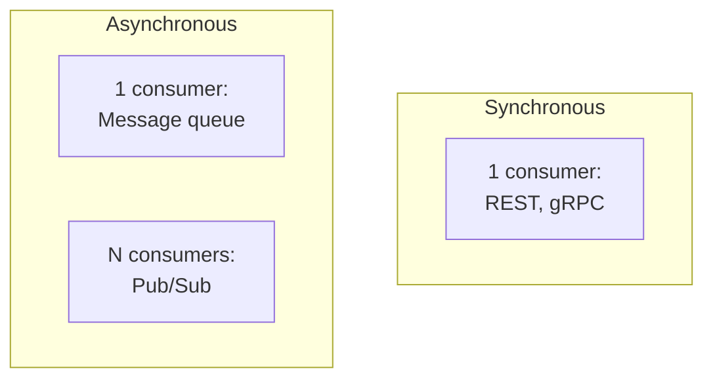
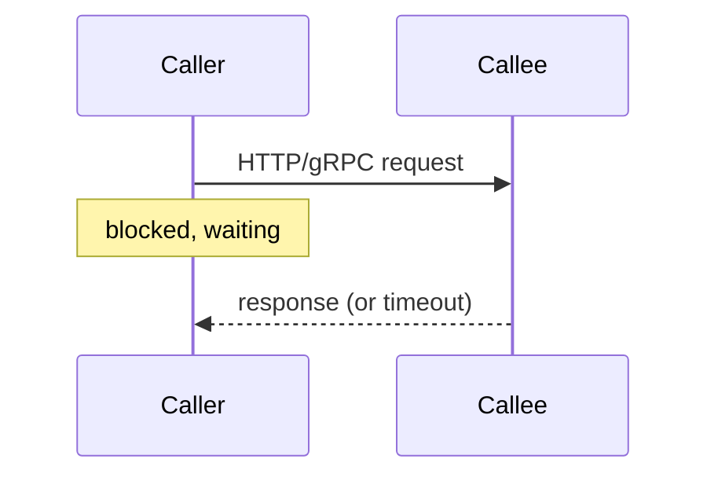
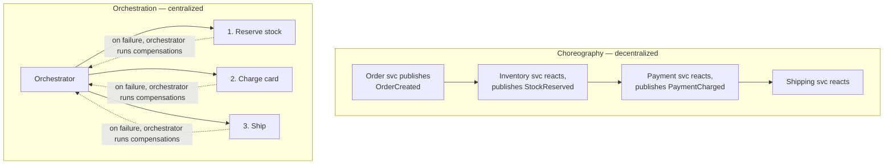

# Microservices Communication

**Prerequisites:** [Messaging patterns](../messaging/patterns.md), [Sagas](sagas.md)

[← Sagas](sagas.md) | [Next: Circuit Breakers →](../reliability/circuit-breakers.md)

---

## Why This Exists

Every in-process function call you split across a network boundary inherits three new failure modes it never had before: the call can be **slow**, it can **fail**, or it can **succeed on the far end while the response is lost** — meaning the caller can never fully distinguish "it didn't happen" from "it happened but I don't know." Every communication pattern on this page is a different answer to living with that ambiguity.

"Great system design isn't about memorizing eight patterns" — it's picking the cheapest one that matches the actual coupling requirement, and being able to say why the other seven were wrong for this call.

!!! tip "Mental model"
    Two independent axes decide the pattern: **synchronous vs. asynchronous** (does the caller block for an answer?) and **one consumer vs. many** (point-to-point vs. broadcast). Everything below is a point in that 2x2, plus two patterns (saga, service mesh) that sit a layer above individual calls.

---

## Synchronous: Request/Response

**REST over HTTP** — caller sends a request, blocks, gets a response. The default for anything user-facing: CRUD APIs, mobile/web clients, anywhere an immediate answer is the point.

**Cost:** both services must be up and responsive *at the same instant*. If the callee is slow, the caller is slow — and without a timeout and circuit breaker (see [Circuit Breakers](../reliability/circuit-breakers.md)), one slow dependency turns into a thread-pool exhaustion cascade across every caller.

**gRPC** is the same synchronous shape with a different wire format: Protocol Buffers over HTTP/2 instead of JSON over HTTP/1.1. Smaller payloads, lower latency, and a strongly-typed schema contract (`.proto` files) — the trade is weaker browser support and a debugging experience that needs `grpcurl`/reflection instead of `curl` and eyeballing JSON. The default choice for internal service-to-service calls at scale; REST remains the default for anything a browser or third party talks to directly.

---

## Asynchronous, One Consumer: Message Queue

Producer drops work onto a queue; a consumer picks it up whenever it's free. The caller does not wait for the work to finish — appropriate for anything without an immediate-response requirement: sending a confirmation email, processing an uploaded file, billing a background job.

**What it buys:** the producer keeps moving even if the consumer is temporarily down or backed up (the queue absorbs the burst — see [Messaging Patterns](../messaging/patterns.md) for backpressure and consumer-group mechanics in depth). **What it costs:** ordering isn't free (most queues guarantee order only within a partition/shard, not globally), and "at least once" delivery means your consumer must be idempotent or you'll double-process on a redelivered message. A **dead-letter queue** is not optional — without one, a poison message that always fails retries forever and blocks everything behind it.

---

## Asynchronous, Many Consumers: Pub/Sub

One event, many independent subscribers — a new-order event might trigger inventory reservation, an email, an analytics write, and a fraud check, none of which know about each other.

**What it buys:** the producer can stay ignorant of who's listening — adding a ninth subscriber requires zero changes to the publisher. This is the loosest coupling on this page. **What it costs:** that same ignorance makes the full business flow hard to trace — "what happens when an order is placed" is no longer readable in one file; it's scattered across N services' event handlers, each reacting independently, and distributed tracing becomes mandatory rather than a nice-to-have.

---

## Orchestration vs. Choreography

These aren't separate transport mechanisms — they're two different ways to coordinate a *multi-step* business process built from the primitives above.

**Choreography** — each service reacts to events independently, no central controller. Maximizes service autonomy; costs visibility, since there's no single place that shows the whole flow, only N places that each show one reaction.

**Orchestration (the Saga pattern)** — a central coordinator drives each step and runs compensating actions on failure. This is the pattern covered in depth in [Sagas](sagas.md): a distributed-transaction substitute where each step commits locally and undo is explicit, not automatic. Preferred for business-critical multi-step flows (checkout, booking) where "what state is this order actually in" needs one authoritative answer — at the cost of the orchestrator becoming a bottleneck or single point of coordination if poorly designed.

---

## Event Sourcing + CQRS

Two patterns that usually show up together, addressing a different pressure than plain pub/sub:

- **Event sourcing** — persist every state *change* as an immutable event, not just the current row. The current state is a derived view (replay the events), not the source of truth.
- **CQRS** (Command Query Responsibility Segregation) — separate the write model (commands, validated against business rules) from the read model (denormalized, optimized for the queries the UI actually needs).

**What it buys:** a complete audit trail for free (you can answer "why is the balance what it is," not just "what is the balance"), replayable history to rebuild projections after a bug, and independently-scalable reads. **What it costs:** the read model is eventually consistent with the write model by some window you must be able to state; evolving an event's schema after the fact is genuinely hard (you can't just `ALTER TABLE` history); and it's a steep enough learning curve that adopting it for a CRUD app with no audit requirement is the textbook "pattern without a pressure" mistake (see [Architecture Patterns](index.md)).

---

## Service Mesh

Not a communication *pattern* between two services — an infrastructure layer that intercepts the calls made by every pattern above. A sidecar proxy runs next to each service instance and handles mTLS, retries, timeouts, traffic splitting (useful for [canary deployments](../cloud/deployment-strategies.md)), and distributed tracing, so individual services don't each reimplement retry logic and certificate rotation.

**What it buys:** cross-cutting concerns move out of application code into infrastructure, applied uniformly instead of "some services remembered to add retries and some didn't." **What it costs:** real operational overhead — another control plane to run, understand, and debug when a request behaves strangely and the mesh itself is a suspect. Standard on large Kubernetes platforms with dozens of services; overkill for five services that could just call each other directly with a shared HTTP client library.

---

## Putting It Together

A realistic e-commerce checkout typically uses several of these at once, not one pattern chosen for the whole system:

| Interaction | Pattern | Why |
|-------------|---------|-----|
| Mobile app → API gateway | REST | Client-facing, needs an immediate response |
| API gateway → internal services | gRPC | Internal, high volume, latency-sensitive |
| Order placed → send confirmation email | Message queue | No immediate response needed, must not block checkout |
| Order placed → notify inventory, analytics, fraud check | Pub/Sub | Multiple independent reactions to one event |
| Checkout: reserve stock, charge card, ship | Saga (orchestration) | Multi-step, needs one authoritative "did this succeed" answer |
| Financial ledger | Event sourcing | Regulatory/audit requirement for full history |
| All internal service-to-service traffic | Service mesh (mTLS, retries) | Uniform security and resilience without per-service reimplementation |

---

## Trade-offs

| Choice | Win | Cost |
|--------|-----|------|
| REST | Simple, universal, human-debuggable | Tight coupling to callee's uptime; no built-in schema contract |
| gRPC | Fast, typed, compact | Weak browser support; needs tooling to debug |
| Message queue | Producer/consumer decoupled in time | Ordering and idempotency become the caller's problem |
| Pub/Sub | Loosest coupling; easy to extend | Business flow visibility scattered across services |
| Choreography | Maximum service autonomy | No single place shows the whole flow |
| Orchestration (saga) | One authoritative view of a multi-step flow | Orchestrator is a coordination bottleneck if not scaled with care |
| Event sourcing + CQRS | Full audit trail, replayable | Eventual consistency; hard schema evolution; real learning curve |
| Service mesh | Uniform cross-cutting concerns | Another control plane; real operational overhead |

---

## Interview Questions

=== "Foundation"
    **Q: When would you choose a message queue over a direct REST call between two services?**

    "When the caller doesn't need an immediate answer and shouldn't be blocked by the callee's availability — sending a welcome email after signup, for example. The queue absorbs bursts and lets the consumer catch up on its own schedule. If the caller genuinely needs a response before it can continue — checking whether a payment succeeded before showing a confirmation screen — that's a synchronous call, not a queue."

=== "Senior"
    **Q: A service publishes events via pub/sub, and six months later nobody can explain what actually happens end-to-end when an order is placed. How did this happen and what would you do?**

    "This is the structural cost of choreography — loose coupling means no single service, and no single file, describes the whole flow; it's implicit in N independent event handlers. I wouldn't necessarily rip out pub/sub, since the decoupling is real and valuable for parts of the flow that genuinely are independent reactions. But for the parts of checkout that are a business-critical, ordered sequence — reserve stock, charge, ship — I'd move that specific subset to an orchestrated saga so there's one place the sequence and its compensations are defined and readable. I'd also add distributed tracing so at minimum the *actual* runtime flow is queryable, even where the code doesn't show it explicitly."

=== "Staff"
    **Q: Every team is independently implementing retries, timeouts, and mTLS in their service's HTTP client, inconsistently. Some retry non-idempotent calls and cause double-charges. How do you fix this org-wide?**

    "This is exactly the pressure a service mesh solves — move retries, timeouts, and mTLS out of application code and into a sidecar proxy that's configured centrally and applied uniformly, so 'does this service retry safely' stops being a per-team trivia question. But the mesh alone doesn't fix retrying non-idempotent operations — that's a data problem: I'd pair the mesh rollout with an idempotency-key requirement on any mutating internal API, enforced by an API-design lint/review gate, so the platform can retry safely by construction rather than by convention. Fixing the double-charge bugs one at a time is a senior task; making the unsafe pattern impossible to write is the staff-level fix."

---

## Key Takeaways

!!! success "Remember"
    1. Every network call trades in-process reliability for three new failure modes: slow, failed, or ambiguous
    2. Sync vs. async and one-consumer vs. many are the two axes; everything else builds on that 2x2
    3. Choreography maximizes autonomy and loses visibility; orchestration (saga) gives one authoritative flow at the cost of a coordination point
    4. Event sourcing + CQRS buys an audit trail and replayability — don't adopt it without an actual pressure for either
    5. A service mesh moves cross-cutting concerns (mTLS, retries) into infrastructure, uniformly — valuable at scale, overkill for a handful of services
    6. Real systems combine several of these patterns; picking one pattern for an entire architecture is the "recall, not judgment" answer

**Previous:** [Sagas](sagas.md) | **Next:** [Circuit Breakers](../reliability/circuit-breakers.md)
