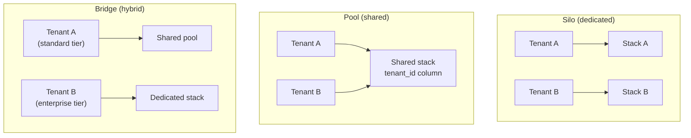

# Multi-Tenancy Design

**Prerequisites:** [Architecture Patterns](index.md), [Database Sharding](../databases/sharding.md)

[← Patterns](index.md)

---

## Why This Exists

A B2B SaaS product serves many customers (tenants) from one codebase. The question that shapes the entire architecture, usually asked far too late: **how isolated is one tenant's data and performance from every other tenant's?** Get this wrong in either direction and it's expensive — too little isolation and one noisy tenant's batch job degrades every other tenant's response time, or worse, a bug leaks Tenant A's data into Tenant B's view (the single worst incident category in B2B SaaS). Too much isolation (a fully separate stack per tenant) and operational cost scales linearly with customer count, undermining the entire economic argument for building a shared platform in the first place.

**This is a spectrum, not a binary, and the right point on it is usually different for different resources within the same system** — a company might isolate tenant *data* strictly while sharing *compute* freely, or vice versa.

---

## The Three Isolation Models

- **Silo (dedicated):** each tenant gets its own database, and often its own application instance. Strongest isolation — a bug in one tenant's data path structurally cannot touch another tenant's, and a noisy tenant can't degrade anyone else's performance. Most expensive per-tenant and the hardest to operate at scale — patching, deploying, and monitoring N separate stacks instead of one.
- **Pool (shared):** all tenants share the same database and application instances, distinguished by a `tenant_id` column (or partition key) on every table. Cheapest, most operationally simple — one thing to deploy, patch, and scale. Isolation is enforced entirely in application logic (every query must filter by `tenant_id`), which means **isolation is only as strong as the weakest query** — miss the filter once, in one endpoint, and you have a cross-tenant data leak.
- **Bridge (hybrid):** most real SaaS products land here. Smaller/cheaper-tier tenants share a pool; larger or compliance-sensitive tenants (an enterprise customer with a contractual data-isolation requirement, or one large enough that its load alone justifies dedicated capacity) get siloed. The isolation model becomes a **pricing tier**, not just a technical decision — "dedicated infrastructure" is frequently sold as an enterprise-plan feature, which means this architectural choice has a direct line to the pricing page.

---

## Data Isolation: Where `tenant_id` Actually Lives

In a pooled model, the mechanism enforcing isolation is worth being specific about, because "we filter by tenant_id" undersells how easy it is to get wrong:

| Approach | How it works | Isolation strength |
|---|---|---|
| Shared table, `tenant_id` column, app-level filtering | Every query includes `WHERE tenant_id = ?`, enforced by application code / ORM | Weakest — one missed filter in one query path is a cross-tenant leak; no structural guarantee |
| Shared table, row-level security (RLS) | Database enforces the `tenant_id` filter automatically based on the connection's session context, even if the application forgets | Stronger — the database is the backstop, not application discipline alone |
| Schema-per-tenant (same DB instance, separate schema/namespace per tenant) | Each tenant's tables live in their own schema; connection is scoped to one schema | Stronger still — a query without a `tenant_id` filter simply can't see another tenant's schema, but N schemas means migrations run N times |
| Database-per-tenant | Full silo at the data layer, shared or dedicated compute above it | Strongest short of full silo — a bug can't cross a database connection boundary; provisioning and migration overhead scales with tenant count |

!!! warning "The interview tell"
    "We filter by `tenant_id` in the application layer" is the correct first answer but an incomplete one at senior level — the follow-up is always "what stops a developer from forgetting the filter in a new endpoint six months from now?" Row-level security or a query-layer abstraction that makes the unfiltered query structurally impossible (not just discouraged by convention) is the answer that shows the isolation is enforced, not just intended.

---

## The Noisy-Neighbor Problem

Isolation isn't only about data leaking — it's also about one tenant's load degrading another's performance, which is a resource-contention problem, not a security one:

- **Compute contention:** a pooled application tier means Tenant A running an expensive report during Tenant B's peak traffic competes for the same CPU/connection pool. Mitigation: per-tenant rate limiting (see [Rate Limiting](../reliability/rate-limiting.md)), request queuing with fairness guarantees, or resource quotas enforced at the infrastructure level (CPU/memory limits per tenant's workload, if the platform can attribute usage that granularly).
- **Database contention:** a shared database means one tenant's expensive, unindexed query or bulk import job can spike latency for every other tenant sharing that instance — a single slow query on a shared DB is now a multi-tenant incident, not a single-customer one. Mitigation: query timeouts and resource governance at the DB level, or graduating high-usage tenants to a dedicated shard/instance before they become the noisy neighbor.
- **The economics of noticing:** in a silo model, a noisy tenant only hurts themselves, which is a much cheaper failure mode to tolerate — this is part of the real cost/benefit calculus behind moving a specific tenant from pool to silo, beyond just the contractual isolation requirement.

---

## Realistic Example

A project-management SaaS starts pooled: one database, `tenant_id` on every table, enforced via an ORM-level scope that's applied automatically to every query (closing the "forgot the filter" gap without full RLS). As the customer base grows, two things happen independently: a healthcare customer requires contractual data isolation for compliance, and a large customer's usage pattern (bulk CSV imports of hundreds of thousands of rows) repeatedly degrades response time for every other tenant sharing that database shard. Both get migrated to dedicated database instances — same application code, different data-tier isolation — while the rest of the tenant base stays pooled. The migration path (extract one tenant's rows into a new database, cut over, verify) is built once and reused for future graduations, rather than treated as a one-off. The lesson embedded in this example: **the trigger for moving a tenant from pool to silo is sometimes compliance and sometimes pure performance economics, and the same mechanism serves both.**

---

## Trade-offs

| | Silo | Pool | Bridge |
|---|---|---|---|
| Data isolation | Strongest — structural | Weakest — app/RLS enforced | Mixed by tier |
| Noisy-neighbor risk | None across tenants | Real — shared resources | Confined to the pooled tier |
| Cost per tenant | Highest | Lowest | Blended, tunable |
| Operational overhead | Scales with tenant count (N stacks to patch/monitor) | Flat — one stack | Two operational models to maintain |
| Onboarding a new tenant | Slower — provision new stack | Fast — add a row | Fast for pooled tier, slower for dedicated |
| Typical fit | Regulated/enterprise customers, or a customer large enough to be its own noisy-neighbor risk | Early-stage SaaS, small/mid-market tenants | Most SaaS products at scale — pricing-tier-driven |

---

## Interview Questions

=== "Foundation"
    **Q: What's the difference between silo and pool multi-tenancy, and what does each cost you?**

    "Silo gives each tenant a dedicated stack — usually a dedicated database, sometimes dedicated compute too — which gives the strongest isolation but means operational cost scales with the number of tenants. Pool puts all tenants in one shared database and application tier, distinguished by a tenant_id, which is far cheaper to run and simpler to operate, but isolation depends entirely on every query correctly filtering by tenant — a missed filter is a cross-tenant data leak. Most real products land on a hybrid: pool the smaller tenants, silo the ones that need contractual isolation or generate enough load to be a noisy neighbor."

=== "Senior"
    **Q: A pooled multi-tenant system just had an incident where one tenant briefly saw another tenant's data due to a missing `tenant_id` filter in a new endpoint. How do you prevent a repeat?**

    "The root cause isn't 'a developer made a mistake' — it's that the isolation mechanism relied on every developer remembering to add a filter, with nothing structural stopping the omission. I'd move the enforcement point: either row-level security at the database, so an unfiltered query simply can't see other tenants' rows regardless of application code, or a query-layer abstraction (a scoped repository/ORM context) that makes writing an unscoped query require deliberately opting out, not deliberately opting in. I'd also add a test that specifically asserts every new endpoint enforces tenant scoping, so the gap is caught in review, not production. The fix has to be structural, because 'be more careful' doesn't survive six months of new engineers touching the codebase."

=== "Staff"
    **Q: Design the tenant-isolation strategy for a new B2B SaaS platform from scratch, knowing you'll have a mix of small self-serve customers and large enterprise accounts.**

    "I'd start pooled by default, because most tenants at launch are small, and building N dedicated stacks before there's revenue to justify it is solving a scale problem that doesn't exist yet. But I'd build the pooled tier with a real isolation backstop from day one — row-level security or an equivalent structural enforcement, not just application-level filtering — because retrofitting that after a leak incident is a much worse position than building it in from the start.

    For enterprise accounts, I'd treat 'dedicated infrastructure' as a tier the pricing model can sell, and build the pool-to-silo migration path as reusable infrastructure early — extract one tenant's data, provision a dedicated instance, cut over, verify — rather than a one-off project the first time a customer demands it contractually. I'd also instrument per-tenant resource usage from day one, even while everyone's pooled, so a tenant approaching noisy-neighbor territory shows up as a metric before it shows up as an incident, and the decision to graduate them to dedicated capacity is a proactive one, not a reactive one made during an outage."

---

## Key Takeaways

!!! success "Remember"
    1. **Isolation is a spectrum (silo → bridge → pool), and the right point can differ per resource** — data isolation and compute isolation don't have to move together.
    2. **In a pooled model, "we filter by tenant_id in application code" is necessary but not sufficient** — row-level security or an equivalent structural guard is what stops a missed filter from becoming a leak.
    3. **Noisy-neighbor is a resource-contention problem, distinct from data isolation** — a tenant can be perfectly data-isolated and still degrade others' performance if compute/DB resources are shared.
    4. **Most real SaaS products are a bridge, and the isolation tier is often literally a pricing tier** — dedicated infrastructure sold as an enterprise feature.
    5. **Build the pool-to-silo migration path once, reusably** — the trigger (compliance requirement or pure load) will happen more than once as the tenant base grows.

**Back to:** [Architecture Patterns](index.md)
