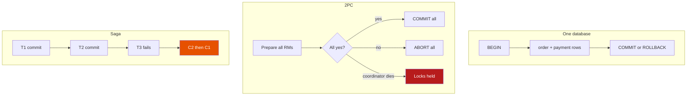
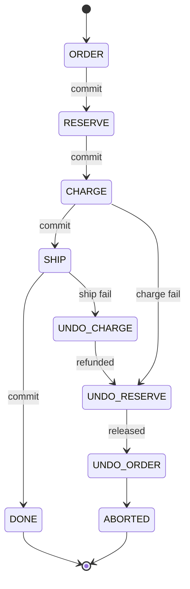

# Sagas

**Prerequisites:** Local transactions, [Messaging patterns](../messaging/patterns.md)

[← Architecture Patterns](index.md) | [Next: Circuit Breakers →](../reliability/circuit-breakers.md)

---

## Why This Exists

Checkout is four writes that *look* like one business transaction:

1. **Create order** (order service)
2. **Reserve inventory** (warehouse)
3. **Charge the card** (payments)
4. **Create shipment** (shipping)

Each write lives in a different database. You charge the card. Shipping's API returns 503. The customer was billed. Nothing will leave the warehouse.

A **local transaction** cannot span those databases. **Two-phase commit (2PC)** can, on paper — and then a coordinator crash, a lock held across a network partition, and a 2-second payment gateway turn your checkout into a distributed deadlock. A **saga** accepts that each step commits locally, and that **undo is your job**: release the stock, refund the charge, mark the order cancelled.

The interview problem is not "what is a saga." It is: **shipping fails after payment — what exactly runs, in what order, and what is still true if the refund itself fails?**

!!! tip "Mental Model"
    A travel agent books a flight, then a hotel, then a car. If the car is sold out, they do not un-commit the airline's database with XA. They **cancel the hotel** and **void the flight** — compensations — each its own transaction. If the void fails, someone still has a ticket and a problem. That leftover is why sagas need **retries, idempotency, and a human/ops path**, not just a diagram.

---

## Local TX vs 2PC vs Saga



| | Local ACID | 2PC / XA | Saga |
|--|------------|----------|------|
| Isolation | Full | Across RMs, expensive | **None** across steps |
| Locks | Milliseconds | Held until all vote | None after each local commit |
| Failure | Rollback | Abort or blocker | **Compensating transactions** |
| Visibility | Never see partial | Rarely | Users *can* see "paid, not shipped" |
| Fit | One service's DB | Rare, same vendor, LAN | Cross-service business flows |

You pick a saga when **you cannot lock the world** for the duration of payment + warehouse + carrier APIs.

---

## Choreography vs Orchestration

**Choreography** — each service emits events; others react.

```
OrderCreated → Inventory reserves → StockReserved → Payments charge
  → PaymentCaptured → Shipping ships
  → ShippingFailed → Payments refund → Inventory release → OrderCancelled
```

- Pro: no central brain, services stay decoupled.
- Con: the workflow is **invisible**. Adding a step means hunting consumers. Cycles and dual-writes to the outbox become a graph you debug in logs.

**Orchestration** — one coordinator (workflow engine or `CheckoutSaga` worker) tells participants what to do, records state, and runs compensations in reverse.

```
Orchestrator:
  execute Order.create
  execute Inventory.reserve
  execute Payments.charge
  execute Shipping.ship   ← fails
  compensate Payments.refund
  compensate Inventory.release
  compensate Order.cancel
```

- Pro: one state machine you can test, timeout, and show on-call.
- Con: coordinator is a dependency (make it durable, not a singleton JVM).

!!! note "Interview Insight 🎯"
    Use choreography for **simple, rare-branch** flows (user signed up → send email). Use orchestration when you have **more than ~3 steps, need timeouts, or must compensate in a strict reverse order** — checkout, payouts, provisioning.

---

## Compensations Are Not Rollbacks

A compensation is a **new** local transaction that *semantically* undoes a prior one.

| Forward | Compensation | Not equivalent to rollback because |
|---------|--------------|------------------------------------|
| Insert order PENDING | Mark CANCELLED | The row still exists; downstream may have read it |
| Reserve qty | Release reservation | Someone else may have reserved the last unit in between |
| Capture $49 | Refund $49 | PSP is eventually consistent; refund takes days; fees |
| Buy a label | Void label | Carrier may have already scanned the package |

Rules that keep you employed:

1. **Idempotent** forwards and compensations (same saga id / idempotency key).
2. **Retry with backoff** until a terminal state — or park for ops.
3. **Never** assume compensation ran because you *sent* the message.
4. Design the **visible** intermediate states (`PAID_UNSHIPPED`) instead of pretending they cannot happen.

---

## Interactive Simulation

Inject **Fail ship** — payment has already committed. Watch compensations walk backwards.

<div class="sim-container">
  <div class="sim-title">Saga Orchestrator</div>
  <div class="sim-controls">
    <button class="sim-btn success" onclick="window._saga && window._saga.run()">Start order</button>
    <button class="sim-btn" onclick="window._saga && window._saga.step()">Step</button>
    <button class="sim-btn" onclick="window._saga && window._saga.reset()">Reset</button>
    <button class="sim-btn danger" onclick="window._saga && window._saga.failAt('charge')">Fail charge</button>
    <button class="sim-btn danger" onclick="window._saga && window._saga.failAt('ship')">Fail ship</button>
  </div>
  <canvas id="saga-canvas" class="sim-canvas" style="width:100%;height:220px;"></canvas>
  <div class="sim-log" id="saga-log"></div>
</div>

**Try:** Fail charge — inventory reservation must release, order cancel, **no refund**. Fail ship — refund *and* release. Those are different undo lists.

---

## How It Works Internally

Durable orchestrator (the production version of the sim):

```
saga_instance(id, type, state, payload, version)
saga_log(saga_id, step, action, status, attempt)
```



Each `action` is a **local** TX in the participant plus an **outbox** (or a sync RPC with a timeout + retry). The orchestrator advances only after a durable ack. Crash mid-step: on restart, **read the log**, retry the in-flight action (idempotent), do not skip.

---

## Realistic Example: Shipping Fails After Payment

```
t0  Order  #991 PENDING          local TX
t1  Reserve SKU-44 × 1           local TX
t2  Stripe capture $49           local TX (PSP side + our payment row)
t3  Carrier API 503              ship step fails
t4  Refund $49                   may take 1500ms, or "pending"
t5  Release SKU-44
t6  Order #991 CANCELLED
```

What the user may see at t3–t4: **charged**. Support must have a page for `PAID_UNSHIPPED`. If t4 fails (Stripe down), you **do not** silently release inventory and walk away — money is gone, stock is free, the next customer buys the last unit. Park the saga in `COMPENSATION_STUCK` and page payments.

Compare 2PC: Stripe will not join your XA transaction. That option was never real.

---

## Failure Modes

### Compensation fails
- **Symptom:** saga stuck; money or stock wrong
- **Fix:** retry + dead-letter + operator runbook; never "delete the row"

### Lost update / dual write
- **Symptom:** charged twice, or reserved twice
- **Fix:** idempotency key = saga id + step; unique constraint on `(order_id, step)`

### Choreography cycle
- **Symptom:** event ping-pong, infinite refunds
- **Fix:** version the events; terminal states; orchestration for money

### Partial visibility
- **Symptom:** recommendation service reads "paid" order that later cancels
- **Fix:** downstreams handle `cancelled`; or wait for `DONE` before side effects

---

## Production Debugging

```
Symptom: customer billed, no tracking number

1. Find saga_id from order_id
2. Read saga_log — which step last succeeded? ship or charge?
3. Carrier and PSP dashboards for that idempotency key
4. If ship never succeeded: is compensation running or stuck?
5. If refund pending: do not re-run charge; wait or manual refund
6. Metrics: saga_stuck{state}, compensation_fail, step_latency
```

---

## Trade-offs

| Dimension | 2PC | Choreography | Orchestration |
|-----------|-----|--------------|---------------|
| Latency | High (locks) | Low per step | Low per step + coordinator hop |
| Ops visibility | Opaque RM logs | Scattered | One state machine |
| Coupling | RM protocol | Event contracts | Orchestrator API |
| Money safety | Strong if all join | Easy to get wrong | Testable undo path |
| When | Single vendor LAN | Simple async | Checkout-class flows |

---

## Interview Questions

=== "Foundation"
    **Q: What is a saga, and why not a database transaction?**

    "A saga is a sequence of local transactions with compensations if a later step fails. A single ACID transaction cannot span the order DB, Stripe, and the carrier. 2PC would hold locks across those network calls and those systems often cannot participate anyway. We commit each step, and if shipping fails after payment we refund and release stock — new transactions, not a rollback."

=== "Senior"
    **Q: Shipping fails after payment. Walk the orchestrator.**

    "Charge already committed, so rollback is impossible. The orchestrator marks `ship` failed, then runs `refund` (idempotent, keyed by saga id), then `release reservation`, then `cancel order`. Each compensation is retried until a terminal ack. If refund fails, the saga stops in a stuck state and pages — we do not release the last unit while money is unrecovered. The user-visible state is PAID_UNSHIPPED until refund settles."

=== "Staff"
    **Q: The team wants choreography 'because microservices' and no orchestrator. What do you challenge?**

    "I ask them to draw every compensation path including 'refund fails' and 'duplicate StockReserved.' If they cannot name the owner of the workflow, on-call will grep five repos during a money incident. I'd keep events for integration, but put checkout in a durable orchestrator (Temporal, Step Functions, or a boring saga table). The org cost of a coordinator is lower than the org cost of an implicit state machine. I'd also force idempotency keys as a platform standard — that decision outlives the saga library."

---

## Key Takeaways

!!! success "Remember"
    1. Cross-service "transactions" are **sagas**; 2PC is almost never on the table with payments
    2. Compensations are **new** work — idempotent, retried, observable
    3. Orchestrate when the undo order matters; choreograph when the flow is trivial
    4. Intermediate states are product facts (`PAID_UNSHIPPED`), not bugs to hide
    5. A failed compensation is a **pager**, not a log line

**Previous:** [Kubernetes](../kubernetes/index.md) | **Next:** [Rate Limiting](../reliability/rate-limiting.md)
