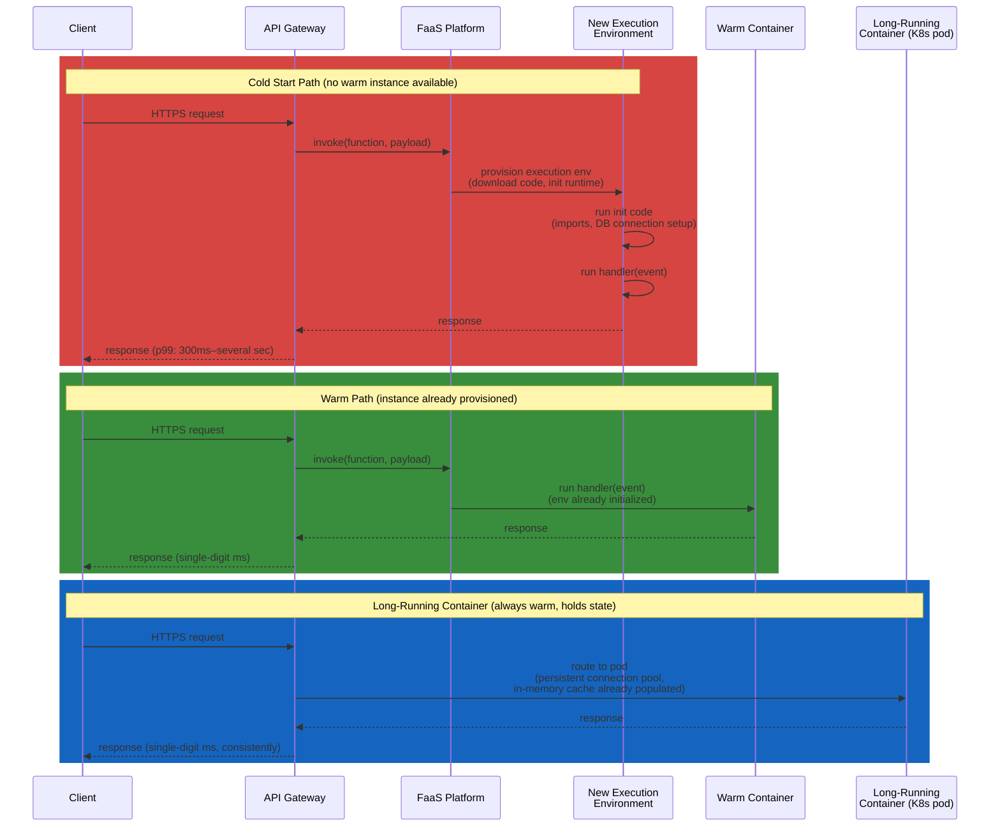

# Serverless vs. Containers — Monolith, Microservices, Serverless

**Prerequisites:** [Architecture Patterns](index.md), [Microservices vs. Monolith](microservices-vs-monolith.md)

[← Back to Patterns](index.md)

---

## Why This Exists

**The question interviews actually ask isn't "microservices or monolith" — it's "how much operational control do you want to give up, and what does giving it up cost you?"**

Monolith, microservices, and serverless are three points on one spectrum, not three unrelated architectures. Each step along it trades a slice of operational responsibility for a corresponding loss of control:

- **Monolith:** you control the process, the machine, the deploy — and you own all of it, forever.
- **Microservices:** you still own the machine and the deploy per service, but you've distributed the *decision* of who owns what — Conway's Law in code.
- **Serverless (FaaS):** the provider owns the machine, the process lifecycle, the scaling, and the patching. You own a function and its trigger. You gave up the most control and, correspondingly, the most responsibility.

Candidates who treat this as "serverless is just microservices, smaller" miss the actual engineering trade-off: **serverless changes your execution model, not just your deployment granularity.** No persistent process means no in-memory cache between requests, no long-lived connections without extra plumbing, and a cold-start tax that a warm container never pays. That's a different set of failure modes than microservices has, and a different cost model than either monolith or microservices.

---

## Mental Model: Renting a Kitchen by the Hour vs. Owning One

**Monolith = owning a house with one kitchen.** You cook everything in it. If the stove breaks, dinner stops. But you know exactly where everything is, and there's no coordination overhead — one cook, one kitchen, one meal.

**Microservices = owning a restaurant with a kitchen per station** (grill, salad, dessert). Each station has its own equipment, its own staff, and can be renovated independently — but you're paying rent, staffing, and utilities for every station, whether or not it's busy that night. And a ticket for a burger now has to travel between stations to become a complete plate.

**Serverless = renting a shared commercial kitchen by the hour, on demand.** You show up when there's an order, cook, and leave — you pay only for the minutes you used the stove. But if it's been sitting cold, the first thing you do is walk in, find the equipment, and warm it up — that's the cold start. You cannot leave a pot simmering on the stove between visits (no persistent state between invocations), and if 500 orders arrive at once, you need 500 available kitchens simultaneously — the venue either has that capacity or you queue.

---

## Architecture: Request Lifecycle, Cold Start vs. Warm Container



**The structural difference:** the container's pod already has its DB connection pool warm, its in-memory cache populated, and its process alive from the last request — every request benefits from prior work. The FaaS warm path gets the same benefit, but only if a previous invocation happened recently enough that the platform hasn't reclaimed the environment; otherwise every request pays the cold-start tax independently, no matter how many other invocations of the *same function* are happening concurrently on *other* fresh environments.

---

## How It Works Internally

### Cold Starts

When no warm execution environment exists (first invocation, a scale-up event, or the platform reclaimed an idle one), the platform must: provision a sandbox (microVM or container), download/mount your code, start the language runtime, and run any module-level initialization (import statements, SDK client construction, DB connection setup) before your handler even runs. Interpreted languages with heavy dependency trees (Python with large ML libraries, Node with a big `node_modules`) cold-start slower than compiled binaries with minimal init (Go, Rust). AWS Lambda's numbers are illustrative: a minimal Go function might cold-start in ~100ms; a Python function importing pandas/numpy inside a VPC can run 1–5 seconds.

**VPC networking makes it worse:** a Lambda attached to a VPC (to reach a private RDS instance, for example) historically had to attach an ENI (elastic network interface) per cold start, adding hundreds of milliseconds to seconds. Providers have mitigated this (AWS's Hyperplane ENI sharing), but it remains a tax most container-based deployments never pay, because a container's networking is set up once at pod start, not once per request burst.

### Execution Time Limits and Statelessness

FaaS platforms impose hard execution ceilings (AWS Lambda: 15 minutes max) and enforce statelessness by design — you cannot rely on anything written to local disk or memory surviving between invocations, because the platform may route the next request to a different (or freshly cold) instance at any time. This forces state out to external stores (DynamoDB, Redis, S3) for anything that must survive a request. A container, by contrast, can hold a warm in-memory cache, a long-lived WebSocket, or a connection pool across thousands of requests, because the process itself persists.

### Cost Model

- **FaaS: pay-per-invocation + pay-per-GB-second of actual execution.** Zero traffic costs zero dollars (idle capacity is free because there is no reserved capacity). Cost scales linearly with usage, which is a feature for spiky/unpredictable load and a liability at sustained high volume — the per-invocation overhead that's negligible at 10 req/sec becomes a very expensive way to run something handling 50K req/sec continuously, when a fixed set of reserved containers would cost less per request at that volume.
- **Containers/monolith: pay-per-reservation.** You pay for the instance/pod whether or not it's handling traffic, which is wasteful at low, spiky load (you provisioned for peak, most of the day it idles) but predictable and cheaper per-request at sustained high, steady throughput.

---

## Realistic Example

**Image thumbnail generation service, spiky traffic (0–2000 req/sec, mostly near 0):**

- **Serverless (Lambda + S3 trigger):** function fires on S3 upload event, generates thumbnails, writes back to S3. At 50K uploads/day averaging ~0.6/sec but bursting to 2000/sec during a marketing push, Lambda scales to match the burst automatically — no pre-provisioning. Cost: ~$0.0000166667/GB-sec × 512MB × ~800ms avg duration × 50K/day ≈ $30–50/month. A fleet of always-on containers sized for the 2000 req/sec burst would idle at near-zero utilization 99% of the day and cost 20–50x more.
- **Containers, same workload but sustained:** if this became a core, constant-traffic API (say, 5000 req/sec sustained, 24/7) instead of a spiky burst, the math flips — a fixed set of container replicas behind a load balancer, sized for steady-state, costs less per request than per-invocation billing at that volume, and you avoid the cold-start tail latency entirely because the fleet never scales to zero.

**Trigger for reconsidering the choice:** when p99 latency SLOs get tight (cold starts blow the budget) or sustained request volume crosses the point where reserved-capacity pricing beats per-invocation pricing — usually somewhere in the tens-of-thousands-of-requests-per-day-per-function range, workload dependent.

---

## Failure Modes

### 1. Cold Start Tail Latency

The p50 looks fine; the p99 (or p99.9, for functions that scale to zero between bursts) is dominated by cold starts. This is invisible in load testing that keeps functions warm through sustained traffic, and only shows up in production when real traffic has gaps — exactly the workload serverless is supposed to be good at. Mitigations (provisioned concurrency, keep-alive pings) each reintroduce some of the reserved-capacity cost model you adopted serverless to avoid.

### 2. Vendor Lock-In

FaaS platforms couple your code to provider-specific triggers, IAM models, and deployment tooling (Lambda's event source mappings, API Gateway integration, Step Functions for orchestration). Migrating off AWS Lambda to GCP Cloud Functions is not a redeploy — it's a rewrite of the trigger wiring, the IAM/permissions model, and often the deployment pipeline. Containers, by contrast, are portable by construction (the same image runs on any Kubernetes cluster, any cloud) — that portability is one of the concrete things you're buying back when you choose containers over FaaS.

### 3. Cost Surprise at Scale

A function that looked free in a proof-of-concept (near-zero traffic) can become the single biggest line item on the cloud bill once product-market fit hits and volume goes from thousands to tens of millions of invocations a month — the linear per-invocation pricing that was an advantage at low volume becomes a liability at high volume, and nobody re-evaluates the architecture decision until finance asks why the bill 10x'd.

### 4. Debugging Distributed FaaS Traces

A request that fans out across 6 chained functions (API Gateway → Lambda A → SQS → Lambda B → DynamoDB Stream → Lambda C) has no single process to attach a debugger to, no persistent log file to `tail`, and each hop can independently cold-start, adding latency at a different point each time you look. Without distributed tracing (AWS X-Ray, OpenTelemetry) wired through every hop from day one, "why did this request take 4 seconds" becomes a correlation-ID scavenger hunt across N separate CloudWatch log groups — worse than the equivalent problem in microservices, because there isn't even a running process to `kubectl exec` into and inspect live.

---

## Production Debugging

**Key metrics to watch:**

| Metric | What it tells you |
|---|---|
| Cold start rate / duration (per function) | High rate under steady traffic → concurrency isn't being reused; check init-code weight, VPC attachment |
| p50 vs p99 vs p99.9 latency spread | Large spread with flat p50 → cold starts dominating the tail, not average-case slowness |
| Concurrent execution count vs. account/region limit | Approaching limit → throttling risk; requests will start failing with 429s under burst |
| Invocation cost per function (billing breakdown) | Identifies runaway functions before the monthly bill does |
| Duration billed vs. actual compute used | Over-provisioned memory (which also buys more CPU on some platforms) wastes money; under-provisioned memory causes slow/failed executions |

**Decision tree — "should this workload be serverless or a container?"**

```
Is traffic spiky/unpredictable, or mostly idle with occasional bursts?
├── Yes → FaaS is likely cheaper AND simpler ops
│         (check: can you tolerate cold-start tail latency on the SLO?)
│         ├── SLO tolerant → serverless
│         └── SLO tight (e.g. sub-100ms p99) → consider provisioned
│              concurrency (adds reserved-capacity cost back) or containers
│
└── No, traffic is sustained/high/steady
    → Containers/monolith almost always cheaper per-request at scale
      (check: does the function need long-lived connections, e.g.
       WebSockets, or in-memory state across requests?)
      ├── Yes → containers (FaaS forces this state external, adds latency)
      └── No → either works; pick based on ops overhead you want to own
```

**Useful checks:**

```bash
# AWS Lambda: check cold start frequency via CloudWatch Logs Insights
fields @timestamp, @initDuration
| filter @type = "REPORT"
| stats count(*) as coldStarts by bin(5m)

# Check concurrent execution against account limit
aws lambda get-account-settings --query 'AccountLimit.ConcurrentExecutions'

# Container equivalent: check pod scale events / HPA behavior for the comparison baseline
kubectl get hpa <deployment-name> -w
```

---

## Trade-offs

| | Monolith | Microservices | Serverless (FaaS) |
|---|---|---|---|
| Operational ownership | Full — you patch, scale, deploy everything | Full, per service — same burden, distributed across teams | Minimal — provider patches OS, runtime, scales for you |
| Scaling granularity | Whole app scales together | Per service | Per function invocation, automatic |
| Cost at low/spiky traffic | Wasteful (pay for idle capacity) | Wasteful (N services idling) | Cheap — near-zero cost at near-zero traffic |
| Cost at high sustained traffic | Efficient (fixed infra, amortized) | Efficient if sized well | Often more expensive — linear per-invocation cost |
| Cold start / latency floor | None (process always warm) | None (process always warm) | Real — cold starts add tail latency |
| State between requests | Trivial (in-process memory) | Trivial within a service | Not allowed — must externalize (DB, cache) |
| Execution time limits | None | None | Hard ceiling (e.g. 15 min on Lambda) |
| Vendor lock-in | Low (portable binary/container) | Low–medium | High — trigger/IAM wiring is provider-specific |
| Best fit | Small team, simple domain, steady load | Large org, independent team release cadence | Event-driven glue, spiky/unpredictable load, low ops budget |

---

## Interview Questions

=== "Foundation"
    **Q: What's a cold start, and why does it happen?**

    "When a FaaS platform has no already-initialized execution environment for a function, it has to provision one from scratch — download the code, start the runtime, run any module-level init like DB connection setup — before the handler even runs. This adds latency, from tens of milliseconds for a lean compiled function to multiple seconds for something like Python with heavy imports inside a VPC. It doesn't happen on every request — only when there's no warm instance to reuse, which is common for low-traffic or bursty functions."

    **Q: When would you choose serverless over containers?**

    "When traffic is spiky or unpredictable and mostly idle — think a webhook handler, an S3-triggered image processor, or event-driven glue between services. You pay near-zero for near-zero traffic, and you don't manage scaling or patching. It's a bad fit when you need low, consistent tail latency (cold starts break that), long-lived connections like WebSockets, or you're running at high sustained volume where reserved-capacity pricing beats per-invocation billing."

=== "Senior"
    **Q: A serverless API's p50 latency looks great in your dashboard, but users complain about occasional multi-second waits. What's going on and how do you fix it?**

    "That's the classic cold-start-in-the-tail signature — p50 hides it because most requests hit a warm instance, but p99 or p99.9 shows the cost of provisioning a fresh environment. I'd confirm by checking cold start duration and frequency in the platform's metrics, not just aggregate latency. Fixes, in order of cost: reduce init-code weight (trim dependencies, lazy-load what's not needed on the hot path), avoid VPC attachment if the function doesn't strictly need it, or — if the SLO genuinely can't tolerate any cold starts — use provisioned concurrency, which keeps N instances warm at all times. That last option reintroduces the reserved-capacity cost you adopted serverless to avoid, so I'd only take it if the latency SLO is a hard requirement, not just a nice-to-have."

    **Q: Your team's Lambda bill went from $200/month to $8,000/month after a traffic increase. How do you evaluate whether to stay serverless?**

    "First I'd get the actual invocation volume and duration breakdown per function — not just the total bill — to find which functions dominate the cost. Then I'd model the reserved-capacity alternative: at the current sustained request rate, what would a fixed container fleet cost, sized for p99 traffic with autoscaling for genuine spikes? If the traffic pattern shifted from spiky to sustained-high as the product grew, that's exactly the crossover point where per-invocation billing stops being cheaper than reserved capacity — the architecture decision that was right at low volume can become wrong at high volume, and it's worth re-evaluating rather than assuming the original choice is permanent."

=== "Staff"
    **Q: Design the compute layer for a platform that has both a spiky webhook-ingestion workload and a steady, latency-sensitive core API. Would you pick one architecture for both?**

    "No — I'd split by workload shape, not force one architecture to fit both. The webhook ingestion is bursty and tolerant of a few hundred milliseconds of variance (it's async, feeding a queue), which is exactly the profile serverless is built for: near-zero cost when quiet, automatic scale for bursts, and I don't need to reason about capacity planning for traffic I can't predict. The core API is latency-sensitive and has steady, predictable volume — a container fleet behind a load balancer, with connection pooling and warm in-memory caches, gives consistent low-latency and is cheaper per-request at that sustained volume; cold starts on the hot path would be an SLO violation I don't want to engineer around.

    The two workloads can share infrastructure at the edges — same VPC, same observability stack, same deployment pipeline where possible — but I wouldn't force the ingestion path onto containers (wasteful idle capacity most of the day) or the core API onto Lambda (cold-start tail risk on a latency-sensitive path, plus the connection-pooling problem: a stateless function re-establishing a DB connection on every cold invocation adds both latency and connection-count pressure on the database).

    I'd also make sure whichever workload starts on FaaS has an explicit re-evaluation trigger — a volume or latency threshold — so the decision gets revisited if traffic patterns shift, rather than staying serverless by inertia once it's no longer the cheaper or faster option."

---

## Key Takeaways

!!! success "Remember"
    1. **Monolith, microservices, and serverless are one spectrum of operational control vs. responsibility**, not three unrelated choices — each step trades control for less ops burden.
    2. **Cold starts are a real, structural cost of FaaS**, not an implementation detail — they show up as tail latency (p99, not p50) and are invisible in load tests that keep functions warm.
    3. **The cost model crossover is real:** FaaS wins at spiky/low/unpredictable traffic (pay-per-invocation, near-zero at idle); containers win at sustained/high/steady traffic (reserved capacity amortizes better).
    4. **Statelessness is enforced, not optional** — FaaS platforms can route the next request to a fresh instance at any time, so anything that must persist goes to an external store, adding latency containers avoid via in-process state.
    5. **Vendor lock-in is a genuine tax on FaaS** — trigger wiring, IAM models, and deployment tooling are provider-specific in a way container images generally aren't.

---

**Previous:** [Stream Processing](stream-processing.md)
