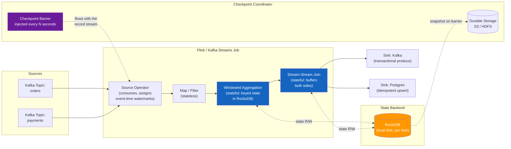

# Stream Processing — Flink, Kafka Streams, Spark Structured Streaming

**Prerequisites:** [Architecture Patterns](index.md), [Kafka Internals & Pulsar Comparison](../messaging/kafka-internals-pulsar-comparison.md)

[← Back to Patterns](index.md)

---

## Why This Exists

**Problem 1: Batch has a latency floor you cannot engineer away.**

A nightly Spark job that computes "fraud score per user" runs at 2 a.m. and finishes at 4 a.m. A fraudulent transaction at 9 a.m. gets scored *tomorrow*. It doesn't matter how much you optimize the job — the architecture itself has a 24-hour latency floor, because the job only runs once a day over a bounded chunk of data. Shrinking the batch window to hourly just moves the floor to an hour; you're still bounding an inherently unbounded thing (a live transaction feed) and paying re-computation cost every cycle.

**Problem 2: The data doesn't stop, but your job does.**

Batch has a start and an end: read the file, compute, write the result, exit. A stream of clickstream events, sensor readings, or order events never ends. Modeling it as "yesterday's batch" is a lossy simplification of what it actually is — a continuous, infinite sequence of records that need continuous computation.

**Problem 3: Events arrive out of order, and "now" is ambiguous.**

A mobile event generated at 9:00:00 might not reach your Kafka topic until 9:00:45 because the phone was in a tunnel. If you group events by *when your server saw them*, you get a windowed count that's an artifact of network conditions, not of user behavior. You need to reason about *when the event happened*, not *when you noticed it* — and that distinction (event time vs. processing time) doesn't exist in batch processing at all, because in batch, every record is already sitting in front of you.

Stream processing engines (Flink, Kafka Streams, Spark Structured Streaming) exist to answer: *how do you compute correct, continuously-updating aggregates over data that never stops arriving and never arrives in order?*

---

## Mental Model: Conveyor Belt vs. Warehouse Picking

**Batch (warehouse picking):** Once a day, a truck backs up to the warehouse. Workers walk every aisle, pick every item on the day's list, load the truck, and it leaves. If a new order comes in five minutes after the truck departs, it waits for tomorrow's truck. The whole operation is bounded — start, do the work, finish, stop.

**Streaming (conveyor belt):** Items are placed on the belt continuously, any time, any rate. Workers stand at fixed stations and process each item *as it passes* — inspect it, route it, count it in a running tally. There is no "run" that finishes; the belt just keeps moving. A worker who falls behind doesn't get to catch up during a quiet period at 2 a.m. — the belt has to slow down or items pile up (backpressure).

The subtlety that trips people up: **items can fall off the belt and get placed back on out of order.** A worker counting "items per minute" has to decide: do I wait for a possibly-late item, or close out the minute and risk being wrong? That decision — how long to wait for stragglers — is exactly what watermarks formalize.

---

## Architecture



**Read this left to right:** two Kafka topics feed a job graph of operators. Stateless operators (map/filter) pass records through. Stateful operators (windowed aggregation, join) keep per-key state in an embedded key-value store (RocksDB in Flink) so a count for `user_42` survives across events without re-scanning history. A checkpoint barrier is periodically injected at the source and flows downstream with the record stream itself — when every operator has seen the barrier, the coordinator snapshots all state to durable storage. That snapshot is what recovery replays from after a crash.

---

## How It Works Internally

### Event Time vs. Processing Time

- **Event time:** the timestamp embedded in the record itself — when the click actually happened, per the device clock.
- **Processing time:** the wall-clock time of the machine executing the operator — when *this specific box* got around to handling the record.

If you window by processing time, a GC pause on the stream processor silently shifts which window an event lands in — the event itself didn't move, but your infrastructure's mood did. Correctness-sensitive aggregates (revenue per minute, fraud windows) must use event time. Simple monitoring dashboards can tolerate processing time because approximate "roughly now" is fine.

### Watermarks: How Late Is Too Late?

A watermark is a moving marker in event time that means "I believe I have seen all events with a timestamp earlier than this." It is a heuristic, not a guarantee — the engine estimates it, usually as `max event timestamp seen so far - allowed lateness (e.g. 30s)`.

```
Events arriving at the operator (event_time, arrival_order):
  (09:00:01, 1st)  (09:00:03, 2nd)  (09:00:02, 3rd, late but within tolerance)
  (09:00:35, 4th)  →  watermark advances to 09:00:05 (35s - 30s allowed lateness)
  (09:00:04, 5th, arrives AFTER watermark passed 09:00:05) → too late, dropped or sent to a side output
```

When the watermark for a window passes the window's end, the engine fires the aggregate — it stops waiting and emits a result. Set allowed lateness too short: correct-looking but wrong results (the straggler never counted). Set it too long: correct results, but every window's output is delayed by that long, which defeats the purpose of streaming in the first place.

### Windowing

- **Tumbling:** fixed, non-overlapping (every 1 minute, 09:00–09:01, 09:01–09:02, …). Each event belongs to exactly one window.
- **Sliding:** fixed size, overlapping (5-minute window, sliding every 1 minute). Each event belongs to multiple windows — 5x the state and 5x the output volume of tumbling for the same window size.
- **Session:** dynamic, gap-based (close the window after 30 minutes of inactivity for that key). Used for "user session" analytics where a fixed clock boundary makes no business sense.

### Stateful Processing, Checkpointing, Exactly-Once

State is what makes stream processing hard: a running count, a join buffer, a deduplication set — all of it must survive a crash without silently losing or double-counting data.

**Flink's mechanism (Chandy-Lamport-derived):** the JobManager injects a checkpoint barrier into the source streams. The barrier flows downstream *inline with the data* — an operator that receives the barrier on all its input channels snapshots its local state (to RocksDB, then async to S3/HDFS) and forwards the barrier onward. Because the barrier travels with the data rather than out-of-band, every operator's snapshot corresponds to a consistent cut across the whole pipeline — "everything up to this point, and nothing after." On failure, the job restarts every operator from the last completed checkpoint and Kafka offsets are rewound to match, replaying only what came after.

**Exactly-once vs. at-least-once:** checkpointing alone gives you *at-least-once* — replay after a crash reprocesses some already-processed records. True *exactly-once* additionally requires the sink to be transactional: Flink's Kafka sink uses Kafka's transactional producer (two-phase commit tied to the checkpoint) so downstream consumers only ever see committed output, never the in-flight replay duplicates. This is why exactly-once has a real cost — transactions add latency and the sink must support them (idempotent upserts to a keyed store work too, without needing 2PC).

**Kafka Streams' mechanism** differs: no separate JobManager. Each task periodically commits its Kafka consumer offsets *and* flushes its local RocksDB state store's changelog topic in the same Kafka transaction — using Kafka transactions natively rather than a bespoke barrier protocol. Simpler operationally (it's a library, not a cluster), but the unit of parallelism and recovery is tied directly to Kafka partitions.

---

## Realistic Example

**Fraud scoring pipeline, 50K events/sec peak:**

- Source: Kafka topic `transactions`, 64 partitions, ~4.3B events/day
- Job: keyed by `account_id`, tumbling 1-minute window computing `sum(amount)`, `count(*)`, joined against a 2-hour sliding window of the same key for velocity checks
- State size: 8M active accounts × ~200 bytes of window state ≈ 1.6 GB live in-memory state, backed by RocksDB per task. On disk this is multiplied by two named factors: RocksDB's LSM-tree layout adds ~5x overhead (uncompacted SSTables, column-family metadata, local snapshot copies), and Flink is configured to retain the last 5 completed checkpoints in S3 for rollback (`state.checkpoints.num-retained: 5`) rather than deleting the prior one as soon as a new checkpoint completes — 1.6 GB × 5 × 5 ≈ 40 GB total across 24 task managers.
- Checkpoint interval: 30 seconds. Checkpoint duration scales with how much state changed since the prior checkpoint and with S3 write throughput — RocksDB's incremental checkpointing uploads only the delta, not the full ~40 GB, so under steady load the delta is small (p50 = 4s), but traffic bursts that inflate the per-key delta, or S3 throttling, push the tail out (p99 = 22s).
- Allowed lateness: 10 seconds (mobile network jitter tolerance) — beyond that, late events go to a side-output topic for a separate reconciliation batch job
- End-to-end latency (event generated → fraud score available): p50 = 1.2s, p99 = 14s (dominated by watermark wait, not compute)
- Exactly-once sink: Kafka transactional producer writing `fraud_scores` topic, transaction timeout 60s (must exceed checkpoint interval or aborted transactions pile up)

Compare to the batch alternative this replaced: nightly Spark job, 6-hour runtime, fraud caught the next day. The stream job trades a fixed 24-hour floor for a p99 of 14 seconds, at the cost of running a stateful, checkpointed, always-on cluster instead of a job that only consumes resources for 6 hours a day.

---

## Failure Modes

### 1. Watermark Stall From a Straggler Partition

If one Kafka partition goes idle (no traffic, or a consumer stuck on a slow disk), and watermarks are computed as the *minimum* across all partitions feeding an operator, the **entire operator's watermark freezes** at that partition's last-seen timestamp — even though 63 of 64 partitions are flowing fine. Every window downstream of that operator stops firing. Symptom: sudden, cliff-like drop in output rate with no corresponding drop in input rate.

**Fix:** configure idle-partition detection (Flink: `withIdleness()`) so a partition with no data for N seconds is excluded from the watermark computation, letting the other partitions' watermark advance.

### 2. State Backend Growth (Unbounded Keys)

A join or dedup operator that keys by `session_id` and never expires state will grow forever if sessions are never explicitly closed. RocksDB compaction slows, checkpoint duration climbs (more state to snapshot), and eventually checkpoints start timing out, which triggers full job restarts — a death spiral where the state that's too big to checkpoint quickly gets bigger because checkpoints keep failing and retrying.

**Fix:** always set a state TTL (Flink: `StateTtlConfig`) or an explicit window/session close. Monitor state size per operator, not just aggregate cluster memory.

### 3. Backpressure

A downstream operator (often the sink) can't keep up — a slow Postgres upsert, a rate-limited external API call. Flink's back-pressure mechanism propagates upstream automatically (bounded buffers between operators fill up, and upstream operators throttle to match), so the whole job slows to the speed of its slowest stage. This is correct behavior — it prevents unbounded memory growth — but it means **watermark advancement, checkpoint completion, and output all stall together**, and it's easy to misdiagnose as "the source is slow" when the source is actually fine and just can't push data through.

**Fix:** identify the bottleneck operator via backpressure metrics (not just consumer lag, which is a symptom). Scale that operator's parallelism, or batch/async the slow I/O call.

### 4. Exactly-Once Cost Under Load

Transactional sinks add coordination overhead — the sink can't commit until the checkpoint completes, so checkpoint duration directly gates output latency for exactly-once pipelines. Under load spikes, checkpoint duration grows (more state, more in-flight data to snapshot), which grows the exactly-once latency floor. Teams that need low p99 more than they need exactly-once should reconsider whether idempotent at-least-once (dedup key on write) is actually sufficient — it usually is.

---

## Production Debugging

**Key metrics to alert on:**

| Metric | What it tells you |
|---|---|
| Checkpoint duration (p50/p99) | Rising duration → state bloat, slow durable storage, or backpressure |
| Checkpoint failure/timeout rate | Non-zero → job restarts imminent, investigate before it cascades |
| Consumer lag (records, not just time) | Lag growing → job can't keep up with input rate |
| Watermark lag (`current time - watermark`) | Diverges from consumer lag → straggler partition or idle-source problem, not a throughput problem |
| Backpressure ratio per operator (Flink UI / `busyTimeMsPerSecond`) | Identifies *which* operator is the bottleneck, not just that one exists |
| State size per operator | Silent growth → missing TTL, key cardinality explosion |

**Decision tree for "the job is behind":**

```
Consumer lag growing?
├── Watermark lag also growing at the same rate
│   → real throughput problem: find the backpressured operator
│     (Flink UI → backpressure tab, or busyTimeMsPerSecond metric)
│     → scale its parallelism, or fix the slow I/O it's waiting on
│
└── Watermark lag flat while consumer lag grows
    → one partition may be idle/stuck; check per-partition watermark
      contribution, not just the operator-level minimum
    → confirm idle-partition detection is configured
```

**Useful commands:**

```bash
# Flink: check checkpoint history and durations
curl http://jobmanager:8081/jobs/<job-id>/checkpoints

# Kafka: consumer lag per partition (Kafka Streams or Flink Kafka source)
kafka-consumer-groups.sh --bootstrap-server broker:9092 \
  --describe --group flink-fraud-scoring

# Flink: current backpressure status per operator
curl http://jobmanager:8081/jobs/<job-id>/vertices/<vertex-id>/backpressure
```

---

## Trade-offs

| | Flink | Kafka Streams | Spark Structured Streaming |
|---|---|---|---|
| Deployment model | Standalone cluster (JobManager/TaskManager) | Library, embedded in your app (no separate cluster) | Runs on Spark cluster (batch engine repurposed) |
| Latency floor | Milliseconds–low seconds (true streaming) | Milliseconds–low seconds (true streaming) | Micro-batch: seconds at best (continuous mode is experimental/limited) |
| State backend | RocksDB, pluggable, very mature | RocksDB, embedded per-instance | In-memory / HDFS checkpoints, less mature for large keyed state |
| Exactly-once | Yes, first-class (checkpoint barriers + transactional sinks) | Yes, via Kafka transactions | Yes, via checkpointing + idempotent/transactional sinks |
| Operational complexity | High — separate cluster, JobManager HA, resource management | Low — it's a library, scales with your app's own deployment | Medium — reuses existing Spark infra if you already run it |
| Best fit | Complex event-time semantics, large state, lowest latency | Kafka-native microservices needing local stream processing, no separate infra | Teams already on Spark for batch, want one engine for both |
| Windowing/CEP sophistication | Richest (custom triggers, CEP library, side outputs) | Good, but less flexible than Flink | Good for standard windows; less for complex event patterns |

---

## Interview Questions

=== "Foundation"
    **Q: What's the difference between event time and processing time, and why does it matter?**

    "Event time is when the event actually happened, embedded in the record. Processing time is when the stream processor happens to handle it. If a mobile event is delayed by a network issue, processing-time windowing puts it in the wrong bucket — the count for '9am' reflects whatever arrived in the 9am wall-clock minute, not what actually happened at 9am. Correctness-sensitive aggregates need event time; simple monitoring can tolerate processing time."

    **Q: What is a watermark?**

    "A heuristic marker saying 'I believe I've seen all events up to this event-time timestamp.' It lets the engine decide when to stop waiting for late data and fire a window's result. Set the allowed lateness too short and you drop real stragglers; too long and every result is delayed by that amount."

=== "Senior"
    **Q: Your Flink job's consumer lag is climbing but CPU usage across the cluster is low. What do you check?**

    "Low CPU with growing lag usually means backpressure from a slow I/O-bound operator, not a compute bottleneck — the cluster is waiting, not working. I'd check the Flink UI's backpressure tab or `busyTimeMsPerSecond` per operator to find which stage is the bottleneck, rather than assuming the source is slow. Common culprits: a synchronous sink call (Postgres upsert, external API), or one skewed key in a keyed operator overloading a single subtask while the rest sit idle. I'd also check checkpoint duration — if checkpoints are timing out, that alone throttles the whole pipeline independent of the actual data-processing bottleneck."

    **Q: When would you choose at-least-once over exactly-once for a stream job?**

    "When the sink is naturally idempotent — an upsert keyed by a stable ID, for instance — exactly-once's transactional coordination is pure overhead with no correctness benefit, since a duplicate write just overwrites with the same result. I'd reserve true exactly-once for sinks where duplicates cause real harm: incrementing a counter, sending an email, charging a card. Exactly-once also raises the latency floor, since output can't commit until the checkpoint completes — for a low-latency dashboard, that trade often isn't worth it."

=== "Staff"
    **Q: Design a stream processing pipeline for real-time fraud detection at 100K events/sec, with a requirement that fraud decisions must account for a 2-hour rolling window of the user's recent activity.**

    "First, the state footprint: 2-hour sliding window per user means every active user's state lives in memory/RocksDB for the full window, not just the current bucket — that's the dominant capacity driver, not throughput. I'd use Flink over Kafka Streams here specifically because the 2-hour keyed state plus a join against a separate short tumbling window for the current transaction is exactly the large-state, complex-windowing case Flink's RocksDB backend and CEP library are built for.

    I'd partition by `account_id` so all of one user's events land on the same task and avoid cross-node state lookups. Watermark strategy needs an explicit idle-partition timeout, since 64+ partitions at 100K/sec will have skew, and I don't want one quiet partition stalling the global watermark.

    Checkpointing at 30s intervals, incremental (RocksDB incremental checkpoints, not full snapshots each time) to keep checkpoint duration from scaling with total state size. Sink is a transactional Kafka producer if downstream consumers can't tolerate duplicate fraud alerts, or an idempotent upsert to a fraud-decision store keyed by transaction ID if they can — I'd push back on requiring exactly-once unless duplicates genuinely cause harm, since it raises the latency floor.

    For failure recovery: state TTL slightly longer than 2 hours (so a restart doesn't need to replay 2 hours of history to rebuild the window), and I'd alert on checkpoint duration and watermark lag separately, since they diagnose different failure classes — state bloat vs. straggler partitions."

---

## Key Takeaways

!!! success "Remember"
    1. **Batch has a latency floor baked into the architecture; streaming removes it** — but adds the complexity of unbounded, out-of-order data.
    2. **Event time vs. processing time is the single most important distinction.** Correctness-sensitive aggregates must use event time; watermarks decide how long to wait for stragglers.
    3. **Checkpointing (Flink's barrier protocol, Kafka Streams' changelog commits) is what makes stateful recovery possible** — but checkpoint duration gates recovery time and, for exactly-once, output latency.
    4. **Backpressure and watermark stalls look similar (both show as growing lag) but have different fixes** — diagnose with per-operator backpressure metrics and per-partition watermark contribution, not just aggregate consumer lag.
    5. **Flink for large state and complex event-time semantics; Kafka Streams for Kafka-native apps that want no separate cluster; Spark Structured Streaming if you already run Spark for batch.**

---

**Previous:** [Event Sourcing & CQRS](event-sourcing-cqrs.md)
