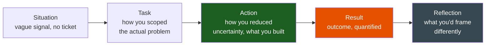
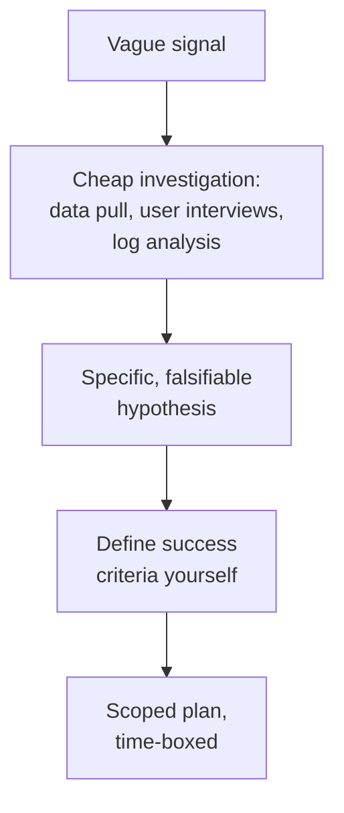

# Ambiguity

**Theme:** Judgement & Ownership | **Seniority:** Senior → Staff

---

## Why This Question Gets Asked

"Tell me about an ambiguous problem" tests whether you can operate without someone else defining success for you. This is the opposite skill from "here's a ticket, implement it." Interviewers are checking:

- Can you define the problem yourself, when nobody handed you a clean spec?
- Do you know how to reduce uncertainty cheaply before committing to a big plan?
- Can you set your own success criteria, and defend that they were the right ones?
- Do you know when to ask for more information versus when to just decide and move?

!!! tip "Interview Insight 🎯"
    Weak answers describe a ticket that merely *felt* vague at first glance but had an obvious right answer within a day. The strong version has genuine, sustained uncertainty — the interviewer should be able to ask "how did you know that was the right problem to solve?" and get a real answer, not a shrug.

---

## STAR + Reflection Framework

---

## Seniority Differentiation

=== "Weak Response"
    > "My manager said users were complaining about the app being slow, but there wasn't a specific ticket. I looked into it, found a slow endpoint, and fixed it."

    **What this shows:** The ambiguity resolved itself almost immediately into a normal bug. No description of how "slow" was scoped, what else it could have meant, or how success was defined.

=== "Senior Response ✓"
    > "I was told, roughly, 'support is getting complaints that the dashboard feels sluggish' — no ticket, no metric, no specific page. That phrase could have meant a dozen different things: one slow query, a client-side rendering issue, a specific browser, a specific customer segment with more data than we'd tested against.
    >
    > Rather than guessing, I spent half a day cheaply reducing the ambiguity: I pulled the actual support tickets (11 of them, over three weeks) and found they clustered on one specific page — the analytics view — and disproportionately came from our largest accounts. That reframed the problem from 'the app is slow' to a specific, testable hypothesis: 'the analytics view doesn't scale with account size.'
    >
    > I defined success myself, since nobody had: p95 load time for the analytics view, segmented by account size, with a target of under 2 seconds for accounts up to 10x our current largest. I profiled the page, found an N+1 query pattern that only showed up past a few thousand rows — invisible in our test data, which was small. I fixed the query pattern and added a synthetic large-account fixture to our test suite so the regression wouldn't reappear silently.
    >
    > Result: p95 for the analytics view on large accounts went from 6.2s to 900ms. Support tickets on this theme dropped to zero over the following two months. I wrote up the scoping process — not just the fix — because the ambiguity-reduction step was the actual hard part, and I wanted the next 'it feels slow' report to start from tickets and a hypothesis, not a guess."

    **What this shows:** Didn't guess at the problem — spent bounded, cheap effort narrowing it into something testable. Defined explicit success criteria that didn't exist before. Fixed both the instance and the blind spot (test data) that let it hide.

=== "Staff Response ✓✓"
    > "A VP asked, in a hallway conversation, whether we should 'invest more in reliability' next year — no further detail, no budget number, no definition of what 'more' meant relative to what we already did. This kind of ask, if taken literally, could justify almost any project; that vagueness is itself a risk, because whoever answers first with a plausible-sounding plan gets the budget, whether or not it's the right plan.
    >
    > I treated it as a scoping problem before a solutioning problem. I pulled a year of incident data across all teams and quantified the actual cost of unreliability we already had: total engineer-hours in incident response, revenue-adjacent impact where we had it, and customer-facing SLA credits paid out. That gave me a real denominator — roughly 900 engineer-hours and a specific dollar figure in credits over the year — rather than a vague sense that things broke sometimes.
    >
    > I then broke 'reliability' into three distinct, separately fundable bets with different payoffs and time horizons: (1) a short-term fix for the two most incident-prone services, (2) a medium-term investment in a shared circuit-breaker library after finding cascading-failure was our most common incident pattern, (3) a longer-term proposal for chaos engineering practice, which I explicitly recommended *against* funding yet, since we didn't have the operational maturity to act on what it would surface.
    >
    > I brought this back to the VP as a menu with trade-offs, not a single answer — deliberately preserving their decision authority rather than assuming I should make the call alone. They funded options 1 and 2. 18 months later, incident engineer-hours were down 35%, and the circuit-breaker library had been adopted by four teams beyond the two I'd originally scoped it for."

    **What this shows:** Recognized that an ambiguous prompt from a VP is a scoping trap — resisted the urge to propose the first plausible-sounding project. Quantified the actual cost before proposing solutions. Presented options rather than a single answer, preserving the requester's real decision authority. Explicitly recommended against funding one option — showing judgement, not just enthusiasm to build.

---

## Reducing Uncertainty Cheaply Before Committing

The core skill in an ambiguity story is not the eventual fix — it's the step where you turned "vague feeling" into "testable hypothesis" without spending a quarter to get there.

!!! warning "Production Trap ⚠️"
    Committing to a full solution before narrowing the problem is the most common failure in ambiguity stories. If your story goes straight from "it felt vague" to "I built X," the interviewer will ask how you knew X was the right thing to build — have a real answer about the narrowing step.

---

## Defining Your Own Success Criteria

Ambiguous problems rarely come with a metric attached. Part of the job is choosing one and being able to defend it.

| Vague ask | Self-defined success criteria |
|---|---|
| "Users say it's confusing" | Task completion rate on the specific flow, measured before/after, target: match or beat the old flow's rate |
| "We should be more reliable" | Incident engineer-hours per quarter, reduced by a specific percentage within two quarters |
| "The onboarding feels clunky" | Time-to-first-value (first successful action), reduced from current baseline |

A defensible metric answers "how would we know if this was the wrong problem to solve?" — if you can't answer that, the metric is decoration, not a real success criterion.

---

## When to Ask vs. When to Decide

Not every ambiguous prompt should be silently resolved on your own judgement — but asking too many clarifying questions before doing any work is its own failure mode.

- **Ask** when the cost of guessing wrong is high and the person who could clarify is cheaply available (a Slack message, not a scheduled meeting three weeks out).
- **Decide and move** when you can cheaply test your interpretation (a data pull, a small prototype) faster than you could get a clarifying answer, or when the requester genuinely doesn't have more specificity to give you — they're asking *you* to define the problem, not withholding information.

---

## Common Interview Questions

1. "Tell me about a time you were given a vague or underspecified problem."
2. "Describe a project with no clear ticket or spec — how did you scope it?"
3. "How do you define success when nobody hands you a metric?"
4. "Tell me about a time you had to decide without enough information."
5. "How do you know when to ask for clarification versus just deciding?"

---

## Staff-Level Extensions

!!! abstract "Staff Engineer Lens 🧠"
    - Did you resist proposing the first plausible plan, and instead quantify the actual problem first?
    - Did you present options with trade-offs, preserving the requester's decision authority, rather than a single unilateral answer?
    - Did you recommend *against* funding something you could have built, showing judgement over enthusiasm?
    - Is the success metric you defined one that could prove your own approach wrong?

---

## Red Flags in Answers

!!! danger "Avoid these"
    - A "vague" problem that resolved itself in an hour — not real ambiguity
    - No description of the narrowing step, straight from feeling to solution
    - A self-defined success metric that conveniently could not fail
    - Asking so many clarifying questions that no work happens for weeks
    - No mention of what else the vague prompt could have meant

---

## Self-Assessment

- [ ] Can I describe the cheap investigation step that turned a vague signal into a testable hypothesis?
- [ ] Did I define my own success metric, and can I defend why that one?
- [ ] Do I have a story where I decided to ask rather than guess, and why?
- [ ] Do I have a story where I decided to act rather than wait for more clarity, and why?
- [ ] For Staff roles: did I present options rather than a single unilateral plan?
