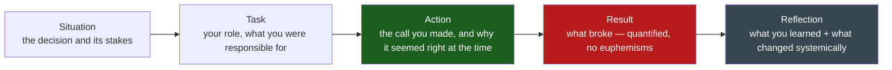

# Failure & Learning

**Theme:** Ownership & Growth | **Seniority:** Senior → Staff → Principal

---

## Why This Question Gets Asked

"Tell me about a time you failed" is one of the most misread prompts in the loop. Candidates hear it as a trap and respond by either flinching (a fake-humble non-failure with no real stakes) or overcorrecting (a public self-flagellation session with no systemic fix). Neither answers what the interviewer is actually testing:

- Do you have enough self-awareness to recognize your own mistakes, or does everything bad happen *to* you?
- When something breaks because of a decision you made, do you own it cleanly, without deflecting to "the requirements were unclear" or "the team didn't have enough time"?
- Do you extract a **systemic** lesson, or just a personal one? ("I should have double-checked" vs. "we now require a second reviewer on schema migrations.")
- Has your behavior actually changed since, or is the "lesson" a line you say in interviews but never applied?

!!! tip "Interview Insight 🎯"
    This question separates candidates into three tiers fast. Tier one picks a non-failure ("I worked too hard and burned out" — not a failure, a humblebrag). Tier two picks a real failure but narrates it as something that happened to them, with the lesson landing on "communicate more." Tier three picks a real failure, owns the decision that caused it without theatrics, and describes a concrete change to the *system* — a lint rule, a review gate, a personal checklist — that makes the same class of mistake harder to repeat.

---

## STAR + Reflection Framework

This question lives or dies on the **Reflection** beat — see the full mechanics in the [Behavioural Framework](framework.md). For failure stories specifically, Reflection needs to answer two things separately: what you learned, and what you *changed* (in the system, not just in your head).

The hardest sentence to get right is inside Action: you have to describe the decision **the way it looked at the time**, not with the benefit of hindsight ("I should have known..."). If you narrate the mistake as obvious-in-retrospect, the interviewer can't tell whether you'd actually catch a *different* mistake next time, or whether you just got lucky that this one taught you something specific.

---

## Seniority Differentiation

Same underlying failure — a bug that caused a production outage — narrated at three levels.

=== "Weak Response (any level)"
    > "We had an outage because of a bug I wrote. It was pretty stressful, but we fixed it and I learned to be more careful with testing."

    **What this shows:** No specifics, no numbers, no systemic fix. "Be more careful" is not a lesson — it's the absence of one. This answer could be told by someone who genuinely didn't examine what happened.

=== "Senior Response ✓"
    > "I shipped a change to our billing service that removed what I believed was a redundant null check. It wasn't redundant — it was catching a legitimate edge case for accounts created via a bulk-import tool that predated our normal signup flow. Those accounts had a null field my new code path didn't handle, and it crashed the checkout process for anyone on one of those accounts — about 1,200 users over 40 minutes before we rolled back.
    >
    > I owned the rollback personally, wrote the incident summary, and root-caused it to a gap in my testing: I'd tested against synthetic data our seed scripts generate, which had been kept clean of that edge case for years. I added a specific test fixture that includes bulk-imported account shapes to our test data going forward, and I now grep for `!= null` / `!== undefined` removals specifically in code review — those are the changes most likely to remove a defense someone added for a reason nobody wrote down.
    >
    > The habit that stuck: when I'm about to delete a check I don't understand, I look at blame history for *why* it was added before assuming it's dead code."

    **What this shows:** Specific, quantified impact. Clean ownership of the actual decision (deleting the check) without hedging. A concrete, narrow fix (the test fixture) plus a personal habit that generalizes beyond this one bug.

=== "Staff Response ✓✓"
    > "Same starting point — I deleted a null check I thought was dead code, and it took down checkout for about 1,200 users over 40 minutes. I want to talk about what happened after the rollback, because that's the part that actually matters at this level.
    >
    > The retro could have stopped at 'add a test fixture' — that's the senior-level fix, and I did that too. But when I looked at *why* that check existed with no comment and no test covering it, I found it had been added four years earlier by someone who'd since left, in response to a different incident that was never written up anywhere durable — just fixed and forgotten. That told me the actual failure wasn't my code review gap; it was that we had no mechanism for defensive code to explain itself, so four years later nobody — including the reviewer who approved my PR — knew that check was load-bearing.
    >
    > I proposed a lightweight convention: any check added specifically because of an incident gets a comment linking to the incident doc, enforced by a lint rule that flags removed conditionals without a corresponding comment for a second look in review. I socialized it with two other teams who'd had near-identical 'deleted a check nobody could explain' incidents in the past year, and it's now part of our org's code review checklist, not just my team's.
    >
    > What changed in how I work: I stopped treating 'this looks like dead code' as a signal to delete, and started treating it as a signal to ask why it's there loudly enough that someone can tell me before I find out the hard way."

    **What this shows:** Ownership without self-flagellation — the story doesn't dwell on how bad the candidate felt, it moves quickly to mechanism. The fix is systemic and cross-team, not just "I added a test." There's a clear artifact (the lint rule) that outlives the individual incident. Crucially, the Staff answer explicitly names what the *senior*-level fix would have been and goes further — showing the interviewer the candidate can operate at both altitudes and knows the difference.

---

## Scenario Walkthroughs

Three realistic scenarios, each run through STAR+Reflection with the seniority delta called out explicitly. Use these as templates — swap in your own numbers and context.

### Scenario 1: Shipped a Bug That Caused an Outage

**Situation:** Billing service, high-traffic checkout path, four years of history in the codebase.

**Task:** I was making a routine cleanup pass removing what looked like unreachable defensive code as part of a broader refactor.

**Action:** I removed a null check with no comment and no covering test, reasoning it was dead code from an old code path we no longer used. I didn't check version history before removing it. I shipped it behind our normal review process — one approving reviewer, no specific scrutiny on that line.

**Result:** The check was live for accounts created through a legacy bulk-import tool. Checkout crashed for ~1,200 affected users over 40 minutes before the on-call engineer identified the deploy and rolled back.

**Reflection:** *(see Senior vs Staff responses above — same scenario, different depth of systemic fix)*

---

### Scenario 2: A Wrong Technical Bet That Had to Be Reversed

**Situation:** I advocated strongly for building a custom event-sourcing layer for our order-management system instead of using our existing relational tables with an audit log, arguing it would give us better replay and debugging capability as the system grew.

**Task:** I was the primary architect on the project and had the most influence on this decision — the team largely deferred to my judgment because I'd used event sourcing successfully at a previous company.

**Action:** I built the first version over six weeks. I underestimated how much the team's mental model, our existing tooling (metrics, dashboards, ad-hoc SQL debugging), and our on-call runbooks all assumed a queryable relational table, not an event-sourced aggregate you had to replay to inspect. Every debugging session during that period took 3-4× longer because engineers had to reconstruct state from an event log instead of running a query.

**Result:** After two on-call engineers separately escalated that they couldn't debug production incidents fast enough, I reversed the decision — we migrated back to a relational model with an append-only audit table (which was the middle ground we should have chosen originally), a project that cost roughly three additional weeks on top of the six already spent.

**Reflection — Senior level:** "I learned that a pattern being right in isolation doesn't mean it's right for a specific team's existing tooling and operational muscle memory. I now explicitly ask 'who debugs this at 2am, and what will they reach for' before proposing an architecture, not just 'is this technically sound.'"

**Reflection — Staff level differentiator:** "The deeper mistake wasn't choosing event sourcing — it's that I made an architectural bet this large without a reversibility plan or a checkpoint to validate the assumption early. I now write a one-page 'kill criteria' section into any architecture proposal above a certain size: what evidence in the first 2-3 weeks would tell us this bet is wrong, and what the cheap-exit path looks like if it is. I've since used that template on two other proposals and it caught a bad direction in one of them after 10 days instead of six weeks."

*Notice the Staff reflection doesn't relitigate whether event sourcing was a good idea — it identifies the process gap that let a wrong bet run three times longer than it needed to before anyone had a structured way to call it.*

---

### Scenario 3: Misjudged a Project's Scope or Timeline

**Situation:** I committed to delivering a permissions-and-roles overhaul in one quarter, based on a scoping conversation where I estimated the work myself without involving the two other teams whose services would need to integrate with the new permission model.

**Task:** I owned the project plan and the commitment to leadership.

**Action:** I broke the work into what I thought were the major pieces — schema design, migration, API — and didn't discover until week 6 of 12 that two consuming teams each needed roughly three weeks of their own integration work that hadn't been scoped or scheduled anywhere, because I'd scoped the project as "my team's work" rather than "the full cross-team dependency graph."

**Result:** The project slipped by five weeks past the original commitment. Leadership had already communicated the original date externally for a compliance-related deadline, which had to be renegotiated.

**Reflection — Senior level:** "I learned to scope cross-team work by literally listing every team whose code touches the change, in week one, and getting a rough estimate from each of them before committing to a date — not estimating their work for them."

**Reflection — Staff level differentiator:** "What changed structurally: I now refuse to give leadership an external-facing date until a project has a written dependency map signed off by every team it touches — not as bureaucracy, but because I'd made the mistake of privately believing I could compress other teams' unscoped work by sheer force of urgency once we hit week 6, and that never works. I also raised this as a gap in our project-planning template company-wide — it now has a mandatory 'cross-team dependencies' section before a date can be committed externally, which two other teams have since told me caught a similar gap for them before it became a slip."

---

## Staff vs Senior: The Explicit Differences

!!! abstract "Staff Engineer Lens 🧠"
    Across all three scenarios, the delta between Senior and Staff answers is consistent:

    1. **Ownership without self-flagellation.** Staff answers spend one sentence on what went wrong and move quickly to mechanism. They don't perform remorse — dwelling on how bad it felt reads as needing the interviewer's reassurance, not as accountability.
    2. **Systemic fix, not just a personal fix.** "I added a test" is a Senior-level close. "I added a test, *and* I changed the review checklist / lint rule / planning template so this class of mistake is harder for anyone to make" is the Staff-level close.
    3. **A concrete change in how they work, stated as a habit, not a resolution.** "I'll be more careful" is not a habit. "I now do X before Y, and I've used it N times since" is a habit — it implies the lesson is load-bearing, not a line reserved for interviews.
    4. **Cross-team or cross-org reach, when the story warrants it.** The Staff scenario 1 answer explicitly mentions socializing the fix with two other teams who'd hit the same failure. That's the signal an interviewer is listening for: did the fix outlive your own repo?
    5. **They name the smaller fix explicitly, then go past it.** The Staff answers in scenarios 1 and 2 both say, in effect, "the obvious fix would have been X — I did that, but the real gap was Y." This shows range: the candidate isn't just reaching for the biggest possible answer, they understand the smaller one and chose to go further.

---

## Avoid These Traps

!!! danger "Red flags interviewers are listening for"
    - **Blaming others.** "The requirements were unclear," "QA should have caught it," "the other team gave me bad data" — any version of this shifts a story about *your* judgment into a story about someone else's. Even if true, own your part first; you can mention contributing factors, but never lead with them.
    - **No real learning, or a lesson that isn't specific.** "I learned to communicate more" or "I learned to test more" are so generic they could follow any failure story ever told — they signal the candidate didn't actually examine the mechanism of what went wrong.
    - **A fake-humble non-failure.** "My biggest weakness is I care too much" in disguise: "I failed because I worked too hard and didn't take enough vacation," or "I failed to delegate because I wanted to make sure it was done right." These have no real cost, no real decision that was wrong, and interviewers have heard hundreds of them. They read as an unwillingness to be vulnerable, which is itself the thing the question is testing for.
    - **Choosing a failure with no real stakes.** A typo in a doc, a meeting you were five minutes late to — if the result section has no quantified consequence, the interviewer can't calibrate how you behave when something actually matters.
    - **Over-performing remorse.** Spending most of the answer on how stressful or embarrassing the incident was, rather than on the decision and the fix. A little acknowledgment of the stakes is fine and human; dwelling on it reads as needing to be told it's okay, which isn't what the interviewer is there to do.
    - **A lesson that isn't durable.** If pressed with "have you had a similar situation since — what did you do differently," you need a real answer. If the honest answer is "no, I haven't thought about it since the interview prep," the story isn't ready yet.

---

## Related Prompts You'll Hear

The framing changes, but these all fish for the same story bank — have your scenarios mapped to each phrasing so you're not caught reconstructing on the spot:

=== "Direct"
    - "Tell me about a time you failed."
    - "What's your biggest professional mistake?"
    - "Describe a time you made a wrong decision."

=== "Indirect"
    - "Tell me about a time a project didn't go as planned." — usually fishing for the same thing, but gives you slightly more room to frame it as a scoping/estimation failure (Scenario 3) rather than a hard technical bug.
    - "What feedback have you received that was hard to hear?" — adjacent but distinct; this one wants a story about *someone else* identifying the gap, not you catching it yourself. Don't reuse a failure story here unless the feedback genuinely came from someone else, not from an outage alarm.
    - "Tell me about a time you had to change your approach mid-project." — can be answered with Scenario 2 (the wrong technical bet), emphasizing the pivot itself more than the initial mistake.

=== "Pressure-tested"
    - "What's a mistake you made that you haven't fully fixed yet?" — deliberately harder; wants to see if you'll manufacture a fake resolution or honestly describe a fix that's still in progress. Honesty here scores better than a too-neat ending.
    - "Tell me about a time you found out you were wrong after strongly advocating for something." — maps directly to Scenario 2; the interviewer wants to hear how you handled being publicly wrong, not just that you were.

---

## Interviewer Follow-up Probes

Be ready for these — they're designed to test whether the reflection is real or rehearsed:

1. **"What would you have needed to see, at the time, to make a different call?"** — Tests whether you actually understand the decision point, or are narrating with hindsight bias.
2. **"Has anything like this happened again since — what did you do differently?"** — Tests whether the "lesson" actually changed behavior, or is a line reserved for interviews.
3. **"Who else was affected by this, and how did you handle telling them?"** — Tests whether you can talk about the human/organizational fallout, not just the technical one.
4. **"What was the reviewer's role in this — did they miss it too, and how did you handle that conversation?"** — A trap for candidates who secretly want to blame the reviewer; watch for deflection here.
5. **"If you hadn't caught it yourself, how would it have been caught?"** — Tests whether the systemic fix is real (a lint rule, a gate) or whether the story is really "I got lucky and now I promise to be careful."

---

## Self-Assessment

- [ ] Do I have a real failure story with a quantified, non-trivial consequence — not a disguised humblebrag?
- [ ] Does my Action beat describe the decision the way it looked *at the time*, without hindsight framing?
- [ ] Does my Reflection name a systemic fix (a gate, a lint rule, a template change) — not just a personal resolution?
- [ ] Can I say, honestly, what changed in how I work since — and give a second example where the habit applied?
- [ ] Have I removed any sentence that blames a person, team, or "unclear requirements" as the primary cause?
- [ ] For Staff-level: does my fix reach beyond my own team, and can I name who else adopted it?

**See also:** [Behavioural Framework](framework.md), [Technical Disagreement](technical-disagreement.md)
