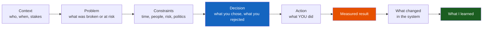
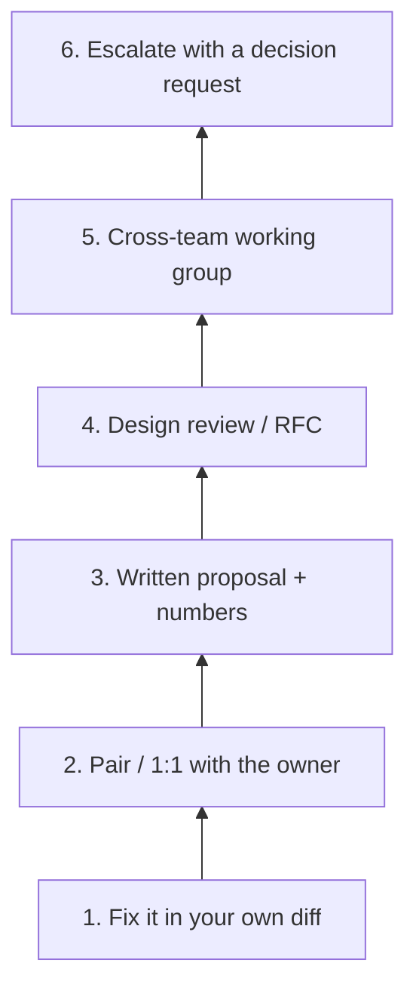
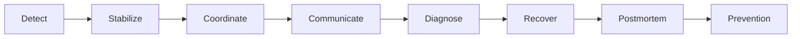

# Behavioural Interview Framework

**Theme:** How you tell the work | **Seniority:** Senior → Staff

Interviewers are not collecting autobiographies. They are testing whether you can **see a system of people and machines**, make a decision under constraints, and leave the system better than you found it.

---

## Why answers fail

A typical senior candidate walks in with “I led the migration.” Ten minutes later the interviewer still does not know: what was at risk, what you personally decided, what number moved, or what you would do again.

The fix is not more adjectives. It is a **spine**.

---

## STAR + Reflection

Classic STAR stops at the press release. Senior loops add **constraints**, **the decision**, and **what changed in you or the org**.



| Beat | You must be able to say | Weak substitute |
|------|-------------------------|-----------------|
| Context | Team, product, time box | “At my last company…” |
| Problem | User / $ / risk in one sentence | “We needed to improve things” |
| Constraints | Deadline, headcount, blast radius | None — sounds like a lab |
| Decision | A vs B and *why A* | A list of tasks |
| Action | First-person verbs | “We” for everything |
| Result | Number + window | “It went well” |
| Changed | Policy, test, design, org habit | “I worked hard” |
| Learned | A rule you still use | “Communication is important” |

!!! tip "Interview Insight 🎯"
    If they interrupt after Action, you front-loaded tasks. Lead with **stakes and decision**, then they will *ask* for the tasks.

---

## Quantifying impact

You do not need a finance partner. You need a **denominator**.

```
Latency:     p99 1.8s → 240ms after the change, 3 weeks of data
Reliability: 12 Sev-2s / quarter → 2, same traffic shape
Cost:        $74k/mo Kafka → $51k/mo (−31%) at constant produce rate
People:      on-call pages 40/week → 9/week; MTTR 70m → 22m
Delivery:    lead time 14d → 5d; rollback rate 18% → 4%
Risk:        blast radius 100% of checkouts → 8% canary
```

If you truly have no number: **rate, time, or blast radius**. “I wrote a design doc” is not a result. “Two teams unblocked; API shipped in 3 weeks instead of a quarter” is.

!!! warning "Production Trap ⚠️"
    Invented precision (“we saved $12,472.18”) reads as fake. Ranges and time windows read as honest: “about 30% CPU, the month after launch.”

---

## One story, three altitudes

Same incident — a checkout timeout during a sale. The **facts** do not change. The **unit of work** does.

=== "Junior — “I fixed the bug”"
    > “Checkout was timing out. I found a missing index on `orders.user_id` from a recent migration. I added the index. Timeouts stopped.”

    **What it proves:** can ship a local fix. **What it misses:** how you knew, who you told, why it shipped unindexed, how it never happens again.

=== "Senior — root cause, tests, monitoring"
    > **Context:** Black Friday weekend, checkout SLO 300ms p99, I was primary on-call.
    > **Problem:** p99 8s, conversion dropping; deploy 90 minutes earlier added a filter on `user_id`.
    > **Constraints:** cannot take checkout down for a long lock; exec wants a time-to-green every 10 minutes.
    > **Decision:** mitigate with a narrower query *and* an online index, not an immediate rollback (rollback would drop a fraud check we needed that weekend).
    > **Action:** I confirmed `Seq Scan` on 40M rows, added the index concurrently, shipped a regression test that fails `EXPLAIN` without Index Scan, added a p99 alert on that query.
    > **Result:** p99 8s → 180ms in 18 minutes. Sale recovered; estimated $X not lost after mitigation.
    > **Changed / learned:** schema checklist now requires `EXPLAIN` on staging at 2× prod rows. I learned I should have blocked the Friday deploy without that check — process, not heroics.

=== "Staff — class of failure, teams, safeguards"
    > Same outage. I ran incident command: platform, checkout, DBA, comms. I froze deploys org-wide for 2 hours, not just our repo. After mitigation I treated it as a **class**: “online schema change without a query plan gate.”
    > I got three orgs to adopt a shared migrate-linter and a canary that compares p99 per *query fingerprint*, not per service. I presented a blameless RCA to the VP: the missing piece was not one index, it was no owner for schema review across six services that share the cluster. We funded that ownership. Next two quarters: zero sale-day Sev-1s from schema. Two other teams reused the fingerprint canary on non-checkout traffic.

    **What it proves:** you change the **system that produced the bug**, across teams you do not staff.

!!! abstract "Staff Engineer Lens"
    Staff stories have a **constituency** (teams who did not report to you), a **reusable artifact** (lint rule, template, SLO), and a **class of failure** (not a ticket). If your story ends at your repo, it is a senior story — say so, then show one time you went wider.

---

## Influence ladder

You do not start every disagreement at “all-hands memo.”



| Rung | Use when | Failure mode |
|------|----------|--------------|
| 1 | You own the code | Silent heroics, no leverage |
| 2 | One other owner, ego in the room | Public challenge, they entrench |
| 3 | Need a record, async time zones | 12-page novel, no ask |
| 4 | Multiple implementations possible | Review with no decision-maker |
| 5 | Incentives disagree | Meeting without a written decision |
| 6 | Safety / money / legal | Escalating taste |

Interviewers listen for **rung choice**. Jumping to 6 on a library bikeshed is a red flag. Staying on 1 while three teams ship the wrong protocol is also a red flag.

Worked example: [Technical Disagreement](technical-disagreement.md).

---

## Incident flow (tell it in this order)

When the prompt is “tell me about an outage,” do not start with the root cause. Start with **detection**, or they cannot judge your judgment.



| Phase | One sentence you should own |
|-------|-----------------------------|
| Detect | Who noticed, how fast vs SLO, what was missing? |
| Stabilize | What reduced user pain *before* you knew why? |
| Coordinate | Who was in the room, who had the pen? |
| Communicate | What did you tell support / exec, how often? |
| Diagnose | What did you rule out, in what order? |
| Recover | What was the actual fix, what was the risk of that fix? |
| Postmortem | What was the systemic cause, not the human? |
| Prevention | What shipped, what you measured after? |

Full worked example: [Production Incident](production-incident.md).

---

## Story inventory (build this before the loop)

Have **six** stories you can retell at junior / senior / staff altitude. Not twelve shallow ones.

1. Production incident you drove
2. Technical disagreement you influenced
3. You were wrong, and changed
4. Delivery under an ugly constraint (date, headcount, legacy)
5. Mentorship or raising the bar (hiring, review, on-call)
6. Ambiguous problem you framed (no ticket, you defined success)

For each, write the eight beats on one page. Rehearse the **90-second** version and the **5-minute** version.

---

## Question bank — what they are actually scoring

=== "Ownership"
    | They ask | They score |
    |----------|------------|
    | Tell me about a production incident. | Detect → prevent, not “I SSHed and it worked.” |
    | A time you dropped the ball. | Specific miss, repair, new habit. No self-flagellation theater. |
    | A time you went beyond the ticket. | Did you notice the adjacent risk? |

=== "Conflict & influence"
    | They ask | They score |
    |----------|------------|
    | Disagreement with a peer / skip-level. | Evidence, 1:1 first, disagree-and-commit. |
    | Someone who would not listen. | Did you change channel, or just talk louder? |
    | You were overruled. | Commitment after the call, plus a recorded dissent. |

=== "Judgment"
    | They ask | They score |
    |----------|------------|
    | A time you said no. | Cost of yes, alternative, relationship intact. |
    | Cut scope under a date. | What you cut, what you protected, who you aligned. |
    | Not enough data. | What you decided, what you instrumented to learn. |

=== "Staff extras"
    | They ask | They score |
    |----------|------------|
    | Influence without authority. | Constituency, artifact, metric. |
    | Strategy vs a shiny rewrite. | Multi-quarter bet, kill criteria. |
    | Org-level failure. | Incentives, ownership gaps, not “they were junior.” |

=== "Growth"
    | They ask | They score |
    |----------|------------|
    | Feedback that stung. | Changed behavior, not just feelings. |
    | Mentored someone. | Their outcome (promo, page load), not your feelings about mentoring. |

---

## Answer hygiene

**Do**

- First person for decisions: “I chose X because constraint Y.”
- Name the alternative you rejected.
- Put the number next to the decision, not in a slide at the end.
- Stop talking when the eight beats are done.

**Do not**

- Narrate a 14-person “we” with no you.
- Trash a previous employer or a named colleague.
- Claim the entire company’s revenue.
- Use a story you cannot defend under “what did the dashboard show?”

---

## Full story — eight beats (senior)

Use this as a template, not a script. Swap in your numbers.

1. **Context.** Payments platform, 40 engineers, I owned the authorize path. Peak 120 TPS, SLO 300ms p99.
2. **Problem.** After we tripled retries to “fix” a flaky PSP, double-charges appeared for 0.4% of orders over a weekend.
3. **Constraints.** Could not take a week for a new ledger; support was already refunding by hand; legal wanted a written control by Monday.
4. **Decision.** Idempotency key at the PSP, not a full exactly-once rewrite. Rejected “just turn off retries” (availability) and “rebuild the ledger” (time).
5. **Action.** I spec’d the key format, sat with two service owners to plumb it, wrote the reconcile job against PSP exports, and paused the retry increase myself.
6. **Result.** Zero duplicates in the next 30 days; authorize success +11% once retries were safe; refund queue cleared in a week.
7. **What changed.** Lint rule: any outbound money call without an idempotency key fails CI. Runbook for “duplicate charge” now starts at the reconcile table.
8. **Learned.** Retries are an amplifier. I now ask “what is the idempotency token?” before I ask “how many retries?”

Staff altitude on the same story: you convene PSP + order + support, fund the lint org-wide, and measure duplicate rate as a company SLO — not a ticket on your team.

---

## Red flags (theirs and yours)

!!! danger "They will ding you for"
    - No constraint (sounds like unlimited time and headcount)
    - No rejected option (sounds like you executed a ticket)
    - No number, or a number you cannot defend
    - Villains (“the other team was incompetent”)
    - Staff title with a junior unit of work (one bug, one PR)

If **you** hear a vague prompt — “tell me about a challenge” — pick the story yourself and announce the lens: “I’ll do this as an incident with detect → prevent” or “as a cross-team influence story.” That is a senior move.

---

## 90-second skeleton (memorize)

> **Context + problem + stake.** “Q3, payments, 2% of auths double-charged after a retry change — trust and money.”
> **Constraint + decision.** “Could not dual-write for a week; I chose idempotency keys at the PSP boundary over a full outbox rewrite.”
> **Action (two verbs).** “I shipped the key + a reconcile job; I paused the retry increase.”
> **Result.** “Zero duplicates in 30 days; retry success +11%.”
> **Changed + learned.** “Idempotency is now a lint rule on any outbound money call. I learned retries without keys are a feature for creating money.”

Then shut up. Let them pick a beat to deepen.

---

## Self-Assessment

- [ ] Six stories, each with a number and a rejected alternative
- [ ] One story I can tell at junior, senior, and staff altitude
- [ ] One story where I was wrong
- [ ] I can walk detect → prevent without jumping to the bug
- [ ] I know which influence rung I used, and why not one higher
