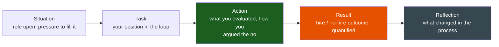

# Hiring & Raising the Bar

**Theme:** Judgement & Ownership | **Seniority:** Senior → Staff

---

## Why This Question Gets Asked

"Tell me about your role in hiring" or "a time you disagreed on a hiring decision" tests something narrower than it sounds: **do you protect the bar when it's expensive to do so?** Anyone can reject a clearly weak candidate. The signal is in what you do with a "maybe" — a candidate who is pleasant, has an okay resume, and would probably not fail, when the team has had three reqs open for two quarters and your manager is asking why the pipeline is empty.

Interviewers are probing:

- Do you have a real bar, or a vibe? Can you articulate *why* someone failed, beyond "didn't feel senior"?
- Do you calibrate against a signal, or against how you felt in the room that day?
- Can you say no to a hire under headcount pressure, and defend it to a manager who wants the seat filled?
- Do you invest in raising other interviewers' bar, or just protect your own loop?

!!! tip "Interview Insight 🎯"
    Weak answers describe the *process* ("we do four rounds, then a debrief"). Strong answers describe a **specific candidate**, the specific signal that tipped the decision, and what it cost to hold the line.

---

## STAR + Reflection Framework

The hard part of this story is never the clear reject. It's the candidate who clears every box except one, where the team desperately wants a yes.

---

## Seniority Differentiation

=== "Weak Response"
    > "We interviewed a candidate who was okay but not amazing. I said we should probably pass, and the hiring manager agreed."

    **What this shows:** No specific signal, no real tension, no cost to the decision. This could describe any interview ever.

=== "Senior Response ✓"
    > "We had a backend req open for 11 weeks — two quarters of eng leadership asking about it in staff meeting. A candidate came through who was likeable, had 6 years of experience, and passed the coding round cleanly on a well-rehearsed problem. My round was the system design interview. I gave him a URL shortener with a twist — a write-heavy variant — and he defaulted to the memorized answer: consistent hashing, read replicas, the works, without noticing the workload didn't call for it. When I pushed — 'walk me through what happens on a write spike' — he couldn't reason from first principles; he re-explained the memorized diagram louder.
    >
    > In debrief, the other three interviewers were leaning yes — good communicator, culture add, the team needed the seat. I said no, specifically: 'He knows the vocabulary of system design but can't reason about a system he hasn't seen before. That's the actual job — most of our design problems aren't in a textbook.' I walked through the transcript of the pushback exchange rather than asserting a vibe.
    >
    > The hiring manager pushed back — we'd already lost two candidates that quarter and the team was stretched. I held the no, and offered a compromise: I'd personally take two more phone screens that week to backfill the pipeline faster."

    **What this shows:** Specific evaluation criteria, evidence from the interview transcript rather than a feeling, holding the line under real pressure, and taking on cost (extra screens) rather than just saying no and walking away.

=== "Staff Response ✓✓"
    > "Same situation, but I'd noticed it wasn't isolated — three of our last five 'no hire' debriefs on system design rounds had the same shape: candidates who'd memorized a small set of designs (URL shortener, chat app, rate limiter) and couldn't adapt them when the constraints changed. Our interview bank was stale; these problems were on every prep site verbatim.
    >
    > Beyond holding the no on that one candidate, I rewrote our system design bank to require a **mid-interview constraint change** — 20 minutes in, we'd flip a requirement (now it's write-heavy, now it needs multi-region) and score specifically on how the candidate re-derived the design, not whether they landed on a 'correct' one. I ran calibration sessions with all 14 interviewers on our loop using recorded past interviews, scored independently, then compared — we had a 40% disagreement rate on 'hire' vs 'lean hire' before calibration, which told me the bar existed in my head but not in the loop's.
    >
    > Six months later: false-positive rate (hires who didn't pass their 6-month review) dropped from roughly 1 in 5 to 1 in 12, and interviewer disagreement on debrief calls dropped by half. I also wrote the calibration doc as a reusable onboarding artifact for new interviewers."

    **What this shows:** Recognized a pattern across candidates, not just one decision. Built a reusable artifact (the calibration doc, the new problem bank) that outlasts the individual hire. Measured a org-level signal (false-positive rate), not just a single good call.

---

## Sample Story: The Compromise Candidate

**Situation:** Series-B startup, 22 engineers, hiring for a senior platform role. The team had been running short-staffed for four months; the VP of Eng had started asking about time-to-fill weekly.

**Task:** I was the bar-raiser interviewer — the person whose "no" could override a majority-yes debrief, by team convention.

**Action:**

1. The candidate passed coding and behavioural cleanly; my round was debugging a flaky-but-passing CI pipeline — deliberately underspecified to see how they'd investigate.
2. He jumped straight to "add retries" without forming a hypothesis about *why* it was flaky. When I asked him to name three possible causes before touching anything, he could only name one.
3. In debrief, three of four interviewers leaned yes — strong communicator, good culture fit, team was desperate.
4. I laid out the specific gap: not a knowledge gap, a *process* gap — jumping to a fix before diagnosing is a pattern that costs real incidents on a platform team, where a wrong "fix" (retries around a resource leak) makes things worse.
5. I proposed a narrower alternative to the VP: extend the current contractor's engagement by six weeks rather than hire this candidate, buying time for a stronger pipeline candidate already in early stages elsewhere.

**Result:** We passed. The stronger candidate closed five weeks later and is still on the team two years on, now leading the on-call rotation. The contractor extension cost roughly the same as the wrong hire's first-quarter salary would have — but with none of the downstream cost of managing out a bad senior hire (which, at that company's own numbers, ran 6–9 months and heavy manager time).

**Reflection:** I learned that "we need the seat filled" is a real constraint, not a reason to abandon the bar — the actual trade is time-to-fill versus cost-of-a-bad-hire, and the second number is almost always bigger and hidden. I now make that trade-off explicit in debriefs instead of letting urgency argue silently for yes.

---

## Calibration: Building the Bar, Not Just Holding It

A "no" that only exists in your head doesn't scale past your own loop. Staff-level hiring stories usually include a **calibration mechanism**:

| Mechanism | What it fixes |
|---|---|
| Shared rubric per interview type | Interviewers scoring different things and calling it the same signal |
| Calibration sessions on recorded interviews | Bar drifting silently between interviewers over time |
| Debrief requires evidence quotes, not adjectives | "Felt senior" replacing an actual transcript moment |
| Post-hire tracking (6-month review vs. interview score) | No feedback loop from hiring decision to outcome |

!!! warning "Production Trap ⚠️"
    A bar that only you enforce is a bottleneck, not a standard. If every "no" on your team routes through you personally, you haven't raised the bar — you've become a single point of failure for quality.

---

## Common Interview Questions

1. "Tell me about a hiring decision you disagreed with."
2. "Describe a time you said no to a candidate under pressure to fill a role."
3. "How do you calibrate interview standards across a team?"
4. "Tell me about a bad hire — what did you learn?"
5. "How do you evaluate someone in an area you're not deeply expert in?"

---

## Staff-Level Extensions

!!! abstract "Staff Engineer Lens 🧠"
    - Do you fix the **loop**, not just the decision? (calibration, rubric, problem bank)
    - Do you track a **post-hire metric**, not just a pass/fail interview outcome?
    - Can you defend a no to a skip-level who owns the headcount budget, with numbers rather than a feeling?
    - Have you trained other interviewers to hold the bar without you in the room?

---

## Red Flags in Answers

!!! danger "Avoid these"
    - "I just get a good feeling about people" — no articulable signal
    - Rejecting on a protected-category proxy dressed up as "culture fit"
    - Never having said no under pressure — suggests the bar bends whenever it's costly
    - Taking credit for a hire's success without describing your specific evaluation
    - No calibration mechanism at Staff level — a personal bar that doesn't scale

---

## Self-Assessment

- [ ] Do I have a specific "maybe" candidate story with a real reason for the no?
- [ ] Can I name the exact signal that tipped the decision, not a vibe?
- [ ] Have I held a no under real headcount or timeline pressure?
- [ ] For Staff roles: can I describe a calibration mechanism I built, not just a decision I made?
