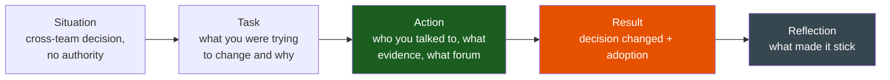
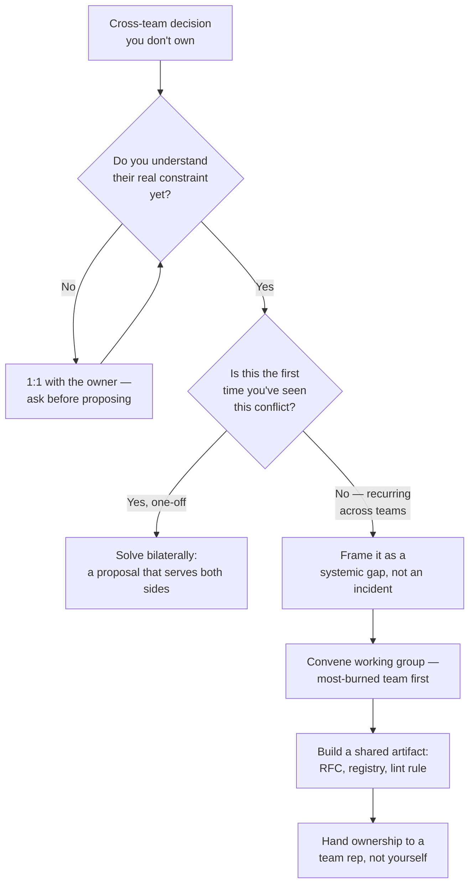

# Influence Without Authority

**Theme:** Leadership & Influence | **Seniority:** Senior → Staff

---

## Why This Question Gets Asked

Past a certain level, your ability to ship depends on people who don't report to you and never will. This question checks whether you can move a decision without a title to lean on:

- Do you understand *why* another team wants what they want, before asking them to change?
- Can you build a case that survives without you in the room advocating for it?
- Do you know the difference between influence and just being persistent or loud?
- Do you leave behind something (a doc, a tool, a metric) that keeps the decision durable after the conversation ends?

!!! tip "Interview Insight 🎯"
    The weak version of this answer is a status story: "I'm respected so people listened to me." The strong version is a mechanism story: specific evidence, specific forum, specific artifact that outlived the meeting.

---

## STAR + Reflection Framework

Use the [influence ladder](framework.md#influence-ladder) from the framework page to pick the right rung before telling this story — jumping straight to an all-hands memo on a decision two teams could resolve in a 1:1 is itself a red flag.

---

## Seniority Differentiation

=== "Weak Response"
    > "I thought another team's approach was wrong, so I wrote up my concerns and sent them to their lead. They ended up agreeing with me."

    **What this shows:** No description of the other team's actual constraints, no forum choice, no artifact. Reads like it could have failed just as easily and we'd never hear about it.

=== "Senior Response ✓"
    > "Our team consumed events from a shared order-events topic owned by the checkout team. They were about to ship a breaking schema change — collapsing three event types into one polymorphic event — to simplify their producer code. It would have broken four downstream consumers, including ours, and none of us had been looped in; I found out from a Slack message in their team channel.
    >
    > I didn't escalate immediately. I messaged their tech lead and asked for 20 minutes to understand the change before reacting. It turned out their actual problem was that maintaining three separate event schemas was slowing down their own feature velocity — the polymorphic event was their fix for *that*, not a decision made carelessly.
    >
    > I proposed an alternative that solved their problem without breaking consumers: keep three event types, but generate them from one internal model, so their producer code got the simplification they wanted, and downstream contracts stayed stable. I wrote a short doc comparing the two approaches with the actual consumer list and blast radius, and asked for a 30-minute review with the three affected consumer teams plus checkout.
    >
    > They adopted the shared-model approach. Zero downstream breakage. It shipped one week later than their original plan, not the month a full consumer migration would have taken."

    **What this shows:** Understood the other team's real problem before proposing a fix, used a 1:1 first (not a public callout), brought numbers (blast radius, consumer list), and found a solution that served both sides.

=== "Staff Response ✓✓"
    > "Same category of problem — a breaking event schema change — but I recognized after the third time this happened across different team pairs that we had no shared contract for event schemas at all: no ownership model, no deprecation process, no way for a producer to know who consumed their topic. Each incident was being solved as a one-off negotiation.
    >
    > I had no authority over any of the four teams involved. I proposed and facilitated a working group — one representative from each team that produced or consumed shared events — with a concrete deliverable: a lightweight schema registry with consumer registration, so any producer could see who'd break before shipping a change, plus a deprecation SLA (60 days notice minimum for breaking changes).
    >
    > I didn't mandate it; I made the case with data — I pulled the last six months of incident history and found five separate 'surprise breaking change' incidents costing a combined ~30 engineer-days. I got buy-in team by team, starting with the two most burned by past incidents, then used their adoption as social proof for the rest. I facilitated the first three working-group sessions myself, but I didn't want the registry's survival to depend on me staying involved — I spent the fourth session deliberately handing facilitation to the checkout team's representative, who'd been the most engaged and had the standing to keep other teams accountable after I moved to a different project two months later.
    >
    > 14 months later, 9 of 11 teams had registered their event schemas; breaking-change incidents in that category dropped to zero in the two quarters after full rollout. The registry is now a standard onboarding item for any new service that publishes events, run entirely by the checkout team's representative — I checked in a year later and it had outlived my involvement completely, which was the actual test of whether it was durable."

    **What this shows:** Recognized a recurring pattern as a systemic gap, not a one-off. Built consensus incrementally (start with the most-burned teams) rather than trying to convince everyone at once. Deliberately transferred ownership to someone who'd stay, rather than making the artifact depend on the narrator's continued advocacy.

---

## When It Got Overridden

Not every influence attempt lands. I once tried to drive a cross-team decision on a shared retry/timeout convention — three teams were each hand-rolling their own retry logic against a common downstream service, causing correlated thundering-herd load during that service's incidents. I wrote a doc, got two of the three teams on board in 1:1s, and brought it to a shared architecture review expecting a straightforward adoption. The third team's lead pushed back hard in the room — not on the technical merits, but because I'd approached it as "let's standardize" without first checking whether their service had different latency requirements that made the standard timeout wrong for them. I hadn't done the 1:1 with the team that actually had the most to lose; I'd gone to the two easiest allies first and treated the review as a rubber stamp. The proposal got tabled, and it took another two months and an actual 1:1 with that team — where I learned their downstream dependency had a legitimately different SLA — to get a revised version adopted with a per-team override. I learned that "most burned" isn't always the right team to start with; sometimes the team most likely to object has information you need before you write the doc, not after.

---

## Choosing the Right Forum

The most common mistake candidates describe (without realizing it's a mistake) is picking the wrong forum for the disagreement's actual size.

| Forum | Right for | Wrong for |
|---|---|---|
| 1:1 with the owner | Most disagreements; preserves their ability to change their mind without an audience | Decisions that need a durable record across time zones |
| Written doc, async | Cross-time-zone teams, complex trade-offs that need re-reading | An urgent decision with a same-day deadline |
| Working group | Recurring pattern across 3+ teams, no single owner | A decision one team can make alone |
| Escalation to a shared manager | Safety, money, legal, or a genuine stalemate after good-faith attempts | The first move on any disagreement |

!!! warning "Production Trap ⚠️"
    Escalating on the first attempt reads as an inability to build consensus, not decisiveness. Interviewers will ask "did you talk to them first?" — have a real answer.

### The Escalation Path

---

## Building the Constituency

Staff-level influence stories have a **constituency** — people who will vouch for the decision when you're not in the room. Concretely, that means:

1. Talk to the people most affected *first*, before you have a fully-formed proposal — they become co-authors, not an audience being pitched to.
2. Use the most-burned team's story as your evidence, not your own opinion — "team X hit this twice last quarter" lands harder than "I think this is risky."
3. Leave a written artifact (RFC, doc, registry, lint rule) so the decision survives you moving teams or the conversation being forgotten.

---

## Common Interview Questions

1. "Tell me about a time you influenced a decision outside your team."
2. "How do you get buy-in from people who don't report to you?"
3. "Describe a cross-team disagreement you resolved."
4. "Tell me about a time your proposal was initially rejected — what did you do?"
5. "How do you drive a decision when you have no formal authority?"

---

## Staff-Level Extensions

!!! abstract "Staff Engineer Lens 🧠"
    - Constituency: who besides you would advocate for this decision if asked?
    - Artifact: what document, tool, or process outlives the specific conversation?
    - Metric: what number moved after adoption, org-wide, not just on your team?
    - Incremental consensus: did you start with the most-motivated stakeholders, or try to convince everyone simultaneously?

---

## Red Flags in Answers

!!! danger "Avoid these"
    - "I'm just good at convincing people" — no mechanism, no evidence
    - Escalating before attempting a 1:1
    - No description of what the other team actually needed
    - Taking full credit for a decision that required several teams' buy-in
    - A proposal that only worked because you personally kept pushing it — no durability

---

## Self-Assessment

- [ ] Can I name the specific forum I chose and why (1:1, doc, working group)?
- [ ] Did I describe the other side's real constraint, not just my own position?
- [ ] Do I have a story where the decision stuck after I stopped personally advocating for it?
- [ ] For Staff roles: can I point to a reusable artifact and an org-level metric that moved?
