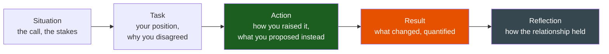
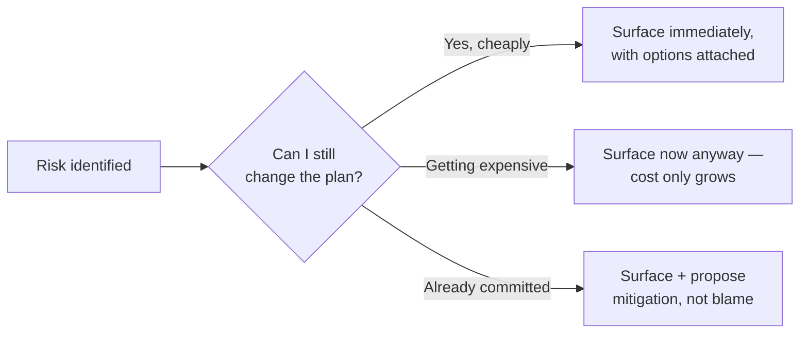

# Managing Up

**Theme:** Judgement & Influence | **Seniority:** Senior → Staff

---

## Why This Question Gets Asked

Managing up is a different skill from peer influence — there's a real power differential, and your manager controls your ratings, your projects, and often your promotion. Interviewers want to know:

- Can you disagree with someone who evaluates you, without either caving or becoming a problem to manage?
- Do you surface bad news early, or let it surface itself later, worse?
- Can you negotiate scope or timeline instead of silently absorbing an unrealistic ask?
- Do you know the difference between "managing up" and "managing around" (going over their head unnecessarily)?

!!! tip "Interview Insight 🎯"
    This question is often disguised as "tell me about a difficult manager" — don't take the bait and vent about a bad manager. The interviewer is scoring *your* behavior, and a story that's really about how unreasonable your manager was reads as an inability to manage the relationship.

---

## STAR + Reflection Framework

---

## Seniority Differentiation

=== "Weak Response"
    > "My manager wanted to ship a feature by a date I didn't think was realistic. I told them my concerns but they said it needed to happen, so I just worked extra hours to hit it."

    **What this shows:** No negotiation, no alternative proposed, resolved the conflict by absorbing the cost personally rather than addressing the actual mismatch between scope and time.

=== "Senior Response ✓"
    > "My manager committed to a customer-facing deadline — a new reporting export feature — in a sales conversation, before checking with the team. When he told me, the date was five weeks out; my honest estimate for the full scope was nine.
    >
    > I didn't say 'that's not enough time' and stop there — that's true but not useful to him, since he'd already made the commitment externally. Instead I came back within a day with three options, each with an explicit trade-off: (1) full scope in nine weeks, (2) five weeks if we cut PDF export and shipped CSV only, deferring PDF, or (3) five weeks with the full scope if we brought in one engineer from an adjacent team for three weeks, which I'd already floated informally with their lead.
    >
    > I made the actual constraint explicit rather than just resisting: 'I can hit five weeks, but only by cutting X or borrowing Y — which do you want me to do?' He picked option 2. I also asked him, going forward, to loop me in before committing a date externally — not as a complaint, but framed as 'I can give you a real number in 20 minutes if I'm in the loop before the commitment, instead of after.'
    >
    > We shipped CSV export on time; PDF shipped four weeks later as planned, and the customer accepted the phased delivery once we explained it. My manager started looping me into pre-commitment conversations after that."

    **What this shows:** Didn't just object — quantified the mismatch and gave the manager real options with trade-offs attached. Fixed the process (loop me in earlier) rather than only fixing the instance. Non-adversarial framing that made the manager's job easier, not harder.

=== "Staff Response ✓✓"
    > "My skip-level wanted to greenlight a rewrite of our core matching engine — a multi-quarter bet — based on a proof-of-concept a vendor had demoed, without input from the engineers who'd own it. I had real technical concerns: the POC hadn't been tested against our actual data skew, which we knew from experience was the thing that broke every previous attempt at this kind of system.
    >
    > Rather than raising it as 'I disagree' in the all-hands where it was announced, I asked for 30 minutes with my skip-level and my manager together, framed around a specific ask: 'before we commit externally to a timeline, can we spend two weeks validating the POC against our real data distribution — here's the specific risk I'm worried about, and here's what two weeks of validation would tell us.' I brought the actual failure mode from a past attempt, not just a general worry.
    >
    > They agreed to the two-week validation gate. It surfaced exactly the skew problem I'd flagged — the vendor's approach degraded badly on our long-tail categories, which were 30% of transaction volume. That saved what I estimate would have been a two-quarter investment in an approach that didn't fit our data. We renegotiated the vendor relationship to include a skew-handling milestone before further investment, and I wrote up the validation methodology as a standard gate for future 'evaluate a vendor POC' decisions.
    >
    > The trust outcome mattered as much as the technical one: my skip-level asked me to review every subsequent build-vs-buy proposal before commitment, specifically because this held up under scrutiny rather than just being an opinion."

    **What this shows:** Managed a two-level relationship carefully (asked for the right forum, brought manager along rather than going around them). Concrete evidence from past experience, not abstract worry. Built a durable process (validation gate) that changed how future decisions get made, and earned a standing role in similar decisions afterward.

---

## Surfacing Risk Early

The core mechanic of "managing up" well is timing: bad news gets cheaper the earlier it surfaces and more expensive every day it's held back hoping it resolves itself.

!!! warning "Production Trap ⚠️"
    "I didn't want to be the bearer of bad news" is the single most common reason risk surfaces too late. The interviewer will read a story where you sat on a known risk for weeks as a judgement failure, regardless of how the eventual conversation went.

---

## Negotiating Scope vs. Timeline

Managers and skip-levels usually don't actually want an impossible date — they want a number they can commit externally, and they often don't know the internal cost of the scope they've implicitly assumed. Your job is to make the trade-off visible, not to simply refuse.

**Template:** "I can hit [date] if we cut [specific thing]. I can hit [full scope] if we move to [later date] or add [specific resource]. Which trade-off do you want?"

This works because it replaces "no" — which a manager under their own pressure may not be able to accept — with a choice they can actually make.

---

## Disagreeing Without Burning Trust

- Raise it privately first, not in a group setting where they have to defend a position publicly.
- Bring the alternative, not just the objection — "here's what I'd do instead" is a different conversation than "this is wrong."
- After the decision is made, commit fully, even if it went the other way — and say so out loud rather than passive-aggressively executing a plan you disagree with.
- If you were overruled and turned out to be right, don't collect the win publicly — the trust cost of "I told you so" outweighs being seen as correct once.

---

## Common Interview Questions

1. "Tell me about a time you disagreed with your manager's technical decision."
2. "Describe a time you had to deliver bad news to your manager."
3. "How do you negotiate scope when a deadline is fixed?"
4. "Tell me about a time your manager was wrong — what did you do?"
5. "How do you handle being overruled by someone senior to you?"

---

## Staff-Level Extensions

!!! abstract "Staff Engineer Lens 🧠"
    - Did you manage a two-level relationship (skip-level involved) carefully, without going around your direct manager?
    - Did the disagreement produce a durable process change (a validation gate, an earlier-loop-in habit), not just a one-time resolution?
    - Did surfacing the risk early change how much decision-making authority you were trusted with afterward?
    - Can you tell a story where you were overruled and committed fully, without it souring the relationship?

---

## Red Flags in Answers

!!! danger "Avoid these"
    - A story that's really just venting about a bad manager
    - No alternative or option offered — only the objection
    - Going to a skip-level or HR as a first move, without trying the direct conversation
    - Holding a known risk quietly, hoping it resolves itself
    - "I told them so" energy after being right — reads as score-keeping

---

## Self-Assessment

- [ ] Do I have a story where I surfaced risk early enough that it was still cheap to fix?
- [ ] Did I offer explicit trade-offs, not just an objection?
- [ ] Do I have a story where I was overruled and committed fully anyway?
- [ ] Can I describe how the relationship or process changed afterward?
- [ ] For Staff roles: can I describe managing a two-level relationship without going around anyone?
