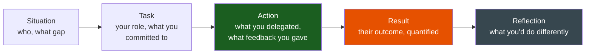
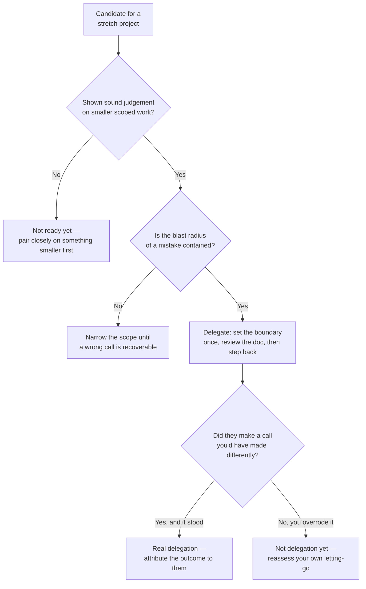

# Mentorship

**Theme:** Growth & Leadership | **Seniority:** Senior → Staff

---

## Why This Question Gets Asked

"Tell me about mentoring someone" is scored on the mentee's outcome, not on how good it felt to mentor. Interviewers are checking:

- Did you diagnose what the person actually needed, or default to generic advice?
- Can you delegate a project you could do faster yourself, and let them own the mistakes?
- Can you give feedback that stings, specifically enough that it changes behavior?
- Is there a measurable outcome for the mentee — a promotion, a skill they didn't have before, work they can now own unsupervised?

!!! tip "Interview Insight 🎯"
    If your answer is entirely about your feelings ("it was rewarding to see them grow"), you've told the interviewer nothing about your mentoring skill. Lead with what changed for *them*.

---

## STAR + Reflection Framework

---

## Seniority Differentiation

=== "Weak Response"
    > "I mentored a junior engineer on my team. We had weekly 1:1s where I answered their questions and reviewed their code. They improved a lot over the year."

    **What this shows:** No specific gap identified, no delegation, no hard feedback moment, no measurable outcome. Could describe any competent senior's default behavior.

=== "Senior Response ✓"
    > "A mid-level engineer on my team, about 18 months into their career, was technically solid but every PR came with a design doc-length Slack message justifying every decision before anyone asked — a tell that they didn't trust their own judgement yet, and it was slowing the whole team's review cycle down.
    >
    > I deliberately handed them a stretch project I would normally have taken myself: redesigning our webhook retry system, which had a known reliability gap and enough scope to be genuinely uncomfortable for them. I set one constraint — they owned the design decisions; I'd review the doc once, then get out of the way except for a standing weekly check-in.
    >
    > Two weeks in, they'd chosen a design I disagreed with — exponential backoff without jitter, which I knew would cause thundering-herd retries under a mass outage. I didn't override it. I asked one question in the design review: 'What happens if 10,000 webhooks fail at the same second?' They caught the gap themselves and added jitter. That mattered more than if I'd just told them, because they now had the instinct, not just the fix.
    >
    > They shipped the redesign in five weeks, ran the migration themselves, and it cut webhook delivery failures by 60%. I gave them direct feedback afterward: the justification-heavy Slack messages weren't building trust, they were signaling the opposite — I told them plainly that senior engineers state a decision and the reasoning in one paragraph, not five. They adjusted within a month; the pattern didn't reappear. They were promoted the following cycle, and the promo doc cited the webhook project as the flagship piece of scope."

    **What this shows:** Specific diagnosed gap, deliberate delegation of a real project rather than busywork, feedback that let them find the gap rather than handing them the answer, direct hard feedback on the meta-pattern (not just the code), and a measurable, attributable outcome (the promotion).

=== "Staff Response ✓✓"
    > "I noticed the justification-heavy-PR pattern wasn't unique to one engineer — three engineers on a team of nine showed some version of it, and when I asked around, two other tech leads on adjacent teams described the same thing. It wasn't an individual confidence problem; it was that our review culture rewarded exhaustive pre-justification because reviewers had, at some point, publicly torn apart a PR that didn't over-explain itself. People had learned the wrong lesson from watching that happen.
    >
    > Beyond the one-on-one mentoring, I ran a lightweight 'design decision' workshop for the org — how to write a one-paragraph decision record instead of a defensive essay — and paired it with a change to our PR template that separated 'what changed' from 'why,' capped at a few sentences each. I also gave direct, private feedback to two senior reviewers whose review style was the actual root cause — pointing at specific PR comment threads where the tone had taught junior engineers to over-justify defensively.
    >
    > Over the next two quarters, median PR description length across the org dropped by half with no increase in review back-and-forth; two of the three engineers I'd originally flagged were promoted within the year. The third didn't — the workshop and template change fixed the org-level incentive, but that engineer's over-justification turned out to be tied to a specific manager relationship with a history of public criticism that a template change couldn't undo, and I didn't solve that part. I built the workshop into new-hire onboarding as a short doc on writing decision records, which outlived my time on that team, but I'm explicit in this story that it was a partial fix — process changes move the average, they don't reach everyone."

    **What this shows:** Recognized an individual pattern as symptomatic of a team/org norm. Addressed root cause (reviewer behavior), not just the symptom (mentee's PR style). Built a durable artifact (template, onboarding doc) and measured an org-level number, not just one person's growth.

---

## Delegating a Stretch Project

The mechanics that separate real delegation from dumping work:

1. **Pick something genuinely uncomfortable, not busywork.** If you'd have done it in half the time and it wouldn't have taught you anything either, it's not a stretch project.
2. **Set the boundary once, explicitly.** "You own the design decisions; I'll review once, then get out of the way" — vague availability ("let me know if you need anything") invites either abandonment or micromanagement.
3. **Let them hit a real mistake if the blast radius is contained.** Catching their own gap in a design review teaches more than being told the answer.
4. **Attribute the outcome to them, not to you, afterward** — in promo docs, in team updates, in the interview story itself.

!!! warning "Production Trap ⚠️"
    Delegating a project and then rewriting their design in review isn't delegation — it's dictation with extra steps. If you can't name a decision they made that you disagreed with and let stand, you didn't actually delegate.

### Assessing Delegation Readiness

---

## A Mentee Who Didn't Improve

Not every investment pays off, and it's worth naming when it doesn't. I spent close to a year with an engineer who was struggling with debugging discipline — jumping to fixes without forming a hypothesis, the same pattern across a dozen incidents. I paired with them repeatedly, gave direct feedback each time, and delegated smaller investigation tasks with explicit checkpoints. The pattern didn't change. What I eventually realized, too late to fully act on it, was that I'd been treating it as a skills gap when it was closer to a mismatch — the role required fast, ambiguous triage under pressure, and this person did genuinely careful, methodical work when given time, which was a real strength I kept trying to route around instead of routing *to*. I should have raised, much earlier, whether they belonged on a different kind of team rather than continuing to coach a mismatch as if more repetition would close it. They eventually moved to a data-quality role on another team and did well there. I learned to ask "is this a skill gap or a fit gap" explicitly, early, instead of assuming every struggle is coachable with enough time.

---

## Giving Hard Feedback

The feedback that sticks has three properties: it's specific, it names the *pattern* not the person, and it comes with a concrete alternative.

| Weak feedback | Feedback that changes behavior |
|---|---|
| "You need to be more concise" | "This PR description is 400 words justifying a 20-line change — state the decision and reasoning in one paragraph; save the detail for if someone asks" |
| "Be more confident" | "You asked me to review three times before merging something you were clearly right about — trust your read on straightforward changes, save review cycles for the ones you're actually unsure about" |
| "Your code quality needs work" | "This function has four responsibilities — extract the validation into its own function; that's the specific pattern I want you to watch for going forward" |

---

## Common Interview Questions

1. "Tell me about mentoring someone junior."
2. "Describe a time you delegated something you could have done faster yourself."
3. "Tell me about giving feedback that was hard to deliver."
4. "How do you know when someone is ready for more responsibility?"
5. "Tell me about someone whose growth you're proud of."

---

## Staff-Level Extensions

!!! abstract "Staff Engineer Lens 🧠"
    - Is the gap you're addressing individual, or a symptom of team/org culture?
    - Did you address root cause (e.g., reviewer behavior) or just the visible symptom?
    - Did you build something durable (template, workshop, onboarding doc) beyond one relationship?
    - Can you point to a measurable outcome across multiple people, not just one mentee?

---

## Red Flags in Answers

!!! danger "Avoid these"
    - Entirely about your own feelings, nothing about their outcome
    - "I told them everything they were doing wrong" — no evidence they grew, just that you talked
    - Taking credit for their promotion as if it were your project
    - No hard feedback moment at all — suggests you avoid discomfort
    - Delegation story where you actually rewrote their work in review

---

## Self-Assessment

- [ ] Can I name the specific gap I diagnosed in a mentee, not a generic one?
- [ ] Do I have a story where I delegated real ownership and let a mistake play out safely?
- [ ] Do I have a specific hard-feedback moment with the exact words I used?
- [ ] Can I cite a measurable outcome for them (promotion, new capability, ownership)?
- [ ] For Staff roles: did I address a pattern across people, not just one relationship?
