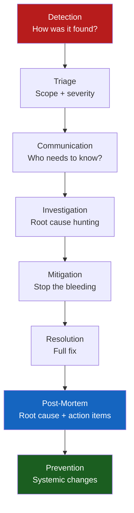

# Leading Through a Production Incident

**Theme:** Ownership & Reliability | **Seniority:** Senior → Staff

---

## Why This Question Gets Asked

Production incidents are how engineers demonstrate their true capabilities under pressure. Interviewers probe:
- Do you take ownership or blame others/systems?
- How do you debug under pressure?
- Do you communicate clearly to stakeholders during incidents?
- Do you do proper RCA and implement lasting fixes?
- Do you learn and prevent recurrence?

---

## The Incident Lifecycle Framework



---

## Seniority Differentiation

=== "Junior Response"
    > "Our service went down and my manager paged me. I found a bug in the code and fixed it. Service came back up after about 2 hours."

    **Missing:** No ownership, no debugging narrative, no stakeholder communication, no RCA, no systemic learning.

=== "Mid-Level Response"
    > "We had a database connection pool exhaustion incident. I was alerted at 2am. I checked the metrics, saw connection count was maxed out. I restarted the service to release connections. Then I increased the connection pool size. I wrote an incident report the next day."

    **Better but missing:** Why did connections exhaust? Was restart the right mitigation? What was the root cause? What prevented recurrence?

=== "Senior Response ✓"
    > "At 3am, our payment service p99 latency spiked from 200ms to 15 seconds. I was on-call. Immediately pinged the team leads for payments and infrastructure. Within 10 minutes I'd ruled out our service code (no recent deploy), the database (CPU fine, no long-running queries), and Kafka (normal). I then checked our PSP dependency — Stripe had a latency incident. I implemented the mitigation: reduced our Stripe timeout from 30s to 5s (fast-fail), added a circuit breaker that degraded gracefully to a 'payment pending' state rather than hanging. We went from 15-second hangs to <500ms failures in 8 minutes. MTTR was 23 minutes. In the post-mortem, we identified we had no health check for our Stripe dependency, no circuit breaker, and our timeout was too long. I implemented all three over the next sprint. We also added a runbook specifically for PSP degradation scenarios."

    **Shows:** Systematic debugging, stakeholder communication, clear mitigation, measurable MTTR, proper RCA, systemic fixes.

=== "Staff Response ✓✓"
    > "Our checkout service had cascading failures affecting 100% of transactions for 40 minutes on Black Friday. I was the incident commander. Immediately: (1) Opened a Zoom with platform, infra, and product — 15 people within 5 minutes; (2) Assigned a scribe to track timeline; (3) Set up a dedicated comms channel; (4) Gave engineering team clear problem statement: 'checkout is timing out, 0% success rate, no recent deploys, investigate DB and downstream services'; (5) Communicated to VP Engineering every 10 minutes with status. Root cause was a combination: recent DB schema migration added an unindexed foreign key, and Black Friday traffic triggered full table scans. Our monitoring showed p99 but not p50, so the gradual degradation wasn't caught. Mitigation: added the index (3 minutes), restored traffic. RCA: added p50 alert, mandatory query EXPLAIN ANALYZE in deployment checklist, pre-production load test requirement for schema changes. I presented to the engineering org — blameless, focused on systems. We published a 'what Black Friday taught us' doc that became a template for 3 other teams."

    **Shows:** Incident command, cross-functional coordination, stakeholder communication, technical depth, systemic fixes, organizational impact.

---

## Key Frameworks

### During the Incident

**First 5 minutes:**
1. Assess severity (how many users affected? What's the business impact?)
2. Page necessary people
3. Start a timeline document / incident channel
4. Do not make *random* changes; mitigate with a reversible action (rollback, flag, shed load), then RCA in the post-mortem. Prioritize mitigation while the fire is burning.

**Debugging order (METTLE):**
1. **M**etrics — CPU, memory, latency, error rate, request volume
2. **E**rrors — log error rates, exception types, stack traces
3. **T**raffic — did request volume change? New client behavior?
4. **T**opology — recent deployments, config changes, infra changes
5. **L**og correlation — trace a failing request end-to-end
6. **E**xternal — third-party services, databases, downstream dependencies

**Mitigation vs Root Cause:**
- Mitigation = stop the bleeding (rollback, circuit breaker, feature flag)
- Root cause = what actually caused it (may take hours/days to fully understand)
- Prioritize mitigation during the incident; root cause in post-mortem

### Communication Template

```
[10 mins] Status update to stakeholders:
  Severity: P1 (100% checkout failure)
  Impact: ~N users affected, $X revenue impact
  Status: Investigating — no recent deploys, DB and cache healthy
  ETA: Targeting resolution in 30 minutes
  Next update: 20 minutes

[Resolution] All-clear:
  Issue: Unindexed foreign key on orders table under high traffic
  Resolution: Index added at 14:37 PST
  Duration: 40 minutes
  Full post-mortem: [link]
```

---

## Post-Mortem Framework

**Blameless Post-Mortem:**

```markdown
## Incident: Checkout Failure — Black Friday 2024

### Timeline
- 14:00: Traffic spike begins (5× normal)
- 14:10: First slow query alert (DB p99 > 1s) — not paged (threshold too high)
- 14:17: Error rate alert fires — on-call paged
- 14:20: Incident channel opened, team assembled
- 14:37: Root cause identified and index applied
- 14:40: Traffic restored, incident closed

### Root Cause
Schema migration (14:00 that morning) added unindexed foreign key.
Low traffic testing did not trigger full table scan.
Black Friday traffic exposed latency: 12-second full table scan on orders.

### Contributing Factors
- p50 DB latency alert didn't exist (only p99)
- Schema migration review checklist didn't require EXPLAIN ANALYZE
- No pre-production load test requirement for schema changes

### Impact
- 40 minutes of 0% checkout success rate
- ~$420,000 estimated lost revenue

### Action Items
| Action | Owner | Due |
|--------|-------|-----|
| Add p50 DB latency alert (< 100ms threshold) | Platform | +3 days |
| Add EXPLAIN ANALYZE requirement to migration checklist | DX Team | +1 week |
| Pre-production load test for schema changes | Platform | +2 weeks |
| Add runbook: DB slow query diagnosis | On-call | +1 week |

### What Went Well
- Team assembled in 5 minutes
- Clear communication to stakeholders throughout
- Correct mitigation (index) found and applied quickly
- No data loss
```

---

## Common Interview Questions

1. "Tell me about a production incident you handled."
2. "Describe your role in a major outage."
3. "What's the most impactful production bug you've fixed?"
4. "Tell me about a time a deployment caused an incident."
5. "How do you handle being paged at 2am?"

---

## Staff-Level Incident Questions

!!! abstract "Staff Lens 🧠"
    1. "Describe how you set up incident response processes for your team."
    2. "How do you run a post-mortem for a politically sensitive incident?"
    3. "Tell me about a time you drove organizational change from an incident."
    4. "How do you ensure incidents from your team don't repeat in other teams?"

---

## Red Flags in Answers

!!! danger "Avoid"
    - Blaming: "The DevOps team hadn't set up proper monitoring"
    - No ownership: "It wasn't my service, I just helped"
    - No learning: "We fixed it and moved on"
    - Vague impact: "It affected some users for a while"
    - No prevention: "We fixed the bug" (same class of bug can recur)

---

## Self-Assessment

- [ ] Do I have 2–3 specific incident stories with timelines?
- [ ] Can I describe my specific diagnostic approach?
- [ ] Do I have a story about post-mortem process and prevention?
- [ ] Can I quantify the impact (time, users, revenue)?
- [ ] For Staff roles: can I describe leading incident response across teams?
