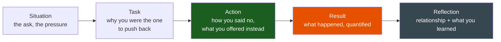
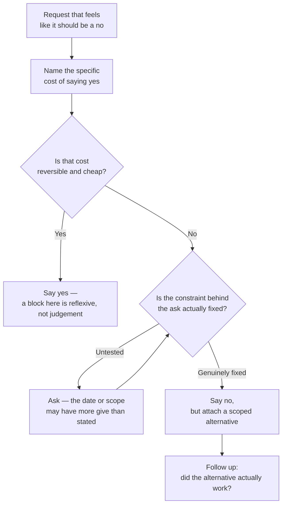

# Saying No

**Theme:** Judgement & Influence | **Seniority:** Senior → Staff

---

## Why This Question Gets Asked

"Tell me about a time you said no" is a judgement test disguised as a conflict question. Interviewers want to see:

- Do you know the actual cost of saying yes, or do you just have a general reluctance to commitment?
- Can you say no in a way that preserves the relationship, or does every no read as friction?
- Do you offer an alternative, or just block?
- Do you know when *not* to say no — when the ask is uncomfortable but actually fine?

!!! tip "Interview Insight 🎯"
    The two failure modes are symmetric: candidates who say yes to everything (no backbone, no judgement) and candidates whose every story is a heroic no (sounds exhausting to work with, suggests poor calibration on what's actually worth resisting). The strong answer includes a story where you said yes to something uncomfortable *because* the cost of no was higher.

---

## STAR + Reflection Framework

---

## Seniority Differentiation

=== "Weak Response"
    > "My manager asked me to skip code review to hit a deadline. I said no because that's against our process, and we found a different way to hit the date."

    **What this shows:** True, but generic — "against our process" isn't a reason, it's a rule citation. No specifics on the actual risk or the alternative that was found.

=== "Senior Response ✓"
    > "Two weeks before a major partner integration launch, the PM asked if we could skip the security review step for a new OAuth flow — the review queue was backed up and the reviewer's earliest slot was after our committed date. The pressure was real: the partner had a hard external date tied to their own launch.
    >
    > I said no, but specifically: I explained that OAuth token handling was exactly the category of change security review exists to catch — a subtle scope-leakage bug here wouldn't show up in QA, it would show up as a partner's user data being over-exposed, discovered by someone else, months later. I didn't just cite policy; I named the specific failure mode.
    >
    > I offered an alternative instead of a flat block: I reached out to the security team directly, explained the deadline, and asked if a scoped 90-minute review of just the token-scope logic (not the full checklist) was possible, given the change was narrow. They agreed. We got the review, found one real issue — a scope was broader than intended — fixed it in a day, and still hit the launch date, three days later than originally planned but within the partner's actual flexibility (which turned out to be a week, not the hard date we'd been told).
    >
    > The PM later thanked me for pushing back — the alternative I found was less friction than they'd expected from a 'no,' and the actual partner conversation about the three-day slip was a non-event."

    **What this shows:** Named the specific risk, not just the rule. Found a scoped alternative rather than only blocking. Tested the assumption behind the pressure (the "hard" date had slack). Preserved the relationship by making the PM's job easier, not harder.

=== "Staff Response ✓✓"
    > "This wasn't the first time a security review got skipped under deadline pressure — I'd seen it happen twice before on other teams that quarter, each time as an individual negotiation between an engineer and the security team, with inconsistent outcomes. One had genuinely shipped without review and caused a minor incident two months later.
    >
    > Beyond saying no on my own change, I proposed a standing process to the security team lead and our director: a tiered review — full review for anything touching auth, payments, or PII; a scoped fast-track (48-hour SLA, narrower checklist) for changes that touch adjacent code but not the sensitive path directly. This gave teams a real alternative to 'skip it' when they hit a deadline, instead of forcing a binary choice between blowing a date and skipping a control entirely.
    >
    > I got buy-in by bringing the incident from the earlier skipped review as evidence of the cost of the status quo, and by proposing the security team define the tiers themselves — I didn't want to be prescribing their process, just requesting that a middle option exist. Six months in, fast-track reviews had a 100% usage rate for exactly this kind of deadline-pressure situation, with zero security incidents traced to fast-tracked changes, and zero more fully-skipped reviews recorded."

    **What this shows:** Recognized a recurring pattern (ad hoc skip-or-block decisions) as a process gap, not an isolated incident. Built a durable middle option rather than relying on individual heroics each time. Brought data and let the affected team (security) co-own the solution.

---

## The Cost-of-Yes Framework

Before saying no, be able to name the actual cost of saying yes — not a vague discomfort, a specific consequence.

| Weak reason to say no | Strong reason to say no |
|---|---|
| "That's not how we do things" | "Skipping this review means a token-scope bug ships undetected until a partner audit finds it" |
| "I'm too busy" | "Taking this on means the migration slips two weeks, and that migration is on the critical path for the compliance deadline" |
| "I don't think it's a good idea" | "This shortcut removes the one check that caught our last three production incidents in this exact code path" |

!!! warning "Production Trap ⚠️"
    A no with no named cost sounds like preference, not judgement. Interviewers will ask "what would have actually happened if you'd said yes?" — have a specific, defensible answer.

### The Cost-of-Yes Decision Tree

---

## The Shape of a Good No

1. **Name the specific risk**, not a general policy.
2. **Test the constraint behind the pressure** — is the date actually hard, or assumed hard? Ask.
3. **Offer a scoped alternative** — a smaller yes, a different timeline, a narrower version of the ask.
4. **Make it about the outcome, not the rule** — "this protects X" lands better than "policy says."
5. **Follow up afterward** — if the alternative worked, that's evidence for next time; if it didn't, own that too.

---

## A No That Landed Badly

Not every no is delivered well, and it's worth having a story where the delivery, not the substance, was the failure. A junior engineer on an adjacent team asked me directly for a quick favor — bypass the normal review queue and get their PR merged same-day because their manager was pushing a deadline. I said no, publicly, in the team channel, citing the review policy — technically correct, but I said it to the engineer instead of raising the actual issue (their manager setting an unrealistic date) with their manager, who was the person who could actually fix it. The engineer took the no personally, felt publicly corrected for something that wasn't really their decision to begin with, and our working relationship was noticeably cooler for a couple of months. The no was right; the target was wrong — I'd pushed back on the person with the least power to change the situation instead of the person who'd created the pressure. I now try to ask "whose decision actually created this ask" before deciding who the no is addressed to, and I do it privately by default.

---

## Knowing When to Say Yes Instead

A no story only lands if you can also show calibration — a time you said yes to something uncomfortable because the cost of no was actually higher.

**Example:** A director asked me to take on an urgent, poorly-scoped migration two weeks before a planned vacation, with no time to hand it off properly. My instinct was to push back — bad timing, unclear scope. But the actual cost of saying no was a compliance deadline slipping for the whole company, not just inconvenience for one team. I said yes, scoped it down to the minimum compliant version rather than the full migration, delegated what I could to a teammate with a clear written handoff, and delayed my vacation by three days rather than cancelling it. The distinction that mattered: I negotiated the *scope* of the yes instead of resisting the ask itself.

---

## Common Interview Questions

1. "Tell me about a time you pushed back on a deadline."
2. "Describe a request you believed was wrong — what did you do?"
3. "How do you say no without damaging a relationship?"
4. "Tell me about a time you should have said no but didn't."
5. "Tell me about a time you said yes to something you initially wanted to refuse."

---

## Staff-Level Extensions

!!! abstract "Staff Engineer Lens 🧠"
    - Is the no a one-off negotiation, or does it expose a recurring gap worth fixing structurally?
    - Did you build a durable middle option (fast-track, tiered process) instead of relying on repeated individual pushback?
    - Did you test the "hard" constraint behind the pressure, and find it had more give than assumed?
    - Do you have a calibrated yes story alongside your no story?

---

## Red Flags in Answers

!!! danger "Avoid these"
    - No specific cost named — "it felt wrong" is not a reason
    - Every story is a heroic no — no evidence of calibration
    - No alternative offered — a no that's purely a block
    - Relationship damage described as an acceptable cost, without reflection
    - No yes story at all — suggests reflexive resistance, not judgement

---

## Self-Assessment

- [ ] Can I name the specific cost of the yes I refused, not a vague feeling?
- [ ] Did I offer a scoped alternative instead of a flat block?
- [ ] Did I test whether the pressure behind the ask was actually as hard as stated?
- [ ] Do I have a calibrated yes story to pair with my no story?
- [ ] For Staff roles: did my no expose and fix a recurring structural gap?
