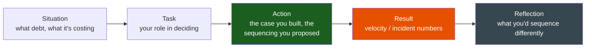
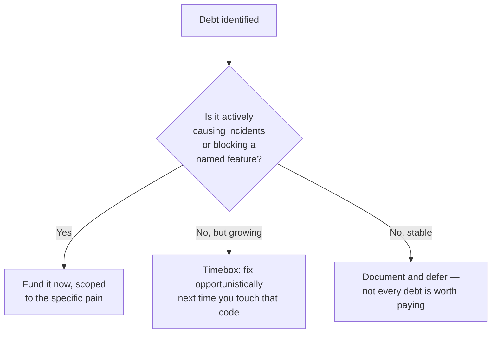

# Technical Debt

**Theme:** Judgement & Influence | **Seniority:** Senior → Staff

---

## Why This Question Gets Asked

Every engineer has an opinion about technical debt; few can get a debt-paydown project funded against a roadmap full of features that have a customer's name attached. Interviewers use this prompt to test:

- Can you translate "the code is bad" into a business case a non-engineer will approve?
- Do you sequence debt paydown against delivery pressure, or treat it as all-or-nothing?
- Can you say no to a shortcut that trades long-term velocity for a short-term date, and make that no stick?
- Do you know the difference between debt worth paying and debt worth living with forever?

!!! tip "Interview Insight 🎯"
    The failure mode here is a purity answer — "we should always do it right." That answer tells the interviewer you've never shipped under a real deadline. The senior answer names the trade-off explicitly and picks a side with a reason.

---

## STAR + Reflection Framework

---

## Seniority Differentiation

=== "Weak Response"
    > "Our codebase had a lot of technical debt, so I pushed for a refactor. It took a while but the code is much cleaner now."

    **What this shows:** No cost quantified, no business case, no sequencing decision, no measurable outcome. "Cleaner" is not a result.

=== "Senior Response ✓"
    > "Our order-processing service had accumulated a synchronous call chain — checkout called inventory, which called pricing, which called tax, all in-request. Each new integration added another hop; p99 latency had crept from 400ms to 2.1s over a year, and we'd had four Sev-2s in the quarter from one slow downstream dragging the whole chain past its timeout.
    >
    > I didn't propose 'refactor everything.' I quantified the cost: I pulled our incident log and showed that 3 of the 4 Sev-2s traced to the same synchronous chain, costing roughly 40 engineer-hours in incident response that quarter, plus an estimated conversion hit during the worst one. I proposed a scoped fix — move tax and pricing calls to async with a cached last-known-good fallback, leaving inventory (which genuinely needs to be synchronous, it blocks the sale) alone. That was a two-week project, not a quarter-long rewrite.
    >
    > I sequenced it: I asked for it as the *first* two weeks of the next quarter, before feature work started, framed as 'this pays for itself in avoided incident time within the quarter.' Product agreed because the ask was small and the justification used their own incident data.
    >
    > Result: zero Sev-2s from that call chain in the following two quarters; p99 dropped to 550ms. I used the recovered latency budget to justify not doing a bigger, riskier rewrite — the synchronous inventory call, the one real bottleneck left, wasn't worth the risk given the smaller wins had removed most of the pain."

    **What this shows:** Quantified cost of *not* fixing it, scoped the fix to the actual pain rather than a full rewrite, sequenced it against feature work with a business framing, and knew when to stop.

=== "Staff Response ✓✓"
    > "Same pattern, but organization-wide: I noticed the synchronous-chain problem wasn't unique to my team — it was how every team in the org built cross-service calls, because our internal client library made synchronous calls the path of least resistance; async took extra boilerplate nobody wanted to write under a deadline.
    >
    > Fixing my service was necessary but not sufficient — six other teams had the same debt and would recreate it. I wrote a proposal to the architecture group: invest two engineers for one quarter building an async-by-default client library with the boilerplate handled for you, and a lint rule that flags new synchronous cross-service calls above a configurable fan-out depth. I got budget by showing the incident cost across all teams, not just mine — I pulled six months of Sev-1/Sev-2 data org-wide and found a cluster: 31% of Sev-2s in that window traced to cascading synchronous calls.
    >
    > I didn't own the other teams, so I ran it as a working group with one engineer from each affected team, rather than mandating adoption — adoption is voluntary but the lint rule makes the *old* pattern the harder path, not the new one. 18 months later, four of six teams had migrated their hottest paths; org-wide Sev-2 count from this failure class dropped by roughly 60%. I wrote the pattern up as an internal engineering guideline that's still cited in design reviews two years later."

    **What this shows:** Recognized the debt as a systemic pattern, not a local one. Built a reusable artifact (library, lint rule) rather than manually fixing six services. Used cross-team incentives (make the right path the easy path) instead of authority he didn't have.

---

## The Business Case: Turning "the code is bad" into a Funded Project

Engineers lose this argument by leading with the code. Win it by leading with the number a non-engineer can act on.

| Weak framing | Strong framing |
|---|---|
| "This module is a mess" | "3 of our last 4 incidents trace to this module; each cost ~10 eng-hours" |
| "We should modernize the stack" | "Onboarding a new engineer to this service takes 3 weeks vs. 1 week elsewhere on the team" |
| "The tests are flaky" | "Flaky tests cost ~45 min/day per engineer in reruns; that's 2 FTE-weeks/quarter across the team" |
| "It's not scalable" | "At current growth we hit the ceiling on this table in 5 months, and the fix takes 6 weeks" |

!!! warning "Production Trap ⚠️"
    Don't ask for "a quarter to pay down debt." That reads as unbounded and unaccountable to anyone funding it. Ask for a **scoped fix with a named metric it moves** — the smaller, provable ask gets funded; the vague big one doesn't.

---

## Sequencing Debt Against Feature Pressure

A useful mental model for the interview and for the job:

Not all debt should be paid. Debt in a module that's stable, low-traffic, and unlikely to change again is often cheaper to leave alone than to refactor — the interview answer that says "we decided *not* to fix X because the cost of touching it exceeded the cost of living with it" is a stronger signal of judgement than always saying yes to cleanup.

---

## Saying No to a Reckless Shortcut

The other half of this theme: a PM or a peer wants to ship a shortcut that trades long-term stability for a short-term date, and you have to say no or negotiate it down.

**Sample story:** A payments feature needed to ship in three weeks for a contractual deadline with a large customer. The proposed shortcut was to skip idempotency handling on a new charge endpoint — "we'll add it later, we need to hit the date." I didn't block the date; I decomposed the ask: idempotency on the actual charge call was non-negotiable (double-charging a customer is a trust and possibly legal problem, not a nice-to-have), but a secondary reconciliation dashboard could genuinely ship two weeks late without risk. I proposed cutting the dashboard, keeping idempotency, and we still hit the contractual date. The alternative — cutting idempotency — would have shipped on time but created exactly the kind of incident that costs more than the three weeks saved.

!!! tip "Interview Insight 🎯"
    "I said no" is a weak answer alone. The strong version names *what you protected* and *what you were willing to cut instead* — a no with an alternative attached, not just a no.

---

## Common Interview Questions

1. "Tell me about a time you argued for paying down technical debt."
2. "How do you decide what debt is worth fixing?"
3. "Describe a time you pushed back on a shortcut under deadline pressure."
4. "How do you get a debt-paydown project prioritized against features?"
5. "Tell me about debt you decided *not* to fix."

---

## Staff-Level Extensions

!!! abstract "Staff Engineer Lens 🧠"
    - Is the debt local to your service, or a pattern repeated across teams? Fix the pattern, not just your instance.
    - Did you build something reusable (lint rule, library, template) that makes the right choice the easy choice for other teams?
    - Can you show the org-level cost (incident data across teams), not just your own team's pain?
    - Did you make adoption a working group with shared incentive, since you had no authority to mandate it?

---

## Red Flags in Answers

!!! danger "Avoid these"
    - "We should always do it right" — no acknowledgment of real trade-offs
    - Asking for an open-ended quarter with no scoped metric
    - Refactoring debt that wasn't actually causing measurable pain
    - Framing every shortcut as reckless — some are genuinely fine trade-offs
    - No story of debt you decided *not* to pay — suggests you can't prioritize

---

## Self-Assessment

- [ ] Can I quantify the cost of a piece of debt in incident-hours, onboarding time, or a growth ceiling?
- [ ] Do I have a story where I scoped a debt fix small enough to get funded?
- [ ] Do I have a story where I said no to a reckless shortcut and named the alternative?
- [ ] Do I have a story where I decided *not* to fix something, and why?
- [ ] For Staff roles: did I fix a pattern across teams, not just my own service?
