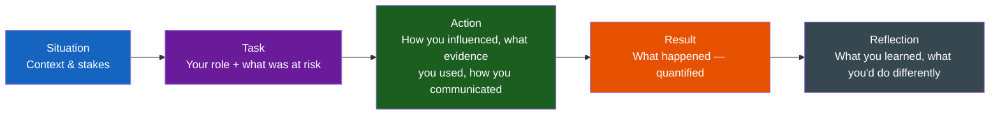

# Handling Technical Disagreements

**Theme:** Leadership & Influence | **Seniority:** Senior → Staff

---

## Why This Question Gets Asked

Technical disagreements are inevitable in engineering. Interviewers want to understand:
- Can you hold a technical position while remaining collaborative?
- Do you change your mind based on evidence or social pressure?
- Can you influence without authority?
- Do you know when to disagree and commit?

!!! tip "Interview Insight 🎯"
    This question separates junior engineers ("I deferred to the senior") from senior engineers ("I changed their mind with data") from staff engineers ("I understood their constraints and found a solution that worked for both teams").

---

## STAR + Reflection Framework

---

## Seniority Differentiation

=== "Junior Response (Insufficient for Senior roles)"
    > "I disagreed with my tech lead's choice to use MongoDB instead of PostgreSQL. I mentioned my concerns, but they had more experience so I went with their decision."

    **What this shows:** Deference, no advocacy, no evidence-based reasoning.

=== "Mid-Level Response"
    > "I disagreed about using MongoDB. I researched the trade-offs, wrote a doc comparing them for our use case, shared it with the team. We discussed it and ultimately the team decided to stick with MongoDB, but added schema validation."

    **What this shows:** Research and documentation skills. Still doesn't drive the outcome.

=== "Senior Response ✓"
    > "I disagreed with using MongoDB for our transaction history service. I built a prototype with both databases, benchmarked query patterns we'd actually use, and measured that PostgreSQL was 3× faster for our read patterns with 40% less code. I shared this in our design review with concrete numbers. The tech lead agreed and we switched. The service launched with 45ms p99 queries vs our original 150ms target."

    **What this shows:** Evidence-based advocacy, measurable outcome, changed the decision.

=== "Staff Response ✓✓"
    > "I disagreed with a cross-team architectural decision to use microservices for a new feature. The other team's architect had committed to it publicly. I requested 30 minutes to walk through my concerns rather than challenging it in a group review — I understood the social dynamics. I prepared a doc showing that the feature had 3 DB joins across services, which would create distributed transaction complexity and triple our deployment surface, with specific examples of incidents from similar patterns at other companies. I also acknowledged their valid concern: they wanted deployment independence. I proposed a modular monolith approach that gave them independent deployment pipelines without distributed transactions. We aligned, and the feature launched 6 weeks faster than planned. I also wrote an ADR on this trade-off so future teams have the decision history."

    **What this shows:** Organizational awareness, understanding their constraints, finding a win-win, creating reusable artifacts, influencing without authority.

---

## Story Bank Framework

Build stories for these specific situations:

### 1. You Disagreed and Were Right

**STAR structure:**
- **S:** Context — what was being decided, what was at stake
- **T:** Your role — what you were responsible for, why you had a view
- **A:** Evidence gathered, how you communicated (1:1 vs group?), how you handled pushback
- **R:** Decision changed + measurable outcome

**Reflection:** What would you do differently? What did you learn about how to influence?

### 2. You Disagreed and Were Wrong

!!! note "This is as important as being right"
    Interviewers specifically probe for intellectual honesty. "I was always right" signals low self-awareness.

**STAR structure:**
- Show that you changed based on **evidence**, not social pressure
- Quantify why you were wrong (what data disproved your position?)
- What you learned about your blind spots

### 3. You Disagreed and Chose to Commit

Sometimes you lose the argument. How do you handle it?

**Good answer:** "I made my position clear with evidence. The team understood the trade-off and decided differently. I committed fully to the decision — I don't believe in half-commitment after a decision is made. I did document my concerns in the design doc so we had that history for future reference."

**Warning signs:**
- "I let them know they were wrong throughout the project" ← vindictiveness
- "I just did what they said" ← no backbone
- "It failed and I told them so" ← not a team player

---

## Sample Stories

### Story A: Database Migration Decision

**Situation:** Our team was rebuilding the user profile service. The senior engineer proposed using Redis as the primary datastore for lower latency. Timeline pressure was high — launch in 8 weeks.

**Task:** I was responsible for the data layer design. I had concerns about using Redis as primary storage for our user profile data.

**Action:**
1. I didn't push back in the design review immediately — I said "let me put together some numbers"
2. I listed specific queries our service would need: range queries, aggregations, partial updates
3. Redis required denormalization for all of these — I estimated 3× the application code
4. I modeled failure scenarios: Redis eviction under memory pressure could silently lose data
5. I scheduled 30 min with the senior engineer to walk through the concerns 1:1 before bringing it to the group
6. I proposed: PostgreSQL as primary (schema flexibility, ACID), Redis as read-through cache for hot profiles

**Result:** We adopted the hybrid approach. Redis cache hit rate was 94%. PostgreSQL handled all the queries cleanly. The service shipped in 7 weeks — 1 week ahead of schedule because we didn't have to build Redis-specific workarounds.

**Reflection:** I learned that going 1:1 first is much more effective than challenging publicly — it gives the other person space to reconsider without losing face. I now default to this approach for any significant disagreement.

---

### Story B: Microservices vs Monolith

**Situation:** New feature for our e-commerce platform — a product recommendation engine. An adjacent team proposed building it as a separate microservice (their standard approach). Our team would consume it via API.

**Task:** I was the tech lead for the integration. I had concerns about the latency and operational complexity of a separate service for a feature that would be called on every product page load.

**Action:**
1. I quantified the concern: recommendation queries needed product data, inventory data, and user behavior — 3 network calls minimum if these were separate services. At p99, each call adds 30–50ms. Total: 90–150ms overhead, approaching our 200ms budget.
2. I proposed alternatives: serverless function co-located with our service, or a library approach
3. The other team had a valid concern: they wanted separate deployment velocity
4. We found a middle ground: a library with a clear API contract, deployed as a separate process on the same hosts, communicating via localhost (no network overhead)
5. Documented the decision in an ADR

**Result:** Recommendation latency: 12ms p99 (vs estimated 90–150ms with network calls). The other team maintained deployment independence via separate CI/CD pipeline. Zero additional network hops.

**Reflection:** The key insight was understanding *what* the other team actually needed (deployment independence) vs what they said they needed (separate service). These aren't the same thing.

---

## Staff Engineer Extensions

!!! abstract "Staff Engineer Lens 🧠"
    At Staff level, technical disagreements often involve:
    - **Organizational dynamics** (you have no authority over the other team)
    - **Already-committed decisions** (announced publicly, team morale invested)
    - **Multiple valid perspectives** (it's not clear who's right without more data)
    - **Long-term vs short-term trade-offs** (the "right" choice depends on 3-year roadmap)

    **Key skills at Staff level:**
    1. **Understand their constraints** before advocating your position — why do they want what they want?
    2. **Find the disagreement level** — is it about technical approach, or underlying goals?
    3. **Know when to escalate** — not every disagreement needs to be won
    4. **Create organizational artifacts** — ADRs, design docs that outlast the individual decision
    5. **Set success metrics upfront** — "let's agree now on how we'll know if this was the right choice in 6 months"

---

## Common Interview Questions

1. "Tell me about a time you disagreed with a technical decision."
2. "How do you handle disagreement with a more senior engineer?"
3. "Describe a situation where you changed someone's mind."
4. "Tell me about a time you were overruled — how did you handle it?"
5. "How do you influence people who don't report to you?"

---

## Red Flags in Answers

!!! danger "Avoid these"
    - Winning every argument (suggests confirmation bias or lack of self-awareness)
    - Never winning (suggests no backbone or advocacy skill)
    - Focusing on being right, not on the outcome (ego over impact)
    - No concrete evidence used — "I just knew intuitively"
    - No quantified results
    - Finger-pointing: "they made the wrong choice"
    - No reflection on what you learned

---

## Self-Assessment

- [ ] Do I have 2–3 specific stories with measurable outcomes?
- [ ] Do I have a story where I changed my mind based on evidence?
- [ ] Can I explain the "disagree and commit" principle clearly?
- [ ] Do I understand the difference between influencing vs. overriding?
- [ ] For Staff roles: can I describe influencing a cross-team decision?
