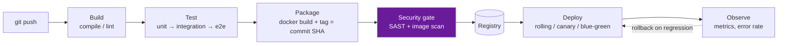
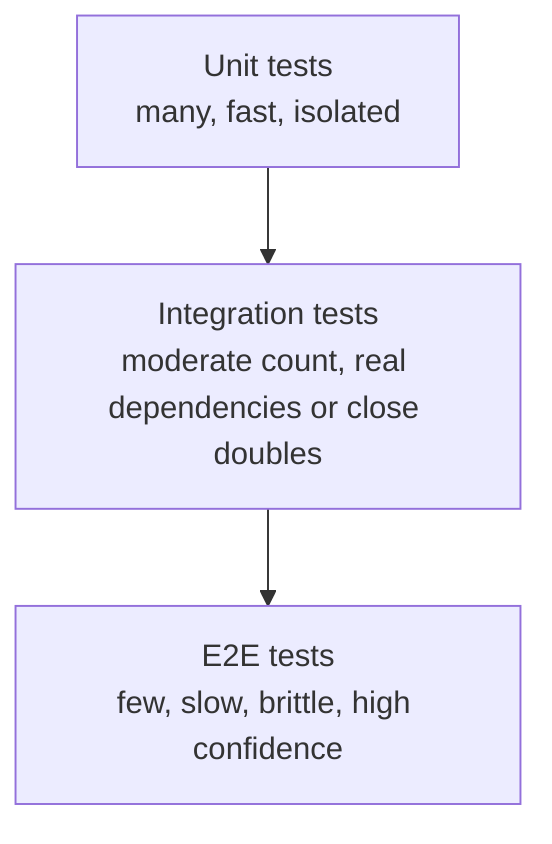
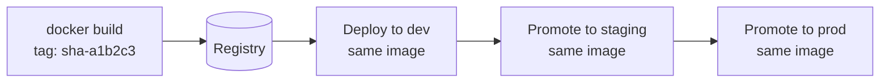
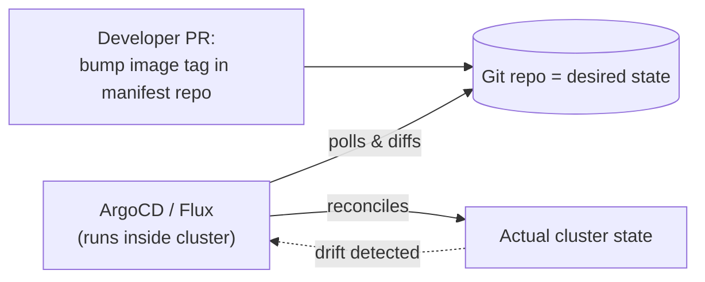
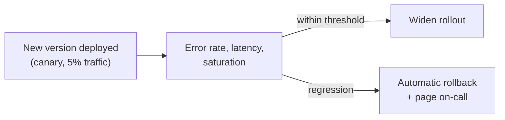

# CI/CD

**Prerequisites:** [Docker](docker.md)

[← Terraform](terraform.md) | [Next: Deployment Strategies →](deployment-strategies.md)

---

## Why This Exists

Continuous Integration and Continuous Delivery are two different claims that get merged into one buzzword. **CI** says: every change is automatically built and tested against the rest of the codebase, frequently, so integration problems surface in minutes instead of at a painful merge three weeks later. **CD** says: the main branch is *always* in a releasable state — deployment is a decision, not an engineering project.

The interview-relevant distinction is that a green pipeline answers "does this compile and pass its tests," which is a much narrower claim than "is this safe to run in production." Conflating the two is how teams end up debugging in production what a canary would have caught in five minutes.

!!! tip "Mental model"
    Think of CI/CD as **Build → Test → Package → Deploy**, where each stage's job is to fail fast and cheap so the next, more expensive stage never runs against something broken. A pipeline is not "green" or "red" as a single fact — it's a sequence of gates, and where it stopped tells you what kind of problem you have: compile error, failing test, security scan, or a canary that regressed a metric.

---

## Pipeline Architecture



**Fail-fast is the whole design principle.** A broken stage halts the pipeline — you don't run a 40-minute end-to-end suite against code that doesn't compile, and you don't deploy an image that failed its security scan. Ordering stages from cheapest-and-fastest to most-expensive-and-slowest is a deliberate performance decision, not an accident.

---

## The Test Pyramid



More unit tests, fewer integration tests, fewest end-to-end tests — inverted, and CI runtime balloons while flaky E2E failures erode trust in the pipeline faster than real bugs do. "Shift left" means catching a defect during the build/unit stage, where it costs a re-run, rather than during a manual QA pass or in production, where it costs an incident.

!!! warning "Production trap"
    A flaky test that fails ~5% of the time doesn't get fixed — it gets re-run until green, by habit. Six months later, engineers reflexively re-run *all* CI failures without reading them, and a real regression ships because it looked like "just the flaky one again." Flaky tests are a pipeline-trust tax; quarantine or delete them, don't let them normalize ignoring red.

---

## Artifacts: Build Once, Promote Everywhere

The artifact that gets tested must be the **exact same artifact** that gets deployed — not rebuilt from source at each environment. Rebuilding introduces the possibility that "tested" and "deployed" silently diverge (a dependency resolved differently, a base image updated between builds).



Tag images with the **commit SHA**, not `latest` and not a hand-incremented version — the SHA is unambiguous, traceable, and answers "what code is actually running" without guessing. Promotion between environments becomes re-pointing a deployment at the same immutable tag, not a new build.

---

## Pipeline as Code

Pipelines defined in a UI (a Jenkins job clicked together by hand) drift silently and have no review trail. Pipelines defined as YAML/Groovy in the repo (`Jenkinsfile`, `.github/workflows/*.yml`, `.gitlab-ci.yml`) get the same treatment as application code: version-controlled, diffable in a PR, reviewable before a pipeline change takes effect.

```yaml
# .github/workflows/deploy.yml (illustrative)
on:
  push:
    branches: [main]
jobs:
  build-test-deploy:
    steps:
      - uses: actions/checkout@v4
      - run: make test
      - run: docker build -t registry/app:${{ github.sha }} .
      - run: docker push registry/app:${{ github.sha }}
      - run: kubectl set image deploy/app app=registry/app:${{ github.sha }}
```

---

## GitOps: Git as the Source of Truth

Instead of a pipeline pushing changes *into* a cluster (push-based), a GitOps controller (ArgoCD, Flux) running inside the cluster continuously pulls the desired state from a Git repo and reconciles the cluster to match it:



This flips the trust model: nobody needs cluster-admin credentials in CI to deploy — the pipeline's job ends at "update the manifest in Git," and the in-cluster controller (which already has cluster access) does the applying. It also gets you drift detection and rollback for free: `git revert` on the manifest repo is a rollback, and the controller will notice and undo any manual `kubectl edit` that diverges from Git.

---

## Security Gates (DevSecOps)

- **No hardcoded secrets** — a secret manager (Vault, AWS Secrets Manager) injected at deploy or runtime, never `ENV API_KEY=...` in a Dockerfile or a plaintext value in a YAML manifest committed to Git.
- **SAST** (static analysis) on every PR — catches injection-shaped code before it merges.
- **Image scanning** as a pipeline gate, not a dashboard — a critical CVE in a base image should fail the build, the same way a failing unit test does.
- **Branch protection** — required reviews and required passing checks before merge to main, so "someone force-pushed a bad deploy straight to prod" isn't a category of incident that can happen.

---

## Observability Closes the Loop

A deploy isn't "done" at `kubectl apply` — it's done when metrics confirm the new version behaves. The three pillars (metrics, logs, traces) feed the decision to continue a rollout or roll back:



Automating this loop — error-rate spike triggers automatic rollback and a notification, rather than waiting for a human to notice a dashboard — is what turns "deploy" from a nerve-wracking event into a boring, frequent one. See [Deployment Strategies](deployment-strategies.md) for how the rollout itself is staged.

---

## Trade-offs

| Choice | Win | Cost |
|--------|-----|------|
| Push-based CI deploys | Simple, one tool does everything | CI needs broad cluster credentials — bigger blast radius if compromised |
| GitOps (pull-based) | No cluster creds in CI; drift detection; Git-native rollback | Extra component to run and understand (the controller itself) |
| Build once, promote the artifact | "What's tested is what ships" is literally true | Requires environment config to be external to the artifact (env vars, not baked-in) |
| Automated rollback on metric regression | Fast recovery, no human in the loop | False positives roll back a healthy deploy; thresholds need tuning |
| Trunk-based development | Short-lived branches, less merge pain | Requires strong feature-flag discipline to keep `main` always releasable |

---

## Interview Questions

=== "Foundation"
    **Q: What's the difference between Continuous Delivery and Continuous Deployment?**

    "Continuous Delivery means every change that passes the pipeline is *releasable* — a human still decides when to hit deploy. Continuous Deployment removes that gate entirely: every change that passes the pipeline goes to production automatically. Most companies practice delivery, not full deployment, especially where a human sign-off is a compliance requirement."

=== "Senior"
    **Q: Your pipeline rebuilds the Docker image separately at each environment (dev, staging, prod). What's wrong with that, and how do you fix it?**

    "It breaks the guarantee that what was tested is what ships — a rebuild at prod-deploy time could resolve a dependency differently or pull an updated base image than the one tested in staging, so a 'passing' staging deploy doesn't actually prove anything about the prod artifact. Fix: build once, tag with the commit SHA, push to a registry, and every environment deploys that exact same image — promotion is a re-pointing operation, not a rebuild. Config differences between environments should be externalized (env vars, ConfigMaps), not baked into the image."

=== "Staff"
    **Q: Incidents keep tracing back to manual `kubectl apply` or console changes that later get silently reverted by the next automated deploy, confusing on-call. How do you fix this systemically?**

    "That's a symptom of push-based deploys with no single source of truth — humans and pipelines both have write access to the cluster, and whoever wrote last wins until the next sync. I'd move to GitOps: the cluster's desired state lives entirely in a Git repo, an in-cluster controller reconciles to it, and nobody — human or pipeline — gets standing write access to the cluster directly. Emergency changes still happen, but they go through a fast-tracked PR to the manifest repo, so the 'current truth' and 'what's actually running' never silently diverge, and every change has a commit, an author, and a revert path."

---

## Key Takeaways

!!! success "Remember"
    1. CI proves "builds and passes tests"; that's a narrower claim than "safe to run in production" — don't conflate them
    2. Fail-fast ordering: cheap, fast checks (lint, unit tests) gate expensive, slow ones (E2E, deploy)
    3. **Build once, promote the same artifact** by commit SHA — never rebuild per environment
    4. Pipelines are code — version-controlled and reviewed, not clicked together in a UI
    5. GitOps makes Git the source of truth and removes standing cluster credentials from CI
    6. Observability isn't optional — a rollout without a metric-based rollback trigger is a deploy you're flying blind on

**Previous:** [Terraform](terraform.md) | **Next:** [Deployment Strategies](deployment-strategies.md)
