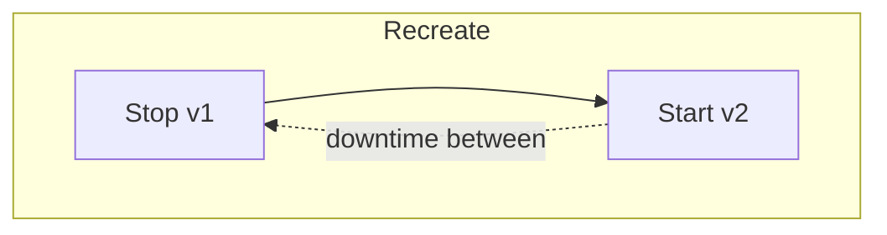
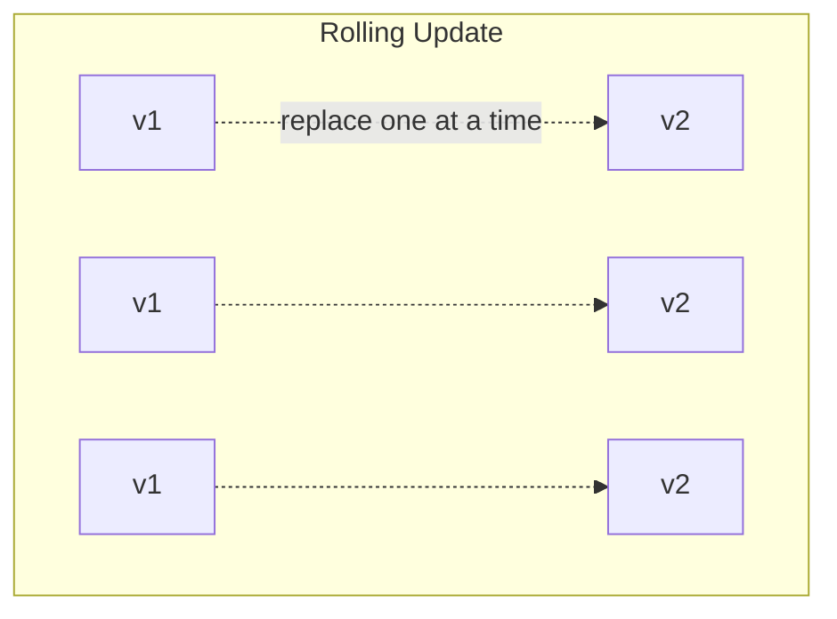
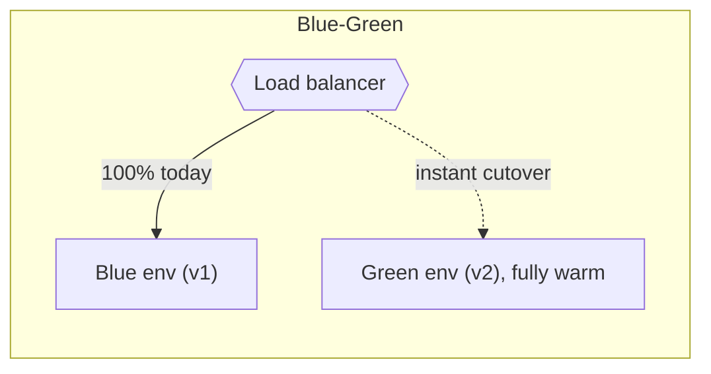
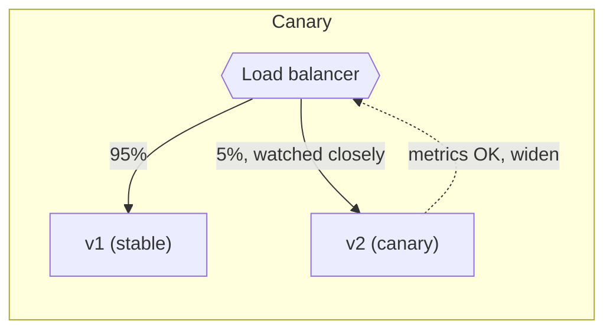
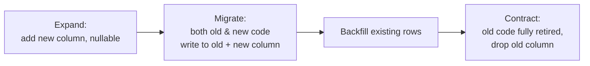

# Deployment Strategies

**Prerequisites:** [CI/CD](cicd.md)

[← CI/CD](cicd.md) | [Next: Kubernetes →](../kubernetes/index.md)

---

## Why This Exists

"How do you deploy?" is really three separate questions wearing one trench coat: **how fast can I roll a new version out, how fast can I roll it back, and how many real users get hurt if it's broken?** Every strategy on this page is a different point on that triangle — none of them is universally "best," and naming one without naming what it costs is the same mistake as naming an architecture pattern without naming its cost (see [Architecture Patterns](../architecture-patterns/index.md)).

!!! tip "Mental model"
    Every strategy answers two questions: **(1) how many users see the new version before you know it's safe?** and **(2) how fast can you undo it?** Recreate answers both badly (downtime, but at least it's simple). Canary and progressive delivery answer both well, at the cost of a longer rollout window and more infrastructure to run two versions side by side.

---

## The Core Four

| Strategy | Downtime | Rollback speed | Infra cost | Use when |
|----------|----------|-----------------|------------|----------|
| **Recreate** | Yes | Slow (redeploy old) | Lowest | Dev/internal tools, brief maintenance windows are acceptable |
| **Rolling update** | None | Moderate (redeploy old gradually) | Low (K8s default) | Most stateless services — the sane default |
| **Blue-green** | None | Seconds (flip traffic back) | 2x (both environments run fully) | Critical systems needing near-instant rollback |
| **Canary** | None | Fast (shrink traffic to 0%) | Moderate (small extra footprint) | High-traffic systems where a bad version must hurt few users |

---

## The Extended Set

Beyond the core four, each of these buys protection from a specific failure the core four don't cover:

| # | Strategy | Mechanics | What it buys you |
|---|----------|-----------|-------------------|
| 5 | **Progressive delivery** | Automated canary: 5%→25%→50%→100%, auto-halts on KPI breach | Removes the human from the "is it safe to widen" decision |
| 6 | **A/B testing** | Route by user segment; measure product metrics, not just health | Product decisions, not reliability — different goal entirely |
| 7 | **Shadow / traffic mirroring** | Copy real traffic to v2; v2's response is discarded, never seen by users | Load-tests v2 under real production traffic with zero user risk |
| 8 | **Feature flags (dark launch)** | Deploy code disabled; toggle it on independently of deploy | Decouples "code is live" from "feature is live" — deploy today, release tomorrow |
| 9 | **Ring deployment** | Internal → beta → early adopters → regions → global | Large orgs staging exposure by trust tier, not just traffic % |
| 10 | **Immutable infrastructure** | New image → new server → destroy old; never patch in place | Eliminates config drift and "works on this server only" |
| 11 | **GitOps pull-based delivery** | Cluster continuously reconciles to Git-declared state | Git becomes the audit trail and rollback mechanism (see [CI/CD](cicd.md)) |
| 12 | **Serverless traffic shifting** | Weighted routing between function versions (90%/10%) | Canary-style safety without managing servers |
| 13 | **Multi-region rollout** | Deploy region by region with monitoring gates between | Contains blast radius to one region if something's wrong |
| 14 | **Database expand-contract** | Add new schema → dual-write both → remove old schema | Zero-downtime schema change without breaking the old code path mid-rollout |
| 15 | **Rollback / health gates** | Auto-rollback on error rate, latency, or health-check threshold breach | Not a strategy on its own — the safety net *every* strategy above needs |

!!! tip "#15 isn't optional"
    Health gates aren't a 15th alternative to pick from — they're the mechanism that makes every strategy above actually safe. A canary with no automated rollback is just "some users get the bug first, then more users get it, then someone notices."

---

## The One Migration Trap: Database Expand-Contract

Rolling, blue-green, and canary all assume **two versions of your app run simultaneously for some window.** That's fine for stateless app code — it breaks the moment a deploy also needs a schema change.

Deploy a schema change and the new app code in the same step, and for the entire rollout window the **old pods are still running against the new schema** (or vice versa) — whichever direction you didn't plan for breaks. Expand-contract is the discipline of never making a single deploy that both old and new code can't survive simultaneously.

---

## Selection Framework

There is no universally correct strategy — the choice depends on:

- **Acceptable downtime** — zero for anything user-facing and revenue-bearing; a maintenance window may be fine for an internal batch tool.
- **Blast radius tolerance** — canary and ring deployment exist specifically to shrink "how many users are affected before we notice."
- **Rollback speed requirement** — blue-green trades 2x infrastructure cost for rollback measured in seconds, not minutes.
- **Statefulness** — stateless services can freely run two versions side by side; stateful services (databases) need expand-contract regardless of which app-level strategy you pick.
- **Team/tooling maturity** — progressive delivery and GitOps need real observability and automation investment to be safe; a team without that is safer on rolling updates plus a fast manual rollback than a half-automated canary nobody trusts.

---

## Trade-offs

| Choice | Win | Cost |
|--------|-----|------|
| Blue-green | Rollback in seconds | 2x infrastructure running simultaneously |
| Canary | Small blast radius on a bad deploy | Longer total rollout time; needs solid metrics to trust the "widen" decision |
| Feature flags | Deploy and release are decoupled | Codebase accumulates flag-check branches; stale flags are tech debt |
| Progressive delivery | No human bottleneck on the widen decision | Wrong KPI threshold either blocks good deploys or ships bad ones |
| Recreate | Simplest possible pipeline | Real downtime — unacceptable for most production traffic |

---

## Interview Questions

=== "Foundation"
    **Q: What's the difference between a rolling update and blue-green deployment?**

    "Rolling update replaces instances of v1 with v2 gradually, one (or a few) at a time, using the same infrastructure — no extra capacity needed, but rollback means rolling the same way in reverse, which takes time. Blue-green keeps two full environments and switches traffic between them atomically — rollback is just flipping the router back, seconds not minutes — at the cost of running double the infrastructure, even if only briefly."

=== "Senior"
    **Q: You want to canary a new version, but the deploy also includes a database migration that renames a column. What goes wrong?**

    "The canary and the stable version both talk to the same database. If I rename the column outright, the stable pods — still serving 95% of traffic — break immediately, because their queries reference the old column name. I need expand-contract instead: add the new column first (both old and new app code can run against that schema), deploy app code that writes to both, backfill, and only drop the old column once 100% of traffic is confirmed on code that no longer needs it. The canary of the app code and the migration of the schema have to be sequenced as separate, overlapping-safe steps, not one atomic deploy."

=== "Staff"
    **Q: Your org's canaries keep 'passing' — error rate looks fine — but user complaints spike anyway after full rollout. What's the systemic gap?**

    "The canary's health signal doesn't match what users actually feel. Error rate and latency are necessary but not sufficient — a UI regression, a subtly wrong recommendation ranking, or a slow-burn issue that only shows up after more than 5% of traffic sustains load for longer than the canary window, won't trip an error-rate gate. I'd push for canary metrics to include product-level signals (conversion rate, session length) alongside infra signals, extend the canary's observation window for gradual-onset issues, and consider ring deployment so internal users and beta cohorts absorb the exposure that a 5%-for-ten-minutes canary structurally can't catch."

---

## Key Takeaways

!!! success "Remember"
    1. Every strategy trades off **blast radius**, **rollback speed**, and **infrastructure cost** — none is free
    2. Rolling update is the sane default for stateless services; reach for blue-green or canary when the cost of being wrong is high
    3. Feature flags decouple "deployed" from "released" — this is often more valuable than the deployment strategy itself
    4. Schema changes need **expand-contract**, independent of whatever app-deployment strategy you're running
    5. Automated rollback on a health/metric gate isn't optional — it's what makes every other strategy actually safe
    6. "Fast rollback" beats "perfect deployment" — optimize for how quickly you can undo a mistake, not just how carefully you avoid one

**Previous:** [CI/CD](cicd.md) | **Next:** [Kubernetes](../kubernetes/index.md)
