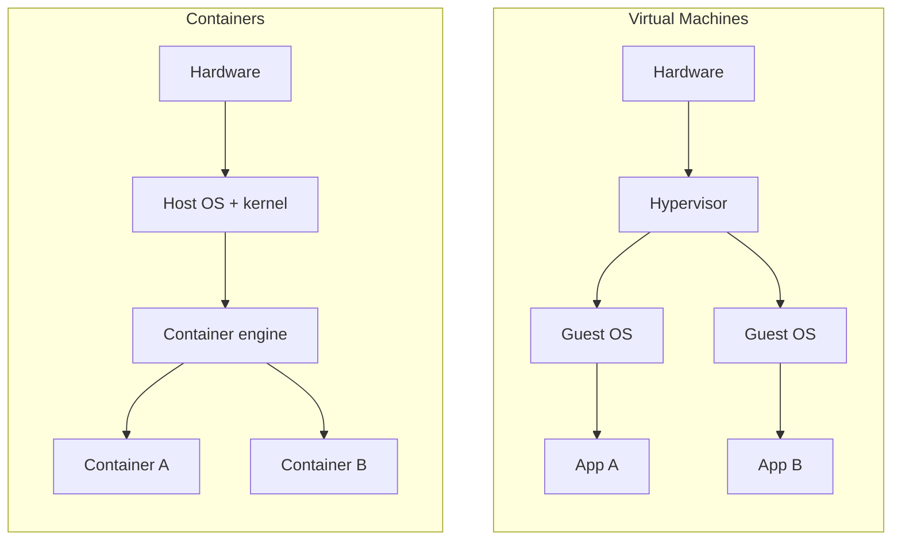
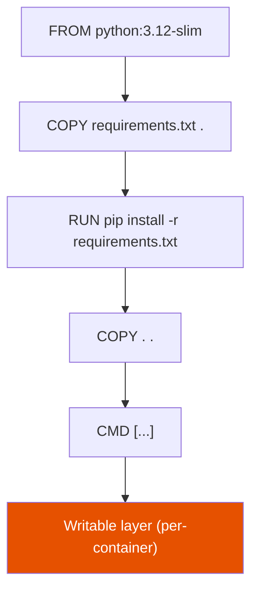

# Docker

**Prerequisites:** none strictly required — helpful to have seen a `Dockerfile` before.

[← Cloud](index.md) | [Next: Terraform →](terraform.md)

---

## Why This Exists

"It works on my machine" is a statement about environments, not code. Docker's entire value proposition is collapsing "works on my machine" into "works," by packaging the process with everything it assumes exists — a specific libc, a specific set of env vars, a specific file at `/etc/config.yml` — into one artifact that runs identically on a laptop, a CI runner, and a production node.

The interview-relevant failure mode is treating Docker as "a lightweight VM." It is not. **An image is a blueprint; a container is a running instance of that blueprint** — the same relationship a class has to an object. Get that model right and layer caching, multi-stage builds, and "why is my container 1.2GB" all follow logically instead of needing to be memorized.

!!! tip "Mental model"
    A **container is not a VM.** A VM virtualizes hardware and boots a full kernel; a container is a normal Linux process with three kernel features drawn around it — **namespaces** (its own view of PIDs, network, mounts, hostname), **cgroups** (CPU/memory limits), and a **union filesystem** (layered image). That's why a container starts in milliseconds, not seconds, and why "the container's kernel" isn't a real thing — it shares the host kernel.

---

## Containers vs. Virtual Machines



| | Virtual Machine | Container |
|---|---|---|
| Isolation unit | Full OS + kernel | Process + namespaces |
| Boot time | Seconds–minutes | Milliseconds |
| Overhead | GBs per guest OS | MBs per image layer diff |
| Kernel | Own kernel | **Shares the host kernel** |
| Isolation strength | Hardware-enforced (stronger) | Kernel-enforced (weaker — a kernel exploit crosses containers) |

That last row is the honest trade-off: containers are cheaper and faster because they give up the hardware isolation boundary. This is why multi-tenant, security-sensitive workloads sometimes still reach for VMs (or gVisor/Firecracker-style microVMs) around the container.

---

## Image Layers and the Build Cache

An image is a stack of read-only layers, each one a diff from the layer below, plus a thin writable layer added at container-start (copy-on-write). Docker caches each instruction's layer by hashing the instruction *and* its inputs — a cache hit skips re-execution entirely.



**The instruction that determines your CI build time is instruction order, not instruction count.** `COPY . .` before `pip install` means any source change — even a comment — invalidates every layer below it, forcing a full dependency reinstall on every build. Put things that change rarely (dependency manifests) before things that change often (source code):

```dockerfile
# Bad: any code change busts the pip-install cache
COPY . .
RUN pip install -r requirements.txt

# Good: cache survives until requirements.txt itself changes
COPY requirements.txt .
RUN pip install -r requirements.txt
COPY . .
```

!!! warning "Production trap"
    `apt-get update && apt-get install -y curl` cached from three months ago silently reinstalls a three-month-old `curl` — the cache doesn't know a CVE shipped. Pin versions, and periodically force a `--no-cache` rebuild rather than trusting a stale cached layer forever.

---

## Multi-Stage Builds

The image you *build with* (compiler, dev headers, test framework) is rarely the image you should *ship*. Multi-stage builds let one `Dockerfile` use a fat builder stage and copy only the compiled artifact into a minimal runtime stage:

```dockerfile
# Stage 1: builder — has the full Go toolchain
FROM golang:1.22 AS builder
WORKDIR /src
COPY . .
RUN CGO_ENABLED=0 go build -o /app ./cmd/server

# Stage 2: runtime — no compiler, no source, no shell if you want it minimal
FROM gcr.io/distroless/static-debian12
COPY --from=builder /app /app
USER nonroot:nonroot
ENTRYPOINT ["/app"]
```

This single change typically drops image size from ~900MB (full Go toolchain) to under 20MB (static binary + nothing else), and it shrinks the attack surface: no shell, no package manager, no source code in the shipped artifact.

---

## Networking

| Mode | What it is | When |
|------|-----------|------|
| **bridge** (default) | Private virtual network on the host; containers get an internal IP | Single-host local dev |
| **host** | Container shares the host's network namespace directly | Max performance, no port mapping, weaker isolation |
| **overlay** | Virtual network spanning multiple hosts (Swarm/K8s CNI) | Multi-node clusters |
| **none** | No networking | Batch jobs that need isolation, not connectivity |

**The concept that surprises people moving from `localhost`-based dev:** on a user-defined bridge network, Docker runs an embedded DNS server, so containers reach each other **by service name**, not by IP. `docker-compose.yml` with services `api` and `db` — `api` connects to `db:5432`, not to an IP it has to discover. This is the same mental model Kubernetes Services extend later (see [Kubernetes](../kubernetes/index.md)) — name-based service discovery, not IP-based.

---

## Storage: Containers Are Not Where Data Lives

The writable layer survives `docker stop` / `docker start` — the same container instance keeps its filesystem across a stop-start cycle. It does **not** survive `docker rm`, and it does not survive the far more common case of *replacing* a container: a new deploy that runs `docker run` (or a fresh Compose/Kubernetes rollout) creates a brand-new container with a brand-new, empty writable layer, even though nothing was ever explicitly "deleted." Anything that must outlive a container being removed or replaced needs to live outside it:

| Mechanism | Backed by | Use case |
|-----------|-----------|----------|
| **Volume** | Docker-managed area on host (or a plugin: EFS, NFS) | Databases, anything that should survive `docker rm` or a redeploy |
| **Bind mount** | An arbitrary host path | Local dev — live-reload source into the container |
| **tmpfs** | Host RAM, never written to disk | Secrets you don't want touching disk at all |

!!! warning "Misconception that causes real outages"
    A container getting OOM-killed and restarted by itself does **not** lose data on the writable layer — the container is still the same container, just stopped and started again. The data loss shows up one step later, at the *next deploy*: the OOM incident prompts a redeploy to "fix" it, that redeploy replaces the container, and only then does anyone discover the database's data was never on a volume. Conversely, `docker system prune -a --volumes` deletes volumes too; run it on a node with an unmounted production DB volume and you have a very bad afternoon. Read the flags.

---

## Security Baseline

- **Run as non-root** (`USER` in the Dockerfile) — a container escape as root is a host-root escape.
- **Minimal base images** (distroless / alpine / scratch) — fewer packages, fewer CVEs, smaller attack surface.
- **Scan before you ship**, not after (Trivy, Grype, or your registry's built-in scanner) — a CI gate, not a dashboard nobody reads.
- **Never bake secrets into layers.** `ENV API_KEY=...` or a `COPY .env` is in the image history forever, even if a later layer deletes the file — `docker history` and `docker save | tar -xO` both recover it. Inject secrets at runtime (mounted file, env var from a secret manager) instead.
- **Pin tags to digests in production**, not `:latest`. `myapp:latest` is not a version — it is a pointer that moves, and "which commit is actually running" becomes unanswerable during an incident.

---

## Trade-offs

| Choice | Win | Cost |
|--------|-----|------|
| Alpine base | Small image | musl libc breaks some glibc-compiled binaries; harder debugging (no shell tools) |
| Distroless | Smallest attack surface | No shell — `docker exec ... sh` for debugging doesn't work |
| Multi-stage build | Small, secure runtime image | Slightly more complex Dockerfile, two build contexts to reason about |
| Host networking | No NAT overhead | Container can bind host ports directly; loses network isolation |
| `:latest` tag | Convenient locally | Unreproducible in production; "what's actually deployed" becomes a guess |

---

## Interview Questions

=== "Foundation"
    **Q: What's the difference between an image and a container?**

    "An image is an immutable, layered filesystem plus metadata — a blueprint. A container is a running process using that image as its root filesystem, with a thin writable layer on top. One image can back many running containers, the same way one class backs many objects. Stopping a container doesn't delete the image; deleting the image requires no running containers reference it."

=== "Senior"
    **Q: Your CI build takes 6 minutes and most of it is `pip install`. How do you fix it?**

    "First check instruction order — if `COPY . .` happens before the install step, every commit invalidates the dependency layer regardless of whether dependencies changed. Split it: copy only the manifest, install, then copy source. Second, use a registry-backed build cache (`--cache-from`) so cold CI runners don't start from zero. Third, consider a multi-stage build so the install-heavy stage isn't even in the shipped image, only its output."

=== "Staff"
    **Q: A security review flags that your production images are built FROM base images with 40+ known CVEs. How do you fix this org-wide, not per-team?**

    "Per-team fixes rot — someone bumps a base image today and it's stale again in a month. I'd publish a small set of golden base images (distroless or minimal, one per language runtime), owned by a platform team, rebuilt on a schedule and on upstream CVE alerts, with an admission policy or CI gate that blocks non-golden bases from reaching prod. Then it's one team's job to keep N base images current instead of every team's job to remember. I'd also add SBOM generation at build time so 'are we affected by CVE-X' is a query, not a fire drill."

---

## Key Takeaways

!!! success "Remember"
    1. Image = blueprint, container = running instance; containers share the host kernel, they don't virtualize hardware
    2. Layer order determines cache efficiency — put what changes least at the top of the `Dockerfile`
    3. Multi-stage builds ship the artifact, not the toolchain that built it
    4. Containers reach each other by **service name** via embedded DNS, not by IP
    5. Data outlives a container only if it's on a **volume**, not the writable layer
    6. Never bake secrets into a layer — `docker history` remembers everything
    7. Pin to a digest in production; `:latest` is not a version

**Previous:** [Cloud](index.md) | **Next:** [Terraform](terraform.md)
