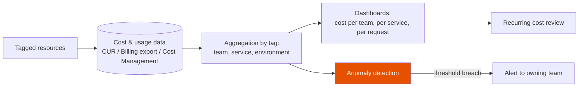

# FinOps

**Prerequisites:** none strictly required.

[← IAM & Managed Services](iam-managed-services.md) | [Next: Kubernetes →](../kubernetes/index.md)

---

## Why This Exists

A misconfigured autoscaler that scales to 10x normal capacity used to be purely an SRE's problem — the pager goes off, someone fixes it, done. In the cloud, the same event is also a finance problem: it shows up three weeks later as a $40K line item nobody can explain, discovered by an accountant, not an engineer. **The infrastructure that causes cost problems is the same infrastructure engineers already own** — so the people best positioned to prevent and diagnose cost anomalies are engineers, not finance. FinOps exists to close that gap: put cost visibility and cost decisions where the technical context already lives.

The interview-relevant failure mode is treating cost as "someone else's spreadsheet." Senior engineers are expected to reason about the cost implications of an architecture decision (autoscaling policy, storage class, commitment strategy) the same way they reason about latency or availability — as a first-class design constraint, not an afterthought discovered in a monthly bill review.

!!! tip "Mental model"
    Cloud cost is a **usage-metered utility bill for a system that changes shape every minute**, not a fixed line item like office rent. The engineering discipline isn't "spend less" — it's "know what you're spending and why, in near-real-time, broken down by the same units you already reason about (per-service, per-team, per-request)." A system with excellent cost visibility isn't necessarily cheap; it's *legible* — every dollar traces to a decision someone can explain.

---

## Cost Allocation: Tagging Strategy

Cloud bills arrive as one undifferentiated total unless every resource is tagged with who owns it and why it exists. Without tags, "which team is spending the most" is an unanswerable question — the bill is a pile of resource IDs, not an org chart.

| Tag | Purpose | Example |
|---|---|---|
| `team` / `owner` | Who to ask when cost spikes | `payments-team` |
| `environment` | Separate prod cost from the dev/staging noise around it | `prod`, `staging` |
| `service` | Attribute cost to a specific deployable | `checkout-api` |
| `cost-center` | Map to finance's existing budget structure | `CC-4471` |

**Showback vs. chargeback:**

- **Showback** — teams see their cost breakdown, but it isn't deducted from a real budget. Low friction, builds awareness, but nothing forces action on it.
- **Chargeback** — a team's cloud spend is actually billed against their budget. Creates real incentive to fix waste, but requires accurate, trusted allocation data — inaccurate chargeback (cost misattributed to the wrong team) destroys trust in the whole system fast, and teams start arguing about tags instead of fixing waste.

!!! warning "Production trap"
    Tagging enforced only at resource-creation time in a console click-through gets bypassed the moment someone provisions via Terraform, a script, or an SDK without the tag defaulted in. The fix isn't a wiki page asking people to remember — it's a **policy gate** (AWS tag policies / SCPs, GCP Organization Policy, Azure Policy) that blocks resource creation without required tags, enforced the same way a required approval gate is enforced, not as a suggestion.

---

## Commitment Models

| Model | Discount | Commitment | Risk |
|---|---|---|---|
| On-demand | 0% (baseline) | None | None — full flexibility |
| Reserved Instances / Savings Plans (AWS), CUDs (GCP), Reserved Instances (Azure) | 30–70% off on-demand | 1 or 3 years, specific instance family (RI) or spend commitment (Savings Plans/CUDs) | Overcommit → paying for capacity you don't use; undercommit → leaving discount on the table |
| Spot / Preemptible / Spot VMs | 60–90% off on-demand | None — can be reclaimed with 30s–2min notice | Reclamation mid-job; only viable for interruptible workloads |

The trade-off underneath this table is always **discount vs. flexibility**. Reserved capacity is a bet that your baseline usage a year from now looks like your baseline usage today — right for stable, predictable workloads (the always-on production fleet), wrong for anything still finding its shape (a new product, a workload that might be re-architected in six months). Spot is a bet that your workload can be interrupted without correctness or user-facing impact — right for batch jobs, CI runners, stateless horizontally-scaled workers; wrong for anything holding state that isn't checkpointed or a synchronous user-facing request.

---

## Rightsizing

Provisioned capacity that doesn't match actual utilization is waste in both directions: **oversized** instances burn budget on unused headroom; **undersized** instances cause latency/availability problems that get "fixed" by oversizing further, compounding the waste. Rightsizing is the discipline of matching provisioned capacity to observed utilization, on a cadence, not once at launch and never again.

- **Utilization-based sizing** — pull CPU/memory/IO utilization percentiles (not just averages — a p50 of 20% with a p99 of 95% is a very different sizing decision than a flat 60%) over a representative window (at least one full business cycle, ideally including a peak event) before resizing.
- **Autoscaling cost implications** — autoscaling optimizes for *availability under load*, not cost; a policy with an aggressive scale-up threshold and a conservative (slow) scale-down threshold is a deliberate reliability choice that also means the fleet spends more time over-provisioned than under. That's often the right trade-off — but it should be a chosen trade-off, not a default nobody revisited.

---

## Cost Visibility Pipeline

Without the tagging step at the front, everything downstream degrades to "the total bill went up" — true, unhelpful, and impossible to route to the team that can act on it.

---

## Realistic Example

**The $40K line item from the intro, resolved.**

`recommendations-service` runs on an autoscaling group of `r5.4xlarge` instances (16 vCPU / 128GB, on-demand $1.008/hr in us-east-1). Baseline size: 10 instances, running at a steady p50 CPU utilization of 15% — already oversized for its actual load, but nobody had revisited it since launch.

A bug shipped in a scale-in cooldown change: the scale-down alarm's comparison operator was flipped during a refactor, so the group could scale up on a load spike but never scaled back down. A traffic blip pushed the group to 90 instances (an 80-instance overshoot) three weeks before a scheduled peak event, and it stayed pinned at 90 for **21 days (504 hours)** before anyone noticed — nothing paged, because nothing was down; the extra capacity just sat there, idle and billing.

**The bill breakdown:**

| Line item | Quantity | Rate | Duration | Cost |
|---|---|---|---|---|
| Extra on-demand instances (the bug) | 80 × r5.4xlarge | $1.008/hr | 504 hrs | $40,643 |
| Baseline fleet (would have run regardless) | 10 × r5.4xlarge | $1.008/hr | 504 hrs | $5,080 |
| **Total for the period** | | | | **$45,723** |

The accountant who flagged the anomaly three weeks later saw a $40,643 jump against the prior month's baseline — that's the "$40K line item nobody can explain" from the intro. Once traced, it was a one-line alarm-comparison bug, not a traffic problem: actual request volume during those 21 days was flat.

**What commitment coverage and rightsizing would have saved, independent of the bug:**

The baseline 10-instance fleet was itself running 100% on-demand with no committed spend, on hardware sized for a load it wasn't using:

- **Rightsizing:** p50 CPU of 15% (p99 40%) on `r5.4xlarge` fits comfortably on `r5.xlarge` (4 vCPU / 32GB, $0.252/hr) with the fleet resized from 10 to 6 instances to hold the same headroom. Monthly baseline cost drops from 10 × $1.008 × 730 = **$7,358/mo** to 6 × $0.252 × 730 = **$1,104/mo** — a $6,254/mo saving (85%) before any commitment discount is applied.
- **Commitment coverage:** layering a 1-year Savings Plan (≈40% discount, a mid-range rate for a 1-year no-upfront commitment) on top of the rightsized fleet takes $1,104/mo to **$662/mo** — another $442/mo.
- **Combined ongoing saving: ~$6,696/mo (~$80K/year)** on a service that was quietly overspending long before the autoscaler bug made a single dramatic month of it visible.

The incident fix (correct the alarm comparison, add a max-instance ceiling and a scale-up rate limit, wire a cost anomaly alert to the owning team) prevents the next $40K spike. The rightsizing and commitment fix is the larger, boring, recurring saving that a one-time incident review never surfaces on its own — which is the actual point of treating cost as a standing engineering practice instead of a post-incident cleanup.

---

## Failure Modes

**Spot instance reclamation mid-job.** A cloud provider reclaims spot capacity with 30 seconds (AWS) to 2 minutes (GCP) notice. A batch job or long-running training run without checkpointing loses all progress and restarts from zero — worse than if it had just run on-demand the whole time, once you count the wasted compute. The fix is checkpointing at a cadence shorter than the typical reclamation window, plus a mixed fleet (spot + a small on-demand baseline) so total capacity doesn't cliff to zero if spot is reclaimed broadly during a capacity crunch.

**Orphaned resources.** An EBS volume left behind after its instance was terminated, an unattached Elastic IP, a load balancer nobody deleted after decommissioning a service — none of these page anyone, because nothing is broken. They just accumulate as invisible recurring cost, individually cheap and collectively significant, discovered only in a periodic audit or never.

**Runaway autoscaling.** A scaling policy tied to a metric that spikes for a reason unrelated to real load — a bug causing a retry storm, a misconfigured health check flapping — scales the fleet to its max and holds it there, burning cost at the ceiling instead of at the actual demand level. This is the cost-side twin of a reliability incident: the same retry storm that pages SRE for latency also shows up in finance as a spend anomaly.

**Egress cost surprises.** Cross-region or cross-cloud data transfer, and especially egress to the public internet, is priced per-GB in a way that's easy to ignore during architecture design and expensive to discover after launch — a chatty multi-region replication scheme or a design that serves large payloads directly from a cloud provider instead of a CDN can turn into a bill line item bigger than compute.

---

## Production Debugging

**Cost anomaly detection** — most providers (AWS Cost Anomaly Detection, GCP cost anomaly alerts, Azure Cost Management anomaly alerts) apply statistical baselining per service/account and alert on deviation. Treat these the same as a latency alert: **when it fires, ask "what changed" before "who do I blame"** — a deploy, a traffic spike, a new feature flag rollout, and a misconfiguration are all plausible causes with different fixes.

**Unit economics — cost per request.** Total spend going up is not itself informative; total spend going up *faster than traffic* is. Track cost-per-request (or cost-per-active-user, cost-per-transaction — whatever unit maps to the business) alongside the raw bill. A service that costs more in absolute terms because traffic tripled is healthy; a service whose cost-per-request itself is climbing has a genuine efficiency regression — a memory leak forcing bigger instances, an N+1 query burning more compute per request, a cache hit rate that quietly dropped.

**Decision tree for a cost spike:**

1. Check if traffic/usage rose proportionally — if yes, this is scaling working as intended, not a bug.
2. If cost rose faster than traffic, check for a recent deploy or config change around the inflection point.
3. If no deploy correlates, check for orphaned/idle resources newly created (a forgotten load test, a debug instance left running).
4. If none of the above, check for a pricing/tier change (a service crossing a volume threshold into a more expensive tier, a reserved-capacity commitment expiring and falling back to on-demand rates).

---

## Trade-offs

| Model | Win | Cost |
|---|---|---|
| On-demand | Zero commitment, maximum flexibility | Highest per-unit price |
| Reserved / Savings Plans / CUDs | 30–70% discount on stable baseline | Wrong bet on future usage = paying for unused capacity |
| Spot / Preemptible | 60–90% discount | Reclamation risk — only safe for checkpointed/interruptible workloads |
| Chargeback | Real incentive to fix waste | Requires trustworthy attribution or teams fight the tagging instead of the waste |
| Showback | Low friction, builds visibility | No forcing function — awareness without accountability often doesn't change behavior |
| Aggressive autoscaling scale-down | Lower idle cost | Risk of thrashing (scale down then immediately back up) under bursty load |

---

## Interview Questions

=== "Foundation"
    **Q: What's the difference between showback and chargeback, and when would you use each?**

    "Showback gives teams visibility into their own cloud spend without actually billing it against a real budget — it's informational, low-friction to roll out, and good for building cost awareness in an org that's never had it. Chargeback actually debits a team's budget for their usage, which creates a real incentive to fix waste, but it only works if the underlying cost attribution (the tagging) is accurate — misattributed chargeback causes teams to dispute the bill instead of fixing the waste, which is worse than not having chargeback at all. I'd start with showback to get tagging accuracy solid, then move to chargeback once the data is trusted."

=== "Senior"
    **Q: A team's monthly bill tripled and nobody can explain why. How do you find the cause?**

    "First, check if traffic tripled too — if it did, this might just be the system scaling correctly and the actual problem is nobody expected traffic to triple, which is a capacity-planning conversation, not a cost bug. If cost outpaced traffic, I'd pull the cost breakdown by service and by resource type for the billing period, looking for the specific line item that grew, then correlate its timeline against the team's deploy log — most cost regressions trace to a specific change (a new autoscaling policy, a misconfigured retry loop, a cache that stopped being effective). I'd also check for orphaned resources — it's common for a load test or a debug environment to get spun up and never torn down. The key move is treating it like a production incident with a timeline, not just staring at the total."

=== "Staff"
    **Q: Your org has good cost dashboards but spend keeps growing faster than revenue, and nobody feels individually responsible. What do you change?**

    "Dashboards without accountability are just interesting reading — visibility alone doesn't change behavior if no one owns the outcome. I'd move from showback to chargeback for the largest cost centers, tied to tagging that's enforced at provisioning time via policy, not convention, so the attribution is trustworthy enough to hold up when a team pushes back. I'd also push unit economics — cost per request or per active user — into the same dashboards engineers already look at for latency and error rate, so cost becomes a normal design constraint reviewed at architecture time, not a monthly surprise reviewed by finance after the fact. And I'd build automated guardrails for the highest-leverage waste categories — orphaned resource cleanup, commitment coverage recommendations, anomaly alerts routed to the owning team directly — because manual quarterly cost reviews don't scale and always lag the actual spend by weeks."

---

## Key Takeaways

!!! success "Remember"
    1. Cloud cost problems are caused by the same infrastructure engineers own — treat cost as a design constraint alongside latency and availability, not finance's problem
    2. Tagging is the foundation everything else depends on; enforce it with a policy gate at provision time, not a wiki page
    3. Commitment models trade discount for flexibility — reserved for stable baseline load, spot for interruptible/checkpointed workloads, on-demand for anything still finding its shape
    4. Track cost-per-request, not just total spend — total spend rising with traffic is healthy, cost-per-request rising is a real regression
    5. Orphaned resources, runaway autoscaling, and egress are the three cost failure modes that never page anyone — they need deliberate detection, not incident response

**Previous:** [IAM & Managed Services](iam-managed-services.md) | **Next:** [Kubernetes](../kubernetes/index.md)
