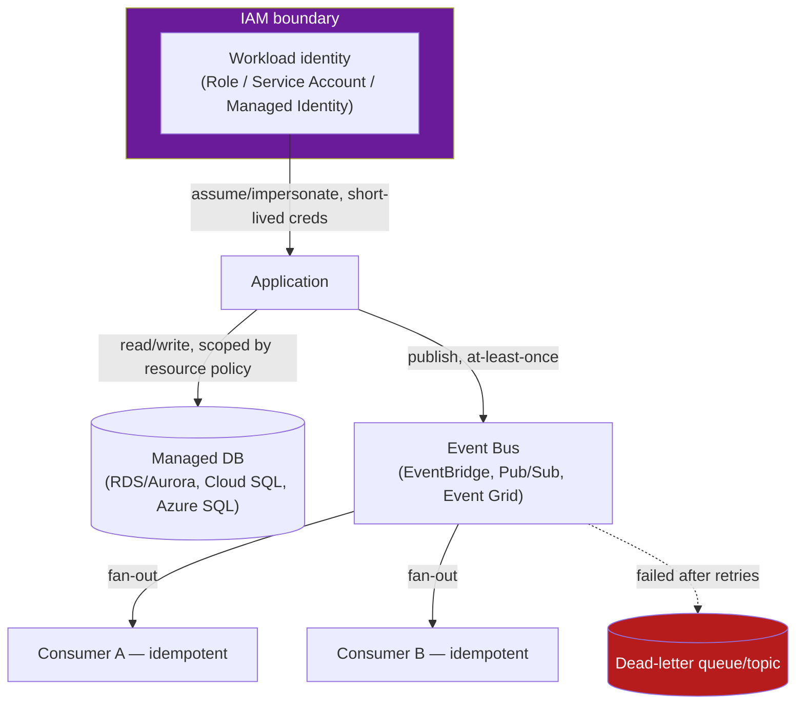

# IAM & Managed Services — Vendor Rosetta Stone

**Prerequisites:** none strictly required — helpful to have read [Cloud Provider Comparison](providers.md) first.

[← Deployment Strategies](deployment-strategies.md) | [Next: Kubernetes →](../kubernetes/index.md)

---

## Why This Exists

Every cloud provider solves the same three problems — who's allowed to do what, where does state live durably, how do services tell each other things happened — with three incompatible vocabularies. A candidate who can only speak "AWS" freezes the moment an interviewer says "the client is on GCP" or a new job lands them on Azure. The underlying concepts (identity, managed data stores, eventing) don't change between clouds; only the nouns do.

The interview-relevant skill isn't memorizing every service name. It's recognizing that **IAM is always "who can do what to which resource, and how do you prove it,"** that **managed databases always trade control for someone else handling failover and patching,** and that **event buses always trade strict ordering for scale.** Once you have that mapping, walking into a GCP or Azure shop is a vocabulary problem, not a conceptual one.

!!! tip "Mental model"
    Think of each vendor's IAM/DB/eventing stack as a **regional dialect of the same language.** AWS IAM roles, GCP service accounts, and Azure managed identities are all answering "how does a workload prove who it is without a human typing a password." RDS Multi-AZ, Cloud SQL HA, and Azure SQL zone redundancy are all answering "how do I not lose data when a rack dies." EventBridge, Pub/Sub, and Event Grid are all answering "how do services react to things without polling." Learn the question once; the vendor name is just the answer's accent.

---

## IAM: Identity and Access Management

| Concept | AWS | GCP | Azure |
|---|---|---|---|
| Human/service identity | IAM User / IAM Role | Google Account / Service Account | Azure AD (Entra ID) User / Service Principal |
| Workload identity (no long-lived keys) | IAM Role + `AssumeRole` (STS) | Service Account + Workload Identity Federation | Managed Identity (system- or user-assigned) |
| Permission grouping | Managed/inline Policy (JSON) attached to identity | Predefined/custom Role bound to identity | RBAC Role Definition assigned to identity |
| Resource-level guardrail | Resource-based policy (e.g., S3 bucket policy) | IAM Policy directly on the resource | Azure RBAC scope (resource/RG/subscription) |
| Org-wide guardrail | Service Control Policy (SCP) via AWS Organizations | Organization Policy Constraint | Azure Policy |
| Cross-account/project access | Cross-account role + `AssumeRole` (temporary creds) | Cross-project IAM binding | Cross-tenant guest access / Lighthouse |
| Temporary credential mechanism | STS (`sts:AssumeRole`, session tokens, 15min–12hr TTL) | Short-lived OAuth tokens via impersonation | Azure AD token (default 1hr, refreshable) |

**The concept that maps 1:1 across all three: never give a workload a long-lived static credential.** AWS access keys committed to a repo, a GCP service-account JSON key downloaded to a laptop, an Azure connection string in an env var — all three are the same mistake wearing a different hat. The fix is also universal: **assume a role / impersonate a service account / use a managed identity**, so credentials are short-lived and never touch disk.

!!! warning "Production trap"
    AWS's resource-based policies (bucket policies, trust policies) can grant access **independent of the calling principal's own IAM policy** — a bucket policy alone can expose an S3 bucket to the public internet even if every IAM user's policy looks locked down. GCP and Azure both funnel *all* access decisions through the identity's role bindings, so "check the resource policy separately from the identity policy" is an AWS-specific step engineers moving from GCP/Azure forget to do, and it's the single most common cause of "how was this bucket public" incidents.

---

## Managed Databases

| Dimension | AWS RDS / Aurora | GCP Cloud SQL / AlloyDB | Azure SQL DB / Cosmos DB |
|---|---|---|---|
| HA model | Multi-AZ synchronous standby (RDS); Aurora replicates storage across 3 AZs, 6 copies | Regional HA: synchronous standby in second zone | Zone-redundant configuration; Cosmos DB multi-region with tunable consistency |
| Failover time | RDS Multi-AZ: 60–120s; Aurora: typically <30s (storage-level, no data copy) | Cloud SQL HA: ~60s; AlloyDB: <60s with connection pooling | Azure SQL: ~30s (zone-redundant); Cosmos DB: near-zero for multi-region writes |
| Consistency options | Aurora: strong (single primary) or eventual (read replicas) | Cloud SQL: strong; AlloyDB: strong with lower replica lag | Cosmos DB: 5 tunable levels — strong, bounded staleness, session, consistent prefix, eventual |
| Backup / PITR | Automated snapshots + PITR (5 min granularity, up to 35 days) | Automated backups + PITR (up to 35 days) | Automated backups + PITR (7–35 days) |
| Read scaling | Up to 15 Aurora read replicas; RDS up to 5 | Up to 20 read replicas (Cloud SQL); AlloyDB read pools | Up to 5 geo-replicas (SQL DB); Cosmos DB scales reads per-region |
| Write scaling | Single writer (Aurora Limitless is the exception — sharded writes) | Single writer | Cosmos DB: multi-region writes with conflict resolution |

**The trap that surprises engineers moving between clouds:** "HA" does not mean "no connection disruption." All three force existing connections to drop and reconnect on failover — the DNS/endpoint moves to the new primary, but a connection pool holding stale connections keeps retrying a dead node until it notices. This is a connection-pool configuration problem (short-lived connections, retry with backoff, driver-level failover awareness), not something the managed service solves for you regardless of vendor.

---

## Event Buses

| Dimension | AWS EventBridge | GCP Pub/Sub | Azure Event Grid |
|---|---|---|---|
| Delivery guarantee | At-least-once | At-least-once | At-least-once |
| Ordering | Not guaranteed by default (FIFO not native to EventBridge; use SQS FIFO downstream) | Ordering keys give per-key ordering within a region | Not guaranteed by default |
| Fan-out model | Rule-based routing to targets (Lambda, SQS, Step Functions, etc.) | Topic → multiple subscriptions, each gets full copy | Topic → multiple event subscriptions with filters |
| Dead-lettering | Per-target DLQ (SQS/SNS) | Per-subscription dead-letter topic | Per-subscription dead-letter destination (Storage) |
| Schema/filtering | Content-based filtering on event JSON | Attribute-based filtering; no payload filtering natively | Advanced filtering on event payload |
| Push vs. pull | Push to targets | Both push and pull subscriptions | Push only (webhook-style) |

**The concept that catches everyone regardless of vendor: "at-least-once" is a promise about delivery, not about your handler.** All three can redeliver the same event — a target that acknowledges slowly, a network blip during ack, a retry after a transient 5xx — so every consumer must be **idempotent**, keyed on an event ID or a natural dedup key, or duplicate processing becomes a silent correctness bug (double-charging a customer, double-incrementing a counter) rather than a loud one.

---

## Reference Architecture

The pattern that repeats across all three vendors: **identity gates access, the managed DB is the source of truth, the event bus is how everyone else finds out.** Draw this shape in an interview and swap in vendor-specific boxes — the architecture doesn't change.

---

## Failure Modes

**Overly broad IAM policies → privilege escalation.** A role with `iam:PassRole` (AWS), `iam.serviceAccounts.actAs` (GCP), or a Contributor-level Azure RBAC assignment can hand itself more powerful credentials than it started with — a workload with permission to *assign roles* can assign itself admin. This is the single most common path from "one compromised low-privilege service" to "full account takeover" in all three clouds. The fix is the same everywhere: **least privilege on the ability to grant privilege**, audited separately from ordinary resource access.

**Managed DB failover → connection storms.** When a primary fails over, every application instance's connection pool tries to reconnect simultaneously. If the pool's retry logic doesn't back off, hundreds of instances hammering a freshly-promoted (and still warming its buffer cache / query plan cache) replica can push it back into failure — a self-inflicted second outage caused by *recovering* from the first one.

**Event bus at-least-once → duplicate side effects.** A consumer that isn't idempotent double-processes a redelivered event. The classic version: an order-confirmation event triggers a second confirmation email, or worse, a second charge. The fix is a dedup table keyed on event ID with a unique constraint, checked before processing — not "hope delivery is exactly-once," because none of these three buses promise that.

---

## Production Debugging

**"Why did this API call get denied?"**

- AWS: CloudTrail event history → check the exact `Action`/`Resource` denied, then `aws iam simulate-principal-policy` to test the policy offline
- GCP: Cloud Audit Logs (Admin Activity + Data Access) → Policy Troubleshooter (`gcloud iam ...` or console) to see which binding was missing
- Azure: Activity Log + `az role assignment list --assignee <id>` to check effective RBAC scope

**"Why did my DB connections spike/error during a deploy or maintenance window?"**

- Check failover events: RDS Events / Aurora cluster events, Cloud SQL operations log, Azure SQL failover history — confirm a failover actually happened before chasing application code
- Check connection pool metrics: active connections vs. max, connection errors, retry rate — a spike aligned with the failover timestamp confirms the connection-storm pattern above
- Decision tree: failover happened + connection errors spiked together → pool/retry config issue, not a DB issue. Failover happened + no connection errors → working as intended. No failover + connection errors → separate root cause (app-level leak, network).

**"Why are events being processed twice (or not at all)?"**

- Check the DLQ/dead-letter destination first — if messages are landing there, the consumer is failing, not the bus
- Check subscription/target metrics for retry counts — a high retry count with eventual success means a slow or flaky consumer, not a bus problem
- Confirm idempotency key coverage — if duplicates cause a visible bug, the gap is almost always a missing dedup check, not a bus delivering more than once than documented

---

## Trade-offs

| Choice | Win | Cost |
|---|---|---|
| AWS resource-based policies | Fine-grained, cross-account access without IAM role changes | Access can be granted outside the identity's own policy — easy to overlook in an audit |
| GCP's single unified IAM model | One place to reason about all access | Less granular resource-level nuance than AWS bucket policies for edge cases |
| Cosmos DB's 5 consistency levels | Tunable per-workload, can trade consistency for latency deliberately | More decisions to get right; picking the wrong default silently changes correctness guarantees |
| Aurora storage-level replication | Sub-30s failover, no data-copy step | Vendor lock-in — the storage engine isn't portable to another cloud |
| Pub/Sub ordering keys | Per-key ordering without a separate FIFO product | Ordering is regional and per-key, not global — still a design constraint, not "solved" |
| EventBridge content-based filtering | Cheap fan-out without a Lambda per rule | Filtering is JSON-pattern-based; complex conditional routing still needs code downstream |

---

## Interview Questions

=== "Foundation"
    **Q: What's the difference between an IAM role and an IAM user, and why does it matter for a workload (not a human)?**

    "A user is a long-lived identity, typically for a human, often paired with a static credential. A role is an identity a workload *assumes* temporarily — AWS STS, GCP impersonation, and Azure managed identities all issue short-lived tokens instead of static keys. For workloads, always use the role/service-account/managed-identity path: a static credential baked into code or a config file is a standing liability — it doesn't expire, it can leak into logs or repos, and revoking it means finding every place it was used. A role's credentials expire on their own and are scoped to exactly what the workload assumed."

=== "Senior"
    **Q: A service on GCP needs to write to a database and publish to a topic. How do you scope its permissions, and how does that map to what you'd do on AWS?**

    "Give the workload its own service account (not a shared one), and bind only the specific roles it needs — `cloudsql.client` for the DB connection, `pubsub.publisher` scoped to the specific topic, not `pubsub.admin` or a project-wide role. On AWS the same shape: a dedicated IAM role for the service, an inline or managed policy scoped to the specific RDS resource and the specific EventBridge bus/rule ARN, assumed via instance profile or IRSA if it's running on EKS. The principle transfers directly — least privilege, one identity per workload, scoped to specific resource ARNs/names, not wildcards — only the API calls to set it up differ."

=== "Staff"
    **Q: Your org runs workloads across AWS and GCP after an acquisition. Engineers keep shipping IAM policies that are broader than needed because "it's faster to get unblocked." How do you fix this systemically?**

    "This is a paved-road problem, not an individual-discipline problem — nagging people to write tighter policies doesn't scale and doesn't survive turnover. I'd build a small library of pre-approved, parameterized IAM modules (Terraform, one set per cloud) that encode least-privilege patterns for the common cases — 'read from this specific S3 prefix,' 'publish to this specific topic' — so the fast path and the safe path are the same path. I'd pair that with a CI policy-linter (e.g., checking for wildcard resources or `*:*` actions) that blocks merge rather than a manual review that people route around under deadline pressure. And I'd run a scheduled least-privilege audit (AWS Access Analyzer, GCP Policy Analyzer) that flags granted-but-unused permissions on a cadence, because even well-scoped-at-creation policies rot as a service's actual usage narrows over time."

---

## Key Takeaways

!!! success "Remember"
    1. IAM, managed DBs, and event buses solve the same three problems on every cloud — identity, durable state, and eventing — only the noun changes
    2. Workload identity should always be short-lived (assumed role / impersonated service account / managed identity), never a static long-lived credential
    3. AWS resource-based policies can grant access outside the identity's own policy — check both, every audit, every cloud has an equivalent gap somewhere
    4. Managed-DB "HA" doesn't mean connection-transparent failover — connection pools need backoff or failover becomes a self-inflicted second outage
    5. All three event buses are at-least-once — idempotent consumers are not optional, they're the actual delivery guarantee you're relying on

**Previous:** [Deployment Strategies](deployment-strategies.md) | **Next:** [Kubernetes](../kubernetes/index.md)
