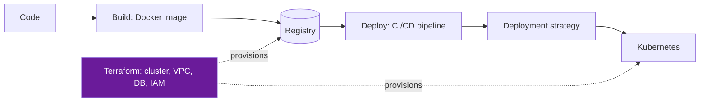

# Cloud

A cloud platform is just someone else's API for compute, network, and storage. The primitives repeat across AWS, Azure, and GCP; the interview-relevant skill is knowing **what each layer actually guarantees** and where it silently stops guaranteeing anything.

This section covers the layer *below* Kubernetes (how your code becomes a runnable artifact and how that artifact gets to production) rather than vendor consoles.

---

## The Path From Laptop to Production

Four questions map to four pages:

| Question | Page |
|----------|------|
| How does my code become a runnable, portable artifact? | [Docker](docker.md) |
| How does the infrastructure that artifact runs on get created, and stay reproducible? | [Terraform](terraform.md) |
| How does a commit turn into a running artifact, automatically and safely? | [CI/CD](cicd.md) |
| How does a new version reach users without an outage? | [Deployment Strategies](deployment-strategies.md) |
| How does the artifact actually run and stay healthy at scale? | [Kubernetes](../kubernetes/index.md) |

!!! tip "Mental model"
    **Docker** answers "what am I shipping." **Terraform** answers "what does it run on." **CI/CD** answers "how does it get there." **Deployment strategy** answers "how do users stop seeing the old version without seeing an outage." Interviewers who ask "walk me through your deploy pipeline" are really asking whether you can keep these four concerns separate — candidates who collapse them into "we use Kubernetes" get follow-up questions until the gaps show.

---

## Pages in This Section

| Page | Covers |
|------|--------|
| [Cloud Provider Comparison](providers.md) | **NEW** — AWS/GCP/Azure mental models; VPC & Auth as foundations; service mappings across providers |
| [Docker](docker.md) | Images vs. containers, layer caching, multi-stage builds, networking, volumes |
| [Terraform](terraform.md) | State, plan/apply, modules, drift, blast radius |
| [CI/CD](cicd.md) | Pipeline stages, artifact promotion, GitOps, security gates |
| [Deployment Strategies](deployment-strategies.md) | Rolling, blue-green, canary, and 12 more — with the failure each one buys you out of |
| [IAM & Managed Services](iam-managed-services.md) | Vendor-mapped IAM, managed DB, and event-bus comparison across AWS/GCP/Azure |
| [FinOps](finops.md) | Tagging, showback/chargeback, commitment models, rightsizing, cost anomaly debugging |
| [Kubernetes](../kubernetes/index.md) | Request path, probes, kubectl diagnosis |

[Cloud Provider Comparison](providers.md) is the entry point: it explains the mental model (VPC, Auth, then everything else is a derivative), maps AWS services to GCP/Azure equivalents, and teaches when to use each cloud.

**Next:** [Docker →](docker.md)
