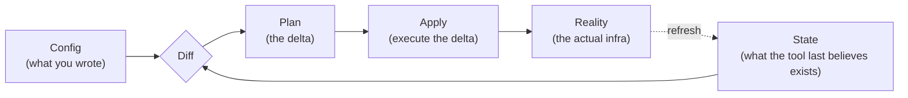

# Infrastructure as Code

!!! example "Hypothetical drift"
    An emergency console change fixes production and silently diverges from version control. The next deployment proposes to undo it. Infrastructure as code earns repeatability only when state, review, imports, and drift are part of the operating model.

**Prerequisites:** none strictly required.

[← Docker](docker.md) | [Next: Terraform →](terraform.md)

---

## Why This Exists

Before IaC, "provisioning" meant a runbook: a wiki page of steps someone follows by hand, or clicking through a cloud console. Both have the same failure mode — **the process lives in a person's head or a document, not in a system that can verify it ran correctly.** Two engineers following "the same" runbook produce two subtly different environments. Nobody can diff what changed between last Tuesday and today. Reproducing production in a new region means re-reading the wiki page and hoping nothing was missed.

**Infrastructure as Code (IaC) is the practice of defining infrastructure — servers, networks, databases, DNS records, IAM policies — as text, checked into version control, and applied by a tool rather than a person.** That's the whole idea. Terraform, Pulumi, CloudFormation, and Ansible are different implementations of it; the concepts below are what they all share, and what an interviewer is actually testing when they ask about any one of these tools.

---

## Declarative vs. Imperative

This is the single most important distinction in the space, and the one most candidates blur.

| | Imperative | Declarative |
|---|---|---|
| **You write** | Steps: "create a VPC, then create a subnet, then create an instance" | End state: "there should be a VPC with this subnet and this instance" |
| **The tool's job** | Execute your steps, in order, exactly as written | Figure out what steps get from *current state* to your *declared state* |
| **Re-running it** | Re-runs every step — often unsafe (tries to create the VPC again) unless you hand-write guards | Safe by default — the tool diffs current vs. desired and only changes what's different |
| **Examples** | A bash script calling `aws ec2 run-instances`; classic Ansible playbooks (though modules are often idempotent) | Terraform, CloudFormation, Pulumi (declarative resource model even though the *language* is imperative-looking code) |

!!! tip "Mental model"
    An imperative script is a recipe: "do this, then this, then this." A declarative config is a blueprint: "the finished building should look like this — you, the tool, figure out what to build, skip, or tear down to get there." The blueprint is safer to re-run because "re-running a blueprint" just means "check the building still matches it," not "build a second building on top of the first."

Most modern IaC tools are declarative specifically because infrastructure changes are rarely one-shot — you apply the same config dozens of times over a resource's life as it evolves, and imperative scripts get dangerous to re-run the moment they're not perfectly idempotent.

---

## Idempotency: The Property That Makes Re-Running Safe

**Idempotent** means: applying the same operation multiple times produces the same result as applying it once. `PUT /users/5 {name: "Sanket"}` is idempotent — run it 10 times, the user's name is still "Sanket." `POST /users {name: "Sanket"}` (create a new user) is not — run it 10 times, you get 10 users.

IaC tools are built around making infrastructure changes idempotent by construction:

```
Run 1: desired state (3 servers) vs current state (0 servers) → create 3
Run 2: desired state (3 servers) vs current state (3 servers) → no-op
Run 3 (someone deleted 1 by hand): desired (3) vs current (2) → create 1
```

This is *why* the declarative model matters in practice, not just in theory: a script that says "create 3 servers" is dangerous to re-run, but a declarative tool that says "there should be 3 servers" is safe to re-run as many times as you want — including in CI, on every merge, without anyone having to remember whether it already ran.

---

## The Reconciliation Loop

Every declarative IaC tool, underneath its specific CLI, is running the same loop:



Three things, always: **config** (your intent), **state** (the tool's memory of what it created), and **reality** (what's actually out there). A tool's whole job is reconciling these three. When they agree, there's nothing to do. When config and state disagree, there's a change to apply. When state and reality disagree, that's **drift** — something changed outside the tool's knowledge, and the next run has to decide what to do about it.

This three-way reconciliation is exactly what [Terraform](terraform.md)'s state file, [Kubernetes](../kubernetes/index.md)' controllers reconciling actual vs. desired pod count, and even a GitOps tool like ArgoCD watching a Git repo against a live cluster are all doing — the pattern generalizes past "cloud infrastructure" to any system that manages desired state against reality.

---

## The Tool Landscape

| Tool | Model | Scope | Where it's strong |
|---|---|---|---|
| **Terraform** | Declarative (HCL) | Multi-cloud, any provider with an API | The default for most teams — huge provider ecosystem, mature state model |
| **Pulumi** | Declarative resource model, imperative-looking code (Python/TS/Go) | Multi-cloud | Teams who want real programming constructs (loops, functions, types) instead of a DSL |
| **AWS CloudFormation / CDK** | Declarative (CFN) / imperative-looking code that compiles to CFN (CDK) | AWS only | Native AWS integration, no separate state backend to manage (AWS holds it) |
| **Ansible** | Primarily imperative playbooks, with many idempotent modules | Configuration management + provisioning | Config management (package installs, file templating) more than resource provisioning; agentless (SSH-based) |
| **Kubernetes manifests / Helm** | Declarative | Workloads *inside* a cluster, not the cluster's own infrastructure | The IaC layer one level up from Terraform — Terraform often provisions the cluster, manifests describe what runs on it |

The interview-relevant point isn't memorizing this table — it's being able to say *why* a team would pick one over another for a given constraint (multi-cloud vs. AWS-only, DSL vs. real programming language, needing agentless config management vs. resource provisioning).

---

## Mutable vs. Immutable Infrastructure

A second axis, orthogonal to declarative-vs-imperative, that IaC discussions often conflate with it:

- **Mutable infrastructure**: a server is provisioned once, then patched, updated, and reconfigured in place over its life (Ansible's classic use case — SSH in, apply changes to what's already running).
- **Immutable infrastructure**: a server is never modified after creation — a change means building a new image/instance and replacing the old one wholesale, rather than patching it.

IaC tools don't force one or the other, but the ecosystem has trended toward immutable: it sidesteps configuration drift entirely (there's nothing to drift — the running instance is exactly the image it was built from), at the cost of needing a fast, automated build-and-replace pipeline rather than a quick SSH patch. This is the same "start simple, add complexity only when forced" trade-off as everywhere else in this academy — mutable is simpler for a single server; immutable earns its keep once you have enough servers that "which ones drifted" becomes an unanswerable question by hand.

---

## Drift: Reality Diverging From State

Drift is what happens the moment someone (a human in a console, or an out-of-band script) changes something the IaC tool doesn't know about. It's not a Terraform-specific problem — it's inherent to the reconciliation model:

```
Declared: 3 servers, each with 4GB RAM
Someone manually bumps server #2 to 8GB during an incident at 2am
Reality now: 3 servers, one with 8GB
Next apply: the tool sees the diff and either reverts it (silently undoing the incident fix)
            or, if the config was updated to match, adopts it cleanly
```

The fix isn't a tooling feature — it's a discipline: **any manual change made under pressure needs a same-day follow-up to update the IaC config**, or the next scheduled apply reverts it without anyone connecting the dots. See [Terraform](terraform.md#drift) for exactly how this plays out with `terraform plan`.

!!! tip "Run it yourself"
    [`labs/terraform-docker`](https://github.com/sanketn26/interview-prep/blob/main/labs/terraform-docker) makes every concept on this page checkable with real Terraform against real Docker containers, no cloud account needed: idempotent re-apply (`plan` says "No changes"), drift (delete a container by hand, `plan` notices), and a real `-/+` forced replacement.

---

## Interview Questions

=== "Foundation"
    **Q: What does "idempotent" mean, and why does it matter for infrastructure tooling?**

    "Applying the same operation multiple times produces the same end state as applying it once. It matters because infrastructure changes get re-applied constantly — in CI on every merge, by a teammate re-running a script, after a failed partial apply gets retried. An imperative 'create a server' script run twice creates two servers; a declarative 'there should be one server' config run twice is a no-op the second time. Idempotency is what makes it safe to re-run a change without first checking whether it already happened."

=== "Senior"
    **Q: A teammate proposes replacing your team's Terraform setup with a bash script that calls the cloud CLI directly, arguing it's simpler and doesn't need a state file. What's your response?**

    "The bash script trades away exactly the properties that matter at scale: idempotency (the script has to hand-roll 'does this already exist' checks for every resource, or it's not safe to re-run), diffing (no `plan` — you find out what changed by reading the script and guessing, not by seeing a delta), and drift detection (nothing notices if reality diverges from what the script last created). For a single, rarely-changed resource, the script might genuinely be simpler. For anything a team touches regularly, the state-and-diff model is what prevents 'I re-ran the script and it did something unexpected' from being a recurring incident."

=== "Staff"
    **Q: Your org has infrastructure defined three different ways across teams — some Terraform, some CloudFormation, some hand-run scripts. How do you think about unifying it, and is unifying it even the right goal?**

    "I wouldn't start from 'pick one tool and migrate everything' — that's a multi-quarter project with high risk and unclear payoff if the different tools are each well-suited to what they're managing (CloudFormation for a team that's AWS-only and wants no separate state backend to run, Terraform for a team spanning multiple providers). I'd first ask what's actually causing pain: is it the tool diversity itself, or is it that the *hand-run scripts* are the real risk (no diff, no idempotency, no review trail) while the CFN-vs-Terraform split is mostly cosmetic? I'd prioritize getting everything onto *some* declarative, diffable, reviewable tool first — that's the property that actually prevents incidents — and treat consolidating onto a single tool as a separate, lower-urgency decision to make once the bigger risk (undeclared, unreviewable infrastructure) is gone."

---

## Key Takeaways

!!! success "Remember"
    1. **IaC is the concept; Terraform/Pulumi/CloudFormation/Ansible are implementations of it.** An interviewer asking about any one of these is usually testing whether you understand the concept underneath.
    2. **Declarative beats imperative for infrastructure specifically because changes get re-applied constantly** — idempotency is what makes re-running safe.
    3. **Every declarative tool runs the same reconciliation loop**: config vs. state vs. reality. Drift is what happens when state and reality disagree.
    4. **Mutable vs. immutable infrastructure is a separate axis** from declarative vs. imperative — immutable sidesteps drift entirely, at the cost of needing a fast rebuild-and-replace pipeline.
    5. **Tool choice follows constraints** (multi-cloud vs. single-cloud, DSL vs. real programming language, provisioning vs. configuration management) — there's rarely one universally-correct answer.

**Previous:** [Docker](docker.md) | **Next:** [Terraform](terraform.md)
