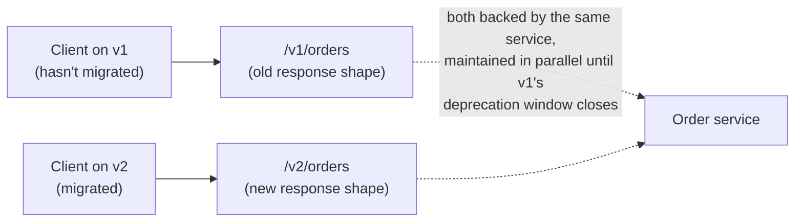

# Release Engineering — Versioning, Dependencies & Build Caching

**Prerequisites:** [CI/CD](cicd.md), [Docker](docker.md)

[← Cloud & Kubernetes](index.md)

---

## Why This Exists

[CI/CD](cicd.md) covers how a change moves from commit to production. This page covers three backend-engineering disciplines that sit underneath that pipeline and quietly determine whether it's trustworthy: **how you signal what a version actually changed** (semantic versioning, API versioning), **how you keep a build reproducible across machines and time** (dependency locking — what "dependency hell" actually is and how it's fixed), and **how you keep the pipeline fast enough that people don't start skipping it** (build caching). None of these are glamorous, and all three are the kind of thing a staff engineer gets asked about specifically because they're invisible until they're broken.

---

## Semantic Versioning: A Version Number as a Promise

Semantic versioning (`MAJOR.MINOR.PATCH`) isn't a counting convention — it's a **contract with everyone who depends on you**, and the contract is what makes it useful:

- **PATCH** (`1.2.3` → `1.2.4`): backward-compatible bug fix. A consumer can take this upgrade with zero code changes, always.
- **MINOR** (`1.2.3` → `1.3.0`): backward-compatible new functionality. Existing consumers are unaffected; nothing they already depend on changed shape.
- **MAJOR** (`1.2.3` → `2.0.0`): breaking change. A consumer's existing code may need to change to keep working.

**The entire value of the scheme is that a consumer can encode trust into their dependency constraint** — `^1.2.3` (accept any `1.x.x` at or above this) is a bet that the maintainer is telling the truth about what counts as breaking. The moment a maintainer ships a breaking change as a MINOR bump "because it was a small change," every downstream consumer's automated-upgrade assumption is now false, and that's a trust failure that costs the ecosystem, not just that one release.

!!! warning "The interview tell: 'small' and 'breaking' are not the same axis"
    Renaming a public function is a one-line diff and still a MAJOR change — the size of the code change and whether it breaks a consumer are unrelated. A candidate who says "it's a tiny change, patch bump is fine" for something that alters a public contract hasn't understood what the version number actually communicates.

---

## API Versioning: The Same Discipline, at a Network Boundary

API versioning is semantic versioning's problem restated for a boundary you can't force everyone to cross at once — a library's consumers pin a version in a lockfile and upgrade on their own schedule; an API's consumers are calling a live endpoint you don't control the timing of, so a breaking change to `v1` breaks every caller **the instant you deploy it**, not whenever they choose to upgrade.



The practical rule: **additive changes (a new optional field, a new endpoint) don't need a version bump — nothing that already worked stops working.** A genuinely breaking change (removing a field, changing a field's type or meaning, changing what a status code means) needs either a new version (`/v2/...` or a version header) run **in parallel** with the old one for a defined deprecation window, or — if you control every caller directly — a coordinated simultaneous migration, which is rare enough in practice that most real systems default to parallel versions.

This is the same discipline [Architecture Decision Records](../foundations/adrs.md) apply to a decision's reasoning, applied to an API's contract: **the cost of a breaking change without a version bump is paid by someone who didn't get a say in the decision** — the caller who wakes up to a broken integration. [Contract testing](../observability/testing-strategy.md) is the mechanism that catches this *before* it ships, on the provider's own side, rather than relying on version discipline alone.

---

## Dependency Hell and Lockfiles

"Dependency hell" is the specific failure where **the same source code produces a different build depending on when or where it's built**, because dependency version ranges resolved differently:

```
package.json says:  "left-pad": "^1.2.0"   (accept any 1.x >= 1.2.0)

Monday's build resolves:    left-pad@1.2.0
Thursday's build resolves:  left-pad@1.3.0   ← a new 1.x version was published,
                                                and it changed behavior in a way
                                                that wasn't actually backward-compatible
                                                (the semver promise was broken upstream)
```

Nothing in the source code changed between Monday and Thursday — only *which exact versions of dependencies* got resolved changed, because the version constraint was a range, not a pin. Transitive dependencies add another failure mode: if direct dependency `A` requires `lib ^1.0` while `B` requires `lib ^2.0`, the outcome depends on the ecosystem and resolver. It might reject the graph, install both versions side by side, or select one version according to ecosystem-specific rules. The important point is to inspect the resolved graph rather than assume every package manager handles conflicts the same way.

**The usual fix is a committed lockfile** (`package-lock.json`, `poetry.lock`, `Cargo.lock`) — it records the *exact* resolved version of every dependency, direct and transitive, at the moment it was generated, and subsequent frozen/locked installs use those versions instead of re-resolving the ranges. The version range in the manifest (`^1.2.0`) still governs what may be selected during a deliberate upgrade; the lockfile makes ordinary builds repeat that previously resolved graph.

Go uses a different model, and `go.sum` is not its lockfile. The selected module versions are recorded in `go.mod` (including indirect requirements needed to preserve the module graph), while `go.sum` records cryptographic checksums used to verify downloaded module content. Committing both files gives Go builds a selected graph plus integrity verification, but saying that `go.sum` pins the graph conflates those two jobs.

!!! tip "The interview tell"
    "We pin direct versions" is weaker than "we commit the ecosystem's complete resolution state." A direct pin may leave transitive selection unconstrained. In npm, Poetry, and Cargo that resolution state is a lockfile; in Go, selected versions are represented through `go.mod` and verified with `go.sum`. The durable principle is to commit the files the ecosystem uses to reproduce and verify the resolved graph.

---

## Build Caching: Not Re-Doing Work That Hasn't Changed

A build (compiling code, installing dependencies, running a Docker image build) is a DAG of steps, the same shape as the [batch pipeline DAG](../architecture-patterns/batch-etl-lambda-kappa.md) covered elsewhere — and like any DAG, **a step only needs to re-run if its inputs changed.** Build caching is keying each step's output by a hash of its inputs, and skipping the step entirely (reusing the cached output) when that hash matches a previous run.

```dockerfile
# Docker layer caching: each instruction is a layer, cached by the hash
# of the instruction + its inputs. Order matters — a layer's cache is
# invalidated the moment anything above it in the file changes.

FROM python:3.12-slim
COPY requirements.txt .
RUN pip install -r requirements.txt   # cached UNLESS requirements.txt changed
COPY . .                              # this layer changes on every code edit —
                                       # putting it BEFORE the pip install would
                                       # invalidate the expensive install step
                                       # on every single commit
```

The specific discipline that trips people up: **order steps from least-frequently-changing to most-frequently-changing.** Dependencies change rarely; application code changes on every commit. Copying source code before installing dependencies means the dependency-install layer's cache gets invalidated by *any* code change, even though the dependencies themselves didn't move — turning a 2-second cached step into a 3-minute reinstall, on every single build, for no reason tied to what actually changed.

This same principle scales up to CI pipeline caching generally — caching a language's dependency directory (`node_modules`, `~/.m2`, `~/.cargo`) keyed by a hash of the lockfile means a pipeline run only pays the install cost when the lockfile itself changed, not on every run regardless.

---

## Cron Jobs vs. Event-Triggered Scheduling

Worth a short, explicit callout since it's an easy default that isn't always the right one: **cron is "run this at a fixed time, regardless of whether anything changed,"** which is the right model for genuinely time-based work (a nightly report, a certificate-renewal check) but the wrong model for work that's actually reacting to an event (process a new file, react to a state change) — that's better modeled as event-triggered (a queue consumer, a webhook, a file-arrival trigger), because cron reacting to "did something happen" means either polling on a schedule (wasted work most cycles, and latency bounded by the poll interval) or accepting up-to-a-full-interval delay before the reaction happens at all. A distributed system with many independent cron-scheduled jobs also has its own failure modes worth naming — missed runs if the scheduler itself was down at trigger time, and no natural retry/backoff the way a queue consumer gets for free — which is exactly why systems with real scheduling needs beyond "just run this nightly" reach for a dedicated distributed job scheduler (see [Distributed Job Scheduler](../system-design-exercises/distributed-job-scheduler.md)) rather than a fleet of independent cron entries.

---

## Interview Questions

=== "Foundation"
    **Q: What problem does a lockfile solve that a version range in the manifest doesn't?**

    "A version range like `^1.2.0` says 'any compatible version is fine,' which means the exact version resolved can differ between builds if a new compatible version was published in between — the same source can produce a different build depending on when it's built. In ecosystems that use lockfiles, the lockfile records the exact resolved dependency graph, and frozen/locked installs reuse it instead of resolving the ranges again. The manifest still governs deliberate upgrades; the committed lockfile makes ordinary builds repeat the selected graph. Ecosystem details matter: in Go, selected versions live in `go.mod`, while `go.sum` verifies module content rather than locking versions."

=== "Senior"
    **Q: A Docker build that used to take 20 seconds now takes 3 minutes on every commit, even for one-line code changes. What's the likely cause?**

    "Almost certainly a layer ordering problem — if the dependency-install step comes after the application code is copied into the image, then every code change (even a one-line one) invalidates that layer's cache, because Docker invalidates a layer and everything after it the moment anything in that layer's inputs changes. The fix is reordering the Dockerfile so dependency manifests are copied and installed before the application code — that way the expensive install step stays cached across commits that don't touch dependencies, and only actually re-runs when the dependency manifest itself changes."

=== "Staff"
    **Q: Your org ships a public API used by dozens of external partners. How do you introduce a genuinely breaking change without an incident?**

    "First I'd confirm it's actually breaking and not something that can be made additive instead — a new optional field or a new endpoint doesn't need a version bump at all, and a lot of 'breaking changes' turn out to be avoidable with a slightly different design. If it's genuinely breaking, I'd run the new version in parallel with the old rather than replacing it in place — `/v2` alongside `/v1` — because external partners aren't on a schedule I control, and a breaking change deployed in place breaks every caller the instant it ships, with zero warning.

    I'd set an explicit deprecation window for `/v1`, communicated to partners with enough lead time to migrate on their own schedule, and instrument `/v1` traffic so I know which partners haven't migrated as the window closes rather than finding out when I actually remove it. I'd also push for contract tests from any partner willing to adopt them, so a change that's *supposed* to be additive but accidentally isn't gets caught in our own CI before it reaches anyone's production traffic, rather than relying purely on version discipline to prevent that class of mistake."

---

## Key Takeaways

!!! success "Remember"
    1. **Semantic versioning is a promise to consumers, not a counting convention** — the size of a code diff and whether it breaks a caller are unrelated axes; a one-line rename can still be a MAJOR change.
    2. **API versioning is the same discipline at a network boundary you don't control the timing of** — a breaking change without a parallel version breaks every caller the instant it deploys, with no upgrade window.
    3. **Dependency hell is "same source, different build" caused by version ranges re-resolving differently over time** — a committed lockfile, not just pinning direct dependencies, is what actually fixes it.
    4. **Build caching only works if steps are ordered least-to-most-frequently-changing** — copying source before installing dependencies invalidates the expensive step on every commit, for no reason tied to what changed.
    5. **Cron is for genuinely time-based work; event-triggered scheduling is for work reacting to something happening** — using cron for the latter means either wasted polling or bounded-by-interval latency.

**Back to:** [Cloud & Kubernetes](index.md)
