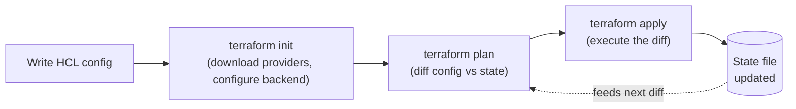
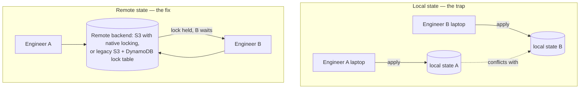

# Terraform

**Prerequisites:** none strictly required.

[← Docker](docker.md) | [Next: CI/CD →](cicd.md)

---

## Why This Exists

Infrastructure used to mean clicking buttons in a cloud console. The problem with that model isn't that it's slow — it's that **the console has no diff.** Nobody can tell you what changed, who changed it, or how to reproduce it in a second region. Terraform's entire value is turning infrastructure into a text file: reviewable in a pull request, diffable, and re-appliable.

The interview-relevant skill isn't HCL syntax. It's understanding **state** — the thing that makes Terraform dangerous when mishandled and powerful when respected.

!!! tip "Mental model"
    Terraform's job is to reconcile three things: your **config** (what you wrote), the **state file** (what Terraform last believes exists), and **reality** (what the cloud provider actually has). By default, `plan` first *refreshes* — it queries the provider for each tracked resource's real, current attributes and reconciles that into its working copy of state — and only then diffs config against that refreshed state to show you the delta before touching anything. So if someone deletes a resource by hand in the console, a normal `plan` *will* notice: the refresh sees it's gone and the plan proposes to recreate it. What refresh cannot do is discover resources nobody told Terraform about — anything created outside config and never imported stays invisible, and `-refresh=false` skips this step entirely and diffs against last-known state as-is.

---

## The Core Workflow



- **`init`** — downloads provider plugins, sets up the backend (where state lives). Run once per config change, safe to re-run.
- **`plan`** — a dry run. Read it like a code review: `+` create, `~` update in place, `-/+` destroy-and-recreate. **`-/+` is the line that causes outages** — it means the resource can't be updated, only replaced, which for a database means data loss unless you've planned for it.
- **`apply`** — executes the plan. Never `apply` without having read the `plan` output first; `-auto-approve` in a human's terminal is how "add a tag" becomes "recreate the load balancer."
- **`destroy`** — tears down everything Terraform manages in that state. One command, entire environment — treat it with the same caution as `DROP DATABASE`.

---

## State: The Part That Actually Matters

The state file is Terraform's memory — a JSON record mapping your config's resource names to real-world resource IDs, plus every attribute Terraform knows about them. Lose it, and Terraform has no idea what it created; it will try to create everything again, colliding with resources that already exist.

**Why this becomes a production incident:** state files by default live on local disk. Two engineers running `terraform apply` from their own laptops each have their own local state file — the files themselves never touch or overwrite each other, since they're just separate files on separate machines. The actual damage happens against the **real infrastructure**, independently of the state files ever colliding: Engineer A applies, creates resource X, and their local state now reflects that. Engineer B's local state has no idea X exists — B's `plan` sees a gap between their (stale) state and their config, and `apply` can create a *second* copy of X, or, if B's config happened to reference the same resource name/identity, attempt to modify or destroy what A just created. Either way you end up with duplicated resources nobody has a single source of truth for, or one engineer's work getting silently clobbered by the other's apply — not because the state files overwrote each other, but because two independent, out-of-sync beliefs about reality both got to act on that same reality.



The fix: a **remote backend** (S3, Terraform Cloud, GCS) that both centralizes the state file and provides **locking** — a second `apply` blocks while one is in flight, instead of racing it. Historically, S3-backed locking required a separate DynamoDB table (`dynamodb_table` in the backend config) to hold the lock, since S3 itself had no native compare-and-swap primitive. Terraform 1.10+ added **native S3 locking** using S3's own conditional-write support, so a DynamoDB table is no longer required for new S3 backends — treat the S3+DynamoDB pairing as the legacy pattern you'll still encounter in existing infrastructure, not the current recommended default for a fresh setup.

!!! warning "Production trap"
    State files contain resource attributes in plaintext, including things like initial database passwords set via a resource argument. A local or improperly-permissioned remote state file is a secrets leak waiting to be discovered. Restrict who can read the state backend the same way you'd restrict who can read a secrets manager.

---

## Variables, Outputs, and Modules

**Variables** parameterize a config so the same code runs against dev/staging/prod without copy-paste:

```hcl
variable "instance_count" {
  type    = number
  default = 2
}

resource "aws_instance" "web" {
  count = var.instance_count
  # ...
}
```

**Modules** are reusable, versioned bundles of resources — think of them as functions for infrastructure. A `vpc` module that takes a CIDR block and returns subnet IDs means five teams stop hand-rolling five slightly-different, unaudited VPC configs:

```hcl
module "vpc" {
  source = "./modules/vpc"
  cidr_block = "10.0.0.0/16"
}

resource "aws_instance" "web" {
  subnet_id = module.vpc.public_subnet_ids[0]
}
```

Terraform builds a **dependency graph** from these references automatically — it knows `aws_instance.web` needs `module.vpc` to exist first, without you writing an explicit ordering.

---

## Blast Radius and Workspaces

The single biggest design mistake in Terraform usage isn't syntax — it's **one giant state file for the entire org.** A typo in the networking module's `plan` now threatens to touch the database, the cache cluster, and the load balancer in the same `apply`, because they all live in one state.

| Structure | Blast radius | Trade-off |
|-----------|--------------|-----------|
| One state, everything | Entire org, one bad apply | Simple to start, terrifying at scale |
| One state per environment (dev/stage/prod) | One environment | Still couples unrelated services within an env |
| One state per service/component | Just that component | More moving parts, but a bad `plan` can only hurt one thing |

**Workspaces** let one config target multiple environments with separate state, but they're not a substitute for splitting state by blast radius — a workspace-per-environment setup with one giant shared config still means every service in that environment shares a lock and a failure domain.

---

## Drift

Drift is reality diverging from state — someone (or some other automation) changed a resource outside Terraform. `terraform plan` surfaces it as an unexpected diff on the next run; `terraform apply` will then either revert the manual change or, worse, attempt to reconcile in a way nobody predicted.

!!! warning "Production trap"
    An on-call engineer manually bumps an instance's memory in the AWS console during an incident — the fastest fix available at 2am. Nobody removes that from Terraform's mental model. Next scheduled `apply` reverts the fix, silently, days later, and the incident recurs with no clear trigger. The rule: any manual change made under pressure needs a same-day follow-up to update the Terraform config, or it will get reverted by the next apply.

---

## Trade-offs

| Choice | Win | Cost |
|--------|-----|------|
| Remote state + locking | Safe for teams | Extra infra to stand up and secure (the backend itself) |
| One state per service | Small blast radius | More repos/dirs, cross-references need remote state data sources |
| Modules for everything | Consistency, less copy-paste | Indirection — reading "what does this actually create" takes longer |
| `-auto-approve` in CI | Fast pipelines | No human review checkpoint before infra changes apply |
| Managed infra via console "just this once" | Fast in an emergency | Drift; reverted by the next apply unless the config is updated too |

---

## Interview Questions

=== "Foundation"
    **Q: What happens if you lose the state file?**

    "Terraform loses its map from config to real-world resource IDs. The next `plan` sees no state and will propose creating everything from scratch, which collides with resources that already exist — you'd get 'already exists' errors, or worse, orphaned duplicate resources if the provider allows the name collision. Recovery is `terraform import` per resource, which is why remote state with versioning (S3 with versioning enabled, or Terraform Cloud) is the default posture, not an afterthought."

=== "Senior"
    **Q: `terraform plan` shows `-/+` on your production database instance. What do you do?**

    "Stop — that's destroy-and-recreate, not update-in-place, and for a stateful resource that likely means data loss. I'd find which attribute forced replacement — some attributes are immutable post-creation and any change to them forces recreation. Then I'd check if there's a non-destructive path (a separate migration, `lifecycle { create_before_destroy = true }` plus a manual data migration, or reverting the change and doing it a different way). I would not apply a `-/+` on stateful infra without an explicit data migration plan reviewed separately from the Terraform change itself."

=== "Staff"
    **Q: Every team at your company has their own Terraform state, own module conventions, and own CI wiring. Onboarding a new service takes two weeks just for infra. What do you change?**

    "This is a platform problem, not a Terraform problem. I'd build a small number of opinionated, versioned modules (VPC, service-on-K8s, managed DB) that encode the org's security and networking defaults, published to an internal registry. Teams consume modules, they don't write raw resources for common patterns. I'd pair that with a standard CI pipeline template (plan on PR, apply on merge, mandatory review for `-/+` diffs) so 'set up infra for a new service' becomes filling in a module call, not writing HCL from scratch. The goal is that the safe path and the fast path are the same path."

---

## Key Takeaways

!!! success "Remember"
    1. Terraform reconciles **config vs. state vs. reality** — drift is what happens when state and reality disagree
    2. Local state + multiple engineers is a race condition; remote state with **locking** is the fix
    3. `-/+` in a plan means destroy-and-recreate — read every plan before applying, especially on stateful resources
    4. Blast radius is a design choice: split state by service/environment, don't run one state for the whole org
    5. Manual "just this once" console changes get reverted by the next `apply` unless the config is updated same-day
    6. Modules are the reuse mechanism — they also enforce the org's defaults if the platform team owns them

**Previous:** [Docker](docker.md) | **Next:** [CI/CD](cicd.md)
