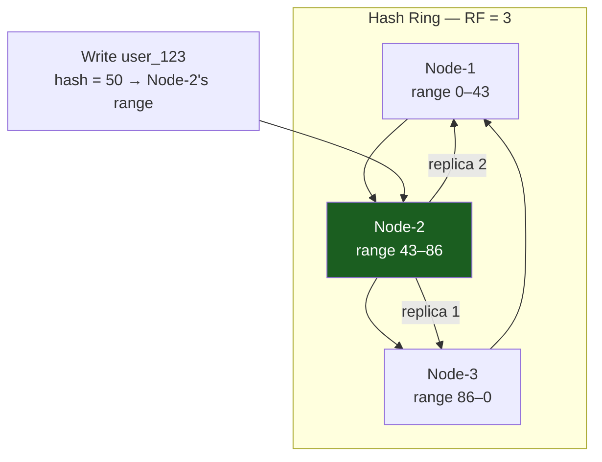
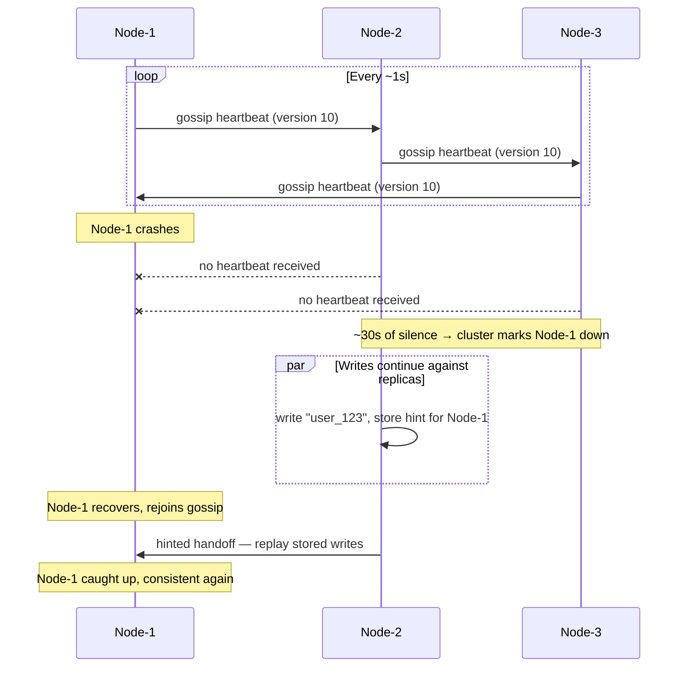

# Cassandra Deep Dive: Distributed at Massive Scale

Cassandra is the **peer-to-peer distributed database** for when you need to write 1M+ events/second across multiple data centers and still maintain availability during outages.

---

## Why Cassandra

Cassandra trades **query flexibility for write scale and availability**:

| Goal | Cassandra | Postgres |
|---|---|---|
| **Write throughput** | 1M+ ops/sec per cluster | 10K ops/sec per machine |
| **Availability** | Single node failure ≈ invisible | Single node failure = read replicas only |
| **Query flexibility** | Only queries you designed indexes for | Full SQL, joins, complex filtering |
| **Consistency** | Tunable (eventual → strong) | Strong (ACID) |

Cassandra shines when: **you write tons, rarely update, and read by known key**.

---

## Part 1: Peer-to-Peer Architecture

### No Single Leader

Unlike PostgreSQL (primary + replicas) or MongoDB (shard leaders), Cassandra has **no leader**. Every node is equal:

```
Node-1 ←→ Node-2
  ↑         ↓
  └─ Node-3 ┘

All nodes accept writes
All nodes accept reads
No election, no failover complexity
```

### Consistent Hashing

Data is distributed via consistent hashing:

```
Ring (0 to 2^128):
             Node-1 (range: 0 to 43)
            /                    \
   Node-3                        Node-2
  (range:                      (range:
   86 to 0)                     43 to 86)

Write key: "user_123"
hash("user_123") = 50 → falls in Node-2's range → Node-2 stores it

Add Node-4 to cluster:
  Splits Node-1's range (0 to 43)
  Only data in the new range migrates; others unaffected
```

**Production benefit**: Adding capacity doesn't require stopping the cluster or reshuffling all data.

### Replication

Data is replicated across N nodes (replication factor, typically 3):

```
Replication Factor = 3
Write "user_123" to Node-2:
  → Node-2 (primary)
  → Node-3 (replica 1)
  → Node-1 (replica 2)

Now any of the 3 nodes can serve reads. If Node-2 crashes:
  → Node-3 and Node-1 still have the data
  → No data loss
```



**Cassandra is leaderless — there is no "primary" node for a key.** Two separate roles are easy to conflate here:

- The **coordinator** is whichever node the *client happens to connect to* for this particular request — any node in the cluster can act as coordinator for any key, purely based on which node the client's driver picked. It has nothing to do with where the data lives.
- The **replicas** for a key are determined by the replication strategy (e.g. `SimpleStrategy` or `NetworkTopologyStrategy`) walking clockwise from the key's hash position on the ring — `user_123` hashes into Node-2's range, so Node-2 owns the "first" replica by ring position, and replicas 2 and 3 land on Node-3 and Node-1 by the same clockwise rule consistent hashing uses everywhere.

If the client happens to connect to Node-2 for this request, Node-2 is acting as *both* coordinator and a replica — but that's incidental, not structural. If the client instead connects to Node-1 (which isn't even a replica-by-ring-position beyond being replica 2 here, or could be a totally unrelated node in a larger cluster), Node-1 becomes the coordinator: it forwards the write to all three replicas, collects acknowledgments per the consistency level, and returns to the client — without ever being "the primary." This leaderless coordinator/replica split is precisely what gives Cassandra no single point of failure for writes to any given key.

---

## Part 2: Quorum Consistency

Cassandra's secret: **tunable consistency via quorum**.

### Read/Write Quorum

```
Replication Factor = 3

Write with consistency level QUORUM:
  quorum = 3 / 2 + 1 = 2
  → Write waits for ACK from 2 of 3 nodes
  → Fast (doesn't wait for all replicas)
  → Durable (majority has data)

Read with consistency level QUORUM:
  → Query 2 of 3 nodes
  → Return latest version
  → Compare timestamps; return newest
```

### Read-Your-Writes Consistency

```
Write with CL=ALL (wait for all 3 replicas):
  → All 3 acknowledge before returning to client

Read with CL=ONE (read from any 1 node):
  → Can immediately read what you just wrote
  → Cost: might return stale data from other clients' writes
```

**Production pattern**:
```
Write: CL=QUORUM (balance speed and durability)
Read: CL=QUORUM (strong consistency) for critical reads
Read: CL=ONE (fast) for analytics/caching layers
```

### Consistency Level Trade-offs

| CL | Write Latency | Durability | Use Case |
|---|---|---|---|
| **ONE** | Lowest | Lowest | Analytics, cache layer |
| **QUORUM** | Medium | Strong | Operational data |
| **ALL** | Highest | Highest | Critical financial data |

---

## Part 3: Data Model (CQL)

Cassandra Query Language (CQL) is SQL-like but only for **queries you pre-designed**:

```sql
CREATE TABLE users (
  user_id UUID PRIMARY KEY,
  name text,
  email text,
  created_at timestamp
);

-- Create an index for email queries
CREATE INDEX ON users(email);

-- Query by primary key (fast)
SELECT * FROM users WHERE user_id = '123e4567...';

-- Query by indexed column (fast)
SELECT * FROM users WHERE email = 'alice@example.com';

-- Query without index (error or slow)
SELECT * FROM users WHERE name = 'Alice';  ← Bad! No index
```

### Partition Key vs Clustering Key

```sql
CREATE TABLE orders (
  user_id UUID,           -- partition key (determines which node stores data)
  order_id timeuuid,      -- clustering key (sorts data within partition)
  amount decimal,
  created_at timestamp,
  PRIMARY KEY ((user_id), order_id)
);

-- Fast: queries partition directly
SELECT * FROM orders WHERE user_id = '123' ORDER BY order_id DESC LIMIT 10;

-- Slow: scans all partitions
SELECT * FROM orders WHERE amount > 1000;  ← requires full table scan
```

### Wide Rows (Many Clustering Keys)

```sql
-- Store millions of time-series readings per sensor
CREATE TABLE sensor_readings (
  sensor_id UUID,           -- partition key
  reading_time timestamp,   -- clustering key (sorts by time)
  temperature float,
  humidity float,
  PRIMARY KEY ((sensor_id), reading_time)
);

-- sensor_id must be an actual UUID literal, not a bare integer;
-- now() specifically produces a timeuuid, not a timestamp — for a
-- `timestamp` column, use toTimestamp(now()) or pass an explicit
-- ISO-8601 value.
INSERT INTO sensor_readings (sensor_id, reading_time, temperature, humidity)
  VALUES (123e4567-e89b-12d3-a456-426614174000, toTimestamp(now()), 72.5, 45);
INSERT INTO sensor_readings (sensor_id, reading_time, temperature, humidity)
  VALUES (123e4567-e89b-12d3-a456-426614174000, toTimestamp(now()), 72.3, 45);
INSERT INTO sensor_readings (sensor_id, reading_time, temperature, humidity)
  VALUES (123e4567-e89b-12d3-a456-426614174000, toTimestamp(now()), 72.1, 45);
...
-- Millions of readings for this sensor, each indexed by timestamp

SELECT * FROM sensor_readings WHERE sensor_id = 123e4567-e89b-12d3-a456-426614174000 AND reading_time > '2024-01-01' LIMIT 1000;
-- Fast: queries one partition, scans by time range
```

---

## Part 4: Compaction (Garbage Collection)

Cassandra uses LSM trees (write optimized). Writes append to **MemTable** (in-memory), flushed to **SSTable** (on disk):

```
Write: INSERT user_id=1, name="Alice"
  ↓ (in MemTable in RAM)
MemTable fills up (after ~100s or when full)
  ↓ (flush to disk)
SSTable (immutable, sorted file on disk)

Read: SELECT * WHERE user_id=1
  → Check MemTable (newest)
  → Check SSTable-1, SSTable-2, ... (oldest)
  → Merge results (read amplification)
```

### Compaction

Cassandra **compacts** SSTables to reduce read amplification:

```
Before compaction:
  SSTable-1: [1,2,3]
  SSTable-2: [1,4,5]     (1 is newer version)
  SSTable-3: [2,6,7]     (2 is newer version)

Compaction merges all 3:
  SSTable-merged: [1,2,3,4,5,6,7]  (each key appears once, newest version)

Now reads hit fewer files.
Cost: I/O-intensive, typically scheduled off-peak.
```

**Compaction strategy impacts write throughput**:
- **Size-tiered**: quick compactions, slower reads
- **Leveled**: slower compactions, faster reads
- **Time-window**: good for time-series (data by date)

---

## Part 5: Gossip and Failure Detection

Nodes communicate via **gossip** (peer-to-peer heartbeats):

```
Node-1: "I'm alive, version 10"
Node-2: "Node-1 just sent me: version 10"
Node-3: "I heard Node-1 is at version 10"

Node-1 crashes:
  After ~30 seconds: no new gossip from Node-1
  Cluster marks Node-1 down
  Read/write requests route to replicas

Node-1 recovers:
  Gossip resumes
  Hinted handoff: replicas replay data written while Node-1 was down
```



### Hinted Handoff

When Node-2 is down, replicas write data locally with a hint "this is for Node-2":

```
Write "user_123" (replicas: Node-1, Node-2, Node-3)
Node-2 is down:
  → Write succeeds on Node-1 and Node-3
  → Node-1 or Node-3 stores hint: "this data belongs to Node-2"
  
Node-2 comes back online:
  → Node-1 and Node-3 send hints to Node-2
  → Node-2 catches up
  → Data is durable and consistent
```

---

## Part 6: Batch Operations and Latency

### Batch Writes

```cql
BEGIN BATCH
  INSERT INTO users VALUES (1, 'Alice');
  INSERT INTO users VALUES (2, 'Bob');
  UPDATE user_auth SET password = '...' WHERE user_id = 1;
APPLY BATCH;
```

Cassandra **batches are not atomic** (unlike transactions). Each statement executes independently. Use batches for:
- **Atomic updates to same partition**: guaranteed to be applied in order
- **Related updates to multiple partitions**: not atomic, use carefully

### Latency Trade-offs

```
Read latency (CL=ONE):
  P50: 5ms
  P99: 20ms
  P999: 100ms

Read latency (CL=QUORUM):
  P50: 8ms (wait for majority)
  P99: 40ms
  P999: 200ms

Read latency (CL=ALL):
  P50: 15ms (wait for all)
  P99: 100ms
  P999: 500ms (one slow replica holds everyone up)
```

**Production**: Use CL=QUORUM for most queries. CL=ALL is rarely worth the tail latency cost.

---

## Part 7: Operational Patterns

### Monitoring

Key metrics:

```
1. Cluster state: nodetool status
   Check: is any node down? All nodes in "UN" (up, normal)?

2. Commit log size: should be < 50MB (disk full risk)

3. Compaction backlog: if growing, compaction can't keep up
   → Reduce write rate or improve hardware

4. Read/write latency (percentiles, not averages)
   P99 and P999 matter more than P50
```

### Rolling Restarts

Upgrade Cassandra without downtime:

```
1. Stop Node-1 (cluster continues, replicas handle traffic)
2. Upgrade Node-1 (run migrations, etc)
3. Restart Node-1 (rejoin cluster, hinted handoff catches it up)
4. Repeat for Node-2, Node-3
5. Cluster never loses availability
```

### Nodetool Commands

```bash
# Check cluster state
nodetool status

# Repair consistency (critical! run periodically)
nodetool repair

# Compact SSTable
nodetool compact

# Flush MemTable to disk
nodetool flush
```

---

## Interview Scenarios

| Scenario | Answer |
|---|---|
| "How do we ensure data doesn't get lost during a node failure?" | "Replication factor = 3 (3 copies across nodes). Write consistency = QUORUM means 2 nodes ACK before returning. If 1 node dies, majority survives with all data. On recovery, hinted handoff replays missing writes." |
| "Why is latency P99 higher than P50?" | "Cassandra queries replica nodes; response time is max(replicas). If one replica is slow, the whole query is slow. This is why CL=ALL is bad for tail latency — one slow node blocks everyone." |
| "How do we handle hot partitions?" | "Cassandra doesn't have a great solution (unlike MongoDB). Options: 1) redesign the partition key to spread the hot value across multiple physical partitions — e.g. add a bucket/shard suffix to the partition key so what was one giant partition becomes N smaller ones, then fan out reads across the buckets, 2) cache hot data in Redis to absorb read load. Note: increasing replication factor does NOT help here — Cassandra sends every write to all RF replicas regardless of consistency level, so a higher RF means *more* total write work for a hot partition, not less; RF is about durability and read availability, not write load distribution." |
| "Should we use CL=ONE or CL=QUORUM?" | "QUORUM by default (balance). ONE for analytics/caching (speed). ALL almost never (tail latency). Measure your P99; if it's < acceptable, use ONE." |
| "How often should we repair?" | "Daily to weekly (nodetool repair). Cassandra's eventual consistency means undetected divergence can happen. Repair finds and fixes divergence. Missing repairs → data inconsistency over time." |

---

## Key Takeaways

- **Peer-to-peer: no leader, no election**. Availability is built-in.
- **Consistent hashing: adding nodes doesn't reshuffle all data**. Scaling is incremental.
- **Quorum consistency: W + R > N guarantees strong reads**. Tune for your latency needs.
- **LSM writes are fast**: append-only sequential I/O. Read amplification requires compaction.
- **Query flexibility is your tradeoff**: design your schema around queries, not data normalization.
- **Hinted handoff: keeps data durable during failures**. Nodes catch up automatically.
- **Repair is not optional**: run regularly to detect and fix data inconsistency.

