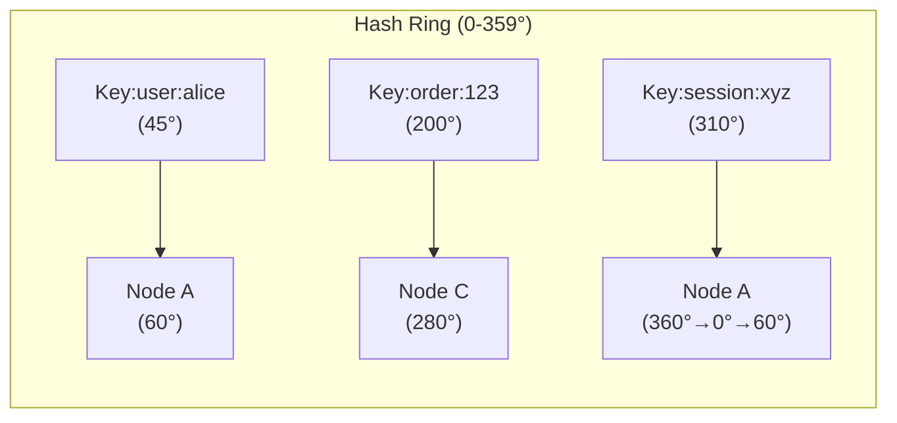

# Consistent Hashing

**Prerequisites:** [Database Sharding](sharding.md), Basic Hash functions

[← Database Sharding](sharding.md) | [Next: SQL vs NoSQL →](sql-vs-nosql.md)

---

## Why This Exists

Simple modular hashing (`node = hash(key) % N`) breaks when you add or remove nodes — almost **every key remaps** to a different node, causing a massive redistribution storm:

```
3 nodes: hash("user:alice") % 3 = 1 → Node 1
4 nodes: hash("user:alice") % 4 = 0 → Node 0  ← different!
```

If you have 1 TB of data across 3 nodes and add a 4th, you'd need to move ~750 GB of data.

Consistent hashing solves this: **only K/N keys need to move** when you add or remove a node (where K = total keys, N = number of nodes).

---

## Mental Model

Imagine a circular ring numbered 0–359 degrees. Both nodes and keys are hashed to positions on this ring. A key is owned by the **first node you encounter walking clockwise** from the key's position.

```
           Node A (60°)
         ↗
    Key3(45°)                Key1(120°)
                                    ↘
         ← ring →              Node B (150°)
    Key2(300°)
         ↖
           Node C (280°)
```

- Key3 → Node A (nearest clockwise at 60°)
- Key1 → Node B (nearest clockwise at 150°)
- Key2 → Node C (nearest clockwise at 280°)

When Node B is removed: only Key1 remaps to Node C. Everything else stays.

---

## Architecture



---

## Interactive Simulation

<div class="sim-container">
  <div class="sim-title">🔄 Consistent Hashing Ring</div>

  <div class="sim-controls">
    <button class="sim-btn success" onclick="window._ch && window._ch.addNode('N' + (window._ch.nodes.length+1))">+ Add Node</button>
    <button class="sim-btn danger" onclick="window._ch && window._ch.nodes.length > 1 && window._ch.removeNode(window._ch.nodes[window._ch.nodes.length-1].name)">− Remove Node</button>
    <button class="sim-btn" onclick="window._ch && window._ch.addKey('key:'+Math.random().toString(36).substr(2,5))">+ Add Key</button>
    <button class="sim-btn danger" onclick="if(window._ch){window._ch.nodes=[];window._ch.keys=[];['N1','N2','N3'].forEach(n=>window._ch.addNode(n));['user:alice','user:bob','session:xyz','order:123'].forEach(k=>window._ch.addKey(k));}">Reset</button>
  </div>

  <canvas id="ch-ring" style="width:100%;height:280px;"></canvas>

  <div class="sim-stats">
    <div class="sim-stat">
      <div class="sim-stat-label">Nodes</div>
      <div class="sim-stat-value" id="ch-nodes">3</div>
    </div>
    <div class="sim-stat">
      <div class="sim-stat-label">Keys</div>
      <div class="sim-stat-value" id="ch-keys">4</div>
    </div>
  </div>

  <div class="sim-log" id="ch-log"></div>
</div>

**Try:** Add a node → observe that only some keys remapped. Remove a node → only those keys moved to the next node clockwise.

---

## How It Works Internally

### Basic Implementation

```python
import hashlib
from bisect import bisect_right, insort

class ConsistentHashRing:
    def __init__(self, virtual_nodes: int = 150):
        self.virtual_nodes = virtual_nodes
        self.ring: dict[int, str] = {}   # position → node_name
        self.sorted_keys: list[int] = [] # sorted positions

    def _hash(self, key: str) -> int:
        return int(hashlib.md5(key.encode()).hexdigest(), 16) % (2**32)

    def add_node(self, node: str):
        for i in range(self.virtual_nodes):
            pos = self._hash(f"{node}:vnode:{i}")
            self.ring[pos] = node
            insort(self.sorted_keys, pos)

    def remove_node(self, node: str):
        for i in range(self.virtual_nodes):
            pos = self._hash(f"{node}:vnode:{i}")
            del self.ring[pos]
            self.sorted_keys.remove(pos)

    def get_node(self, key: str) -> str:
        if not self.ring:
            raise Exception("No nodes in ring")
        pos = self._hash(key)
        idx = bisect_right(self.sorted_keys, pos) % len(self.sorted_keys)
        return self.ring[self.sorted_keys[idx]]

# Usage
ring = ConsistentHashRing(virtual_nodes=150)
ring.add_node("cache-1")
ring.add_node("cache-2")
ring.add_node("cache-3")

print(ring.get_node("user:alice"))  # cache-2
print(ring.get_node("user:bob"))    # cache-1

# Add node — only ~33% of keys remapped
ring.add_node("cache-4")
print(ring.get_node("user:alice"))  # might change — but only ~25% probability
```

### Virtual Nodes

Without virtual nodes, nodes cluster unevenly — one might own 60% of the ring, another 10%. Virtual nodes fix this by placing **multiple copies** of each node at different positions:

```
Without virtual nodes (3 nodes):
  [Node A: 30°] [Node B: 120°] [Node C: 210°]
  Node A owns 90°, Node B owns 90°, Node C owns 180° ← uneven!

With 150 virtual nodes per physical node:
  Each physical node ~evenly distributed across the ring
  Std deviation of load: ~10% (vs 100%+ without)
```

Standard practice: **150–200 virtual nodes** per physical node.

---

## Rebalancing — Why It's the Part That Actually Matters

Consistent hashing gets talked about as if computing "which node owns this key" is the hard part. It isn't — that's a hash and a binary search. **Rebalancing is the hard part**: physically moving the data for those K/N keys to their new owner, while the cluster keeps serving reads and writes.

### What rebalancing actually involves

Adding a node doesn't just repoint lookups — every key that now maps to the new node still lives on its *old* node's disk until something copies it over. Until that copy finishes, you have to choose one of two bad-sounding options and make it not bad:

1. **Serve from the old owner until migration completes**, then cut over — simple, but the new node sits idle while doing this, and you need a way to know when a given key's migration is done.
2. **Dual-read/dual-write during the transition** — writes go to both old and new owner, reads check new-then-old (or vice versa) — handles in-flight traffic correctly but doubles write load on the affected key range for the duration.

Real systems (Cassandra, DynamoDB, Redis Cluster) use a variant of #2: a key range is marked "migrating," writes are dual-written, and a background process streams the bulk data across while a smaller "catch-up" pass handles anything written during the streaming window.

### Why this is "super important," not just a detail

- **Blast radius during the move.** The whole reason consistent hashing exists is to bound the blast radius of a topology change to K/N keys instead of nearly all of them. If rebalancing itself is not throttled and coordinated, you've reintroduced the exact failure mode consistent hashing was supposed to prevent — a burst of migration traffic that saturates the new node's disk/network and takes it down before it's even serving production reads.
- **It's not instantaneous.** For a node holding, say, 500 GB, moving its ~1/N share to a new peer over a 1 Gbps link is a multi-hour operation, not a config change. Anything that assumes rebalancing is atomic — a naive "just update the ring and move on" implementation — will serve wrong or missing data for every key mid-migration.
- **Uncontrolled rebalancing cascades.** If migration itself isn't rate-limited, the new node's disk I/O and network saturate, its read latency spikes, health checks start failing, and the orchestrator may conclude the *new* node is unhealthy and route around it — the exact opposite of the intended outcome.
- **Virtual nodes make rebalancing granular, not free.** Moving whole virtual nodes (each a fixed hash range, typically low tens of MB to a few GB) rather than the whole physical node's data is what makes it possible to throttle and checkpoint the migration — but the operator still has to actually rate-limit it; consistent hashing bounds *what* moves, not *how fast* it's safe to move it.

### A concrete throttled-rebalance walkthrough

```
Cluster: 3 nodes, 500 GB total data, adding a 4th node
Expected data movement: ~125 GB (1/4 of total) to the new node

Naive (unthrottled):
  New node receives 125 GB as fast as the network allows
  → saturates its NIC and disk, read latency on the new node spikes 10-50x
  → health checks start failing, orchestrator flags it unhealthy
  → migration aborts or restarts, no forward progress

Throttled (real-world):
  Migration capped at, say, 50 MB/s per virtual node,
  4-8 virtual node migrations running concurrently
  → ~125 GB / (50 MB/s × 6 concurrent) ≈ 7 minutes of *sustained* migration bandwidth,
    but spread so the node's read/write capacity for live traffic is never starved
  → each virtual node's migration is checkpointed — a restart resumes, doesn't restart from zero
```

The number to know for an interview: rebalancing bandwidth is a **deliberate trade-off between migration speed and live-traffic capacity**, not a fixed cost — and the right answer to "how fast should we rebalance" is "as fast as we can without starving production traffic," which requires the throttle to be tunable, not hardcoded.

---

## Realistic Example: Redis Cluster

Redis Cluster uses a variant — 16,384 **hash slots** (not a pure ring, but same concept):

```
key → CRC16(key) % 16384 → hash slot → node

Node 1: slots 0–5460
Node 2: slots 5461–10922
Node 3: slots 10923–16383
```

Adding a node: move some slots from existing nodes. No full rehash needed — Redis Cluster's `CLUSTER SETSLOT ... MIGRATING`/`IMPORTING` commands implement exactly the dual-state migration described above, one hash slot at a time, so the cluster keeps serving both old and new owners correctly mid-move.

---

## Failure Modes

### Hot Node Problem
If a few keys are extremely popular ("hot keys"), they all map to the same node — consistent hashing doesn't help here.

**Detection:** Per-node request rate diverges significantly from mean
**Fix:** Hot key replication (serve hot key from multiple nodes), application-level caching, key sharding (append random suffix `user:alice:0`, `user:alice:1`)

### Cascading on Node Loss
When a node dies, its keys fall to the next node. If that node is also at capacity, it overloads.

**Detection:** Node load spikes after peer failure
**Fix:** Replication (keys exist on N+1 nodes), autoscaling, capacity buffer

### Virtual Node Imbalance
Choosing too few virtual nodes → uneven distribution.

**Fix:** Use 150+ virtual nodes. Monitor per-node key distribution.

---

## Production Debugging

```
Symptom: One cache node is hot (high CPU/memory) vs peers

Diagnosis:
1. Check per-node key count → is distribution uneven?
   → redis-cli --cluster info
2. Check virtual node count → too few?
3. Check for hot keys → MONITOR command (careful: high overhead)
   → redis-cli --hotkeys (with LFU policy)
4. Check if a node recently failed → its keys fell on this node
   → check cluster event logs

Fix:
- Short-term: replicate hot keys, add suffix randomization
- Medium-term: increase virtual nodes, rebalance slots
- Long-term: identify hot key pattern, cache at CDN/application layer
```

---

## Scaling Limits

- Works well up to hundreds of nodes
- Virtual nodes add CPU overhead during lookup (binary search over sorted positions)
- Typical lookup: O(log(N × V)) where V = virtual nodes per node — negligible for reasonable N

---

## Trade-offs

| Dimension | Consistent Hashing | Modular Hashing |
|-----------|-------------------|-----------------|
| Key remapping on node add/remove | ~K/N keys | ~(N-1)/N × K keys |
| Implementation complexity | Medium | Low |
| Load balance | Good (with virtual nodes) | Perfect |
| Hot key handling | Doesn't help | Doesn't help |
| Used in | Redis Cluster, Cassandra, Memcached | Not used in distributed systems |

---

## Interview Questions

=== "Basic"
    **Q: What problem does consistent hashing solve?**

    "It solves the massive key remapping problem in distributed caches/databases when nodes are added or removed. With simple modular hashing (key % N), changing N from 3 to 4 remaps ~75% of all keys. Consistent hashing maps both keys and nodes to a ring — adding a node only affects the keys that fall between the new node and its predecessor, which is approximately K/N keys — a much smaller fraction."

=== "Senior"
    **Q: Why do we use virtual nodes in consistent hashing?**

    "Without virtual nodes, the hash function might place physical nodes unevenly around the ring — one node might own 60% of the ring. Virtual nodes solve this by giving each physical node multiple positions on the ring (typically 150–200). This distributes load evenly. It also means when a node fails, its keys are distributed across *all* remaining nodes rather than falling entirely on one neighbor — which would overload it."

=== "Staff"
    **Q: When would you NOT use consistent hashing?**

    "When the access pattern is highly skewed — consistent hashing distributes keys evenly but doesn't help with hot keys. A single viral post getting 1M reads/second always maps to the same node regardless of ring distribution. In that case you need hot-key replication, CDN caching, or application-level disaggregation. Also, for small datasets where the simplicity of modular hashing (or just a single node) outweighs the operational complexity. And when you have strict ordering requirements — consistent hashing makes no ordering guarantees across nodes."

---

## Key Takeaways

!!! success "Remember"
    1. Consistent hashing maps both keys and nodes to a ring; keys route to the next clockwise node
    2. Adding/removing a node remaps only K/N keys, not all keys
    3. Virtual nodes (150–200 per physical node) ensure even load distribution
    4. Rebalancing is the part that actually matters operationally — throttled, checkpointed migration (dual-read/dual-write) is what keeps K/N keys moving from becoming a self-inflicted outage
    5. Hot keys require separate solutions — consistent hashing doesn't help
    6. Used in: Redis Cluster (hash slots), Cassandra (vnodes), Memcached, CDN routing

