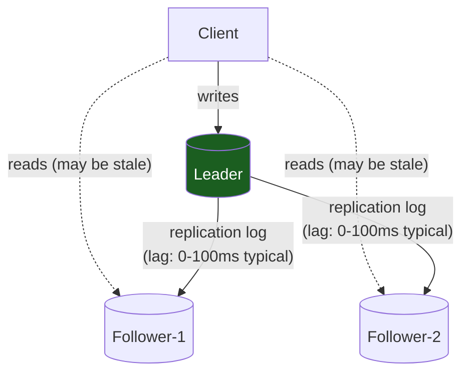
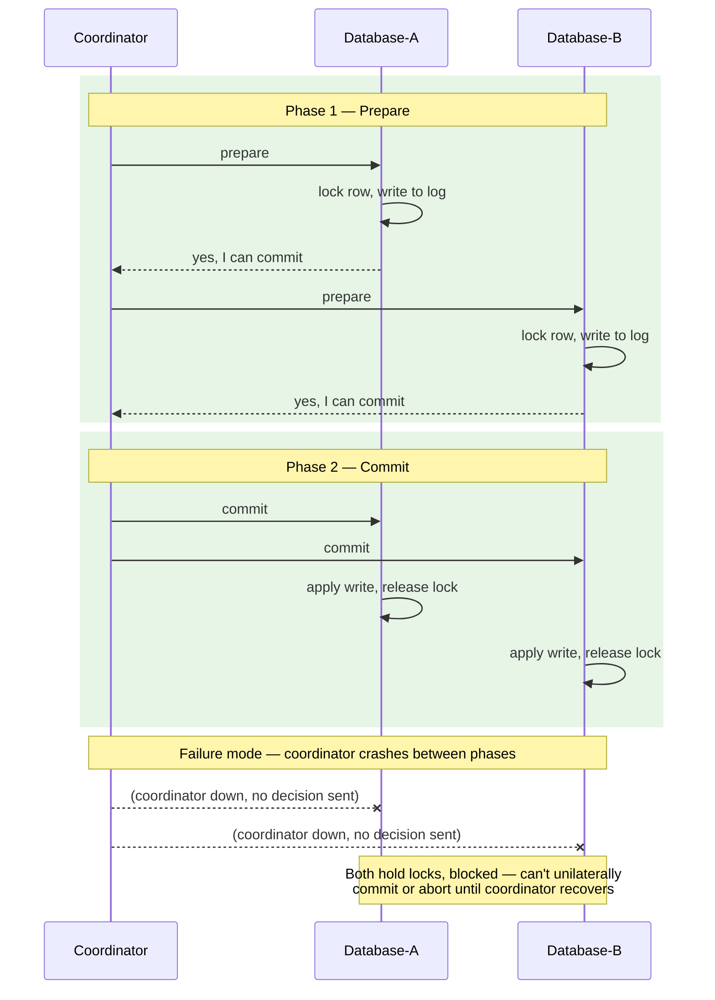
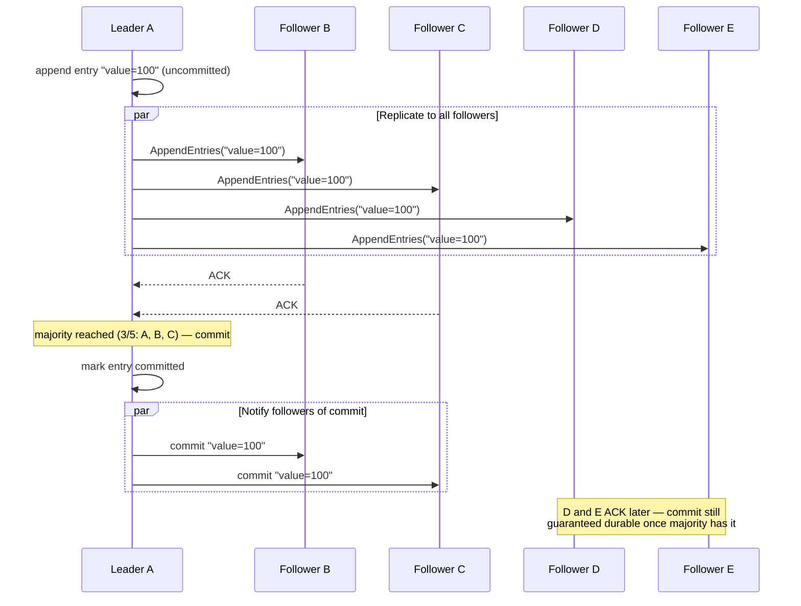

# DDIA Concepts: Foundation for All Database Systems

This page distills the critical concepts from *Designing Data-Intensive Applications* by Martin Kleppmann that apply to **every** database system you will encounter in interviews and production.

---

## Why This Matters

Most database problems in production trace back to one of five core issues:

1. **Storage** — How does a single node lay out data on disk so reads and writes are both fast?
2. **Replication** — How do we keep data consistent across multiple machines?
3. **Partitioning** — How do we distribute data when it no longer fits on one box?
4. **Transactions** — How do we guarantee correctness when multiple clients are writing simultaneously?
5. **Consistency Models** — What guarantees can we actually make, and which are illusions?

Understanding these **transfer across every database**: PostgreSQL, MongoDB, Cassandra, DynamoDB, Redis. The mental model is the same; the implementation details differ. Each part below builds intuition by first showing what breaks *without* the mechanism, then how the mechanism fixes it — that's the derivation the book itself uses, and it's what makes the answer stick in an interview instead of sounding memorized.

Parts 0–9 build the mental model. **[Part 10](#part-10-the-war-room-what-you-actually-do-at-3-am) is different on purpose** — it's not concepts, it's the runbook: what a real incident looks like on a dashboard, what to check first, and what *not* to do under pressure. That's the part of DDIA that's genuinely hard to find anywhere else — read it even if you skim the rest.

---

## Part 0: Storage Engines — What Happens When You Write a Row

Before replication or partitioning matter, a single database has to answer a simpler question: *how does it store data on disk so both reads and writes are fast?* Every database you'll ever discuss in an interview picks one of two fundamentally different answers.

### The Naive Baseline: An Append-Only Log

The simplest possible database is a text file you append to:

```
db_set() {
  echo "$1,$2" >> database.txt
}
db_get() {
  grep "^$1," database.txt | tail -1 | cut -d, -f2
}
```

**Writes are O(1)** — just append. **Reads are O(n)** — scan the whole file. This is fast to write, catastrophic to read from once the file has millions of rows. Every real storage engine is a strategy for making reads fast without giving up cheap writes. There are two schools of thought.

### B-Trees: Optimize for Reads, Update in Place

A B-tree keeps data in fixed-size pages (e.g. 4 KB) arranged in a tree, sorted by key. To find a row, you walk down the tree — a handful of page reads even for billions of rows (branching factor of a few hundred keeps the tree only 3-4 levels deep).

```
                  [ 50 | 150 ]
                 /      |      \
          [1..49]   [51..149]  [151..∞]
```

**Write path**: find the leaf page the key belongs to, and overwrite it in place on disk.

```
UPDATE users SET name = 'Alice' WHERE id = 42;
  → locate the exact 4KB page containing id=42
  → modify that page in memory
  → write the whole page back to the same disk location
```

**The catch**: overwriting a page in place, mid-write, if the machine crashes, corrupts the page — you're left with a mix of old and new bytes. B-trees solve this with a **write-ahead log (WAL)**: every modification is appended to a log *before* touching the tree page. Crash recovery replays the WAL.

```
1. Append to WAL: "about to change page 7823 from X to Y"
2. Overwrite page 7823 on disk
3. Crash between step 1 and 2? Replay WAL on restart → finish the write
```

**Used by**: PostgreSQL, MySQL (InnoDB), SQLite, most traditional RDBMSs.

**Trade-off**: One write to a row can mean multiple random disk writes (the page, the WAL, and any index pages that also point to it). Random I/O is the enemy of throughput on spinning disks and, to a lesser extent, SSDs.

### LSM-Trees: Optimize for Writes, Never Update in Place

A Log-Structured Merge-tree never modifies data on disk. Instead:

```
Write path:
1. Write goes to an in-memory sorted structure (the "memtable") — fast, no disk I/O
2. Also appended to a WAL on disk for crash safety (memtable is in RAM, WAL is durable)
3. When memtable hits a size threshold, flush it to disk as an immutable sorted file (an "SSTable")
4. Old SSTables never change — new writes always go to a fresh memtable → new SSTable
```

```
Disk after a while:
  SSTable-1 (oldest, keys 1-1000, written first)
  SSTable-2 (keys 500-1500, written second, may overlap SSTable-1)
  SSTable-3 (keys 2-800, written third)
  memtable (in RAM, not yet flushed)
```

**Read path**: check the memtable first, then SSTables from newest to oldest, until the key is found. This is why reads can be slower — you might check several files for a key that doesn't exist.

```
GET user_42:
  Check memtable → miss
  Check SSTable-3 (newest) → miss
  Check SSTable-2 → miss
  Check SSTable-1 → found!
  (Bloom filters — see below — skip most of these misses in practice)
```

**Compaction**: a background process merges SSTables, discarding overwritten/deleted keys, so the number of files (and thus read cost) stays bounded.

```
SSTable-1: user_42 = "Alice"
SSTable-3: user_42 = "Alicia"  (newer, overwrites)
  ↓ compaction merges these
SSTable-1+3: user_42 = "Alicia"   (old value discarded)
```

**Bloom filters**: a probabilistic structure that answers "is this key *definitely not* in this SSTable?" in O(1), so most SSTables are skipped entirely on a read without doing disk I/O.

**Used by**: Cassandra, RocksDB, LevelDB, HBase, and as an option in many modern engines.

**Trade-off**: writes are sequential and cheap (great for write-heavy workloads); reads are more expensive (mitigated by bloom filters and compaction) and compaction itself consumes background I/O, which can cause latency spikes if it falls behind writes ("write stalls" — the write-heavy equivalent of replication lag piling up).

### B-Tree vs LSM-Tree: The Interview Answer

| | B-Tree | LSM-Tree |
|---|---|---|
| Write pattern | Random (overwrite in place) | Sequential (append-only) |
| Read pattern | Predictable, few page reads | May check multiple SSTables |
| Write amplification | Lower per-write, but WAL + page write | Higher (compaction rewrites data multiple times) |
| Best for | Read-heavy, mixed workloads | Write-heavy workloads (logging, time-series, event streams) |
| Examples | PostgreSQL, MySQL, SQLite | Cassandra, RocksDB, LevelDB |

**Interview signal**: "If a system is write-heavy (ingest pipelines, metrics, logs), I'd reach for an LSM-based store. If it's read-heavy with complex queries and needs strong secondary-index support, a B-tree engine like Postgres is usually the safer default."

---

## Part 1: Replication — Keeping Data in Sync

Replication answers: *"How do we copy data to another machine and keep both copies consistent?"*

### Leader-Follower (Primary-Replica)

The dominant replication model:

- **Leader** (primary): accepts all writes, applies them to its local storage
- **Followers** (replicas): receive a stream of write events, apply them
- **Reads**: can go to any replica; writes only to leader

```
Client writes: User(id=1, name="Alice")
    ↓
Leader: UPDATE users SET name = "Alice" WHERE id = 1
    ↓
Replication log sent to followers
    ↓
Follower-1: UPDATE users SET name = "Alice" WHERE id = 1  ← same order, same result
Follower-2: UPDATE users SET name = "Alice" WHERE id = 1  ← same order, same result
```

**Why this works**: All three machines apply the same writes in the same order → same final state.



**Replication lag** — the delay between leader applying a write and followers catching up — is your operational reality:

```
Time: 0ms
  Leader applies: INSERT order(id=1, amount=100)
  
Time: 50ms
  Client immediately reads from replica
  Replica hasn't caught up yet → sees old version (order doesn't exist)
  → "I just placed an order but I can't see it!"
```

This is **read-after-write inconsistency**, the most common replication problem.

**Solutions**:
- Read critical data from leader (write-heavy workloads: read from primary)
- Client-side timestamping: "read data as of timestamp T" (eventual consistency contract)
- Follower with guaranteed lag < 100ms (monitoring + alerts)

### Beyond Single-Leader: Multi-Leader and Leaderless

Single-leader is the default because it's the simplest model to reason about (one writer → no conflicts to resolve), but it isn't the only topology.

**Multi-leader replication**: more than one node accepts writes, and leaders replicate to each other.

```
Datacenter US: Leader-A accepts writes from US users
Datacenter EU: Leader-B accepts writes from EU users
Leader-A and Leader-B replicate to each other asynchronously

Why: writes don't cross an ocean before being acknowledged → lower latency per region
Cost: two users can edit the same record in different datacenters at the same time
```

```
Leader-A: user_1.email = "alice@new.com"     (t=100ms)
Leader-B: user_1.email = "alice@newer.com"   (t=101ms)
  ↓ replicate to each other
Conflict! Both changed the same field. Who wins?
```

This is the fundamental cost of multi-leader: you've traded "no conflicts" for "lower write latency," and now the database (or your application) needs a conflict resolution strategy — last-write-wins, merge functions, or surfacing the conflict to the user (think Git merge conflicts). This is exactly the problem CRDTs (Part 7) exist to solve automatically.

**Leaderless replication**: no leader at all. Clients write directly to multiple replicas and read from multiple replicas, relying on quorum overlap (Part 5) to stay consistent.

```
Client writes value=100 directly to nodes [A, B, C] (not through a leader)
  A: ACK, B: ACK, C: times out (down)
Client got 2/3 ACKs → treats write as successful (if W=2 was the requirement)

Client later reads from [A, C, D]
  A: value=100, C: (was down, hasn't recovered) stale, D: never got the write
  → majority-ish logic and read repair (Part 5) reconcile this
```

**Used by**: Cassandra, Riak, DynamoDB (leaderless-inspired). This is the replication model that quorum reads/writes (Part 5) and hinted handoff were actually designed for — single-leader systems don't need per-request quorum math because there's only ever one writer to agree with.

**Interview signal**: "Single-leader if you need simplicity and your write latency budget allows routing all writes to one region. Multi-leader if you have geographically distributed writers and can tolerate/resolve conflicts. Leaderless if you want no single point of failure for writes and can tune consistency per-request via quorum."

### Replication Lag: The Performance vs Consistency Trade-off

| Latency | Replicas Sync | Tradeoff |
|---------|---|---|
| **Async (fire-and-forget)** | Leader returns before replicas ACK | Low latency, high durability risk. Leader crashes → data loss. |
| **Semi-sync** | Leader waits for ≥1 replica, returns to client | Balanced. Leader crash loses only in-flight data. |
| **Sync** | Leader waits for all replicas | High latency. One slow replica blocks all writes. |

*Production rule*: async by default (speed matters), but monitor replication lag religiously. When lag > SLO threshold, alert oncall.

### Handling Replication Failures

When a follower falls behind (network partition, GC pause):

```
Leader:     [Write1] [Write2] [Write3] [Write4]
Follower:   [Write1] [Write2]  ← gap, lag = 2 writes
            
When follower reconnects:
1. Follower asks: "Where did I fall behind?"
2. Leader: "You're missing writes from offset 3 onward"
3. Follower: "Send me everything from offset 3"
4. Leader streams all changes
5. Follower replays them → catches up
```

If the leader crashes and you promote a follower to leader, that follower might be behind. **You chose to lose those unreplicated writes.** This is why async replication has durability risk: those writes exist nowhere else.

### Cascading Failures in Replication

```
Writes are slow (200 ms). Replicas accumulate lag.
  → One replica falls so far behind it disconnects
  → All reads are now served by fewer replicas
  → Each replica gets more load
  → They get slower
  → More fall behind
  → Cascading failure: you end up reading only from leader
```

This is why monitoring replication lag isn't optional.

---

## Part 2: Partitioning (Sharding) — Splitting Data Across Machines

Replication solves **redundancy** (data available on multiple machines). Partitioning solves **scale**: data too large for one machine.

### The Core Problem

```
Dataset: 10 TB
One machine can hold: 2 TB
Solution: 5 machines, 2 TB each
Problem: How do we decide which data goes on which machine?

If partition scheme is wrong:
  - Machine 1: 100 GB
  - Machine 2: 100 GB
  - Machine 3: 9,700 GB  ← hotspot, takes all the queries
```

### Partition by Range

```
User IDs 1-1M → Machine A
User IDs 1M-2M → Machine B
User IDs 2M-3M → Machine C
...
```

**Pros**: Range queries are efficient ("get all users 1M-1.5M" = single machine).

**Cons**: If your keys aren't uniformly distributed, you get hotspots.

```
US users: 500M
European users: 100M
Asian users: 50M

If partitioned by geography:
  US partition gets hammered
  Europe and Asia partitions sit idle
```

### Partition by Hash

```
hash("user_" + user_id) % num_machines = partition
hash("user_1") % 5 = 2 → Machine C
hash("user_2") % 5 = 1 → Machine B
hash("user_1000000") % 5 = 4 → Machine E
```

**Pros**: Distributes load evenly; hotspots become extremely unlikely (even for celebrity users like Elon Musk).

**Cons**: Range queries are lost. "Get all users in range 1M-2M" now requires querying all machines.

```
SELECT * FROM users WHERE id BETWEEN 1000000 AND 2000000;
↓
Single partition (range): 1 machine queried
↓
Hash partition: All 5 machines queried in parallel, results merged
```

**Real cost**: If this is a common query pattern, you're paying for partitioning in latency.

### Consistent Hashing

Standard modulo hashing has a fatal flaw: **adding or removing a machine rehashes everything**.

```
5 machines, user 1000 maps to: hash(1000) % 5 = 2
Add machine 6: hash(1000) % 6 = 0  ← different machine! Must move all data.
```

Consistent hashing solves this:

```
Imagine a clock face (0 to 2^32).
Each machine claims a range on the clock.

User 1000: hash(1000) = 1,000,000,000 → falls in Machine-B's range
Add Machine-F: claims a new range
  Only data in Machine-F's range moves; others unaffected.
```

**Production impact**: Consistent hashing lets you add/remove partitions with minimal reshuffling. Without it, scaling is a full rewrite.

### Hot Partitions (Hotkeys)

Even with hash partitioning, you can get hotspots from data, not distribution:

```
Celebrity user (100M followers) posts → 100M writes to one partition
All other users' partitions sit idle
```

**Solutions**:
- **Separate hot data**: Detect celebrity users, split their writes across multiple partitions with a suffix:
  ```
  partition_key = "user_" + user_id + "_" + random(0, 100)
  Elon Musk writes → "user_1_42", "user_1_87", "user_1_15"...
  Reads: "get me user_1_*" → query all 100 shards (read 100x slower, but write burden distributed)
  ```
- **Caching**: Cache popular data in a distributed cache (Redis), serve reads from cache
- **Rate limiting**: Limit how fast one user can write per partition

---

## Part 3: Transactions — Consistency in the Face of Concurrency

Transactions answer: *"When multiple clients write simultaneously, how do we prevent corruption?"*

### The Classic Problem

```
Alice's bank account: $100
Bob's bank account: $50

Alice sends $30 to Bob:
1. Read Alice's balance: $100
2. Read Bob's balance: $50
3. Deduct from Alice: $70
4. Add to Bob: $80
```

Without transactions, both reads could complete at step 1, then both writes happen out of order:

```
Thread-A: Read Alice=100, Read Bob=50, Write Alice=70, Write Bob=80
Thread-B: Read Alice=100, Read Bob=50, Write Alice=???, Write Bob=???

What if Thread-B's write happens between Thread-A's reads and writes?
→ Dirty read, lost update, inconsistency
```

### ACID Semantics

**A - Atomicity**: "All or nothing"
```
BEGIN TRANSACTION
  UPDATE accounts SET balance = 70 WHERE id = alice;
  UPDATE accounts SET balance = 80 WHERE id = bob;
COMMIT;

If either UPDATE fails → entire transaction rolls back
Both succeed → both changes persist
No partial state where Alice lost $30 but Bob never received it
```

**C - Consistency**: "Invariants hold"
```
Invariant: sum of all balances = total money in system
Transactions are written to preserve invariants
```

**I - Isolation**: "Concurrent transactions don't interfere"
```
Transaction A (Alice sends $30) and Transaction B (Bob sends $20)
run at the same time. Isolation guarantees they execute as if
one happened completely before the other, even though they overlap.
```

**D - Durability**: "Once committed, data is permanent"
```
COMMIT returns → data is written to persistent storage
(disk, replicas, quorum)
Crash happens 1 second later → data still there
```

### Isolation Levels

There is no single "isolation." It's a spectrum of guarantees (and performance).

#### Read Uncommitted
```
Transaction A: INSERT account(balance = 100);
                (not committed yet)
Transaction B: SELECT balance FROM account;
                → sees balance = 100 (dirty read!)
```

**Problem**: B sees data A hasn't committed. If A rolls back, B saw data that never existed.

**Use**: Never in production (or only for analytics on copies).

#### Read Committed
```
Transaction A: INSERT account(balance = 100);
Transaction B: SELECT balance FROM account;
                → blocks until A commits or rolls back
```

**Guarantees**: You only see committed data. No dirty reads.

**Problem**: If A reads row X, then B modifies row X and commits, then A reads again:
```
A: SELECT balance FROM alice;  → 100
B: UPDATE alice SET balance = 70;  COMMIT;
A: SELECT balance FROM alice;  → 70 (non-repeatable read)
```

A's view of Alice's balance changed mid-transaction. This is a **non-repeatable read**.

#### Repeatable Read
```
Transaction A: SELECT balance FROM alice;  → 100
               (acquires read lock)
Transaction B: UPDATE alice SET balance = 70;  COMMIT;
               (waits for A's read lock)
Transaction A: SELECT balance FROM alice;  → 100 (same as before)
               COMMIT;
               (releases lock, B can now write)
```

**Guarantees**: Data you read at the start of the transaction is frozen. Repeatable reads.

**Problem**: Phantom reads. A reads "all users in USA", B inserts a new USA user, A reads again:
```
A: SELECT COUNT(*) FROM users WHERE country = 'USA';  → 500
B: INSERT users(country = 'USA');  COMMIT;
A: SELECT COUNT(*) FROM users WHERE country = 'USA';  → 501 (phantom!)
```

The set of rows matching a query changed mid-transaction.

#### Serializable
```
All transactions execute sequentially, in order.
A: SELECT...
A: UPDATE...
A: COMMIT;
← (A must complete before B starts)
B: SELECT...
B: UPDATE...
B: COMMIT;
```

**Guarantees**: No dirty reads, no non-repeatable reads, no phantoms. Perfect isolation.

**Cost**: Severely limited concurrency. Most production systems can't tolerate this.

### The Trade-off Chart

| Level | Dirty Reads | Non-repeatable | Phantoms | Concurrency |
|---|---|---|---|---|
| Read Uncommitted | Yes | Yes | Yes | Highest |
| Read Committed | No | Yes | Yes | High |
| Repeatable Read | No | No | Yes | Medium |
| Serializable | No | No | No | Low |

**Interview answer**: "Most systems use Read Committed by default because it prevents the worst anomalies (dirty reads) while preserving concurrency. We add explicit locks where Repeatable Read is needed (financial transactions, inventory)."

### How Isolation Is Actually Implemented

Isolation levels are the *contract*. Here's the *mechanism* underneath — the part that turns a memorized table into intuition.

**Two-Phase Locking (2PL)**: a transaction acquires a lock before reading or writing a row, and holds all locks until commit.

```
Transaction A: SELECT * FROM alice FOR UPDATE;   → acquires write lock on alice's row
Transaction B: UPDATE alice SET balance = 70;    → blocks, waiting for A's lock
Transaction A: COMMIT;                            → releases lock
Transaction B: proceeds now
```

**Cost**: transactions physically wait on each other. Under contention, this serializes throughput and risks deadlock (A waits on B's lock while B waits on A's) — resolved by a deadlock detector that aborts one transaction.

**MVCC (Multi-Version Concurrency Control)**: instead of locking, every write creates a *new version* of the row, tagged with the transaction ID / timestamp that created it. Readers never block writers and writers never block readers — each transaction reads a consistent snapshot as of when it started.

```
Row versions for alice's balance:
  version 1: balance=100, created by txn 5, (not yet superseded)
  version 2: balance=70,  created by txn 12

Transaction A (started before txn 12 committed):
  SELECT balance FROM alice;  → sees version 1 (balance=100), its snapshot

Transaction B (started after txn 12 committed):
  SELECT balance FROM alice;  → sees version 2 (balance=70)
```

This is *why* Repeatable Read is cheap in Postgres: it's not holding a lock on every row you've read, it's just pinned to a snapshot. Old versions are garbage-collected later (Postgres calls this VACUUM).

**Serializable Snapshot Isolation (SSI)**: MVCC gives you a consistent snapshot, but two transactions can still each read a consistent-but-different snapshot and make decisions that conflict once both commit (write skew — e.g. two doctors each check "is at least one other doctor on call?", both see "yes," both go off duty, now zero are on call). SSI adds conflict *detection* on top of MVCC: it tracks which rows each transaction read, and if another transaction concurrently wrote to one of those rows, one of the two is aborted at commit time.

```
Txn A: reads on_call_count → sees 2, decides to go off-duty
Txn B: reads on_call_count → sees 2, decides to go off-duty
Both commit → SSI detects A's read set overlaps B's write, aborts one
→ App retries the aborted transaction, re-reads the now-updated count
```

**Why this matters for the interview**: "Serializable" doesn't have to mean "transactions run one at a time" (true serial execution, or 2PL-based serializability, is slow). SSI gets you serializable guarantees at close to snapshot-isolation speed by optimistically allowing concurrency and only paying the cost (an abort + retry) when an actual conflict happens. This is what Postgres's `SERIALIZABLE` level and CockroachDB use.

---

## Part 4: Consistency Models — What Can We Really Guarantee?

This is the most misunderstood topic. When engineers say "our database is consistent," they could mean 5 different things.

### Strong Consistency

All clients see the same data at the same time. Writes are instantly visible to all readers.

```
Client-A writes: value = 100
Client-B reads: immediately sees 100
Client-C reads: immediately sees 100
```

**Cost**: Requires synchronous replication (leader waits for all replicas to acknowledge write before returning). High latency.

The precise name for this guarantee is **linearizability**: once a write completes, every subsequent read (from any client, any replica) sees that value or a later one — the whole system behaves as if there were only one copy of the data. It's a guarantee about *recency of a single value*, not about transactions — don't confuse it with Serializable isolation (Part 3), which is a guarantee about *the ordering of multi-statement transactions*. A database can be linearizable but not serializable (e.g. it guarantees fresh single-key reads but lets two transactions interleave), or serializable but not linearizable (e.g. a single-leader system with async read replicas gives serializable transactions per-node but stale reads on replicas).

### Why You Can't Have It All: CAP, Properly

CAP is usually stated as "pick 2 of 3: Consistency, Availability, Partition tolerance" — which is misleading, because partitions (a network link dropping packets) are a fact of physics, not a choice. The real content of CAP is narrower and sharper:

```
A network partition happens: two groups of replicas can't talk to each other.
A client sends a write to a replica on one side of the partition.

Option 1 — refuse to answer until the partition heals:
  You've chosen Consistency. The system is unavailable to that client
  during the partition (violates Availability).

Option 2 — accept the write anyway, using only the data this side of
  the partition can see:
  You've chosen Availability. But the other side of the partition might
  have a conflicting write in flight → the two sides disagree
  (violates Consistency/linearizability).

There is no Option 3. This is the entire theorem.
```

**What CAP does *not* say**: it says nothing about behavior when there's no partition (the vast majority of the time), and it only concerns linearizability specifically — not every notion of "consistency" people mean colloquially (e.g. ACID's C, or read-your-writes). This is why CAP shows up so often in interviews but is a weaker tool than it sounds: most real system design decisions (Read Committed vs Serializable, sync vs async replication lag) are about trade-offs CAP doesn't even address. Treat CAP as answering one narrow question — "what do we do during a network partition?" — not as a general theory of consistency.

**Interview signal**: "CAP tells you that during a partition you must choose between rejecting the write (CP) or risking a stale/conflicting read (AP). It doesn't tell you anything about the 99.9% of the time there's no partition — that's where isolation levels, replication lag, and quorum configuration actually do the work."

### Eventual Consistency

Writes are applied asynchronously. Clients may see stale data temporarily, but eventually all replicas converge.

```
Client-A writes: value = 100
  ↓ (async replication)
Replicas eventually catch up
  ↓ (300 ms later)
Client-B reads: sees 100
```

**Cost**: Low latency (returns immediately to client).

**Tradeoff**: You must handle stale reads. "I just placed an order, why can't I see it yet?"

### Causal Consistency

A middle ground: "If event B causally depends on event A, all clients see A before B."

```
Alice posts comment: "Great article!"
Bob reads Alice's comment
Bob replies: "I agree"

Causal chain: Alice's comment → Bob's reply

With causal consistency:
- Everyone sees Alice's comment before Bob's reply
- But Alice's comment and an unrelated Carol post might appear out of order
```

**Cost**: More expensive than eventual (requires tracking causality), cheaper than strong (doesn't require all replicas).

### Write Concern (Application-Level Guarantee)

Not a database feature, but how you **use** the database:

```
Option 1: Fire-and-forget
  db.insert(doc, {w: 0})
  Returns immediately, doesn't wait for durability
  Risk: Data loss on crash

Option 2: Wait for primary
  db.insert(doc, {w: 1})
  Waits for primary to acknowledge
  Risk: Replica hasn't caught up; if primary crashes, data loss

Option 3: Wait for quorum (2 of 3 replicas)
  db.insert(doc, {w: 2})
  Guarantees majority has data
  If primary crashes, majority will have the data and survive
  
Option 4: Wait for all
  db.insert(doc, {w: "all"})
  Slow but durable
```

**Interview signal**: "We write with `w: majority` because it provides durability without making writes too slow."

---

## Part 5: Quorum Reads and Writes

Quorum elegantly solves the problem: *"How do I know my data survived, without waiting for everyone?"*

### The Math

```
Nodes: N
Write quorum: W
Read quorum: R

If W + R > N:
  → every read quorum overlaps with every write quorum
  → guaranteed to see at least one replica that has the latest write
```

**Example: 5 nodes**
```
W = 3 (write waits for 3 of 5 nodes to ACK)
R = 3 (read queries 3 of 5 nodes, returns latest version)

W + R = 6 > 5 ✓

Scenario:
1. Write succeeds on nodes [A, B, C]. Returns to client.
2. Nodes [D, E] haven't replicated yet.
3. Read queries nodes [A, D, E].
   → Finds latest version on node A
   → Returns correct data
```

### Read Repair and Hinted Handoff

In practice, quorum is enhanced with:

**Read Repair**: On read, if one replica is stale, overwrite it:
```
Read queries [A, D, E]
  A: version=100
  D: version=50 (stale)
  E: version=100
→ Read repair: send version=100 to D
→ Return version=100 to client
```

**Hinted Handoff**: If a node is down, write to a healthy node with a hint that it's for the unavailable node:
```
Write to [A, B, C]
  A: OK
  B: OK
  C: unavailable
→ Write to D with hint "this is for C"
Later, when C comes online:
  D → C: "Here's data meant for you"
```

---

## Part 5.5: Distributed Transactions — Agreeing Across Machines

Part 3's ACID transactions assumed everything happens on one database. What if a single "transaction" must update two different systems atomically — e.g. debit a row in the orders DB and enqueue a message in a queue, and both must happen or neither?

### Two-Phase Commit (2PC)

```
Coordinator wants: "update Database-A AND update Database-B, atomically"

Phase 1 (Prepare):
  Coordinator → A: "Can you commit this write?"
  A: locks the row, writes to its own log, replies "yes, I can commit"
  Coordinator → B: "Can you commit this write?"
  B: locks the row, writes to its own log, replies "yes, I can commit"

Phase 2 (Commit):
  Both said yes → Coordinator → A: "Commit"
                  Coordinator → B: "Commit"
  Both apply the write for real, release locks.

If EITHER said "no" in phase 1 → Coordinator tells both "Abort" instead.
```



**The failure mode that makes 2PC infamous**: if the coordinator crashes *after* Phase 1 (both participants said "yes" and are now holding locks, waiting) but *before* sending the Phase 2 decision, both A and B are stuck — they can't unilaterally commit (the other participant might have failed) or abort (the coordinator might come back and say "commit"). They hold their locks, blocking other transactions, until the coordinator recovers.

```
A: prepared, waiting for coordinator's decision, holding lock on row X
   ... coordinator is down ...
   ... 10 minutes pass ...
   ... row X is still locked, every transaction touching it blocks ...
```

**Why this matters for the interview**: this is the textbook reason distributed transactions across services are avoided in modern architecture in favor of sagas (a sequence of local transactions with compensating actions for rollback) or simply accepting eventual consistency between services with idempotent retries. "We don't do 2PC across microservices" is a common, correct answer — 2PC's blocking-on-coordinator-failure problem is exactly why.

**Consensus protocols (next section) solve the coordinator's single-point-of-failure problem** by replacing the single coordinator with a group that votes — if one node in the group dies, the others can still make progress, unlike 2PC where the coordinator dying halts everything.

---

## Part 6: Consensus — How Distributed Systems Agree

When a master fails, replicas must **agree** on which one becomes the new master. Consensus protocols solve this.

### The Two Generals Problem

```
General A and General B must attack at the same time.
They communicate only via messengers (who might not arrive).

A sends: "Attack at 9 AM"
  Messenger might lose the message → B never knows

A sends: "Attack at 9 AM"
B receives: "OK, I'll attack at 9 AM"
B sends back confirmation
  Messenger might lose the confirmation → A thinks B didn't get it

There is NO sequence of messages that guarantees agreement without a trusted third party.
```

In databases, the "trusted third party" is a **voting majority**.

### Raft Consensus (Simplified)

Raft ensures a majority of nodes agree before any change is permanent.

```
Nodes: [A, B, C, D, E]

Leader: A
Write request: "value = 100"

A logs the entry (uncommitted)
A sends to all replicas: "Log this entry"
B receives, logs it: ACK
C receives, logs it: ACK
A now has majority (3/5): commits the entry
A sends to all: "This entry is now committed"
B, C, D, E mark as committed

If A crashes now → B, C have committed data → new leader will have it
```



**Why this works**: Majority replication means even if half the cluster dies, the surviving half has the latest committed data and can continue.

---

## Part 7: Conflict-Free Replicated Data Types (CRDTs)

CRDTs solve a different problem: *"What if we can't use a single leader?"* (e.g., peer-to-peer systems, offline-first apps).

### Last-Write-Wins (LWW) Counter

```
Device-A: counter = 10 (timestamp: 100ms)
Device-B: counter = 20 (timestamp: 50ms)

Conflict: both sides have different values
LWW rule: higher timestamp wins
Result: counter = 10 (from Device-A, timestamp 100ms)
```

**Problem**: Causal ordering can be wrong. Device-B's increment might have been based on 5, then Device-A increments, but Device-B's timestamp is old so it wins.

### Vector Clocks

```
Each node tracks: [A's clock, B's clock, C's clock]

Device-A: [1, 0, 0]
  A increments counter locally: [2, 0, 0]
Device-B: [0, 1, 0]
  B increments counter locally: [0, 2, 0]

Merge at sync:
  Device-A sees [0, 2, 0]
  Device-B sees [2, 0, 0]
  Vector [2, 2, 0]: both have incremented, no causality conflict
  
BUT: [2, 0, 0] and [0, 2, 0] are concurrent (neither happened-before)
  → need conflict resolution (merge logic)
```

**Application**: Offline-first databases (Couchbase, Firestore) use CRDTs so edits on your laptop can merge with edits on your phone without a server arbitrating.

---

## Part 8: Read Replicas and Analytics Queries

A common pattern: **separate replica specifically for analytics**.

```
Primary (OLTP):
  - Fast inserts/updates
  - Optimized for transactional consistency
  - Handles operational queries

Read Replica (OLAP):
  - Lagged behind primary by minutes/hours
  - Heavily indexed for analytical queries
  - Optimized for aggregation (GROUP BY, JOIN, scan large tables)
```

**Why separate**: Analytics queries scan large datasets, hit many indexes, and are slow. Running them on the primary would block operational traffic.

```
SELECT customer_id, COUNT(*) as orders, SUM(amount) as total
FROM orders
WHERE date BETWEEN '2024-01-01' AND '2024-12-31'
GROUP BY customer_id
ORDER BY total DESC;

On primary: locks the table for 30 seconds, all writes block
On replica: slow query, but primary traffic unaffected
```

---

## Part 9: Encoding and Schema Evolution

Every database (and every service boundary) eventually asks: *"I need to change the shape of my data. How do old and new code coexist during the rollout?"*

### The Core Problem

```
Day 1: service writes {"name": "Alice", "age": 30}
Day 2: you deploy a new version that adds a field: {"name": "Alice", "age": 30, "email": "a@x.com"}

During rollout: some instances run old code, some run new code (partial deploy)
  Old code reads a new-format record → must ignore the unknown "email" field, not crash
  New code reads an old-format record → must supply a default for missing "email", not crash
```

**Backward compatibility**: new code can read data written by old code.
**Forward compatibility**: old code can read data written by new code (harder — old code doesn't know the new field exists yet, but must not choke on it).

### Why "Just Use JSON" Isn't Free

JSON/XML are self-describing (field names travel with the data) which makes them forward-compatible almost for free — unknown fields are just ignored. The cost: no schema means no validation, and field names in every record waste bandwidth, and numeric/date types are ambiguous (is `"2024-01-01"` a string or a date? Is `12345678901234567890` still a valid number in every language's JSON parser?).

```
JSON record: {"user_id": 42, "balance": 100.00}
  ↓ 30 bytes just for the keys "user_id" and "balance", repeated in every record
  ↓ At 1B records, that's real storage and network cost
```

### Schema-Based Formats (Protobuf, Avro, Thrift)

These require a schema, encode data compactly (field *numbers*, not names, go on the wire), and enforce compatibility rules explicitly:

```
message User {
  string name = 1;
  int32 age = 2;
  string email = 3;   // added in v2
}

Old code (v1 schema) reads a v2-encoded message:
  → sees field 1 and 2, doesn't recognize field 3 → skips it (forward compatible)

New code (v2 schema) reads a v1-encoded message:
  → field 3 is simply absent → must have a default, can't be "required" (backward compatible)
```

**The rule that keeps this safe**: only ever *add* optional fields with defaults; never reuse a field number; never change a field's type. Making a new field `required` breaks backward compatibility immediately — any code still writing the old schema will produce data the new required field can't be filled from.

### Why This Matters Beyond APIs

The same problem exists **inside a database** across a schema migration:

```
Migrating a users table: adding a NOT NULL column "email"

Rows written before migration: no email value exists
Rows written after migration: email is required

Naive migration: ALTER TABLE users ADD COLUMN email TEXT NOT NULL;
  → fails immediately, or requires a default value for existing rows
  → and application code deployed before vs after the migration must
    both tolerate the transition period (exactly the backward/forward
    compatibility problem above, just inside one database instead of
    between two services)
```

**Interview signal**: "Schema changes and service deploys are never atomic across a fleet — assume old and new code run simultaneously for some window, and design each change to be both backward and forward compatible across that window. Add columns as nullable first, backfill, then add constraints in a later deploy."

---

## Part 10: The War Room — What You Actually Do at 3 AM

Concepts are for interviews. This part is for the pager going off. Each scenario: what you'll actually see, what it means, and the sequence of decisions — not the theory behind them (that's in Parts 0–9), just the runbook.

### "Replication lag just spiked from 200ms to 45 minutes"

**What you see**: a dashboard alert, or `SELECT now() - pg_last_xact_replay_timestamp()` climbing, or Cassandra's `nodetool status` showing a node "Up" but its ownership/load numbers stale.

**Don't do first**: don't restart the replica. A restart drops its position in the replication stream and often makes it start catching up from further behind, or from a base backup, turning a lag problem into a downtime problem.

**Actual sequence**:
```
1. Is it ONE replica or ALL replicas?
   One replica  → likely that box: check disk I/O (iostat), CPU, a stuck long-running
                   query holding a lock, or a bad disk about to fail. Pull it out of the
                   read pool (LB / DNS / service discovery) so it stops serving stale reads
                   while you investigate — don't let a lagging replica silently serve traffic.
   All replicas → likely the leader: a burst of large writes, a long transaction holding
                   the WAL from being shipped, or the network path to replicas is degraded.
                   Check leader's write throughput and outbound network, not the replicas.

2. Is anything currently reading from the lagging replica and getting stale data?
   → If yes and it's user-facing (e.g. "I don't see my own order"), route those specific
     reads to the leader NOW (even at higher leader load) — that's the direct fix for the
     symptom users are complaining about, buys you time to fix the root cause.

3. Only once safe (replica pulled from rotation, or lag is leader-side and not
   accelerating): let it catch up naturally. Forcing intervention (restart, resync)
   is a bigger outage than waiting, unless lag is still climbing after ~15 min with
   no sign of leveling off — that suggests it'll never catch up on its own (see
   "cascading failure" in Part 1) and needs a fresh resync from a backup/snapshot.
```

**The lesson that doesn't fit on a dashboard**: replication lag alerts are rarely urgent *by themselves* — what's urgent is what's reading from the lagging replica while it's stale. Triage by blast radius (who's affected right now), not by the lag number.

### "A migration is stuck — ALTER TABLE has been running for 20 minutes and now everything is blocked"

**What you see**: application errors piling up, `SHOW PROCESSLIST` / `pg_stat_activity` showing dozens of queries in `Waiting for table metadata lock` / `waiting` state, all blocked behind your migration.

**What's actually happening**: many `ALTER TABLE` variants take an exclusive lock for the *entire* duration of the operation (not just at the end), and every other query touching that table — reads included — queues up behind it, then everything queued behind *those*.

**Actual sequence**:
```
1. Do NOT kill the migration blindly — on some engines, killing a long-running DDL
   mid-execution can leave the table in a partially-altered, sometimes unusable state.
   Check first whether it's actually still making progress (row counts changing,
   temp table growing) or truly hung.

2. If truly hung (no progress, holding lock, nothing moving): kill it, verify the
   table is intact (a canary SELECT), then let the queued queries drain.

3. If making progress but just slow: the real decision is "wait it out" vs "kill and
   redo online." Waiting is often right if the connection pool can be widened
   temporarily so waiting requests don't cascade into a full outage while you wait.

4. The actual fix, next time: don't run blocking DDL on a hot table during peak
   traffic. Use online schema change tooling (pt-online-schema-change, gh-ost,
   Postgres's CREATE INDEX CONCURRENTLY) which copy/build in the background and only
   take a brief lock at the very end — this is the practical version of the
   backward/forward-compatible migration pattern from Part 9.
```

### "Writes are timing out but the database's CPU/memory look fine"

**What you see**: elevated write latency or timeouts, but `top`/CloudWatch/whatever shows the DB host isn't under obvious resource pressure.

**What to check, roughly in this order** (each is cheap to rule out and points to a different Part above):
```
1. Disk I/O saturation, not CPU: `iostat -x 1` — is %util near 100 with high await?
   → LSM engines mid-compaction (Part 0) can saturate disk I/O even with idle CPU.
     Check if a compaction is running; if it's falling behind, you're seeing "write
     stalls."

2. Lock contention, not resource exhaustion: check for a long-running transaction
   holding row/table locks (Part 3) — one bad transaction can make every other write
   look slow without the machine itself being under load.

3. Replication waiting, not the leader itself: if write_concern/durability requires
   an ACK from replicas (Part 1, sync/semi-sync) and a replica is slow or unreachable,
   every write blocks on that ACK — the leader looks idle because it's waiting, not
   working.

4. Connection pool exhaustion upstream: sometimes it's not the DB at all — the
   app's connection pool is maxed out and requests are queuing client-side before
   ever reaching the DB. Check app-side pool metrics before assuming it's the
   database's fault.
```

**The instinct to build**: "CPU/memory look fine" rules out exactly one category of cause. Disk I/O, locks, replication ACKs, and upstream queuing are all invisible on a basic resource dashboard — you have to check each deliberately.

### "We need to fail over to a replica right now — primary is unreachable"

**What you see**: leader health checks failing, on-call paged, decision needed in minutes not hours.

**The trade-off you're actually making** (this is Part 1's async-replication durability risk, live): whichever replica you promote might be missing the leader's last few writes. Promoting the most-caught-up replica minimizes — but does not eliminate — data loss.

```
1. Before promoting: check each replica's replication position (LSN in Postgres,
   binlog position in MySQL, offset in Kafka-backed setups). Promote the one that's
   furthest ahead, not just the first one that responds.

2. After promoting: the old leader, if it comes back, likely has writes the new
   leader never received (split-brain risk) — do NOT let it rejoin as leader
   automatically. Bring it back as a follower and let it discard/reconcile its
   divergent writes, or you'll get silent data corruption from two "sources of truth"
   disagreeing.

3. This is exactly the failure mode consensus protocols (Part 6, Raft/Paxos) exist
   to automate safely — if you're doing this by hand under pressure, you're
   re-deriving what Raft's leader election does automatically. If failovers are
   frequent enough to be routine, that's the argument for moving to a
   consensus-managed setup instead of manual promotion.
```

### The meta-lesson across all four

Every one of these incidents has the same shape: **the dashboard shows a symptom, not the cause, and the instinct to "fix it now" (restart, kill, force-promote) is usually the thing that turns a degraded system into a down one.** The pattern that holds up under pressure: isolate blast radius first (stop the bleeding — pull the bad node from rotation, route around it), diagnose second, and only take an irreversible action (kill a process, promote a replica, force a resync) once you understand what you're trading away by doing it.

---

## Key Interview Answers

| Question | Answer |
|---|---|
| "How do you handle replication lag?" | Monitor it religiously; alerting when lag > SLO. Use read-from-primary for critical data; eventual consistency for non-critical. |
| "When should we use quorum reads?" | High-value data where reads must always be current. Trade-off: 2-3 nodes to read, slower than single-node read. |
| "How do we handle hot partitions?" | Detect via monitoring (one shard gets > X% of traffic). Options: split hot keys across multiple shards with a random suffix, cache in Redis, rate-limit the user. |
| "What consistency level should we use?" | "Read Committed by default (balance). Repeatable Read for transactions where isolation matters (inventory, financial). Serializable almost never (too slow)." |
| "Can we use eventual consistency here?" | "Only if the domain tolerates stale reads. For money, inventory, auth: no. For analytics, feed recommendations, social: yes." |
| "What's the difference between replication and backup?" | "Replication is continuous (seconds of lag). Backup is point-in-time (minutes/hours old). Use both: replication for HA, backups for recovery." |
| "B-tree or LSM-tree for this workload?" | "LSM (Cassandra, RocksDB) for write-heavy ingest/logging/time-series — sequential writes, background compaction. B-tree (Postgres, MySQL) for read-heavy workloads with complex queries and secondary indexes." |
| "What's the difference between linearizability and serializability?" | "Linearizability is about recency of a single value — once a write completes, everyone sees it or later. Serializability is about transaction ordering across multiple statements/keys. Neither implies the other." |
| "Why don't we use two-phase commit across services?" | "The coordinator is a single point of failure — if it dies after participants prepare but before it broadcasts commit/abort, they're stuck holding locks. We use sagas or idempotent eventual consistency instead." |
| "How do you evolve a schema without downtime?" | "Every change must be backward and forward compatible for the deploy window where old and new code coexist: add nullable columns first, backfill, add constraints later. Never make a new field required in one step." |
| "What does CAP actually guarantee?" | "It's narrow: during a network partition, choose to reject the write (consistent, unavailable) or accept it (available, possibly inconsistent). It says nothing about the common case with no partition — that's governed by isolation levels and replication lag instead." |

---

## Key Takeaways

- **Storage engine choice is a write/read trade-off, not an implementation detail.** LSM-trees (Cassandra, RocksDB) optimize for write throughput via sequential I/O; B-trees (Postgres, MySQL) optimize for predictable reads via in-place updates.
- **Replication keeps data redundant; partitioning makes it scalable.** Neither is optional at scale.
- **Replication lag is real; design for it.** Async replication is fast but durability-risky. Choose read-from-primary for critical data.
- **Single-leader is the default, not the only option.** Multi-leader trades conflict-freedom for lower write latency across regions; leaderless trades a single point of failure for per-request tunable consistency via quorum.
- **Transactions are a spectrum (isolation levels), implemented via 2PL (blocking, deadlock-prone) or MVCC (snapshot-based, non-blocking).** Most systems use Read Committed by default; SSI gets you serializable guarantees near snapshot-isolation speed.
- **Linearizability and serializability are different guarantees answering different questions.** One is about recency of a value; the other is about transaction ordering. Don't conflate "strongly consistent" with "serializable."
- **CAP is a narrow theorem about network partitions specifically**, not a general theory of consistency — most consistency/isolation decisions are made independent of it.
- **Quorum reads ensure freshness without waiting for all replicas.** W + R > N is the magic formula, and it's the mechanism underneath leaderless replication specifically.
- **Consensus (Raft/Paxos) is how replicas agree on truth, and fixes 2PC's single-coordinator failure mode.** A majority is sufficient; doesn't need all.
- **Hot partitions are data problems, not distribution problems.** Even hashing fails if one user generates all traffic; solve at the application layer.
- **Schema and deploy changes are never atomic across a fleet.** Design every change to tolerate old and new code/schema coexisting during rollout.
- **Under pressure, isolate blast radius before you diagnose, and diagnose before you act irreversibly.** Restarting a lagging replica, killing a stuck migration, or force-promoting a follower can each turn a degraded system into a down one — see Part 10 for the specific sequencing that avoids this.

