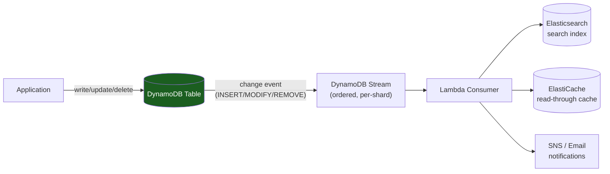
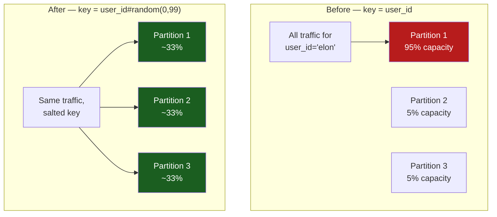

# DynamoDB Deep Dive: Managed Serverless Scale

DynamoDB is AWS's **serverless key-value database**. You don't manage clusters or nodes — AWS handles replication, failover, and scaling transparently.

---

## Why DynamoDB

DynamoDB trades **operational complexity for simplicity**:

| Concern | DynamoDB | Cassandra |
|---|---|---|
| **Cluster management** | Zero (AWS does it) | You own it (gossip, repair, compaction) |
| **Scaling** | Automatic (provisioned or on-demand) | Manual (add nodes, rebalance) |
| **Availability** | Multi-AZ by default | You configure |
| **Query flexibility** | Limited (keys only, or GSI) | Design your schema carefully |
| **Consistency** | Eventually consistent (or strong per-request) | Tunable (CL) |
| **Cost** | Pay per request or reserved | Pay per node + operations |

---

## Part 1: Partition Keys and Sort Keys

### Partition Key (Required)

Every table has a **partition key** that determines which partition stores the item. DynamoDB does **not** expose (or internally use) a fixed 4,096-slot array the way this is sometimes taught — the actual internal partitioning scheme isn't part of DynamoDB's public contract, and the number and boundaries of partitions grow and split dynamically as a table's data size and throughput grow. The model that *is* accurate and useful for reasoning about hot keys:

```
Partition key: user_id

AWS hashes the partition key to decide which physical partition an
item lives on. The number of partitions is NOT fixed — DynamoDB adds
partitions automatically as a table grows past capacity or storage
thresholds for its current partition count, and splits an existing
partition when it outgrows its own throughput ceiling.

What IS fixed, and load-bearing for capacity planning: each partition
has a hard throughput ceiling (~3,000 RCU or 1,000 WCU, whichever is
hit first) and a storage ceiling (~10GB). Once a table needs more
capacity than one partition can serve, DynamoDB adds partitions and
redistributes data across them — you don't control or see this
directly, but the ceiling per partition is why a single hot key can
throttle even when the table overall has huge configured capacity.

AWS replicates each partition across multiple Availability Zones for
durability — the replication factor itself isn't a number DynamoDB
exposes as a tunable, unlike Cassandra's RF.
```

### Sort Key (Optional)

Adds a second dimension for sorting within a partition:

```sql
CREATE TABLE orders (
  user_id string PRIMARY KEY,      -- partition key
  order_id string SORT KEY         -- sort key
);

Items:
  user_id="alice", order_id="order_1"
  user_id="alice", order_id="order_2"
  user_id="alice", order_id="order_3"

Query:
  SELECT * FROM orders WHERE user_id="alice" ORDER BY order_id DESC;
  → Fast: queries one partition, sorts by order_id
```

### Composite Key

```
Partition key: user_id
Sort key: timestamp (DESC)

Query: "Get all events for user_id='alice' in last 7 days"

WHERE user_id = 'alice' AND timestamp > now() - 7 days
→ Scans partition for alice, filters by timestamp
→ Fast (if sorted order matches query)
```

---

## Part 2: Global Secondary Indexes (GSI)

GSI lets you query by **any attribute**, not just the partition key:

```sql
CREATE TABLE users (
  user_id string PRIMARY KEY,
  email string,
  name string,
  created_at timestamp
);

-- Primary key query (fast, no GSI needed)
SELECT * FROM users WHERE user_id = 'alice';

-- Query by email (need GSI)
CREATE GLOBAL SECONDARY INDEX ON users(email);
SELECT * FROM users WHERE email = 'alice@example.com';

-- Query by created_at (need GSI)
CREATE GLOBAL SECONDARY INDEX ON users(created_at);
SELECT * FROM users WHERE created_at > '2024-01-01';
```

### GSI Cost

**GSI consumes separate capacity**:

```
Main table (user_id partition):
  Allocated: 1000 RCU (read capacity units), 500 WCU (write capacity units)

GSI (email partition):
  Allocated: 1000 RCU, 500 WCU (separate from main table!)
  
Total cost = main table + all GSIs

Write a user:
  Main table: 1 WCU
  GSI-1 (email): 1 WCU
  GSI-2 (created_at): 1 WCU
  → 3 WCU total
```

**Interview signal**: "Every GSI increases write cost and storage. Only create indexes for queries you actually run."

### Sparse Indexes

If an attribute is missing from many items, create a **sparse index** (only indexes items where the attribute exists):

```
Table: 1 billion users
Attribute: phone (only 10% have it)

Without sparse index:
  GSI stores 1 billion items (even if 900M have null)

With sparse index:
  GSI stores 100 million items (only those with phone)
  Much smaller, cheaper
```

---

## Part 3: Capacity Modes

### Provisioned Capacity

You pay for reserved capacity (even if unused):

```
Allocated: 1000 RCU, 500 WCU per second

Cost: $0.47/month per 100 RCU + $0.94/month per 100 WCU
      (rough pricing; varies by region)

1000 RCU: ~$47/month
500 WCU: ~$47/month
Total: ~$94/month

If you exceed capacity:
  → Requests are throttled (HTTP 400 ProvisionedThroughputExceededException)
  → Application must retry
```

**Good for**: predictable workloads (you know capacity needs).

### On-Demand Capacity

You pay per request (no reserved capacity):

```
Cost: ~$0.25 per million RCU + ~$1.25 per million WCU

1 million reads: $0.25
1 million writes: $1.25

If traffic spikes:
  → Capacity auto-scales to absorb it, cost increases with usage
  → BUT on-demand does NOT mean throttling is impossible:
    - Per-partition throughput still has a hard ceiling (a single
      partition tops out around 3,000 RCU / 1,000 WCU) — a hot key
      can still get throttled even on-demand, same failure as
      provisioned mode, see Part 5
    - On-demand tables also cap how fast they scale: a table can
      generally handle up to double its previous peak traffic
      immediately, but a much larger, sudden spike can still outrun
      that ramp-up window and throttle until capacity catches up
    - Account-level and table-level service limits still apply
```

**Good for**: unpredictable workloads, spiky traffic, or prototype phases — but "no throttling" is not a guarantee on-demand gives you; it just removes the need to *provision* capacity in advance.

### Choosing Between Modes

| Workload | Provisioned | On-Demand |
|---|---|---|
| Steady 10K RCU/sec | $470/month | ~$216/day (10K reads/sec × 86,400 sec/day = 864M reads/day ÷ 1M × $0.25 ≈ $216/day, ~$6,480/month) |
| Spiky (0-100K RCU/sec) | Over-provision (pay for 100K) | Auto-scale (pay per request) |
| Dev/prototype | On-demand (cheap) | On-demand (cheap) |

This is the concrete reason on-demand's per-request pricing crosses over to being *more* expensive than provisioned once traffic is steady and predictable — on-demand's premium buys you not having to forecast capacity, and it's worth paying only while that uncertainty is real. At 10K RCU/sec sustained, provisioned is roughly 14x cheaper; on-demand only wins when traffic is genuinely spiky or unpredictable enough that over-provisioning for the peak would cost even more.

---

## Part 4: Streams and Change Capture

### DynamoDB Streams

Track changes to items in a stream (like Kafka):

```
Item: user_id="alice", balance=100

UPDATE users SET balance = 50 WHERE user_id="alice";

DynamoDB Stream:
  MODIFY: {
    "user_id": {"S": "alice"},
    "balance": {"N": "100"}        -- old value
  }
  →
  {
    "user_id": {"S": "alice"},
    "balance": {"N": "50"}         -- new value
  }
```

### Lambda Integration

Trigger Lambda on every DynamoDB change:

```
DynamoDB table → stream → Lambda function
                          (e.g., update cache, send email, log analytics)
```



**Use case**: Sync DynamoDB writes to Elasticsearch for full-text search:

```
1. Write to DynamoDB
2. Stream captures change
3. Lambda reads stream, indexes in ES
4. ES stays in sync with DynamoDB
```

---

## Part 5: The Hot Partition Problem

DynamoDB partitions data by hash(partition_key). **If one partition key gets all traffic, one partition serves everything**:

```
Partition key: user_id

Celebrity user (100M followers):
  Every write to user_id="elon" goes to one partition
  That partition maxes out write capacity
  Other partitions sit idle

Actual: 1 partition at 95% capacity while others at 5%
```



### Solutions

**Solution 1: Distribute Key Writes**

```
Instead of: user_id="elon"
Write to: "elon#" + random(0, 100)

"elon#0": write 1
"elon#1": write 1
...
"elon#99": write 1

Total: 100 writes distributed across 100 partitions

Read: Query "elon#*" (all 100 keys)
```

**Solution 2: Cache Hot Reads**

```
If elon's profile is read 10M times/sec:
  Cache in ElastiCache (Redis)
  Only cache misses hit DynamoDB
```

**Solution 3: Adaptive Capacity (Not a Full Fix)**

```
AWS DynamoDB's adaptive capacity:
  Reallocates a table's UNUSED provisioned throughput toward a hot
  partition, up to that partition's own hard ceiling (~3,000 RCU /
  1,000 WCU per partition).

What it does NOT do:
  - Does not replicate or split the hot partition itself
  - Does not raise the per-partition throughput ceiling
  - Cannot help once the hot partition is already saturating that
    ceiling — a single truly hot key (like "elon") can still throttle
    even with adaptive capacity fully engaged, because the ceiling is
    per-partition, not per-table

It buys you some headroom when a partition is hot but the table still
has slack capacity elsewhere — it does not make a single key infinitely
scalable. Solution 1 (spread the key itself across multiple physical
partitions) is still the actual fix for a genuinely hot single key.
```

---

## Part 6: Transactions

DynamoDB supports **atomic transactions** across multiple items (different partition keys):

```
BEGIN TRANSACTION
  UPDATE accounts SET balance = 100 WHERE user_id="alice";
  UPDATE accounts SET balance = 50 WHERE user_id="bob";
COMMIT;

If either update fails → entire transaction rolls back
Both succeed → both changes persist
```

**Cost**: Transactions consume 2× the capacity (coordination overhead).

```
Normal write: 1 WCU
Transactional write: 2 WCU

If you do 1000 transactional writes/sec:
  Provisioned: 2000 WCU (vs 1000 for normal writes)
  Cost: 2× higher
```

---

## Part 7: Operational Patterns

### Point-in-Time Recovery (PITR)

```
Backup automatically (up to 35 days retention)

Restore: restore_time="2024-08-10 03:00:00"
→ DynamoDB creates a new table with data from that point
→ No downtime for original table
```

### TTL (Time-to-Live)

Auto-delete items after a time period:

```
CREATE TABLE sessions (
  session_id string PRIMARY KEY,
  created_at timestamp,
  ttl_timestamp timestamp
);

Set TTL on column: ttl_timestamp

INSERT sessions VALUES ('session_123', now(), now() + 1 hour);
-- After 1 hour, item is automatically deleted (no write cost)
```

### Global Tables

Multi-region replication (for low-latency reads across regions):

```
DynamoDB table in us-east-1
  ↕ (replicates both ways)
DynamoDB table in eu-west-1

Write in us-east-1 → automatically replicated to eu-west-1 (< 1 second)
Read from nearest region → always fast
```

---

## Interview Scenarios

| Scenario | Answer |
|---|---|
| "How do we prevent hot partitions?" | "Monitor by partition key. If one key gets > 30% of traffic: distribute writes across multiple sub-keys (user_123#0 through #99), cache hot reads in Redis, or enable DynamoDB adaptive capacity." |
| "When should we use provisioned vs on-demand?" | "Provisioned: steady, predictable traffic (save money). On-demand: spiky or unpredictable. Measure your peak/average ratio — if > 5×, on-demand is cheaper." |
| "Can we do complex queries?" | "Not really. Query by partition key + sort key only (or GSI). Complex filtering (multiple columns) requires ExpressionAttribute. No JOINs. If you need that, consider Postgres." |
| "GSI capacity — how much do we need?" | "Same as main table for the same throughput. Writes flow to both. If GSI falls behind (lag), queries might return stale data. Monitor with metrics." |
| "How do we sync DynamoDB to ES for search?" | "DynamoDB Streams → Lambda → ES. Every write triggers Lambda, which updates ES. Lag depends on Lambda cold start (typically < 1 second)." |

---

## Key Takeaways

- **Partition key is fundamental**: determines which partition stores data. Choose carefully (avoid hotkeys).
- **GSI costs extra**: each GSI is a separate table with its own capacity. Write goes to main table + all GSIs.
- **Provisioned vs On-Demand**: provisioned is cheap at steady scale; on-demand is cheap for spiky/prototype.
- **Hot partitions can't be solved in the app**: distribute key writes across sub-keys or cache hot reads.
- **Transactions are 2× cost**: use only when needed (multi-item atomicity).
- **Streams + Lambda: powerful event-driven pattern**. Use for real-time sync to ES, caches, analytics.
- **TTL is cheap**: auto-delete items without write cost.

