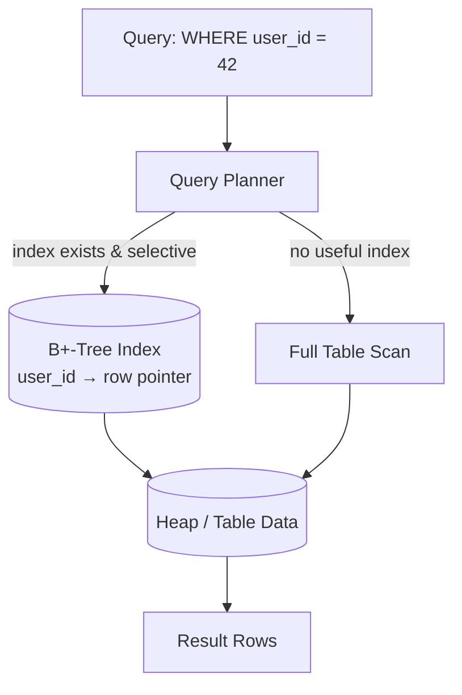

# Indexing & Storage Engines

**Prerequisites:** [SQL vs NoSQL](sql-vs-nosql.md)

[← SQL vs NoSQL](sql-vs-nosql.md)

---

## Why This Exists

A table with no index is a stack of pages the database must read sequentially — a full table scan. At 10 rows that's free. At 100 million rows, a query that should take microseconds takes seconds, and every concurrent query competes for the same disk I/O.

An **index** is a separate, ordered data structure that lets the database jump directly to the rows it needs instead of scanning everything. That's the entire idea. Everything else in this page — which structure, which columns, in which order — is about making that jump as cheap as possible for the queries you actually run, without making every write unbearably expensive.

---

## Mental Model

```
No index (full scan):                 With index (B+-tree lookup):
┌────┬────┬────┬────┬────┬────┐       Root
│ r1 │ r2 │ r3 │ ... │ r_N│           ┌────┴────┐
└────┴────┴────┴────┴────┴────┘     Node       Node
Scan all N rows to find one          ┌──┴──┐   ┌──┴──┐
O(N)                                Leaf  Leaf Leaf  Leaf → matching row
                                     O(log N), ~3-4 disk reads for millions of rows
```

An index trades **write cost** (every insert/update/delete must also update the index) and **storage** (the index takes disk space) for **read speed** on the columns it covers. There is no free index — this is the axis every indexing decision runs along.

---

## Why B+-Trees, Not Binary Trees

A plain binary search tree gives you O(log₂ N) comparisons, which sounds great until you remember each node access on disk is a **seek**, not a comparison — and a seek is ~100,000x slower than an in-memory comparison. A binary tree over a billion rows has ~30 levels, meaning up to 30 disk seeks per lookup. At even 1ms per seek, that's 30ms for a single index lookup — unacceptable at any real query rate.

**B+-trees fix this by maximizing branching factor**, not minimizing comparisons. Instead of 2 children per node, a B+-tree node holds hundreds of keys and pointers — sized to fill exactly one disk page (typically 4KB–16KB). With a branching factor of ~500, a B+-tree over a billion rows is only **3–4 levels deep**, meaning 3–4 disk reads (and the top 1–2 levels are almost always cached in memory, so it's often 1–2 *actual* disk reads).

```
Binary tree, 1B rows:  ~30 levels  → up to 30 disk seeks
B+-tree,     1B rows:  ~3-4 levels → 3-4 disk seeks (top levels cached)
```

The "+" in B+-tree matters too: only leaf nodes store the actual row data (or pointers to it); internal nodes store only keys for routing. Leaves are linked in a doubly-linked list, so once you've found the start of a range, scanning forward for `BETWEEN` or `ORDER BY` is a sequential leaf-to-leaf walk, not a series of tree lookups. This is why B+-trees — not B-trees, not binary trees — are the default index structure in almost every relational database: they're built around the actual cost model of disk I/O, and they make range scans nearly free.

---

## Hash Indexes

A hash index maps `hash(key) → row location` — O(1) average lookup, no tree traversal at all.

```
hash("user_42") = 0x8f3a2b1c → bucket 412 → row location
```

**Where hash wins:** pure equality lookups (`WHERE id = 42`) at higher raw speed than a B-tree, because there's no multi-level traversal.

**Where hash loses:**
- No ordering — `<`, `>`, `BETWEEN`, `ORDER BY` are impossible; the hash function destroys locality on purpose
- No prefix matching — can't use a hash index on `(a, b)` to satisfy a query on `a` alone
- Hash collisions require chaining/probing, adding variance to worst-case lookup time

**In practice:** Postgres supports `USING HASH` indexes but B-tree is the default and covers the hash use case plus range queries, so hash indexes see little real-world use in relational databases. They're far more common as the core structure of key-value stores (Redis, DynamoDB's partition-key lookup) where range queries were never a requirement in the first place.

---

## Architecture: Where the Index Sits



---

## How It Works: Composite Indexes and the Leftmost Prefix Rule

A composite (compound) index on `(a, b, c)` is a single B+-tree keyed on the **concatenation** of those columns, sorted by `a`, then `b` within each `a`, then `c` within each `b`. It is not three separate indexes.

```
Index on (last_name, first_name, signup_date):

Adams,   Emma,   2023-01-04
Adams,   John,   2022-11-19
Baker,   Sam,    2024-02-01
Baker,   Sam,    2021-06-30
Clark,   Ana,    2023-09-12
```

This structure can efficiently serve:
- `WHERE last_name = 'Baker'` — usable, it's the leftmost column
- `WHERE last_name = 'Baker' AND first_name = 'Sam'` — usable, both from the left
- `WHERE last_name = 'Baker' AND signup_date > '2022-01-01'` — usable for `last_name`, then a scan within the Baker block for `signup_date` (not a seek, because `first_name` is skipped)

It **cannot** efficiently serve:
- `WHERE first_name = 'Sam'` alone — `first_name` isn't the leftmost column, so the tree has no ordering to exploit; this degrades to a full index or table scan
- `WHERE signup_date > '2022-01-01'` alone — same problem, `signup_date` is third

This is the **leftmost prefix rule**: a composite index is only usable for queries that filter on a leftmost, contiguous prefix of its columns. Column order in a composite index isn't cosmetic — it's the difference between an index being usable and invisible to a given query. Put the column with equality filters first, range filters last, and the most selective equality column earlier when several are tied.

---

## Covering Indexes

A **covering index** includes every column a query needs — filter columns and selected columns — so the database *usually* doesn't have to touch the underlying table (the "heap") to answer the query.

```sql
CREATE INDEX idx_orders_covering ON orders (customer_id, status) INCLUDE (total, created_at);

SELECT total, created_at FROM orders WHERE customer_id = 42 AND status = 'shipped';
-- Index-only scan when possible — usually satisfied by the index leaf
-- pages alone, no heap lookup
```

Without the `INCLUDE`, the database finds matching rows in the index, then does a second read per row into the heap to fetch `total` and `created_at` — one extra random I/O per matched row. For a query returning thousands of rows, that's thousands of extra seeks. A covering index eliminates most of that at the cost of a larger index (it duplicates more column data).

**"Never touches the heap" is not quite true in PostgreSQL, and the exception matters in practice.** An index-only scan can still visit the heap on a per-row basis to check MVCC visibility — whether that row version is actually visible to the current transaction's snapshot — when the **visibility map** doesn't already mark the row's page as "all rows here are visible to everyone" (an `all-visible` bit set per page, maintained by VACUUM). On a table with recent writes that VACUUM hasn't caught up on yet, a meaningful fraction of an index-only scan's rows can still trigger heap fetches, silently degrading it back toward a regular index scan's I/O cost. This is the concrete reason `autovacuum` tuning matters even for tables you've specifically built covering indexes for — a covering index only delivers on its promise once the visibility map is current, which is a VACUUM outcome, not something the index definition alone guarantees. `EXPLAIN (ANALYZE, BUFFERS)` showing `Heap Fetches: 0` is how you verify it's actually happening in practice, rather than assuming it from the query plan saying "Index Only Scan."

---

## Selectivity and Cardinality

**Cardinality** = number of distinct values in a column. **Selectivity** = cardinality relative to row count — how much an equality filter on that column narrows the result set.

```
users table, 10,000,000 rows

country column:    ~195 distinct values → low selectivity (avg 51,000 rows per value)
email column:      ~10,000,000 distinct → high selectivity (avg 1 row per value)
is_active column:  2 distinct values    → very low selectivity (avg 5,000,000 rows per value)
```

An index on `is_active` is nearly useless — a query for `WHERE is_active = true` might still match millions of rows, and the query planner will correctly choose a full table scan over the index, because random-access index lookups for millions of rows are slower than one sequential scan. An index on `email` is extremely effective — one lookup, one row.

**The rule of thumb:** index columns with high selectivity for equality lookups. Low-selectivity columns are only useful as a later column in a composite index (narrowing an already-filtered set) or with specialized structures (bitmap indexes, partial indexes with a `WHERE` clause).

---

## Worked Example: How the Query Planner Chooses

```sql
-- Table: orders (10M rows)
-- Indexes: idx_customer (customer_id), idx_status_date (status, created_at)

EXPLAIN ANALYZE
SELECT * FROM orders
WHERE customer_id = 4821 AND status = 'pending' AND created_at > '2026-01-01';
```

The planner estimates cost for each candidate path using table statistics (row counts, distinct-value histograms, updated by `ANALYZE`):

```
Path A: idx_customer on customer_id = 4821
  → estimated 40 rows (10M rows / ~250,000 distinct customers)
  → then filter status and created_at in memory
  → cost: ~3 index page reads + 40 heap reads ≈ 43 I/Os

Path B: idx_status_date on (status, created_at)
  → estimated 200,000 rows match status='pending'
  → created_at range narrows to ~20,000 rows
  → then filter customer_id in memory
  → cost: ~4 index page reads + 20,000 heap reads ≈ 20,004 I/Os

Path C: full table scan
  → cost: 10,000,000 sequential reads, but no random I/O
  → often cheaper than a badly-selective index due to sequential vs random I/O

Planner picks Path A — customer_id is far more selective here.
```

This is why `EXPLAIN` output showing "Seq Scan" isn't automatically a bug — it can be the *correct* choice when no available index is selective enough, and forcing an index in that case would be slower. The fix in that scenario isn't "add more indexes," it's often "add a composite index that matches the actual filter combination" — here, `(customer_id, status, created_at)` would let Path A serve the whole `WHERE` clause from the index directly.

---

## Failure Modes

### Write Amplification
Every index on a table must be updated on every `INSERT`, `UPDATE` (of an indexed column), and `DELETE`. A table with 6 indexes doesn't do 1 write per row change — it does up to 7 (1 heap + 6 index updates), each potentially a separate random I/O and lock.

**Detection:** write latency degrades linearly with index count; `pg_stat_user_tables` shows high `n_tup_upd` vs. throughput ratio
**Fix:** audit for unused indexes (`pg_stat_user_indexes` with near-zero scans), drop them; consider partial indexes (`WHERE` clause on the index) to index only the rows that matter

### Index Bloat
Every `UPDATE`/`DELETE` in a B+-tree leaves dead entries until vacuumed. Over time, index pages fill with dead space, growing the index far beyond its logical size and degrading the branching factor's effectiveness.

**Detection:** index size grows faster than row count; `pg_stat_user_indexes` bloat estimates
**Fix:** regular `VACUUM`/`ANALYZE` (Postgres), online index rebuild

### Missing Composite Index Order
A query filters on `(a, b)` but the index is `(b, a)` — the leftmost prefix rule silently disqualifies the index for filters on `a` alone, and the planner falls back to a scan with no warning beyond `EXPLAIN`.

**Detection:** `EXPLAIN` shows `Seq Scan` on a table you were sure had the right index
**Fix:** match column order to the actual filter pattern — equality columns first, most selective first, range column last

### Over-Indexing "Just in Case"
Adding an index for every column that might someday be queried. Each one costs write throughput and disk permanently, for a read benefit that may never materialize.

**Detection:** dozens of indexes on a hot write table; index maintenance dominating write latency
**Fix:** index for the queries you actually run (from slow query logs), not the queries you imagine

---

## Production Debugging

```
Symptom: A query that used to be fast is now slow, or writes have gotten slower.

1. EXPLAIN ANALYZE the slow query
   → Seq Scan where you expected Index Scan? Check leftmost prefix, check selectivity
2. Check pg_stat_user_indexes / equivalent
   → idx_scan near zero on an index you pay to maintain on every write? Drop it.
3. Check table/index bloat
   → index physically much larger than expected for its row count → needs VACUUM/rebuild
4. Check if statistics are stale
   → ANALYZE recently run? Planner decisions are only as good as the histogram
5. Check write latency vs. index count
   → correlate p99 write latency with number of indexes added over time
6. Check for an unindexed foreign key
   → deletes on the parent table doing a full scan of the child table to enforce/cascade
```

**Metrics:** `idx_scan{index}`, `seq_scan{table}`, `index_size_bytes`, `write_latency_p99`, `vacuum_lag`, `planner_row_estimate_vs_actual`.

---

## Scaling Limits

- B+-tree lookups stay ~3-4 disk reads from thousands to billions of rows — the structure itself scales logarithmically; the bottleneck becomes disk I/O contention across concurrent queries, not tree depth.
- Every additional index linearly increases write cost — past a handful of indexes on a hot write table, write throughput becomes the ceiling, not read latency.
- Composite indexes only help the query patterns whose filters match their column order — they don't scale to "any combination of filters" without one index per meaningful combination, which itself hits the write-amplification wall.
- At extreme write volume, B-tree's in-place random-write pattern becomes the bottleneck regardless of index tuning — this is the point where an LSM-based engine (see below) becomes the better fit, not a bigger B-tree.

---

## LSM-Trees: The Write-Optimized Alternative

A B+-tree updates in place — an insert means finding the right leaf page and writing it there, which is a random I/O. That's fine at moderate write rates, but at very high sustained write throughput, random I/O becomes the bottleneck.

A **Log-Structured Merge-tree (LSM-tree)** takes the opposite approach: writes always go to an in-memory buffer (the "memtable"), which is periodically flushed to disk as an immutable, sorted file (an "SSTable"). All disk writes are sequential appends — no in-place random writes at all.

```
Write path (LSM):
  Write → Memtable (in-memory, sorted) → [full] → flush → SSTable (immutable, on disk)
  Background: SSTables periodically merged/compacted into fewer, larger sorted files

Read path (LSM):
  Read → check memtable → check SSTables newest-to-oldest (bloom filters skip files that can't contain the key)
```

**The trade-off:** LSM-trees make writes cheap (sequential append, no read-before-write) but make reads potentially more expensive (a key might need checking across the memtable and several SSTables before compaction catches up) and add background **compaction** overhead (merging SSTables consumes CPU and I/O continuously).

| | B+-Tree | LSM-Tree |
|---|---|---|
| Write pattern | In-place, random I/O | Append-only, sequential I/O |
| Write cost | Higher per write | Lower per write (deferred cost = compaction) |
| Read cost | Consistent, ~log N | Variable — may check multiple SSTables |
| Range scans | Excellent (linked leaves) | Good, but must merge across SSTables |
| Best for | Read-heavy, range-query-heavy workloads | Write-heavy, append-heavy workloads |
| Real engines | PostgreSQL, MySQL (InnoDB), Oracle | Cassandra, RocksDB, LevelDB, HBase |

This connects directly to the choice covered in [SQL vs NoSQL](sql-vs-nosql.md): Postgres and MySQL default to B-tree because most relational workloads are read-heavy with ad-hoc range queries. Cassandra and other wide-column stores default to LSM because their whole design point is absorbing extremely high write throughput (see the wide-column section of that page) — the read cost is an acceptable trade for write volume that would make a B-tree's random I/O the bottleneck. RocksDB (LSM-based) is popular as an embedded storage engine precisely because so many systems need that write profile.

---

## Trade-offs

| Dimension | B+-Tree Index | Hash Index | LSM-Tree (storage engine) |
|-----------|--------------|------------|---------------------------|
| Equality lookup | Fast (log N) | Fastest (O(1) avg) | Fast, but checks multiple files |
| Range queries | Excellent | Not supported | Good, with merge overhead |
| Write cost | Moderate (in-place random I/O) | Low | Low (sequential append) at write time, compaction cost later |
| Read consistency | Predictable | Predictable | Variable (depends on compaction state) |
| Storage overhead | Moderate | Low | Higher (multiple SSTable copies until compacted) |
| Typical use | Relational indexes, general purpose | Key-value equality-only stores | Write-heavy wide-column / embedded stores |

---

## Interview Questions

=== "Basic"
    **Q: Why do databases use B+-trees for indexes instead of binary search trees?**

    "It comes down to the cost of disk I/O, not the number of comparisons. A binary tree over a billion rows is ~30 levels deep, meaning up to 30 disk seeks per lookup — too slow. A B+-tree maximizes its branching factor by sizing each node to a disk page (holding hundreds of keys), so the same billion rows fit in only 3-4 levels — 3-4 disk reads, and the top levels are usually cached in memory anyway. B+-trees are built around the real cost model of disk access, not abstract comparison counts."

=== "Senior"
    **Q: You have a composite index on `(status, created_at)` but a query filtering only on `created_at` isn't using it. Why, and what would you do?**

    "That's the leftmost prefix rule — a composite index is a single tree sorted by the first column, then the second within each value of the first. Since `status` is first, the tree has no way to jump directly to a range of `created_at` values without knowing `status` — the ordering only holds within each status group. If most queries filter on `created_at` alone, I'd add a separate index on `created_at`, or if queries commonly filter on both, keep the composite but check whether the column order matches the actual filter pattern — often it should be reordered, or a second index is needed for the different access pattern. I'd verify with EXPLAIN before and after rather than guessing."

=== "Staff"
    **Q: A write-heavy table has 8 indexes and write latency has crept up 4x over six months as data grew. How do you approach this?**

    "First I'd quantify the actual cost: pull `pg_stat_user_indexes` (or equivalent) to see per-index scan counts — I'd expect some of the 8 to have near-zero reads relative to their write-maintenance cost, and those are the first to drop. Second, I'd check for index bloat — if none have been vacuumed effectively, the indexes may be several times their logical size, amplifying every write further; a rebuild might fix a large chunk of the regression without dropping anything. Third, I'd look at whether several of the 8 are really needed as separate indexes, or whether a couple of them are redundant prefixes of a composite index that could be merged. If after that the table is still write-bound because the access pattern is genuinely high-volume appends rather than point lookups, I'd question whether this table belongs on a B-tree engine at all — if it's mostly time-ordered appends with less need for ad-hoc secondary queries, an LSM-based store might match the workload better long-term. But I would not jump to a storage engine migration before exhausting the index audit — that's a much bigger, riskier change for what's often an operational fix."

---

## Reasoning Exercises

1. A table has 50 million rows and a column `is_deleted` (boolean, 2 distinct values, 99% `false`). Would you index this column? What if you needed to efficiently query `WHERE is_deleted = true`?
2. You have a composite index `(tenant_id, created_at, status)`. List three queries that can use this index efficiently and two that cannot, and explain why for each.
3. A team is choosing between Postgres and Cassandra for a new "activity log" feature: every user action is appended (never updated), write volume is expected at 50,000 writes/second, and reads are almost always "give me the last 100 events for user X." Which storage engine model fits, and why?
4. `EXPLAIN ANALYZE` shows a query using an index but the estimated row count is off from the actual by 100x, and the query is slow despite the index being "correct." What's the likely root cause, and what single command would you try first?

---

## Key Takeaways

!!! success "Remember"
    1. Indexes trade write cost and storage for read speed — every index makes every write on that table slower, with no exceptions
    2. B+-trees win over binary trees because they maximize branching factor to match disk page size, keeping tree depth (and disk seeks) tiny even at billions of rows
    3. Composite index column order is not cosmetic — the leftmost prefix rule determines which queries can use the index at all
    4. Index low-cardinality columns rarely; the query planner will (correctly) prefer a full scan over a bad index
    5. LSM-trees trade read predictability for write throughput — B-tree engines (Postgres, MySQL) fit read-heavy/range-query workloads, LSM engines (Cassandra, RocksDB) fit write-heavy append workloads
