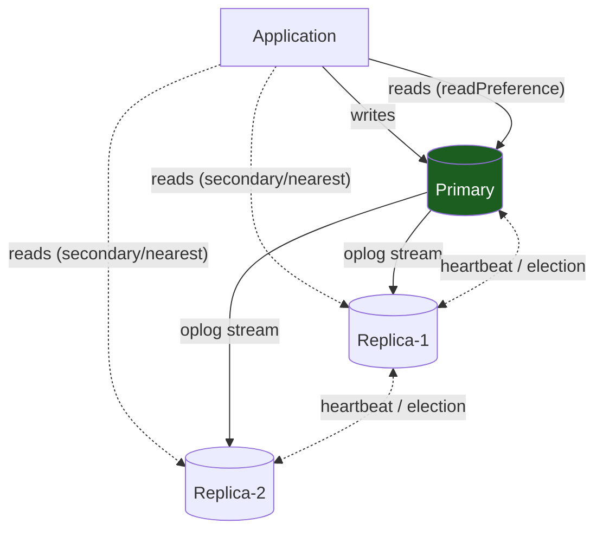
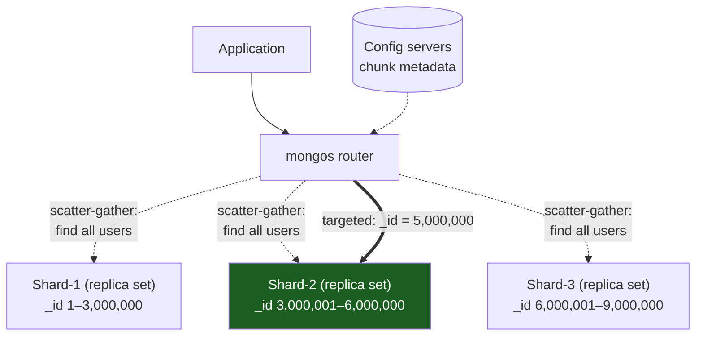

# MongoDB Deep Dive: Document Database at Scale

MongoDB trades **SQL flexibility for developer ergonomics**. Instead of designing a schema with 10 normalized tables, you store a document (JSON-like) exactly as your application needs it.

---

## Why MongoDB

MongoDB solves the impedance mismatch between objects in code and rows in a database:

```python
# In Python:
user = {
  "id": 1,
  "name": "Alice",
  "addresses": [           # embedded array
    {"street": "123 Main", "city": "NYC"},
    {"street": "456 Oak", "city": "LA"}
  ],
  "orders": [
    {"id": 1, "amount": 100, "items": [{"sku": "X", "qty": 2}]},
    {"id": 2, "amount": 50, "items": [{"sku": "Y", "qty": 1}]}
  ]
}

# In SQL: 4 tables (users, addresses, orders, order_items)
# In MongoDB: 1 document
```

**Cost**: No schema enforcement (until recently), and no SQL-style joins (embed related data instead).

---

## Part 1: Document Model and Schema Validation

### Document Structure

A MongoDB document is a BSON object (like JSON, with binary types for dates/UUIDs):

```javascript
db.users.insertOne({
  _id: ObjectId("..."),       // auto-generated unique ID
  name: "Alice",
  email: "alice@example.com",
  tags: ["vip", "early-adopter"],  // arrays
  metadata: {                        // nested objects
    created_at: ISODate("2024-01-01"),
    last_login: ISODate("2024-08-14")
  }
});
```

### Schema Validation (Optional but Recommended)

MongoDB doesn't enforce schemas by default. **This is dangerous in production.** Add validation:

```javascript
db.createCollection("users", {
  validator: {
    $jsonSchema: {
      bsonType: "object",
      required: ["name", "email"],
      properties: {
        _id: { bsonType: "objectId" },
        name: { bsonType: "string" },
        email: { 
          bsonType: "string",
          pattern: "^[a-zA-Z0-9._%+-]+@[a-zA-Z0-9.-]+\\.[a-zA-Z]{2,}$"
        },
        age: { bsonType: ["int", "null"] },
        tags: {
          bsonType: "array",
          items: { bsonType: "string" }
        }
      },
      additionalProperties: false
    }
  }
});
```

This is **essential** for catching bugs before data corruption.

---

## Part 2: Querying and Indexes

### Query Syntax

```javascript
// Simple equality
db.users.find({ email: "alice@example.com" });

// Comparison operators
db.orders.find({ amount: { $gt: 100 } });  // >
db.orders.find({ amount: { $gte: 100, $lt: 500 } });  // range

// Array contains (if tags is an array)
db.users.find({ tags: "vip" });  // matches any document where "vip" is in tags

// Nested field
db.users.find({ "metadata.created_at": { $gt: ISODate("2024-01-01") } });

// AND (implicit)
db.users.find({ email: "alice@example.com", age: { $gt: 18 } });

// OR
db.users.find({ $or: [ { email: "alice@example.com" }, { email: "bob@example.com" } ] });
```

### Indexes

Like SQL, indexes speed reads:

```javascript
// Single field
db.users.createIndex({ email: 1 });  // ascending

// Compound index (works for queries on both fields or first field)
db.orders.createIndex({ user_id: 1, created_at: -1 });

// Unique index
db.users.createIndex({ email: 1 }, { unique: true });

// Sparse index (ignore documents missing the field)
db.users.createIndex({ phone: 1 }, { sparse: true });
```

### Aggregation Pipeline

For complex analytical queries (equivalent to SQL's GROUP BY, JOIN):

```javascript
db.orders.aggregate([
  { $match: { status: "completed" } },                    // WHERE
  { $lookup: {                                            // JOIN
      from: "users",
      localField: "user_id",
      foreignField: "_id",
      as: "user_info"
    }
  },
  { $group: {                                             // GROUP BY
      _id: "$user_id",
      total_orders: { $sum: 1 },
      total_amount: { $sum: "$amount" }
    }
  },
  { $sort: { total_amount: -1 } },                        // ORDER BY
  { $limit: 10 }                                          // LIMIT
]);
```

---

## Part 3: Transactions

MongoDB 4.0+ supports multi-document transactions (with caveats):

```javascript
const session = db.getMongo().startSession();
session.startTransaction();

try {
  db.accounts.updateOne(
    { _id: 1 },
    { $inc: { balance: -100 } },
    { session }  // <- part of transaction
  );
  db.accounts.updateOne(
    { _id: 2 },
    { $inc: { balance: 100 } },
    { session }
  );
  session.commitTransaction();
} catch (err) {
  session.abortTransaction();
  throw err;
}
```

**Important caveat**: Transactions only work within a single **replica set**, not across shards (until MongoDB 4.2+, which added cross-shard transactions but they're slow).

### Why Denormalization is Easier Than Transactions

Many MongoDB use cases avoid transactions by embedding related data:

```javascript
// Instead of two documents:
db.orders.insertOne({
  _id: 1,
  user_id: 123,
  items: [
    { sku: "X", qty: 2, price: 50 },
    { sku: "Y", qty: 1, price: 100 }
  ],
  total: 200
});

// One atomic write, no transaction needed
```

**Tradeoff**: If you need to update the same item in many orders (e.g., "change SKU X's price"), you now update every order document. This is why **denormalization works best for writes that don't cross boundaries**.

---

## Part 4: Replication (Replica Sets)

MongoDB replicates data across a replica set (typically 3 nodes):

```
Primary (accepts reads + writes)
├─ Replica-1 (read-only, automatically replicas from primary)
└─ Replica-2 (read-only)

Oplog (operation log):
Primary writes: INSERT order(id=1, amount=100)
  ↓ (asynchronously)
Replicas: apply INSERT operation
```



### Read Preferences

You can read from replicas to reduce load on primary:

```javascript
// mongosh cursor method is .readPref(), not .readPreference()

// Read from primary (default, most consistent)
db.orders.find({}).readPref("primary");

// Read from any replica (faster, possibly stale)
db.orders.find({}).readPref("secondary");

// Read from nearest (by latency)
db.orders.find({}).readPref("nearest");
```

**Tradeoff, and two distinct risks that are easy to conflate**: replication lag and rollback risk are different problems with different causes.

- **Replication lag** (the secondary hasn't yet applied an oplog entry the primary already committed) means a secondary read can return **stale** data — an older, but still genuinely committed, value. This is what `readPref("secondary")` trades away.
- **Rollback risk** — a secondary read returning data that gets *retroactively undone* (a value that was written to a former primary but never actually reached durable majority consensus before a failover) — is governed by **write concern** and **read concern**, not by which member you read from. Writing with `writeConcern: "majority"` and reading with `readConcern: "majority"` is what protects against ever observing data that a subsequent election could roll back; reading from a secondary with weaker read concern can expose you to it regardless of how far behind that secondary actually is.

Don't describe "stale reads" and "rollback-exposed reads" as the same risk — lag causes the first, insufficient write/read concern causes the second, and fixing one doesn't fix the other.

### Replication Lag and Oplog

The **oplog** is a capped collection (fixed size, oldest entries deleted). If a replica falls too far behind, it can't catch up (missing operations from oplog):

```
Oplog size: 10 GB
Write rate: 100 MB/s

If a replica is down for 100+ seconds:
  100 MB/s × 100s = 10 GB
  → entire oplog is gone
  → replica must do a full resync (copy entire dataset)
```

**Production**: Monitor oplog lag and alert if > SLO.

---

## Part 5: Sharding

When data is too large for one replica set, split across multiple shards:

```
Shard-1 (replica set):   users with _id: 1-3,000,000
Shard-2 (replica set):   users with _id: 3,000,001-6,000,000
Shard-3 (replica set):   users with _id: 6,000,001-9,000,000

Mongos (router):
  Query: "find user with _id = 5,000,000"
  → routes to Shard-2
  Query: "find all users"
  → broadcasts to all shards, merges results
```



A query with the shard key (`_id = 5,000,000`) routes to exactly one shard. A query without it (`find all users`) fans out to every shard and merges results — the same scatter-gather cost as generic sharding.

### Shard Keys

The shard key determines which shard a document lives on:

```javascript
// Shard by user_id
db.users.createIndex({ _id: "hashed" });
db.adminCommand({ shardCollection: "myapp.users", key: { _id: "hashed" } });
```

MongoDB does **not** place documents with `hash(key) % shard_count` the way generic modulo-hash sharding works. Instead, the hashed key space is divided into contiguous **chunks** (ranges of the hash value, default ~128MB each), and each chunk is assigned to a shard. A document's shard is "which chunk does this document's hash fall into, and which shard currently owns that chunk" — not a direct modulo of the shard count. This matters because it's exactly what makes rebalancing possible: the balancer moves whole chunks between shards as data grows or shards are added/removed, without needing every document's placement to be recomputed the way a naive `% shard_count` scheme would if `shard_count` changed.

**Choosing poorly is expensive** — moving a lot of data across shards to fix a bad distribution takes real time and I/O, so pick the shard key with real production values, not example data:

```javascript
// Bad: shard by status (only "active" or "inactive")
sh.shardCollection("myapp.users", { status: 1 });
// All active users' chunks concentrate on one shard (hotspot)

// Good: shard by email hash (distributes evenly)
sh.shardCollection("myapp.users", { email: "hashed" });
```

**The shard key itself is not permanently fixed, either** — since MongoDB 5.0, `reshardCollection` can change a collection's shard key in place (MongoDB copies and re-chunks the data under the hood, and it's a real operation with real cost and duration for large collections, but it's a supported live migration, not "pick correctly the first time or start over"). Before 5.0, changing a shard key genuinely did require dropping and recreating the collection — treat this history as the reason poor shard-key choices are still expensive to fix, not as "impossible."

### Hot Shards

Even with hashing, data hotspots exist:

```
Celebrity user (100M followers) gets updates constantly
→ All updates hash to one shard
→ That shard becomes bottleneck
```

**Solution**: Use a compound shard key with a random suffix:

```javascript
// Shard key: { user_id: 1, shard_id: 1 }
db.user_updates.insertOne({
  user_id: 123,           // celebrity
  shard_id: random(0, 10),  // random suffix
  update: { likes: 1 }
});

// 10 distinct suffix values does NOT mean 1 suffix value = 1 physical
// shard. MongoDB still assigns the (user_id, shard_id) key range to
// CHUNKS, and chunks are what get distributed across the actual shard
// nodes — the 10 suffix values spread this celebrity's writes across
// (up to) 10 different chunks, which the balancer can then place on
// different physical shards over time, but there's no guaranteed 1:1
// mapping from suffix value to shard. With more physical shards than
// 10, some shards may end up with none of this key's chunks; with
// fewer than 10 shards, multiple suffix values necessarily share a
// shard. The suffix's real job is turning one massive, unsplittable
// chunk range (a single celebrity's key) into multiple independently
// placeable chunks — the balancer, not the suffix count, decides the
// actual shard distribution.
// Reads must query all 10 shard_id values in [0..9] to reassemble the full picture
```

---

## Part 6: Performance Considerations

### Embedded vs Referenced Documents

**Embed** if:
- Related data is always needed together
- The embedded array is small (< 1000 items) and grows slowly

**Reference** if:
- Related data is needed independently
- The embedded array is unbounded or changes frequently

```javascript
// Embed: good for small, stable arrays
db.users.insertOne({
  _id: 1,
  name: "Alice",
  addresses: [          // always returned with user
    { street: "123 Main", city: "NYC" }
  ]
});

// Reference: good for large or frequently-changing relationships
db.users.insertOne({
  _id: 1,
  name: "Alice",
  address_ids: [1, 2, 3]  // reference to separate collection
});
db.addresses.insertOne({
  _id: 1,
  user_id: 1,
  street: "123 Main",
  city: "NYC"
});
```

### Write Throughput (WiredTiger Engine)

MongoDB uses **WiredTiger** for persistence. Its default and primary on-disk structure is a **B+tree** (copy-on-write, with checkpoints) — WiredTiger also ships an optional LSM-tree access method, but MongoDB does not use it by default, and describing WiredTiger itself as "LSM-based" overstates a configuration option as the norm. Write optimization:

```
Writes:
1. Batched in RAM (write cache)
2. Flushed to persistent journal every 100ms
3. Flushed to data files every 60 seconds

If MongoDB crashes between step 2 and 3:
  → Data from journal is recovered (durability)
  → Never lose committed data

Journal I/O is the main write bottleneck. SSD is mandatory for high write throughput.
```

### Read Throughput (Caching)

```
Query: db.users.find({ email: "alice@example.com" });

1. Check WiredTiger cache (in-memory)
   → fast (microseconds)
2. If not cached, read from disk
   → slow (milliseconds)

Cache size: MongoDB uses available RAM up to configured limit.
Larger cache = fewer disk reads.

Monitor: db.serverStatus().wiredTiger.cache
```

---

## Part 7: Operational Patterns

### Bulk Operations

Insert thousands of documents efficiently:

```javascript
const ops = [];
for (let i = 0; i < 10000; i++) {
  ops.push({ insertOne: { document: { user_id: i, name: "User " + i } } });
}
db.users.bulkWrite(ops, { ordered: false });  // ordered: false allows parallel inserts
```

### TTL Indexes (Auto-Expiring Documents)

```javascript
// Sessions that auto-delete after 1 hour
db.sessions.createIndex(
  { createdAt: 1 },
  { expireAfterSeconds: 3600 }
);

db.sessions.insertOne({
  _id: "session123",
  createdAt: new Date(),
  user_id: 1
});
// This document will be deleted 1 hour after createdAt
```

### Change Streams (Real-Time Updates)

```javascript
const changeStream = db.orders.watch();
changeStream.on("change", (change) => {
  console.log("Order updated:", change);
  // change.operationType: "insert", "update", "delete"
  // change.fullDocument: full document after update
});
```

---

## Interview Scenarios

| Scenario | Answer |
|---|---|
| "When should we use MongoDB vs Postgres?" | "MongoDB for: flexible schema, embedded documents, fast writes. Postgres for: complex queries, joins, strict consistency. Real answer: PostgreSQL first, MongoDB only when you have a strong reason." |
| "How do we avoid hot shards?" | "Monitor shard distribution. If 1 shard gets > 30% of traffic, use a compound shard key with a random suffix and split the hot key across multiple shards. Read queries scatter; writes distribute." |
| "Can we do transactions?" | "Yes, multi-document transactions within a replica set (4.0+). But cross-shard transactions are slower (4.2+). Often: embed related data to avoid transactions." |
| "Our sharding is unbalanced." | "Rebalancing is expensive but not impossible. Options: 1) live with imbalance (if < 10% skew), 2) let the balancer migrate chunks over time (moves data gradually, throttled to limit production impact), 3) since MongoDB 5.0, use `reshardCollection` to change the shard key in place — a real, costly, but supported operation, not a rebuild-from-scratch. Choose the shard key carefully upfront regardless, since fixing it later is still an expensive migration." |
| "What's the replication lag?" | "Asynchronous, typically < 100ms. Check oplog lag with: rs.printSlaveReplicationInfo(). If > 1s, secondary is falling behind; check network/disk." |

---

## Key Takeaways

- **Document model matches application objects**: embed related data instead of normalizing.
- **Schema validation is not optional**: add JSON schema validators to catch bugs early.
- **Transactions work within replica sets**: cross-shard transactions are slow; denormalize when possible.
- **Shard key is expensive to change, not permanent**: hashed sharding uses chunk ranges assigned to shards (not a raw `hash % shard_count`), and `reshardCollection` (5.0+) can migrate a collection to a new shard key — but it's a real, costly operation, so choose carefully upfront regardless.
- **Replication is asynchronous**: design for eventual consistency; use read preference carefully.
- **Embedded arrays grow unbounded**: cap at 1000 items; split if needed.
- **WiredTiger is B+tree-based by default**: an optional LSM access method exists but isn't the default; write-optimized via a write cache + journal; SSD is mandatory for sustained throughput.

