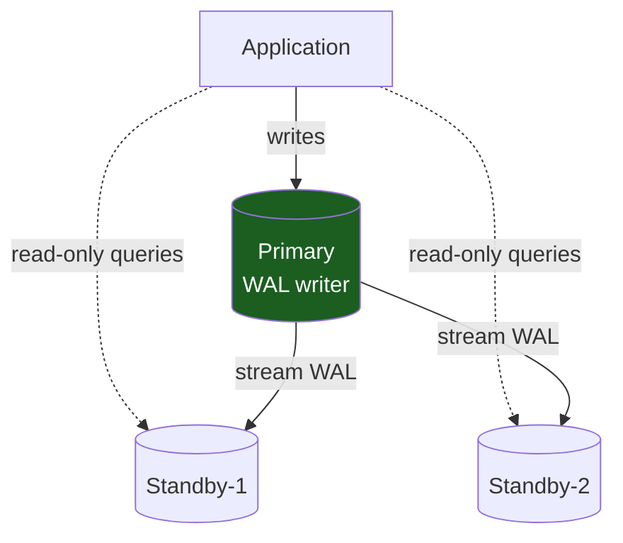
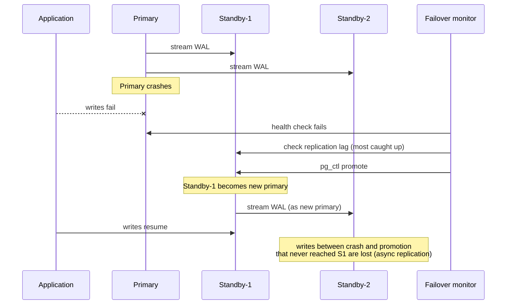
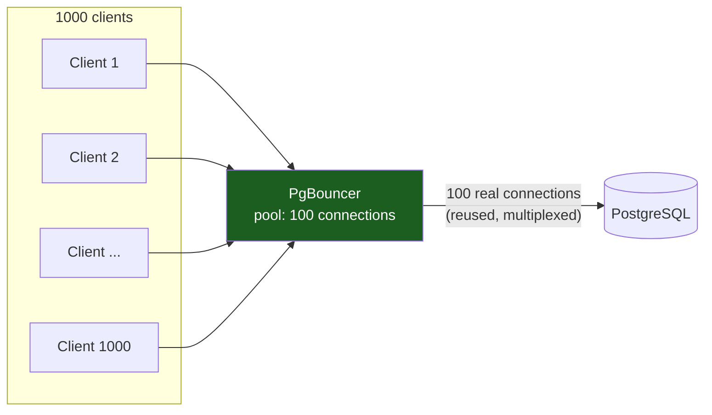

# PostgreSQL Deep Dive: The SQL Workhorse

PostgreSQL is the default SQL database for most companies because it **balances generality with reliability**. It is not the fastest at anything, but it is fast enough at everything — and it will not surprise you at 3 AM.

---

## Why PostgreSQL

PostgreSQL solves the hardest problem in databases: **making the right tradeoffs**. It chooses:

- **B-tree indexes by default** (reads optimized)
- **ACID transactions** (correctness over raw speed)
- **MVCC** (multiple readers and writers coexist)
- **Extensibility** (types, functions, operators — you can add anything)

The result: a database that handles OLTP (transactional), OLAP (analytical), and JSON queries without a schema rewrite.

---

## Part 1: MVCC — How PostgreSQL Handles Concurrent Writes

PostgreSQL's secret weapon is **Multi-Version Concurrency Control (MVCC)**. Instead of locking rows when writers conflict, it creates new versions of data.

### The Problem MVCC Solves

```
Without MVCC (pessimistic locking):
Writer-A: BEGIN TRANSACTION; UPDATE user SET balance = 100;
  → Locks the row
Reader-B: SELECT * FROM user WHERE id = 1;
  → Waits for Writer-A's lock

Writer-A is slow (10 seconds). Reader-B waits 10 seconds to read one row.
Result: Read throughput is destroyed.
```

### MVCC Solution: Multiple Versions Coexist

```
Writer-A: BEGIN TRANSACTION; UPDATE user SET balance = 100;
  CREATE new version: (id=1, balance=100, xmin=100)
  Old version still exists: (id=1, balance=50, xmax=100)
Reader-B: SELECT * FROM user WHERE id = 1;
  Sees version with xmax=100 (old version, still valid before commit)
  Returns: balance = 50
  Immediately, no waiting.

Writer-A: COMMIT;
Reader-C: SELECT * FROM user WHERE id = 1;
  Sees version with xmin=100 (new version)
  Returns: balance = 100
```

**Key insight**: Each transaction sees a snapshot of the database at the moment it started. Writes don't block readers.

```mermaid
sequenceDiagram
    participant A as Writer-A (txid 100)
    participant Row as Row (id=1)
    participant B as Reader-B (started before commit)
    participant C as Reader-C (started after commit)

    Note over Row: balance=50, xmin=90, xmax=NULL
    A->>Row: BEGIN; UPDATE balance = 100
    Row->>Row: new version: balance=100, xmin=100
    Row->>Row: old version kept: balance=50, xmax=100
    B->>Row: SELECT balance
    Row-->>B: 50 (snapshot taken before txid 100 committed)
    A->>Row: COMMIT
    C->>Row: SELECT balance
    Row-->>C: 100 (sees xmin=100, committed and visible)
```

### Transaction IDs (xmin, xmax)

Every row has two internal columns:

- **xmin**: Transaction ID that created this version
- **xmax**: Transaction ID that deleted this version (or NULL if current)

```
Transaction 100: DELETE FROM users WHERE id = 1;
  → Sets xmax=100 on the row
  Physically: row stays on disk (deleted rows are cleaned later by VACUUM)

Transaction 105: SELECT * FROM users WHERE id = 1;
  → Sees xmax=100
  → Checks visibility rules: is my transaction before/after the delete?
  → If 105 > 100, the delete happened before me, row is gone
  → If 105 < 100, the delete is in the future, I see the row
```

**Consequence**: Deletes don't free space immediately. Dead rows accumulate until VACUUM cleans them. Postgres calls this **bloat**.

### VACUUM — Space Reclamation

VACUUM is the maintenance operation that reclaims space:

```
Before VACUUM:
  users table: 1 GB
    100M rows, but 50M are marked deleted (xmax is set)
    
VACUUM:
  Scans the table (1 GB)
  Removes rows with xmax < (oldest active transaction)
  Reuses space on disk
  
After VACUUM:
  users table: 0.5 GB
  Cleanup is I/O intensive (scans entire table sequentially)
```

**Production impact**: Without VACUUM, disk usage grows unbounded. With aggressive DML, VACUUM can't keep up. Solution: **tune autovacuum**.

```sql
-- On a high-churn table
ALTER TABLE events SET (
  autovacuum_vacuum_scale_factor = 0.01,    -- vacuum when 1% of table is dead
  autovacuum_analyze_scale_factor = 0.005   -- analyze when 0.5% has changed
);
```

---

## Part 2: Indexes and Query Planning

### B-Tree Indexes (Default)

PostgreSQL uses B-tree for most indexes because they're excellent for range queries.

```sql
CREATE INDEX ON users(email);  -- B-tree index

-- Fast: uses index
SELECT * FROM users WHERE email = 'alice@example.com';  -- O(log N)

-- Also fast: ranges use index
SELECT * FROM users WHERE email BETWEEN 'a@' AND 'z@';  -- O(log N + result size)

-- Slow: no index helps
SELECT * FROM users WHERE email LIKE '%@example.com';   -- O(N) full scan
```

### Hash Indexes

PostgreSQL also supports hash indexes (only equality, not ranges):

```sql
CREATE INDEX ON users USING hash(phone);

-- Good
SELECT * FROM users WHERE phone = '555-1234';  -- hash lookup

-- Useless (hash can't do ranges)
SELECT * FROM users WHERE phone > '555-0000';  -- full scan anyway
```

### Partial Indexes

```sql
-- Instead of indexing all 100M users, index only active ones:
CREATE INDEX ON users(email) WHERE is_active = true;

-- This index is tiny (1% of full index)
-- Queries on active users use it and run faster
SELECT * FROM users WHERE is_active AND email = 'alice@example.com';
```

### The EXPLAIN Plan

Every DBA's best friend — shows how Postgres executes a query:

```sql
EXPLAIN ANALYZE
SELECT * FROM users WHERE email = 'alice@example.com' AND created_at > '2024-01-01';

                          QUERY PLAN
──────────────────────────────────────────────────────────────────────
 Bitmap Index Scan on users_email_idx (cost=0.43..2.50 rows=1)
   Index Cond: (email = 'alice@example.com')
   Filter: (created_at > '2024-01-01')

 Execution Time: 0.123 ms
```

**What to read**:
- **cost**: Optimizer's estimate of work (arbitrary units, useful for comparing plans)
- **rows**: Estimated rows vs actual rows (if very different, statistics are stale → run ANALYZE)
- **Execution Time**: Actual time spent

```sql
-- When stats are stale, index selection is wrong:
ANALYZE users;  -- Recompute statistics
```

### Join Strategies

```sql
SELECT *
FROM users u
JOIN orders o ON u.id = o.user_id
WHERE u.email = 'alice@example.com';

-- Postgres chooses one of:
-- 1. Nested Loop: for each user, search orders (good if orders is small)
-- 2. Hash Join: load all orders into hash table, scan users (good if both medium)
-- 3. Sort-Merge Join: sort both, merge (good if both indexed on join key)
```

**Interview signal**: "Postgres does surprisingly smart optimization. An unindexed join might be faster than an indexed one if the data is small or hot-cached."

---

## Part 3: Isolation Levels

PostgreSQL implements the four standard isolation levels (though its "Read Uncommitted" is actually Read Committed).

### Read Committed (Default)

```sql
SESSION A:                          SESSION B:
BEGIN;
SELECT balance FROM accounts WHERE id = 1;
→ balance = 100

                                    BEGIN;
                                    UPDATE accounts SET balance = 50 WHERE id = 1;
                                    COMMIT;

SELECT balance FROM accounts WHERE id = 1;
→ balance = 50  (different from before!)
```

Allows **non-repeatable reads**: A's view of the row changed mid-transaction.

### Repeatable Read

```sql
SESSION A:                          SESSION B:
SET TRANSACTION ISOLATION LEVEL REPEATABLE READ;
BEGIN;
SELECT balance FROM accounts WHERE id = 1;
→ balance = 100

                                    UPDATE accounts SET balance = 50 WHERE id = 1;
                                    COMMIT;

SELECT balance FROM accounts WHERE id = 1;
→ balance = 100  (same as before)
```

A's view is frozen at the transaction start. B's update doesn't affect A's reads.

**But phantoms are possible**:

```sql
SELECT COUNT(*) FROM orders WHERE status = 'pending';
→ 5 orders

                                    INSERT INTO orders (status) VALUES ('pending');
                                    COMMIT;

SELECT COUNT(*) FROM orders WHERE status = 'pending';
→ 6 orders (phantom insert)
```

### Serializable

```sql
SET TRANSACTION ISOLATION LEVEL SERIALIZABLE;
BEGIN;
-- All transactions are serialized (one at a time)
```

Slowest, most correct. Use for critical financial operations.

---

## Part 4: Replication and High Availability

### Streaming Replication

Primary writes changes; standby replicas apply them:

```
Primary:
  WAL (Write-Ahead Log): [Write1] [Write2] [Write3] ← written to disk first
  ↓ streams WAL segment
Standby-1:
  Applies [Write1] [Write2] [Write3]
  Read-only replica (can run queries)
Standby-2:
  Same
```

**Replication lag**: time between primary write and standby apply. Can be 0 (synchronous) to seconds (asynchronous).



### Synchronous Replication

```sql
-- On primary:
ALTER SYSTEM SET synchronous_standby_names = 'standby1,standby2';
SELECT pg_ctl_reload_conf();

-- Now:
-- Every COMMIT waits for at least one standby to ACK
-- Slow but durable
```

### Failover

When the primary crashes, promote a standby to primary:



```bash
# On standby:
pg_ctl promote -D /data/postgres

# Standby becomes primary
# But: standby might be behind (async replication)
# Lost writes between crash and promotion
```

**Protection**: Use **quorum-based replication** — wait for majority of standbys:

```sql
ALTER SYSTEM SET synchronous_standby_names = 'ANY 2 (standby1,standby2,standby3)';
-- Now: writes wait for ANY 2 of 3 standbys
-- Majority always survives
```

---

## Part 5: Connection Pooling (PgBouncer)

PostgreSQL connections are expensive (~5 MB RAM each). Direct connection per client doesn't scale:

```
1000 clients × 10 connections per client = 10,000 connections
10,000 × 5 MB = 50 GB of RAM just for connection metadata
```

**PgBouncer** is a connection pooler:

```
1000 clients
        ↓
    PgBouncer (pool: 100 connections to Postgres)
        ↓
PostgreSQL (100 real connections, reused)
```



Each client connects to PgBouncer; PgBouncer multiplexes to Postgres:

```
Client-1: SELECT * FROM users;
          (uses Postgres connection #1)
Client-2: SELECT * FROM orders;
          (uses Postgres connection #2)
Client-3: SELECT * FROM products;
          (reuses Postgres connection #1 after Client-1 finishes)
```

**Pool modes**:
- **Session**: PgBouncer holds a Postgres connection for each client session (safest, uses more memory)
- **Transaction**: PgBouncer holds a connection only during transactions (client queries between transactions get different connections)
- **Statement**: PgBouncer holds a connection only for each statement (most efficient, risky with prepared statements)

---

## Part 6: Performance Tuning

### Shared Buffers

Amount of RAM Postgres uses to cache pages from disk:

```sql
-- Default: 128 MB (way too low)
-- Good value: 25% of system RAM (on a dedicated server)
ALTER SYSTEM SET shared_buffers = '16GB';
-- (on a 64 GB machine)
```

Larger buffer pool means fewer disk seeks.

### Work Memory

RAM used per query operation (sort, hash join):

```sql
ALTER SYSTEM SET work_mem = '4MB';

-- If you run 100 concurrent queries, each needing 4 MB for a sort:
-- Total: 100 × 4 MB = 400 MB (fine)

-- If each query needs 400 MB (for a big join):
-- Total: 100 × 400 MB = 40 GB (out of memory!)

-- Solution: tune work_mem based on concurrent query count
-- work_mem = (RAM - shared_buffers) / (avg concurrent queries)
```

### Max Connections

Hard limit on concurrent connections:

```sql
ALTER SYSTEM SET max_connections = 200;
```

**Don't set too high** — at 10,000 connections, the system spends more time context-switching than working. Use PgBouncer for high concurrency.

### Checkpoint Configuration

Checkpoints write all dirty pages to disk (for crash recovery):

```sql
ALTER SYSTEM SET checkpoint_timeout = '15 min';
ALTER SYSTEM SET max_wal_size = '2GB';
```

Frequent checkpoints = faster recovery, but higher I/O. Tune based on RPO (Recovery Point Objective).

---

## Part 7: Monitoring and Alerting

### Critical Metrics

| Metric | Alert Threshold | Why |
|---|---|---|
| Replication lag | > 1 second | Data divergence risk |
| Bloat ratio | > 20% | Performance degradation; VACUUM falling behind |
| Cache hit ratio | < 99% | Too many disk reads; increase shared_buffers |
| Transaction rate | drops by 30% | Query performance degrading |
| Connection count | near max_connections | Running out of connections |

### Key Queries

```sql
-- Replication lag
SELECT EXTRACT(EPOCH FROM (NOW() - pg_last_xact_replay_timestamp())) as lag_seconds;

-- Table size and live rows
SELECT schemaname, tablename, pg_size_pretty(pg_total_relation_size(schemaname||'.'||tablename)) as size,
       n_live_tup, n_dead_tup, ROUND(100.0 * n_dead_tup / (n_live_tup + n_dead_tup), 2) as bloat_percent
FROM pg_stat_user_tables
WHERE n_live_tup > 0
ORDER BY pg_total_relation_size(schemaname||'.'||tablename) DESC;

-- Slow queries
SELECT mean_exec_time, calls, query
FROM pg_stat_statements
ORDER BY mean_exec_time DESC
LIMIT 10;
```

---

## Interview Scenarios

| Scenario | Answer |
|---|---|
| "Our Postgres is getting slow. What's happening?" | "Check replication lag, bloat ratio, cache hit ratio, and slow query log. Likely: VACUUM falling behind (bloat), or shared_buffers too small (disk I/O). Look at WAL size — if it's huge, checkpoint is taking too long." |
| "Can we scale reads?" | "Yes, read replicas are cheap. Each standby replicates from primary asynchronously. Reads scatter to replicas, primary handles all writes." |
| "How do we scale writes?" | "Postgres doesn't scale writes past 5-15K TPS without sharding. At that point, Cassandra or a distributed database is cheaper. Before sharding, check: are you really CPU-bound, or is I/O the bottleneck? (usually I/O)." |
| "How do we handle concurrent writes safely?" | "MVCC + transactions. Use Repeatable Read or Serializable for critical sections. Most apps use Read Committed (default) and handle potential conflicts in application logic." |
| "What's the difference between indexes and partitioning?" | "Indexes speed up queries on a single table. Partitioning splits a large table into smaller physical pieces. Use both: partition large tables by date, then index within partitions." |

---

## Key Takeaways

- **MVCC is Postgres's secret weapon**: writers don't block readers. Dead rows stay on disk until VACUUM cleans them.
- **B-tree indexes are powerful but not free**: they speed reads and slow writes. Don't over-index.
- **EXPLAIN ANALYZE is your friend**: always check the plan before tuning.
- **Replication is the cheapest HA**: read replicas are async and fast; failover is manual but straightforward.
- **Tune in order**: shared_buffers → work_mem → checkpoint settings. 80% of performance issues are config.
- **PgBouncer is mandatory at scale**: 1000+ concurrent clients need connection pooling.
- **VACUUM is not optional**: bloat compounds. Monitor it and tune autovacuum aggressively on high-churn tables.

