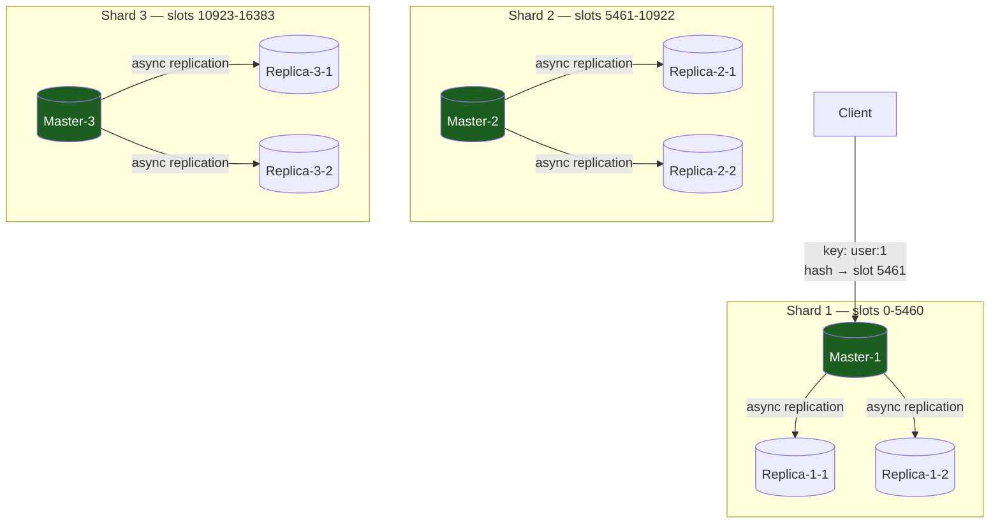

# Redis Deep Dive: In-Memory Data Store

Redis is the **in-memory data store** you reach for caching, sessions, rate limiting, and real-time analytics. It is not a database replacement — it is the **speed layer** in front of your database.

---

## Why Redis

Redis solves the **latency problem**:

```
Query: SELECT * FROM user WHERE id = 1;

Postgres (on disk):
  Parse SQL → acquire lock → seek on disk → return row
  → 10 ms

Redis (in memory):
  hash lookup (O(1))
  → 0.1 ms (100× faster)
```

Redis trades **durability for speed**. Data lives in RAM; if you crash, it's gone (unless you enable persistence).

---

## Part 1: Data Structures

Redis is **not a simple key-value store**. It's a structured data store with rich operations:

### Strings

```
SET key "value"
GET key → "value"

Atomic operations:
  INCR counter           → increment by 1
  INCRBY counter 5       → increment by 5
  APPEND key "suffix"    → concatenate
  STRLEN key             → length
```

### Hashes

```
HSET user:1 name "Alice" email "alice@example.com" age 30
HGET user:1 name → "Alice"
HGETALL user:1 → {name: "Alice", email: "...", age: 30}
HINCRBY user:1 age 1 → 31
```

**Use case**: Object storage (user profile, product info).

### Lists

```
LPUSH queue "job_1"   → add to head
LPUSH queue "job_2"
RPOP queue            → remove from tail → "job_1"

Use case: Job queues, activity feeds
```

### Sets

```
SADD tags "ruby" "python" "golang"
SCARD tags → 3
SISMEMBER tags "ruby" → true
SINTER tags1 tags2 → intersection

Use case: Unique collections (followers, tags, members)
```

### Sorted Sets

```
ZADD leaderboard 100 "alice" 90 "bob" 110 "charlie"
ZRANGE leaderboard 0 -1 WITHSCORES
  → [alice: 100, bob: 90, charlie: 110]
ZREVRANGE leaderboard 0 10  → top 10 by score

Use case: Leaderboards, rate limiting (sliding window), time-series
```

### Streams

```
XADD events * user "alice" action "login"
XREAD COUNT 10 STREAMS events 0
  → returns 10 most recent events (like Kafka)

Use case: Event log, message queue (without persistence guarantees)
```

---

## Part 2: Persistence

Redis data lives in RAM. Without persistence, a crash loses everything.

### RDB (Snapshot)

Periodically writes the entire dataset to disk:

```
SAVE: writes synchronously (blocks all commands) ← SLOW
BGSAVE: forks, writes in background (Redis continues) ← GOOD

Frequency: every 900 seconds (15 min) if any key changed
           or every 300 seconds if 10+ keys changed
```

**Tradeoff**: If you crash between snapshots, you lose that interval's data.

```
BGSAVE at 10:00
Crash at 10:05
Data loss: last 5 minutes
```

### AOF (Append-Only File)

Log every write operation:

```
SET key1 "value1" → writes: *3\r\n$3\r\nSET\r\n... (AOF log)
SET key2 "value2" → appends to log
```

On crash, replay the log to restore data.

**Tradeoff**: Slower than RDB (every write must go to disk), but durability is better.

**fsync strategy**:
- `fsync = always`: slowest, most durable (every write syncs to disk)
- `fsync = everysec`: fast + durable (sync once per second)
- `fsync = no`: fastest, least durable (let OS decide when to sync)

---

## Part 3: Expiration and Eviction

### TTL (Time-to-Live)

```
SET key "value" EX 3600  → key expires after 3600 seconds
EXPIRE key 3600          → set expiration on existing key
TTL key                  → seconds remaining
```

**Use case**: Sessions, temporary caches, rate limiting buckets.

### Eviction Policies

When Redis runs out of memory, what do we delete?

```
maxmemory: 2GB
maxmemory-policy: allkeys-lru

When memory exceeds 2GB:
  Evict least-recently-used key (across all keys)
  Repeat until memory < 2GB
```

**Policies**:

| Policy | Behavior |
|---|---|
| **noeviction** | Error when full (safest) |
| **allkeys-lru** | Evict least-recently-used (any key) |
| **volatile-lru** | Evict LRU key with TTL only |
| **allkeys-random** | Random eviction |
| **allkeys-lfu** | Evict least-frequently-used |

**Production**: Use `volatile-lru` or `allkeys-lru` (not `noeviction` — graceful degradation).

---

## Part 4: Clustering and Replication

### Master-Slave Replication

```
Master: accepts writes, broadcasts to replicas
Replica-1: read-only, applies master's commands
Replica-2: read-only
```

Replication is **asynchronous** (master doesn't wait for replicas to ACK).

```python
# Replica 1 millisecond behind
SET key "value"
  ↓ (async)
Replica sees: value (after 1 ms)

Read from replica immediately:
  old_value = "previous"  ← stale
```

### Redis Cluster

Distributed Redis across multiple nodes (no central master):

```
Nodes: 6 (usually 3 masters + 3 replicas)
Sharding: consistent hashing

Key: "user:1"
hash("user:1") → slot 5461
Slot 5461 → Master-1 (primary)
            Replica-1-1, Replica-1-2 (backups)
```



Each master owns a contiguous slice of the 16,384 hash slots and replicates asynchronously to its own replicas; a client hashes the key to find the owning slot, then routes directly to that shard's master.

**Cost**: Complexity. Operations becomes harder (no transparent failover, multi-key transactions limited).

---

## Part 5: Pub/Sub and Blocking Operations

### Pub/Sub

```
Publisher: PUBLISH channel "message"
Subscriber-1: SUBSCRIBE channel
Subscriber-2: SUBSCRIBE channel

Subscribers receive message immediately
```

**Limitation**: Pub/Sub is **fire-and-forget**. If no subscriber is listening, the message is lost. For reliable delivery, use Streams instead.

### Blocking Operations

```
Queue (FIFO):
RPUSH queue "job_1"
RPUSH queue "job_2"

Consumer blocks until item available:
  BRPOP queue 0  → waits indefinitely, returns "job_1" when available
  (timeout: 0 = forever)

Producer:
  RPUSH queue "job_3"
    → consumer unblocks, receives "job_3"
```

**Use case**: Job queues, real-time chat notifications.

---

## Part 6: Lua Scripting

Execute atomic scripts (multiple commands, guaranteed to be indivisible):

```lua
-- Decrement counter, but only if > 0
local value = redis.call('GET', 'counter')
if tonumber(value) > 0 then
  redis.call('DECR', 'counter')
  return 1  -- success
else
  return 0  -- failed
end
```

Called from client:

```python
result = redis.eval(script, 0)  # 0 keys, no KEYS args
if result == 1:
  print("Counter decremented")
else:
  print("Counter was 0, didn't decrement")
```

**Use case**: Rate limiting (INCR + check limit atomically), distributed locks, complex cache operations.

---

## Part 7: Operational Patterns

### Caching Strategy: Cache-Aside

```
Client request: GET user:1
  → Check Redis
  → Cache miss: query Postgres
  → Store result in Redis (SET user:1 ... EX 3600)
  → Return to client

Next request:
  → Check Redis
  → Cache hit: return immediately
```

**Tradeoff**: Stale data possible (cache expires, but hasn't been refreshed yet).

### Write-Through Caching

```
Client write: UPDATE user:1 SET balance = 100
  → Write to Postgres
  → Update Redis
  → Return to client
```

**Guarantee**: Redis always matches Postgres. **Cost**: Must update both (slower, more code).

### Cache Stampede

```
Cache expires at 10:00:01
10000 clients check Redis at 10:00:02
All 10000 cache misses
All 10000 query Postgres simultaneously
Postgres gets hammered
```

**Solution**: Probabilistic early expiration:

```python
if redis.get(key) exists and time_to_expiry < random(0, ttl/2):
  # Refresh cache in background (async job)
  queue.add(refresh_cache_job, key)
  # Meanwhile, return stale value to user
  return redis.get(key)
```

This prevents thundering herd while serving stale data.

### Monitoring

```
Key metrics:
1. Memory usage: should be stable (not growing indefinitely)
2. Hit rate: % of requests that hit cache (aim for > 90%)
3. Evictions: if high, maxmemory is too low
4. Command latency: P99 should be < 10ms
5. Replication lag: if > 100ms, issues with master
```

---

## Interview Scenarios

| Scenario | Answer |
|---|---|
| "Why is Redis fast?" | "Everything is in RAM. No disk I/O, no parsing. Hash lookup is O(1), sorted set is O(log N). Latency is microseconds, not milliseconds." |
| "What if we crash?" | "Data loss. Unless you enable RDB (snapshots) or AOF (append-only log). RDB loses interval between snapshots. AOF is more durable but slower. Typical: RDB + AOF." |
| "Replication lag — is it a problem?" | "Only if you need strong consistency. Most caches tolerate stale data. If it's critical (leaderboards, rate limits), read from master only." |
| "Cache stampede?" | "Thousands of cache misses at once hammer the database. Solution: probabilistic early refresh (async background job refreshes cache before it expires) or distributed locks (one process refreshes, others wait)." |
| "When should we use Pub/Sub vs Streams?" | "Pub/Sub: fire-and-forget notifications (no persistence). Streams: reliable event log (persisted). Use Streams if you care about dropped events." |
| "Lua scripting — when use it?" | "Atomic operations (multiple commands as one). Rate limiting: check + increment limit atomically. Distributed locks: release only if you hold the lock (Lua prevents race)." |

---

## Key Takeaways

- **RAM = speed**. Redis is 100× faster than disk databases, at the cost of durability.
- **TTL is essential**: keys auto-expire; otherwise Redis becomes a database, not a cache.
- **Eviction policies matter**: choose LRU or LFU to gracefully degrade when full.
- **RDB + AOF**: snapshot + append-only for best durability/performance balance.
- **Replication is async**: design for eventual consistency.
- **Pub/Sub is fire-and-forget**: use Streams for reliable delivery.
- **Lua scripts guarantee atomicity**: use for rate limiting, locks, complex operations.
- **Monitor hit rate and evictions**: < 90% hit rate = cache is too small or wrong.

