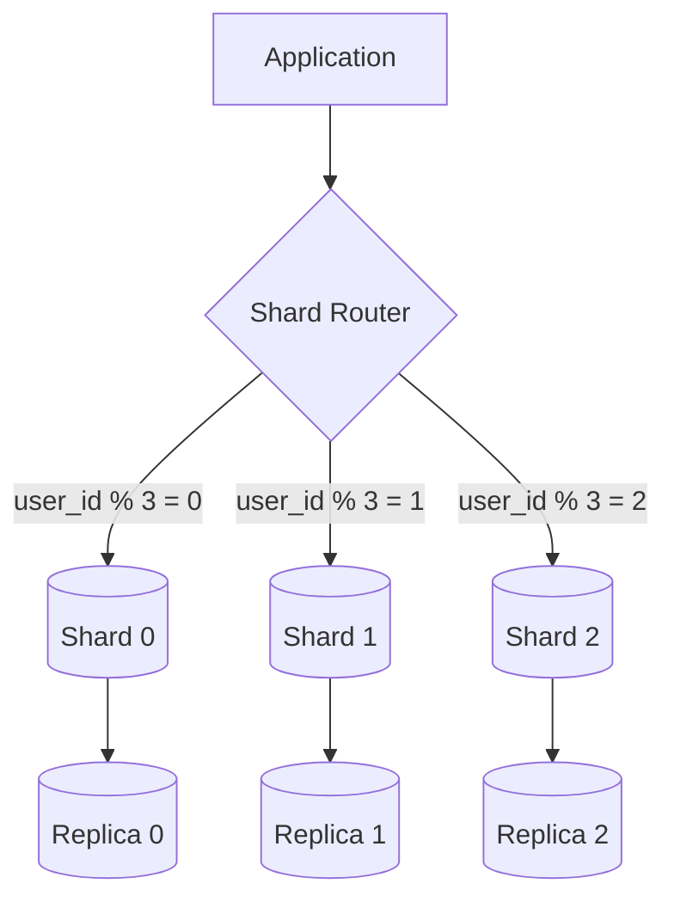

# Database Sharding

**Prerequisites:** [Consistent Hashing](consistent-hashing.md)

---

## Why This Exists

A single database server has physical limits: disk I/O bandwidth, CPU for query processing, memory for buffer pool, network bandwidth. When your write throughput exceeds what one node can handle, you need to scale writes horizontally — **sharding**.

**Sharding** = splitting data across multiple database instances based on a **shard key**.

---

## Mental Model

```
Single DB (vertical limit):         Sharded (horizontal):
┌─────────────────┐                 ┌──────┐ ┌──────┐ ┌──────┐
│   All 100M      │                 │ 33M  │ │ 33M  │ │ 34M  │
│   Users         │        →        │Users │ │Users │ │Users │
│   (1 server)    │                 │Shard0│ │Shard1│ │Shard2│
└─────────────────┘                 └──────┘ └──────┘ └──────┘
```

---

## Sharding Strategies

### 1. Range-Based Sharding

```
Shard 0: user_id 1 – 33,333,333
Shard 1: user_id 33,333,334 – 66,666,666
Shard 2: user_id 66,666,667 – 100,000,000
```

**Pros:** Range queries efficient, easy to reason about
**Cons:** Uneven load if recent users are more active (new users go to shard 2 only → hot shard)

### 2. Hash-Based Sharding

```python
shard_id = hash(user_id) % num_shards
# user_id=1 → shard 0
# user_id=2 → shard 2
# user_id=3 → shard 1
```

**Pros:** Even distribution
**Cons:** Range queries require scatter-gather; resharding expensive (use consistent hashing)

### 3. Directory-Based Sharding

Lookup table: `user_id → shard_id` stored in a separate service.

**Pros:** Flexible, can move data between shards without changing shard key logic
**Cons:** Lookup service is a bottleneck and single point of failure

---

## Architecture



---

## Choosing a Shard Key

**Good shard keys:**
- High cardinality (many distinct values)
- Even distribution (no hot values)
- Used in most queries (avoid cross-shard queries)
- Stable (doesn't change after record creation)

**Poor shard keys:**
- `user_country` — uneven distribution (US >> all others)
- `created_at` — range hot shard problem
- `status` — low cardinality (active vs inactive)

**Examples:**
- E-commerce: `user_id` → all orders for a user on one shard
- Multi-tenant SaaS: `tenant_id` → all data for a tenant on one shard
- Time-series: `(device_id, timestamp_bucket)` → device data co-located

---

## Problems with Sharding

### Cross-Shard Queries
```sql
-- This requires querying all shards and merging results:
SELECT * FROM orders WHERE total > 1000 AND created_at > '2024-01-01'
-- Solution: denormalize, use a separate reporting DB (not sharded), or accept scatter-gather
```

### Hot Shard
One shard receives disproportionate traffic (e.g., one large tenant, one viral product).

**Detection:** Per-shard CPU/IOPS metrics diverge significantly
**Fix:** Shard splitting, move hot tenant to dedicated shard, application-level caching

### Resharding
Adding new shards requires moving data. With consistent hashing, only K/N keys move. With modular hashing, almost everything moves.

**Zero-downtime resharding:**
1. Dual-write to old and new shard
2. Backfill data to new shard
3. Validate consistency
4. Switch reads to new shard
5. Remove old shard

### Distributed Transactions
A transaction touching data on multiple shards requires a distributed transaction protocol (2PC) — complex, slow, and failure-prone.

**Better solution:** Design shard key so related data is co-located (no cross-shard transactions).

---

## Interview Questions

=== "Basic"
    **Q: What is database sharding and when would you use it?**

    "Sharding is horizontal partitioning — splitting data across multiple database instances based on a shard key. Each shard is an independent database handling a subset of the data. You use it when a single database instance can't handle your write throughput or storage requirements. Read replicas handle read scaling; sharding handles write scaling."

=== "Senior"
    **Q: How do you choose a shard key?**

    "Four criteria: (1) High cardinality — must have enough distinct values to distribute data; (2) Even distribution — no 'hot' values that concentrate load; (3) Query locality — the shard key should appear in most queries to avoid cross-shard scatter-gather; (4) Immutability — the key shouldn't change after record creation (changing it means moving data between shards). For most user-centric applications, user_id is the natural choice. For B2B SaaS, tenant_id. For time-series, a compound key like (device_id, time_bucket)."

=== "Staff"
    **Q: How would you migrate a single PostgreSQL database to a sharded architecture with zero downtime?**

    "This is a multi-week migration. Phase 1: Set up the new sharded infrastructure alongside the existing DB. Phase 2: Implement dual-write in the application — new writes go to both old DB and the correct shard. Phase 3: Backfill existing data to the sharded setup. Phase 4: Validate — compare row counts, spot-check records, run read traffic against sharded DB in shadow mode. Phase 5: Shift read traffic to shards gradually (canary → 10% → 50% → 100%). Phase 6: Remove writes to old DB. Phase 7: Decommission old DB. Key risks: dual-write consistency during migration, backfill causing load on old DB, application bugs in shard routing logic. I'd budget 8–12 weeks and have a rollback plan at each phase."

---

## Key Takeaways

!!! success "Remember"
    1. Sharding solves write scaling; read replicas solve read scaling
    2. Shard key choice determines everything — get this wrong and resharding is painful
    3. Co-locate related data to avoid cross-shard queries
    4. Use consistent hashing to minimize data movement during resharding
    5. Hot shards require shard splitting or dedicated resources — there's no automatic fix
