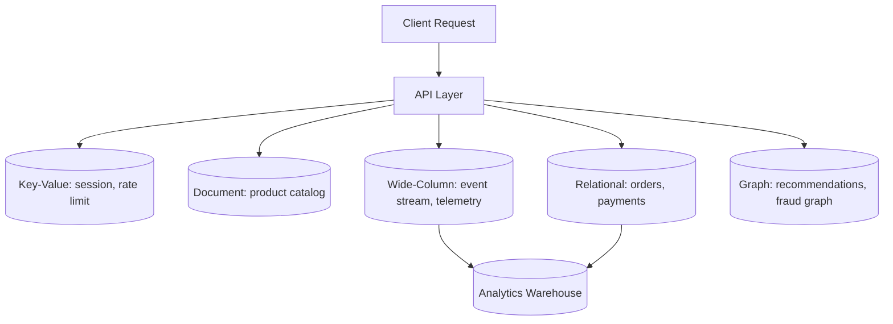

# SQL vs NoSQL

**Prerequisites:** [Database Sharding](sharding.md), [Consistent Hashing](consistent-hashing.md)

[← Consistent Hashing](consistent-hashing.md) | [Next: Indexing & Storage →](indexing.md)

---

## Why This Exists

"SQL vs NoSQL" is a bad framing. It suggests a single axis with relational databases on one end and everything else lumped together on the other. In practice there are at least five distinct data models, each optimized for a different **access pattern**, and the question a Staff engineer actually answers is not "which side am I on" but "what does this workload need to do fast, and what can it afford to get eventually."

The stub version of this debate — "SQL is old and rigid, NoSQL is new and scalable" — is wrong on both counts. Modern relational databases shard, replicate, and scale writes into the millions per second (see [Sharding](sharding.md)). Modern NoSQL databases support secondary indexes, transactions, and joins. The real differences are in the data model's native shape and what it optimizes away.

---

## Mental Model

Think of each database family as answering a different question about how you'll touch the data:

```
Relational   → "How do these entities relate to each other?"
Document     → "What does one aggregate look like as a whole?"
Key-Value    → "Give me the value for this exact key, fast."
Wide-Column  → "Give me a time-ordered slice of this partition."
Graph        → "How are these nodes connected, and how deep?"
```

The model you pick shapes how painful every future query, migration, and scale-out will be. Picking wrong doesn't fail immediately — it fails two years later when a "just add a join" ticket turns into a rewrite.

---

## The Five Families

### 1. Relational (SQL) — Postgres, MySQL, Aurora

**Optimized for:** multi-entity consistency and ad-hoc queries across relationships.

- **Schema:** fixed, enforced at write time
- **Joins:** first-class, query planner optimizes them
- **Transactions:** full ACID, multi-row, multi-table
- **Example use case:** an order management system where an order references a customer, a shipping address, line items, and payment records, and you need "all unpaid orders over $500 placed by customers in California" as a single query.

```sql
SELECT o.id, o.total, c.name
FROM orders o
JOIN customers c ON c.id = o.customer_id
WHERE o.status = 'unpaid' AND o.total > 500 AND c.state = 'CA';
```

### 2. Document — MongoDB, DynamoDB (document mode), Firestore

**Optimized for:** reading and writing one self-contained aggregate as a unit.

- **Schema:** flexible per-document, versioned in application code
- **Joins:** discouraged; you embed instead of join
- **Transactions:** strong within a document, weaker across documents
- **Example use case:** a product catalog where each product has a variable set of attributes (a shirt has size/color, a laptop has RAM/storage) and you almost always fetch one product at a time.

```json
{
  "_id": "sku_9182",
  "name": "Trail Runner Jacket",
  "attributes": { "size": ["S", "M", "L"], "color": "orange", "waterproof": true },
  "price_cents": 12900
}
```

### 3. Key-Value — Redis, Memcached, DynamoDB (KV mode), Riak

**Optimized for:** O(1) lookup by a single exact key, nothing else.

- **Schema:** none — the value is an opaque blob
- **Joins:** not supported
- **Transactions:** single-key atomic operations only
- **Example use case:** session storage (`session:abc123 → user_id, expiry`), a feature-flag cache, a rate-limit counter.

### 4. Wide-Column — Cassandra, Bigtable, HBase, ScyllaDB

**Optimized for:** high-throughput writes and range scans within a partition, across a massive number of partitions.

- **Schema:** column families defined loosely; rows in a partition can have different columns
- **Joins:** not supported — you design the table around the query, not the entity
- **Transactions:** per-partition (lightweight transactions); no cross-partition ACID
- **Example use case:** time-series telemetry — `partition_key = device_id`, `clustering_key = timestamp` — writing millions of sensor readings per second and reading "the last 24 hours for device X" as a contiguous scan.

```
Partition: device_id=42
  2026-08-13T00:00:00 → {temp: 21.3, humidity: 40}
  2026-08-13T00:00:05 → {temp: 21.4, humidity: 40}
  2026-08-13T00:00:10 → {temp: 21.4, humidity: 41}
```

### 5. Graph — Neo4j, Amazon Neptune, JanusGraph

**Optimized for:** traversing relationships of arbitrary, unknown depth.

- **Schema:** nodes and edges, both with properties
- **Joins:** replaced by graph traversal — no join-explosion as depth increases
- **Transactions:** ACID, but the win is traversal speed, not consistency
- **Example use case:** "friends of friends who are not already friends" for a social network, or fraud rings — "accounts that share a device fingerprint within 2 hops of a known bad actor." A relational equivalent needs a self-join per hop and gets slower with every hop; a graph traversal stays roughly constant per hop.

---

## Architecture: Where Each Fits in a Request Path



---

## Trade-off Axes

These are the axes that actually matter — not "SQL vs NoSQL" but where each family lands on each axis.

| Axis | Relational | Document | Key-Value | Wide-Column | Graph |
|------|-----------|----------|-----------|-------------|-------|
| Schema flexibility | Low (migrations) | High (per-doc) | Highest (opaque) | Medium (per-partition) | Medium |
| Join support | Native, optimized | Emulated via embedding | None | None (denormalize) | Native (traversal) |
| Horizontal write scale | Harder (needs sharding) | Good | Excellent | Excellent | Moderate |
| Consistency guarantee | Strong (ACID) | Strong per-doc | Eventual (usually) | Tunable (Cassandra: per-query) | Strong |
| Query flexibility | Highest (arbitrary SQL) | Medium (query language per doc shape) | Lowest (key only) | Low (query = table design) | High for relationships, low otherwise |
| Read pattern | Ad-hoc, joins | Whole aggregate | Point lookup | Range scan in partition | Traversal |

---

## How It Works: The Underlying Trade

Every one of these systems is trading the same currency: **how much work happens at write time vs. read time**, and **how much the schema constrains you vs. the query engine does**.

- Relational pushes structure to write time (schema, constraints, indexes) so reads can be arbitrary and still fast — the query planner does the work.
- Wide-column pushes structure to write time even harder — you design the table for the one query pattern you'll run, so writes are cheap and reads are a sequential scan.
- Document defers structure to the application — flexible writes, but "what does this field mean" lives in code, not the database.
- Key-value defers almost everything — the fastest possible read, the least the database can help you with.
- Graph inverts the relational trade-off: instead of computing joins at query time across normalized tables, it stores the relationship as a first-class, traversable edge, so multi-hop reads don't degrade with depth the way SQL self-joins do.

---

## Worked Example: Choosing for a Social Feed

A social app needs: user profiles, posts, a "who follows whom" graph, a materialized feed, and session auth.

```
User profiles         → Relational or Document (structured, low write volume, needs strong consistency for username uniqueness)
Follow graph           → Graph DB or adjacency-list table (traversal: "who does X follow", "mutual follows")
Post content            → Document (variable attachments, embeds, per-post schema drift over time)
Feed generation (fan-out)→ Wide-Column (partition per user, clustering by time — exactly the Cassandra sweet spot)
Session / auth tokens   → Key-Value (Redis — O(1) lookup, TTL expiry built in)
```

This is **one product**, five data stores. That's normal at this scale, not over-engineering — each store is doing the one thing it's fastest at.

---

## Failure Modes

### Forcing Joins on a Document Store
Modeling a document database like a relational one — normalizing into many small collections and joining in application code — gets you the worst of both: no query planner to optimize the join, and N+1 round trips.

**Detection:** application code doing loops of queries per parent document
**Fix:** embed related data that's read together; reference (and denormalize) data that's independently updated

### Wide-Column Table Designed Around the Entity, Not the Query
Cassandra tables designed like relational tables (`users`, `posts`, joined at read time) force scatter-gather reads across partitions — the opposite of what wide-column stores are for.

**Detection:** read queries hitting multiple partitions or requiring `ALLOW FILTERING`
**Fix:** one table per query pattern, denormalize aggressively, accept write amplification

### Eventual Consistency Surprising the Product
A key-value or wide-column store returns stale data right after a write (read-your-own-write violation) — a user posts a comment and doesn't see it on refresh.

**Detection:** support tickets like "my update disappeared" that resolve themselves on retry
**Fix:** read-your-writes via session affinity to the same replica, or route the immediate post-write read to the primary

### Graph Database for Simple Lookups
Using a graph database for data that's mostly point lookups (not traversal) adds operational and query-language overhead with no payoff.

**Detection:** most queries are single-hop equality lookups, not multi-hop traversal
**Fix:** graph DBs earn their cost on 2+ hop traversal; for 0–1 hop, a relational or document store is simpler and cheaper

---

## Production Debugging

```
Symptom: Feature works in staging, times out in production at scale.

1. Is the query doing a join/traversal the store isn't built for?
   → EXPLAIN (relational), query profiler (Mongo), trace (graph)
2. Is the access pattern actually point-lookup but modeled as relational?
   → check for single-row SELECTs behind a full schema + joins overhead
3. Is a wide-column table being scanned across partitions?
   → check for ALLOW FILTERING or missing partition key in WHERE
4. Is eventual consistency causing retried/duplicate writes downstream?
   → check idempotency keys, write timestamps vs. read timestamps
5. Is one store doing double duty as both OLTP and analytics?
   → move reporting to a warehouse; don't run aggregate queries on the primary
```

**Metrics:** `query_latency_p99{store}`, `cross_partition_scans`, `join_row_estimate_vs_actual`, `stale_read_rate`, `replica_lag`.

---

## Scaling Limits

- Relational scales reads easily (replicas) but writes need [sharding](sharding.md) — plan the shard key before you need it, not after.
- Document stores scale writes well but joins across collections get worse, not better, as data grows — denormalize early.
- Key-value stores scale almost linearly but offer no query flexibility — if you find yourself scanning keys by pattern, it's the wrong store.
- Wide-column stores scale to petabytes and huge write volume but every new query pattern may need a new table (denormalized copy) — schema evolution has an operational cost.
- Graph traversal performance degrades with unconstrained hop count on dense graphs — bound the traversal depth or pre-materialize common paths.

---

## Decision Table

| If your access pattern is... | And consistency needs are... | And scale is... | Reach for |
|---|---|---|---|
| Ad-hoc queries across related entities | Strong, multi-row transactions | Moderate (fits one primary + replicas, or shardable) | **Relational** |
| Fetch/update one aggregate at a time | Strong per-document | High write volume, flexible schema | **Document** |
| Exact-key lookup, cache, session, counter | Eventual is fine | Very high, low latency required | **Key-Value** |
| Time-ordered or partitioned range scans | Tunable (per-query) | Very high write throughput, many nodes | **Wide-Column** |
| Multi-hop relationship traversal | Strong | Traversal-bound, not row-count-bound | **Graph** |

```mermaid
flowchart TD
    A[What's the access pattern?] -->|Ad-hoc joins across entities| B[Relational]
    A -->|Whole aggregate, one call| C[Document]
    A -->|Exact key, O(1)| D[Key-Value]
    A -->|Time/partition range scan, huge write volume| E[Wide-Column]
    A -->|Multi-hop traversal| F[Graph]
```

---

## Polyglot Persistence

Most systems past a certain scale don't pick one database family — they pick several, each for the workload it's best at. This is **polyglot persistence**, and it's the normal end state, not a smell.

**Example architecture — an e-commerce platform:**

```
Relational (Postgres)   → orders, payments, inventory counts (needs ACID transactions)
Document (MongoDB)      → product catalog (variable attributes per category)
Key-Value (Redis)       → cart sessions, rate limiting, feature flags
Wide-Column (Cassandra) → clickstream / view events at massive write volume
Graph (Neo4j)           → "customers who bought X also bought Y" recommendations
Warehouse (Snowflake)   → nightly ETL from all of the above for BI/reporting
```

The cost of polyglot persistence is operational: more systems to run, monitor, back up, and staff for. The Staff-level judgment call is when the access-pattern mismatch is expensive enough to justify that operational cost — a startup with one Postgres instance handling everything is often correct; a platform at 100M users with five specialized stores is also often correct. The mistake is picking the second architecture on day one, or refusing to leave the first one once a single access pattern is clearly the bottleneck.

---

## Trade-offs

| Dimension | Relational | Document | Key-Value | Wide-Column | Graph |
|-----------|-----------|----------|-----------|-------------|-------|
| Best at | Multi-entity consistency | Aggregate read/write | Point lookup latency | Write throughput + range scan | Relationship traversal |
| Worst at | Horizontal write scale | Cross-collection joins | Any query beyond key | Ad-hoc queries | Simple point lookups |
| Operational maturity | Very high | High | High | High | Lower, smaller ecosystem |
| Example engines | Postgres, MySQL | MongoDB, Firestore | Redis, DynamoDB (KV) | Cassandra, Bigtable | Neo4j, Neptune |

---

## Interview Questions

=== "Basic"
    **Q: What's the core difference between SQL and NoSQL databases?**

    "It's not one axis — 'NoSQL' covers several different data models: document, key-value, wide-column, and graph, each optimized for a different access pattern. Relational databases enforce a fixed schema and support arbitrary joins with strong multi-row transactions. The NoSQL families each trade some of that generality — usually join support or schema rigidity — for a specific strength: key-value trades everything for O(1) lookup latency, wide-column trades flexibility for write throughput and range scans, document trades joins for flexible per-record schema, graph trades general query flexibility for fast multi-hop traversal."

=== "Senior"
    **Q: How would you decide between a document database and a relational database for a new service?**

    "I'd look at the access pattern first: do I mostly read and write one self-contained object at a time, or do I need to query and join across multiple related entities in ways I can't fully predict up front? If it's the former — like a product catalog with per-category attributes — document fits, because the schema flexibility avoids constant migrations. If I need strong multi-row transactions, like debiting one account and crediting another atomically, or ad-hoc reporting queries across entities, relational wins. I'd also weigh operational maturity — Postgres tooling, backups, and expertise are more mature at most companies than a document store's — so the bar for leaving relational should be a real access-pattern mismatch, not just 'NoSQL scales better,' which is often not true or not the actual bottleneck."

=== "Staff"
    **Q: A team wants to migrate their monolith's single Postgres database to 'NoSQL for scale.' How do you evaluate this?**

    "First I'd find the actual bottleneck — is it write throughput, read latency, schema rigidity, or operational cost? 'NoSQL for scale' is often a proxy for 'we hit a wall we haven't diagnosed.' If the real problem is write throughput on one table, [sharding](sharding.md) Postgres or moving just that table to a wide-column store solves it without touching everything else — that's the polyglot persistence approach: migrate the workload that actually needs it, not the whole system. If it's ad-hoc reporting queries slowing down OLTP, the fix is a read replica or warehouse, not a data model change. I'd push back on an all-or-nothing rewrite: it introduces new consistency semantics the application wasn't built for (read-your-writes, eventual consistency), a new operational surface, and usually takes far longer than the team estimates. I'd want a workload-by-workload audit before agreeing to move anything, and I'd expect the end state to be polyglot — most of the system staying on Postgres, with one or two specific hot paths moved to a purpose-built store."

---

## Reasoning Exercises

1. You're building a URL shortener (`short_code → long_url`, billions of entries, read-heavy, no relationships). Which family fits best, and why would relational be overkill?
2. A ride-sharing app needs: driver locations (updated every few seconds), trip history (needs joins with payments and users), and "drivers near this rider" queries. Sketch which store handles each and why a single database wouldn't fit all three.
3. Your team stores user profiles in MongoDB and just added a requirement: "generate a report of all users who made a purchase in the last 30 days, joined with their support ticket history (in a separate relational database)." What's the right place to do this join, and why not in the application layer at request time?
4. A wide-column table is designed as `partition_key = event_type`, `clustering_key = timestamp`. After six months, the `login` event type partition is 500x larger than any other and is timing out. What's the actual design mistake, and how would you fix the partition key?

---

## Key Takeaways

!!! success "Remember"
    1. "SQL vs NoSQL" is really five data models — relational, document, key-value, wide-column, graph — each built for a different access pattern, not a single scale-vs-flexibility axis
    2. Pick based on read/write pattern first: point lookup, aggregate fetch, range scan, ad-hoc join, or multi-hop traversal
    3. The real trade-off axes are schema flexibility, join support, horizontal write scale, consistency guarantees, and query flexibility — rank your workload on each before picking a store
    4. Polyglot persistence — several database types in one system, each doing what it's best at — is the normal end state at scale, not over-engineering
    5. Don't migrate the whole system for one workload's bottleneck; diagnose the specific access pattern that's failing and move only that
