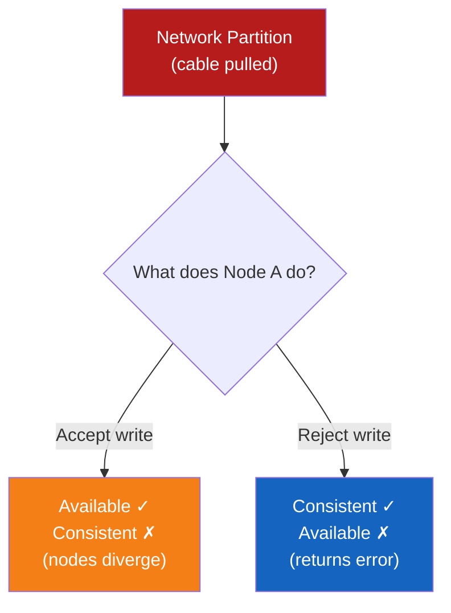
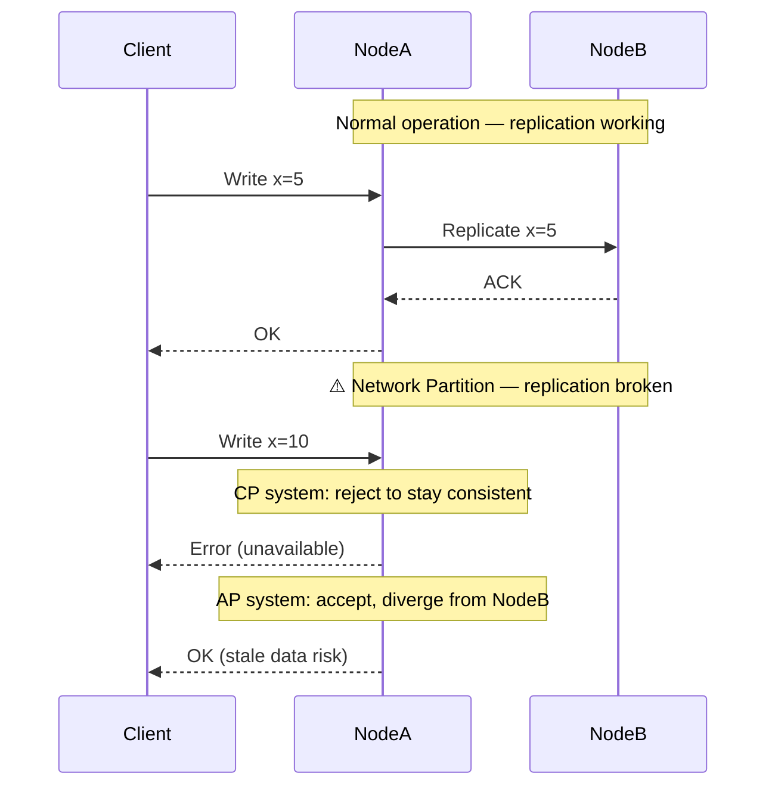

# CAP Theorem

**Prerequisites:** Replication basics, Network fundamentals

[← Distributed Systems Overview](index.md) | [Next: Consistency Models →](consistency-models.md)

---

## Why This Exists

In 2000, Eric Brewer observed that distributed systems face an unavoidable tension. You cannot simultaneously guarantee all three of:

- **Consistency** — every read returns the most recent write
- **Availability** — every request gets a non-error response
- **Partition Tolerance** — the system keeps operating even when network messages are lost/delayed between nodes

The CAP theorem formalizes this: **in the presence of a network partition, you must choose between consistency and availability.**

!!! tip "Mental Model"
    Imagine two database nodes (Node A and Node B) connected by a network cable. You pull out the cable — a **network partition** occurs.

    - Node A gets a write request. Should it accept it and risk diverging from Node B?
    - If it accepts → Available but inconsistent
    - If it rejects → Consistent but unavailable
    - Partition Tolerance is not a choice — networks fail. The real choice is C vs A during a partition.

---

## The Unavoidable Choice



---

## CAP Categories

| Category | Guarantee | Real Systems | Use When |
|----------|-----------|--------------|----------|
| **CP** | Consistent + Partition Tolerant | ZooKeeper, etcd, HBase, MongoDB (default) | Financial data, config, coordination |
| **AP** | Available + Partition Tolerant | Cassandra, CouchDB, DynamoDB (eventual) | Shopping carts, social feeds, DNS |
| **CA** | Consistent + Available | Single-node RDBMS | Not a distributed system — partitions aren't tolerated |

!!! warning "Production Trap"
    "CA" systems don't truly exist in distributed systems. Any distributed system must tolerate network partitions — otherwise a partition causes complete system failure. CA means "single node" in practice.

---

## Architecture Diagram



---

## How It Works Internally

### What is a Partition?

A network partition is when messages between nodes are lost or significantly delayed — not when a node crashes. Partitions can be:

- A switch failure isolating one rack
- High packet loss on an inter-datacenter link
- A firewall rule change
- Network congestion dropping packets

### Why Can't We Have All Three?

**Proof sketch:**
1. Two nodes, A and B. A receives write W1.
2. Before A replicates to B, a partition occurs.
3. Client queries B for the same key.
4. If we want **Consistency**: B must return W1 → B must wait → not **Available**
5. If we want **Availability**: B responds immediately → returns stale data → not **Consistent**

---

## PACELC — The More Practical Model

CAP only covers the partition case. **PACELC** extends it:

> **If Partition (P):** choose Availability (A) or Consistency (C).
> **Else (E) — no partition:** choose Latency (L) or Consistency (C).

| System | Partition behavior | Normal behavior |
|--------|--------------------|-----------------|
| DynamoDB | Available (AP) | Low Latency (EL) |
| Cassandra | Available (AP) | Low Latency (EL) |
| MongoDB | Consistent (CP) | Low Latency (EL) |
| Spanner | Consistent (CP) | Consistent (EC) |
| HBase | Consistent (CP) | Consistent (EC) |

!!! note "Interview Insight 🎯"
    PACELC is more useful in real design conversations than CAP alone because most distributed systems don't experience partitions often — the latency vs consistency trade-off (the "EL" part) dominates daily operation.

---

## Realistic Example

**Designing a bank balance system:**

Requirements:
- Must always show correct balance (never show more money than exists)
- Read/write the same account from multiple DCs

**Choice:** CP — we reject writes during partition rather than risk showing incorrect balances.

**Implementation:** Use quorum reads/writes (e.g., write to 2/3 replicas, read from 2/3). During a partition, if we can't reach quorum, return error — not stale data.

**Designing a shopping cart:**

Requirements:
- Must always be accessible (losing a cart abandonment is expensive)
- Slight staleness acceptable (cart merge on reconnection is fine)

**Choice:** AP — accept writes during partition, merge conflicts on reconnection (Last Write Wins or semantic merge).

---

## Failure Modes

### CP system during partition
- **Symptom:** Clients receive errors / timeouts on writes
- **Impact:** Revenue impact if the partitioned component handles customer-facing traffic
- **Detection:** Error rate spike, timeout alerts
- **Mitigation:** Multi-AZ deployment to reduce partition probability; circuit breakers to fail fast

### AP system during partition
- **Symptom:** Stale reads, conflicting writes, data anomalies post-partition
- **Impact:** Inventory overselling, duplicate orders, lost updates
- **Detection:** Read-your-writes violations, conflict resolution logs
- **Mitigation:** Design for conflict resolution upfront; use CRDTs where possible

---

## Production Debugging

When investigating consistency issues in a distributed system:

```
Symptom: User sees stale data after a write

1. Check replication lag
   → replica_lag metric, binlog position
2. Check if partition occurred
   → network error rate between nodes, packet loss
3. Check read routing
   → is the read going to a replica vs primary?
4. Check consistency level
   → Cassandra: QUORUM vs ONE, DynamoDB: strong vs eventual
5. Check for split-brain
   → are two nodes both accepting writes thinking they're primary?
```

**Key metrics to monitor:**
- Replication lag (p50, p99)
- Network packet loss between nodes
- Write acknowledgment rate
- Read-your-writes violation rate (application-level)

---

## Scaling Limits

- CP systems sacrifice availability during partitions → harder to scale writes globally
- AP systems scale writes globally easily but require conflict resolution strategy
- Spanner achieves global CP using TrueTime (atomic clocks + GPS) — extreme engineering cost

---

## Trade-offs

| Dimension | CP | AP |
|-----------|----|----|
| Consistency | Strong | Eventual |
| Availability during partition | Degraded | Full |
| Write throughput | Lower (quorum) | Higher |
| Conflict handling | None needed | Required |
| Operational complexity | Medium | High (merge logic) |
| Use cases | Finance, config, coordination | Social, carts, DNS, analytics |

---

## Interview Questions

=== "Basic"
    **Q: What is CAP theorem?**

    "CAP states that a distributed system can guarantee at most two of: Consistency (every read gets the latest write), Availability (every request gets a response), and Partition Tolerance (system works despite network failures). Since network partitions are unavoidable, the real choice is between C and A *during* a partition."

=== "Senior"
    **Q: How do you decide between CP and AP for a new service?**

    "I start with the data: what happens if two nodes accept conflicting writes and we can't reconcile them? For financial transactions — unacceptable, CP. For a shopping cart — a merge strategy handles it, AP is fine. I also consider access patterns: how frequently do partitions actually occur in our infrastructure? If we're single-region with good networking, partitions are rare, so the 'EL' part of PACELC (latency vs consistency during normal operation) matters more than the partition case."

=== "Staff"
    **Q: We're migrating from a CP system (PostgreSQL) to a globally distributed AP system (Cassandra) to reduce latency in APAC. What are the organizational and engineering risks?**

    "First, I'd challenge the premise — why do we need global writes? Read replicas might get us 80% of the latency win without the consistency complexity. If we do proceed: we need to audit every write path for conflict sensitivity, design conflict resolution upfront (LWW is dangerous for inventory), ensure the application can handle 'eventual' — meaning UI, notifications, billing. Operationally, the team needs Cassandra expertise and tooling. I'd also set SLOs for read-your-writes guarantees and measure violation rates from day one. And plan the migration incrementally — start with non-critical writes."

---

## Reasoning Exercises

1. **E-commerce inventory**: 100 warehouses, each can decrement stock. Items should never go negative. Is this CP or AP? What's the conflict resolution strategy?

2. **Social media likes**: Instagram shows like counts. Exact count matters less than availability. CP or AP? What consistency model do you use?

3. **Distributed config service** (like etcd): Used by hundreds of microservices to read feature flags. CP or AP? What happens if the config cluster has a partition?

4. **DNS**: You query a DNS server for an IP. The answer might be cached and 30 minutes stale. CP or AP? Why is this the right choice?

---

## Key Takeaways

!!! success "Remember"
    1. Networks partition — it's not if, but when
    2. Partition Tolerance is mandatory in distributed systems; the choice is C vs A **during** a partition
    3. PACELC extends CAP: even without partitions, there's a latency vs consistency trade-off
    4. Most systems are "mostly CP" or "mostly AP" — it's a spectrum, not binary
    5. Design for the failure mode explicitly: CP means failing loud; AP means merging conflicts

**Previous:** [Distributed Systems Overview](index.md) | **Next:** [Consistency Models](consistency-models.md)
