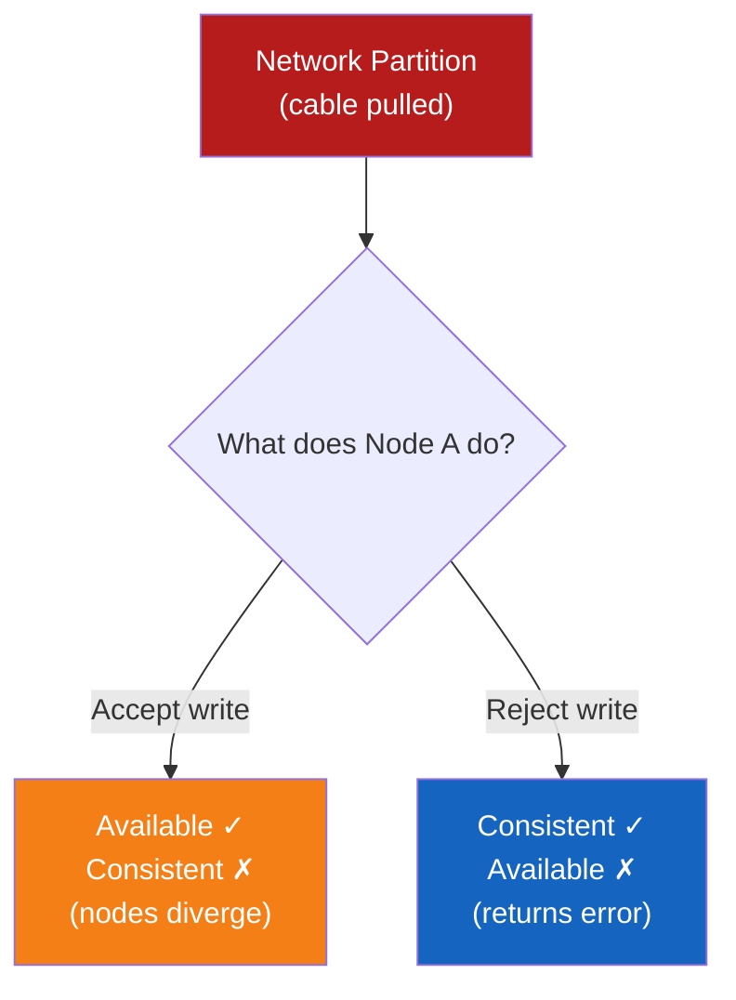
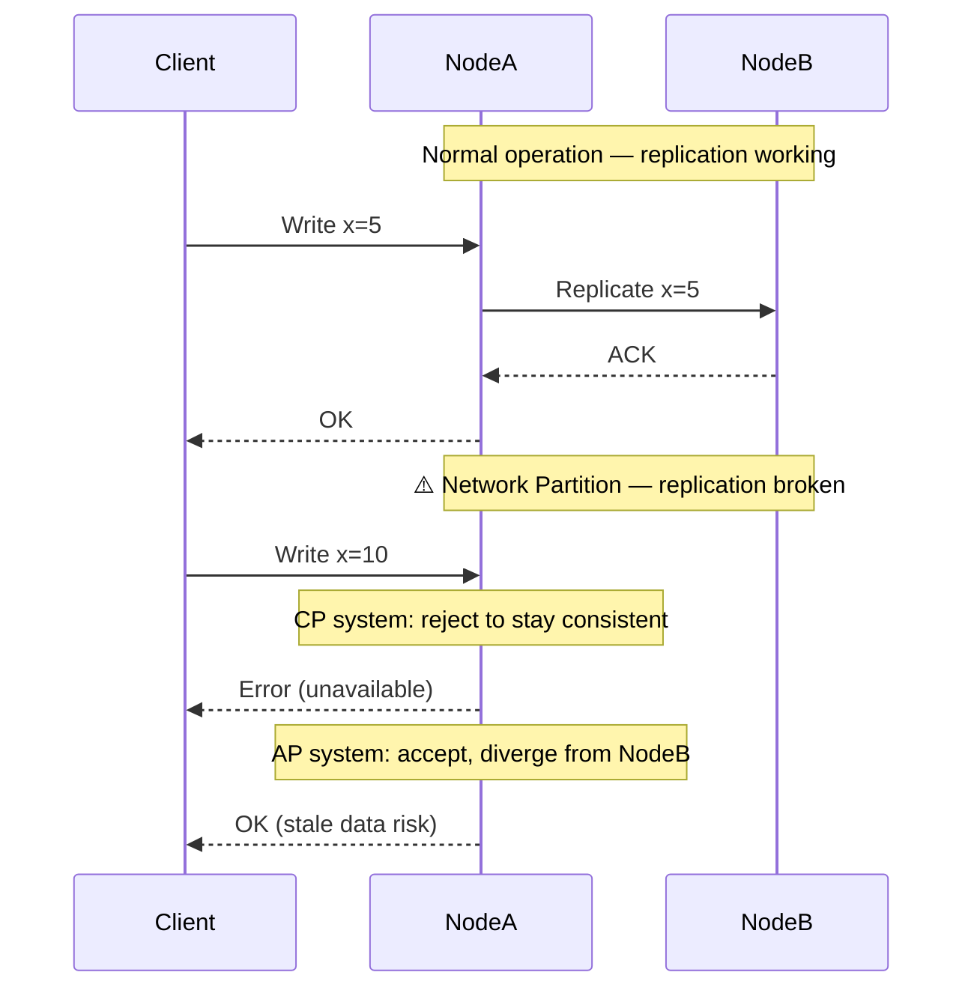

# CAP Theorem

**Prerequisites:** Replication basics, Network fundamentals

[← Distributed Systems Overview](index.md) | [Next: Consistency Models →](consistency-models.md)

---

## Why This Exists

In 2000, Eric Brewer observed that distributed systems face an unavoidable tension. You cannot simultaneously guarantee all three of:

- **Consistency** — every read returns the most recent write
- **Availability** — every request gets a non-error response
- **Partition Tolerance** — the system keeps operating even when network messages are lost/delayed between nodes

The CAP theorem formalizes this: **in the presence of a network partition, you must choose between consistency and availability.**

!!! tip "Mental Model"
    Imagine two database nodes (Node A and Node B) connected by a network cable. You pull out the cable — a **network partition** occurs.

    - Node A gets a write request. Should it accept it and risk diverging from Node B?
    - If it accepts → Available but inconsistent
    - If it rejects → Consistent but unavailable
    - Partition Tolerance is not a choice — networks fail. The real choice is C vs A during a partition.

---

## The Unavoidable Choice



---

## CAP Categories

| Category | Guarantee | Real Systems | Use When |
|----------|-----------|--------------|----------|
| **CP** | Consistent + Partition Tolerant | ZooKeeper, etcd, HBase, MongoDB (default) | Financial data, config, coordination |
| **AP** | Available + Partition Tolerant | Cassandra, CouchDB, DynamoDB (eventual) | Shopping carts, social feeds, DNS |
| **CA** | Consistent + Available | Single-node RDBMS | Not a distributed system — partitions aren't tolerated |

!!! warning "Production Trap"
    "CA" systems don't truly exist in distributed systems. Any distributed system must tolerate network partitions — otherwise a partition causes complete system failure. CA means "single node" in practice.

---

## How Real Databases Behave

"CP" and "AP" are configuration defaults, not fixed identities — most of these systems let you dial the trade-off per-query. What matters in an interview is knowing the *default*, *why* it was chosen, and — critically — that what actually determines partition behavior is topology, quorum/fencing policy, and which reads/writes are allowed during a partition, **not** replication mode alone. Sync vs. async replication changes acknowledgement durability and latency; it doesn't by itself decide what happens when nodes can't reach each other.

| Database | Default | Mechanism | Can you change it? |
|---|---|---|---|
| **MongoDB** | CP-leaning | Single primary per shard via replica-set election (Raft-like); writes go to primary. Primary reads are consistent *relative to that primary*, but not linearizable unless you also set `readConcern: linearizable`, which adds a majority-read round trip | `readPreference: secondaryPreferred` trades consistency for availability/latency on reads; `readConcern`/`writeConcern` levels are the real CP/AP-ish knobs, not "primary vs secondary" alone |
| **Cassandra** | AP | Leaderless, any replica accepts writes; tunable consistency levels (`ONE`, `QUORUM`, `ALL`) | Yes, per-query — `QUORUM` reads+writes narrows the staleness window at the cost of latency; `ONE` is fully AP. `QUORUM` is not the same guarantee as a consensus-backed CP system — it narrows staleness, it doesn't provide linearizability |
| **PostgreSQL** (with replicas) | CP for the primary's own reads/writes; replica behavior depends entirely on topology | Single writer (primary). Synchronous replication blocks the write until a standby acks — this controls **durability and latency**, not partition behavior by itself | Whether the system stays *available* during a partition depends on your failover policy: automatic failover needs a fencing/quorum mechanism (e.g. Patroni + etcd) to avoid two primaries after a split; without one, a naive setup can produce split-brain, which is worse than either CP or AP |
| **Redis** (Cluster/Sentinel) | AP in practice | Asynchronous replication by default; a failed-over replica can be missing the last few writes | `WAIT N timeout` makes the *client* wait for N replicas to ack before treating a write as durable — it reduces the data-loss window on failover, it does **not** make Redis linearizable or turn the cluster into a CP system; split-brain during a partition is still possible without proper fencing |
| **DynamoDB** | AP (tunable) | Eventually consistent reads by default; `ConsistentRead: true` opts a single read into strong consistency *within a region* | Yes — per-request, not global; cross-region behavior (Global Tables) is still eventually consistent regardless of this flag |
| **etcd / ZooKeeper** | CP | Raft/ZAB consensus — a write only commits after a majority quorum acks; a minority partition can't elect a leader or commit new writes | Writes: no — quorum commit isn't optional, that's the entire point of a coordination service. Reads: yes — etcd's default `serializable` read skips quorum and can return stale data for lower cost, upgrading to `linearizable` costs a round trip; ZooKeeper's ordinary read is local-and-possibly-stale, and `sync()` before a read forces it to catch up to the leader first |

!!! note "Interview Insight 🎯"
    Naming "MongoDB is CP, Cassandra is AP" is table stakes. The senior answer separates two different things that are easy to conflate: **replication mode** (sync/async) controls durability and latency, while **partition behavior** (what happens when nodes can't talk to each other) is actually determined by consensus/quorum and fencing — whether a minority side can still accept writes, and whether something prevents two nodes from both believing they're primary. "We use synchronous replication" answers a durability question; it doesn't by itself answer "are we CP or AP," which is why a system with synchronous replication but no fencing can still split-brain during a partition.

---

## Architecture Diagram



---

## How It Works Internally

### What is a Partition?

A network partition is when messages between nodes are lost or significantly delayed — not when a node crashes. Partitions can be:

- A switch failure isolating one rack
- High packet loss on an inter-datacenter link
- A firewall rule change
- Network congestion dropping packets
- Elevated latency that crosses a timeout threshold — nodes are technically reachable, but slow enough that the system must treat them as partitioned anyway (a "gray failure," often harder to detect than a clean disconnect)

The dangerous case isn't the partition itself — it's what happens if both sides keep accepting writes without realizing the other side is still alive: **split-brain**, where two nodes each believe they're the leader, both accept writes, and the histories diverge in a way that isn't a simple merge. This is precisely what quorum-based consensus (Raft, ZAB) is designed to prevent — see [Consensus & Raft](raft.md) for the mechanism.

### Why Can't We Have All Three?

**Proof sketch:**
1. Two nodes, A and B. A receives write W1.
2. Before A replicates to B, a partition occurs.
3. Client queries B for the same key.
4. If we want **Consistency**: B must return W1 → B must wait → not **Available**
5. If we want **Availability**: B responds immediately → returns stale data → not **Consistent**

---

## PACELC — The More Practical Model

CAP only covers the partition case. **PACELC** extends it:

> **If Partition (P):** choose Availability (A) or Consistency (C).
> **Else (E) — no partition:** choose Latency (L) or Consistency (C).

| System | Partition behavior | Normal behavior |
|--------|--------------------|-----------------|
| DynamoDB | Available (AP) | Low Latency (EL) |
| Cassandra | Available (AP) | Low Latency (EL) |
| MongoDB | Consistent (CP) | Low Latency (EL) |
| Spanner | Consistent (CP) | Consistent (EC) |
| HBase | Consistent (CP) | Consistent (EC) |

!!! note "Interview Insight 🎯"
    PACELC is more useful in real design conversations than CAP alone because most distributed systems don't experience partitions often — the latency vs consistency trade-off (the "EL" part) dominates daily operation.

---

## Read & Write Trade-offs

The PACELC "EL" axis isn't abstract — it shows up directly as a knob on every read and write:

```
Stronger consistency  ──────────────────────────────  Higher availability
  Slower writes                                          Faster writes
  Higher read latency                                     Lower read latency
  (wait for quorum/replica ack                          (ack immediately, replicate
   before returning)                                      in the background)
```

| | Strong consistency (quorum/sync) | Eventual consistency (async) |
|---|---|---|
| **Write path** | Block until majority of replicas ack — write latency = slowest replica in the quorum | Ack after the local/primary write — replication happens after the client already has a response |
| **Read path** | Route to primary, or read from a quorum and reconcile — extra round trip(s) | Read from nearest/any replica — lowest possible latency, may be stale |
| **Failure behavior** | A replica being slow or unreachable directly delays or fails the request | A replica being behind just means it serves slightly old data — the request still succeeds |
| **Cost** | Throughput ceiling = your slowest quorum member; you pay latency on every single operation | Staleness window that's unbounded unless you add a mechanism (read-your-writes, bounded staleness) to cap it |

This is why "consistency level" is usually a per-request parameter (Cassandra's `ONE`/`QUORUM`/`ALL`, DynamoDB's `ConsistentRead`) rather than a database-wide setting — a single system routinely runs both ends of this trade-off simultaneously: strong reads for a payment total, eventual reads for a "people also viewed" widget, against the same cluster.

---

## Realistic Example

**Designing a bank balance system:**

Requirements:
- Must always show correct balance (never show more money than exists)
- Read/write the same account from multiple DCs

**Choice:** CP — we reject writes during partition rather than risk showing incorrect balances.

**Implementation — and why quorum reads/writes alone are not enough:** Quorum (write to 2/3, read from 2/3, overlapping majorities) guarantees a read *sees* the most recent acknowledged write — that's freshness, and it's genuinely useful. It does **not** guarantee a read-modify-write is atomic. Two overlapping quorum reads can both see balance=100, both compute "100 − 30 = 70" independently, and both quorum-write 70 — a classic lost update, even though every individual read and write was itself quorum-consistent (this is exactly the gap between quorum reads/writes, which are not linearizable by themselves, and true linearizability). A bank balance mutation needs one of:

- **Compare-and-swap / conditional writes** (Cassandra's `IF balance = :expected`, a lightweight transaction) — the write only applies if the value hasn't changed since it was read, so a concurrent lost update fails the CAS and must retry instead of silently overwriting.
- **Consensus-backed writes** (Raft/Paxos-replicated state machine — etcd, Spanner-style) — the whole read-modify-write goes through a single linearizable log, so concurrent mutations serialize correctly by construction.
- **A ledger design instead of a mutable balance** — append immutable debit/credit entries (each one an independent, idempotent write) and compute balance as a sum/fold over entries, rather than mutating a single balance field at all. This sidesteps the lost-update problem entirely, because there's no shared mutable value for two writers to race on.

Plain quorum reads/writes are the right foundation for freshness and durability during a partition, but "CP + quorum" is not by itself a safe answer for a concurrent balance mutation — say so explicitly in an interview, because reaching for quorum alone here is exactly the mistake this example is warning against.

**Designing a shopping cart:**

Requirements:
- Must always be accessible (losing a cart abandonment is expensive)
- Slight staleness acceptable (cart merge on reconnection is fine)

**Choice:** AP — accept writes during partition, merge conflicts on reconnection (Last Write Wins or semantic merge).

**Designing a chat/messaging system:**

Requirements:
- Users must always be able to send a message, even if a data-center link is degraded
- Messages must eventually be delivered and ordered correctly per-conversation, but a few seconds of delay is invisible to the user

**Choice:** AP for the send path — accept the message locally, replicate and reorder asynchronously (this is exactly the trade-off [WhatsApp-style messaging systems](../system-design-exercises/index.md) make: never block "send" on cross-region replication). Note the nuance: *within* a single conversation, causal/session consistency still matters — a reply shouldn't appear before the message it's replying to — so "AP" here means available-with-ordering-guarantees-per-conversation, not "anything goes."

---

## Failure Modes

### CP system during partition
- **Symptom:** Clients receive errors / timeouts on writes
- **Impact:** Revenue impact if the partitioned component handles customer-facing traffic
- **Detection:** Error rate spike, timeout alerts
- **Mitigation:** Multi-AZ deployment to reduce partition probability; circuit breakers to fail fast

### AP system during partition
- **Symptom:** Stale reads, conflicting writes, data anomalies post-partition
- **Impact:** Inventory overselling, duplicate orders, lost updates
- **Detection:** Read-your-writes violations, conflict resolution logs
- **Mitigation:** Design for conflict resolution upfront; use CRDTs where possible

---

## Production Debugging

When investigating consistency issues in a distributed system:

```
Symptom: User sees stale data after a write

1. Check replication lag
   → replica_lag metric, binlog position
2. Check if partition occurred
   → network error rate between nodes, packet loss
3. Check read routing
   → is the read going to a replica vs primary?
4. Check consistency level
   → Cassandra: QUORUM vs ONE, DynamoDB: strong vs eventual
5. Check for split-brain
   → are two nodes both accepting writes thinking they're primary?
```

**Key metrics to monitor:**
- Replication lag (p50, p99)
- Network packet loss between nodes
- Write acknowledgment rate
- Read-your-writes violation rate (application-level)

---

## Scaling Limits

- CP systems sacrifice availability during partitions → harder to scale writes globally
- AP systems scale writes globally easily but require conflict resolution strategy
- Spanner achieves global CP using TrueTime (atomic clocks + GPS) — extreme engineering cost

---

## Trade-offs

| Dimension | CP | AP |
|-----------|----|----|
| Consistency | Strong | Eventual |
| Availability during partition | Degraded | Full |
| Write throughput | Lower (quorum) | Higher |
| Conflict handling | None needed | Required |
| Operational complexity | Medium | High (merge logic) |
| Use cases | Finance, config, coordination | Social, carts, DNS, analytics |

---

## Interview Questions

=== "Basic"
    **Q: What is CAP theorem?**

    "CAP states that a distributed system can guarantee at most two of: Consistency (every read gets the latest write), Availability (every request gets a response), and Partition Tolerance (system works despite network failures). Since network partitions are unavoidable, the real choice is between C and A *during* a partition."

=== "Senior"
    **Q: How do you decide between CP and AP for a new service?**

    "I start with the data: what happens if two nodes accept conflicting writes and we can't reconcile them? For financial transactions — unacceptable, CP. For a shopping cart — a merge strategy handles it, AP is fine. I also consider access patterns: how frequently do partitions actually occur in our infrastructure? If we're single-region with good networking, partitions are rare, so the 'EL' part of PACELC (latency vs consistency during normal operation) matters more than the partition case."

=== "Staff"
    **Q: We're migrating from a CP system (PostgreSQL) to a globally distributed AP system (Cassandra) to reduce latency in APAC. What are the organizational and engineering risks?**

    "First, I'd challenge the premise — why do we need global writes? Read replicas might get us 80% of the latency win without the consistency complexity. If we do proceed: we need to audit every write path for conflict sensitivity, design conflict resolution upfront (LWW is dangerous for inventory), ensure the application can handle 'eventual' — meaning UI, notifications, billing. Operationally, the team needs Cassandra expertise and tooling. I'd also set SLOs for read-your-writes guarantees and measure violation rates from day one. And plan the migration incrementally — start with non-critical writes."

---

## Reasoning Exercises

1. **E-commerce inventory**: 100 warehouses, each can decrement stock. Items should never go negative. Is this CP or AP? What's the conflict resolution strategy?

2. **Social media likes**: Instagram shows like counts. Exact count matters less than availability. CP or AP? What consistency model do you use?

3. **Distributed config service** (like etcd): Used by hundreds of microservices to read feature flags. CP or AP? What happens if the config cluster has a partition?

4. **DNS**: You query a DNS server for an IP. The answer might be cached and 30 minutes stale. CP or AP? Why is this the right choice?

---

## Key Takeaways

!!! success "Remember"
    1. Networks partition — it's not if, but when
    2. Partition Tolerance is mandatory in distributed systems; the choice is C vs A **during** a partition
    3. PACELC extends CAP: even without partitions, there's a latency vs consistency trade-off — and it shows up directly as slower/safer writes vs faster/riskier ones
    4. Most systems are "mostly CP" or "mostly AP" — it's a spectrum, not binary, and usually a **per-request** dial (Cassandra's consistency levels, DynamoDB's `ConsistentRead`) rather than a database's fixed identity
    5. Design for the failure mode explicitly: CP means failing loud; AP means merging conflicts
    6. Split-brain — two nodes both believing they're the leader — is the failure quorum-based consensus (Raft, ZAB) exists specifically to prevent

**Previous:** [Distributed Systems Overview](index.md) | **Next:** [Consistency Models](consistency-models.md)
