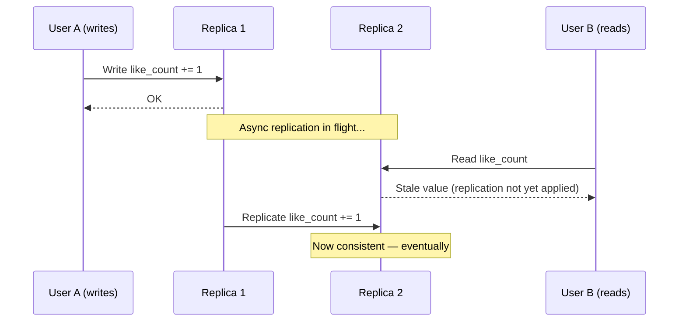

# Consistency Models

**Prerequisites:** [CAP Theorem](cap-theorem.md), [Replication](replication.md)

[← CAP Theorem](cap-theorem.md) | [Next: Replication →](replication.md)

---

## Why This Exists

"Consistency" is not one thing. When someone says "our database is eventually consistent" or "we use strong consistency," they're picking a point on a spectrum — and that point determines what your application is allowed to assume about the order and visibility of writes.

Get this wrong and you ship bugs that only appear under concurrency: a user "loses" an item they just added to their cart, a like count goes backward, two replicas of the same account show different balances. These aren't rare edge cases — they're the default behavior of a system with weaker guarantees than the application assumed.

!!! tip "Mental Model"
    Picture a shared whiteboard with photocopies mailed to remote offices. **Linearizable** means everyone reads the whiteboard itself — one queue, real-time order, no stale copies. **Eventual** means everyone reads their own photocopy, updated whenever the mail arrives — fast, always available, but you might read yesterday's board. Everything in between is a rule about *whose* photocopy you're allowed to read and *when* it must be up to date.

---

## The Spectrum


Moving left → right: stronger guarantees, higher latency, lower availability during partitions. Moving right → left: better latency and availability, more surprising behavior for the application developer.

---

## The Models

### Linearizable (Strong) Consistency

Every read returns the value of the most recent write, and all operations appear to happen in a single, real-time global order. If write W1 completes before write W2 starts (in wall-clock time), every observer sees W1 before W2 — no exceptions, no stale reads, ever.

- **Cost:** every read/write typically requires coordination (a quorum round-trip or a trip to a single leader).
- **Example systems:** ZooKeeper, etcd, Spanner (via TrueTime), a single-node database.

### Sequential Consistency

All operations appear in *some* single global order that respects each individual client's program order — but that order doesn't have to match real-time (wall-clock) order across clients. Two clients might disagree about which of two concurrent writes "came first" in time, but everyone agrees on the same overall sequence.

- **Weaker than linearizable**, but still gives every observer a single consistent story.
- **Example:** distributed logs / append-only sequencers where you need one agreed order but not real-time recency guarantees.

### Causal Consistency

Operations that are *causally related* (a reply to a comment, a read that influenced a later write) are seen by everyone in the same order. Concurrent, unrelated operations can be seen in different orders by different observers.

- **Example:** you comment "Yes!" on a post. Nobody should ever see your reply before the post it replies to — even if they're on different replicas. But two unrelated comments from different users can appear in any order.
- Implemented via **vector clocks** or dependency tracking to know what "happened-before" what.

### Eventual Consistency

If no new writes occur, all replicas *eventually* converge to the same value — with no bound on how long "eventually" takes and no ordering guarantee in the meantime.

- **Cheapest, fastest, most available.**
- **Example systems:** Cassandra (default), DynamoDB (default), DNS.

### Session Guarantees (the practical middle ground)

Most production systems don't pick a single point on the spectrum — they offer **per-client** guarantees layered on top of eventual consistency, scoped to one user's session:

| Guarantee | Promise | Example |
|-----------|---------|---------|
| **Read-your-writes** | A client always sees its own prior writes | You post a comment, refresh, and it's there — even if another user's replica hasn't caught up |
| **Monotonic reads** | Once a client sees a value, it never sees an older one | You don't see your friend's post, refresh, and have it disappear |
| **Monotonic writes** | A client's writes are applied in the order it issued them | Your edits to a document apply in the order you made them, not shuffled |
| **Writes-follow-reads** | A write made after reading value X is ordered after X | You reply to a comment you just read — reply can't be visible before the comment |

These are cheap to implement (e.g., by routing a client's requests to the same replica, or by having the client track a version token) and solve the majority of "our eventually-consistent system feels broken" complaints without paying for full linearizability.

---

## Architecture — Where the Divergence Happens



The gap between "N1 acknowledges the write" and "N2 has applied it" is where every consistency model earns its name. Strong consistency closes that gap by making the read wait; eventual consistency lets the read return immediately and accepts the staleness.

---

## Worked Example: Shopping Cart Under a Partition

A user adds an item to their cart from their phone, then immediately opens the cart on their laptop during a network partition between the datacenter serving the phone and the one serving the laptop.

| Model | Behavior | User sees |
|-------|----------|-----------|
| **Linearizable** | Laptop read blocks/errors until it can confirm the latest state, or is routed to the same replica that has the write | Either correct cart or an explicit error — never wrong data |
| **Sequential** | Both devices see the add-to-cart eventually, in an order consistent with the user's actions, but laptop's *real-time* freshness isn't guaranteed | Cart converges, but "which action happened first" across devices may not match wall-clock reality |
| **Causal** | If "add item" causally precedes "apply coupon," every replica applies them in that order | Coupon never applies before the item exists in the cart |
| **Read-your-writes** | If routed to the replica that took the phone's write (or session-pinned), laptop sees the item immediately | Item appears instantly on second device |
| **Eventual (no session guarantee)** | Laptop may show an empty cart until the partition heals and replication catches up | Item "missing" for a few seconds/minutes — classic support ticket |

Same operation, five different user-visible outcomes, purely a function of which consistency model backs the cart service.

---

## Connection to CAP and PACELC

Consistency models are the fine-grained answer to the coarse question CAP asks. [CAP theorem](cap-theorem.md) says: during a partition, choose C or A. Consistency models describe **which C** — full linearizability, or one of the weaker points on the spectrum that still gives useful guarantees while remaining available.

[PACELC](cap-theorem.md#pacelc-the-more-practical-model) makes this concrete even *without* a partition: a system offering linearizable reads pays a latency tax on every single request (coordination with a quorum or leader), while a system offering eventual or causal consistency can serve from the nearest replica. Choosing a consistency model is really choosing where on the latency/correctness curve your application wants to live — for every request, not just during rare partition events.

### Quorums: R + W > N

Quorum-based systems (Cassandra, DynamoDB, Riak) let you *tune* the consistency model per operation using three numbers:

- **N** — number of replicas holding the data
- **W** — number of replicas that must acknowledge a write before it succeeds
- **R** — number of replicas a read must query before returning

**The rule:** if `R + W > N`, every read set overlaps with every write set by at least one replica — guaranteeing the read sees the latest write (strong-ish consistency, modulo clock/version comparison to pick the winner). If `R + W ≤ N`, reads and writes can miss each other entirely — you're eventually consistent.

```
N=3, W=2, R=2  → R+W=4 > 3   strong read (quorum overlap guaranteed)
N=3, W=1, R=1  → R+W=2 ≤ 3   fast, but reads may miss the latest write
N=3, W=3, R=1  → R+W=4 > 3   slow writes, fast strong reads
```

This is the mechanism that lets one system offer both `ONE` (fast, eventual) and `QUORUM` (slower, strong-ish) consistency per query — the model isn't fixed at the database level, it's chosen per operation.

---

## Failure Modes

### Strong consistency assumed, eventual delivered
- **Symptom:** "I just saved this and it's gone" tickets, race-condition bugs that vanish when you add a `sleep()`
- **Cause:** engineer read the docs for the primary datastore but the read path actually hits a read replica or cache with lag
- **Mitigation:** make the consistency contract explicit per code path; add read-your-writes via session pinning or version tokens

### Causal violations
- **Symptom:** replies appear before the comment they're replying to; a "reaction" shows up detached from its post, briefly orphaned
- **Cause:** replicating operations without tracking happened-before relationships (plain timestamp-based ordering with clock skew)
- **Mitigation:** vector clocks or dependency metadata attached to writes; buffer out-of-order delivery until dependencies arrive

### Quorum math wrong
- **Symptom:** "QUORUM" reads still occasionally return stale data
- **Cause:** `R + W ≤ N` in practice — e.g., a node down drops effective N without adjusting R/W, or hinted handoff writes don't count toward W correctly
- **Mitigation:** monitor effective quorum health, alert when replica count drops below what your R/W math assumes

---

## Production Debugging

```
Symptom: user reports "my write disappeared" or "I see old data"

1. Identify the consistency model in play for that code path
   → which datastore, which read/write API (ONE vs QUORUM, primary vs replica)
2. Check replication lag between the write replica and read replica
   → replica_lag metric, is it seconds or minutes?
3. Check R+W vs N for the operation
   → is this actually configured for a strong read, or does the team assume it is?
4. Check for session/routing issues
   → is the client's read pinned to the same node as its write, or load-balanced randomly?
5. Check clock skew if using timestamp-based conflict resolution
   → NTP drift can silently reorder "last write wins" outcomes
```

**Key metrics to monitor:**
- Replication lag (p50 / p99, per replica)
- Read-your-writes violation rate (compare client-observed write ack vs subsequent read)
- Quorum failure rate (reads/writes unable to reach configured R/W)
- Clock skew across nodes (if timestamps drive conflict resolution)

---

## Scaling Limits

- Linearizable systems bottleneck on the coordination path (single leader, or quorum round-trip) — write throughput caps out well below what eventual systems can sustain.
- Causal consistency requires tracking dependency metadata per operation; at very high write volumes, vector clocks or dependency graphs become a real memory and bandwidth cost.
- Session guarantees are nearly free at scale — they only require sticky routing or a lightweight version token, not global coordination.
- Eventual consistency scales writes horizontally with almost no ceiling, at the cost of pushing conflict resolution into the application.

---

## Trade-offs

| Model | Latency | Availability (during partition) | Correctness guarantee | Typical use case |
|-------|---------|----------------------------------|------------------------|-------------------|
| Linearizable | Highest | Lowest | Real-time global order | Bank balances, distributed locks, leader election |
| Sequential | High | Low | Single global order (not real-time) | Distributed logs, ordered event sequencers |
| Causal | Medium | Medium | Preserves happened-before order | Comment threads, collaborative editing |
| Read-your-writes / session | Low | High | Per-client freshness only | Social feeds, user profile edits |
| Eventual | Lowest | Highest | Convergence, no ordering | Like counts, DNS, caches, analytics |

---

## Interview Questions

=== "Basic"
    **Q: What's the difference between strong and eventual consistency?**

    "Strong (linearizable) consistency means every read reflects the most recent write, in real-time order — as if there were only one copy of the data. Eventual consistency means replicas will converge to the same value *eventually*, with no guarantee on how long that takes or what order reads see writes in during that window. Strong consistency costs latency and availability; eventual buys you speed and uptime at the cost of temporary staleness."

=== "Senior"
    **Q: A user says they added an item to their cart and it disappeared when they refreshed. How do you debug and fix this?**

    "First I'd check whether the read and write paths hit the same replica — if writes go to a primary and reads are load-balanced across replicas with async replication lag, that's a textbook read-your-writes violation, not data loss. I'd check replication lag metrics at the time of the report. The fix isn't necessarily 'go fully strong' — it's usually cheaper to add a session guarantee: pin the user's reads to the replica that took their write for a short window, or have the client pass a version token and have the read wait until the replica has caught up to that version."

=== "Staff"
    **Q: You're designing the consistency model for a multiplayer collaborative document editor. Walk through your choice.**

    "I'd reach for causal consistency as the backbone: edits that depend on each other (typing after a paste, a comment reply) must be applied in causal order, but two users editing unrelated paragraphs concurrently don't need a global order — that's what makes concurrent editing feel fast. I'd track causality via something like a vector clock or an operational-transform/CRDT dependency structure rather than wall-clock timestamps, since clock skew would silently corrupt ordering. On top of that I'd add monotonic reads so a user's own view never regresses. I would explicitly avoid full linearizability — coordinating every keystroke through a single sequencer would make the editor feel laggy for a use case where sub-second staleness is invisible to users but blocking latency is very visible. I'd also plan the conflict-resolution algorithm (OT vs CRDT) before writing any replication code, since retrofitting it is the expensive part."

---

## Reasoning Exercises

1. **Like counts**: Instagram-style like counter, millions of concurrent likes/unlikes. Would you choose CRDT-based eventual consistency, causal, or strong? What observable bug would each *wrong* choice produce?

2. **Bank transfer between two accounts**: what's the minimum consistency model that makes "money never appears or disappears" safe, and why is eventual consistency actively dangerous here even with conflict resolution?

3. **Chat "read receipts"**: design the consistency guarantee for "seen" markers across a group chat. Does every participant need to agree on the exact order receipts were set, or just eventual convergence? Justify with a concrete failure scenario for the wrong choice.

---

## Key Takeaways

!!! success "Remember"
    1. Consistency is a spectrum, not a binary — linearizable, sequential, causal, session guarantees, and eventual each promise something different.
    2. Session guarantees (read-your-writes, monotonic reads/writes) solve most real user complaints without paying for full strong consistency.
    3. CAP tells you C vs A during a partition; consistency models tell you *which* C, and PACELC reminds you there's a latency cost even without a partition.
    4. Quorum math (`R + W > N`) lets you tune consistency per-operation rather than per-database.
    5. Pick the weakest model that keeps your invariants safe — every step toward "stronger" costs latency and availability.

**Previous:** [CAP Theorem](cap-theorem.md) | **Next:** [Replication](replication.md)
