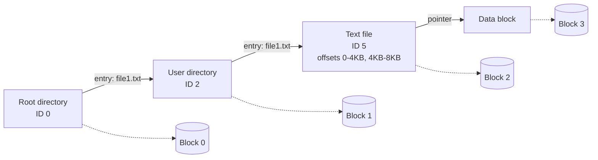
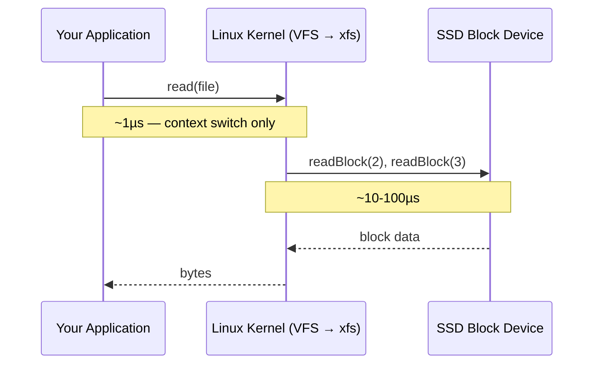
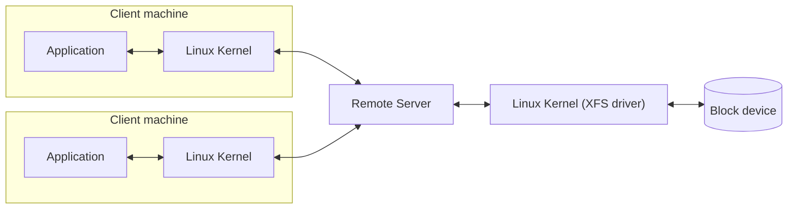
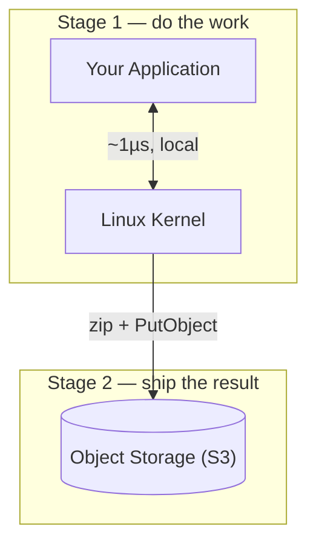
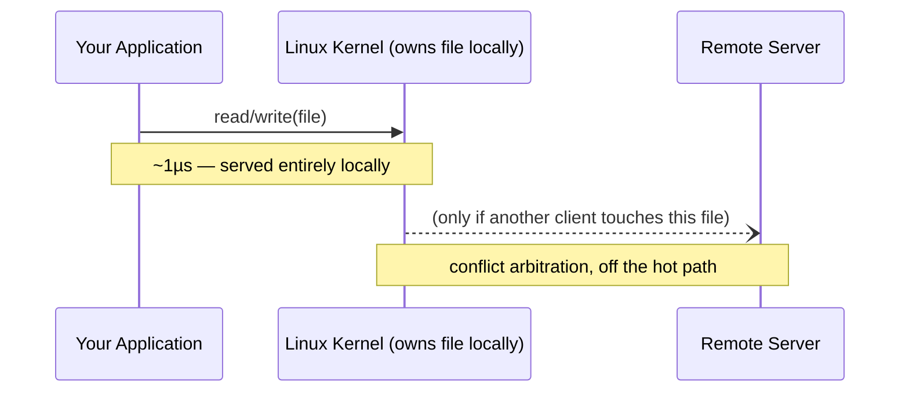

# File Storage vs. Block Storage

**Prerequisites:** [Fundamentals](fundamentals.md)

[← Distributed Systems](index.md)

---

## Why This Exists

"File system" gets used to mean three unrelated things. A real local file system (XFS, ZFS). A real remote file system (NFS, Lustre). And things that aren't file systems at all but get treated like one anyway — S3, Dropbox, a homegrown blob table on top of Postgres.

The confusion isn't pedantic. It's why a team mounts a shared NFS volume expecting "the same disk, just shared," runs `git clone` on it, and watches an operation that takes 2 seconds locally take 3 minutes remotely. Nothing is broken. The mount is doing exactly what a network file system is supposed to do — it's just that "supposed to do" turns out to mean a network round trip for every single file and directory operation, and nobody budgeted for that.

To see why, you have to go one layer lower than "file system" and start at the actual disk.

---

## Mental Model

```
Block device                          File system
─────────────                         ───────────
getLength() → blockCount              mkdir / rmdir
readBlock(id) → data                  create / link / unlink
writeBlock(id, data)                  getattr / setattr
                                       read(fd, offset) / write(fd, offset)
Fixed size, known upfront             No fixed size
No transactions, single writer        Directories, permissions, paths
```

A block device is a fixed-length array of fixed-size buckets — usually 4 KB — with a three-function API and zero transactional semantics. A file system is what turns "block 4,819 has some bytes in it" into `/home/alice/report.pdf`, and it's implemented as a layer inside the OS kernel, not inside the disk.

Everything below follows from that one fact: the file system is software, running on one machine, that happens to read and write a block device. The moment you want two machines to share one file system, you're asking two kernels to agree on state that neither of them fully owns — and that's a distributed systems problem wearing a familiar API.

---

## From Blocks to Files

Your laptop's SSD is literally an array of blocks:

```
SSD Block Device — 32 KB, 8 × 4 KB blocks
┌────────┬────────┬────────┬────────┬────────┬────────┬────────┬────────┐
│Block 0 │Block 1 │Block 2 │Block 3 │Block 4 │Block 5 │Block 6 │Block 7 │
└────────┴────────┴────────┴────────┴────────┴────────┴────────┴────────┘
```

Two properties matter more than they look:

1. **Fixed length, known upfront.** There is no such thing as an infinite block device.
2. **No transactions.** No conditional updates, no compare-and-swap. Safe only because exactly one writer — your laptop — talks to it at a time.

Writing directly to blocks is possible but miserable: data bigger than 4 KB has to span blocks, deleted data leaves holes you must track, and there's no way to *find* anything without separately remembering which blocks hold what. The file system exists to carry that bookkeeping for you.



A directory is just an array of `(name, pointer)` entries; a file is an array of pointers to the blocks holding its actual bytes. Chain enough of these together, starting from a known root, and you get an addressable, permissioned, arbitrarily-large-file namespace out of a device that only knows how to read and write fixed 4 KB buckets.

This is the POSIX API — `mkdir`, `create`, `read`/`write` at an offset, `rename` — standardized across Linux-like systems, and it's what nearly every database, including SQLite and Postgres, is built on. Note what's *not* in that list: a fixed total size. Unlike the block device underneath it, a file system doesn't need to know its capacity ahead of time to be useful.

!!! note "S3 is not a file system"
    Object storage's whole insight is that you don't need to organize your data — a string key (which may contain slashes) points at a blob, full stop. There are no real directories, which is exactly why renames and partial overwrites on S3 are expensive: operations a real file system does by rewriting a pointer, S3 can only fake by moving or rewriting the whole object.

Because file systems (like databases) are entirely a story of trade-offs, the kernel doesn't hardcode one — it exposes a **virtual file system (VFS)** layer that routes calls to whichever implementation is mounted (XFS, ext4, ZFS, ...). A local read looks like this:



---

## Shared File Storage

Local block devices don't scale past one machine, and they don't tolerate a second writer. The obvious fix is to put the file system behind a server: multiple clients talk to it over the network, and the server becomes the single point that decides who's allowed to do what.



Now two clients racing to create `file1.txt` in the same directory is a solved problem — the server serializes it and rejects one. You've enabled multiple writers, and with more servers you can even scale operations-per-second past what one machine could do. Congratulations, you've built NFS. Run `git clone` on it and it's roughly 100x slower than the local version. Same file system semantics, same API — so what changed?

---

## Why Remote File Storage Is Slow

The sneaky part: for performance reasons, an OS basically never wants to touch the physical disk on every write. POSIX reflects this directly — writes can sit in memory until you explicitly call `fsync`/`syncfs`, and until you do, that data can vanish on a crash.

This is the actual difference between "interactive" workloads and "database" workloads. `git clone` and `npm install` never call `fsync` — they're effectively pure in-memory operations. Every SQLite `INSERT` calls `fsync` — it's measuring your storage hardware's real durability latency, every time.

| Path | Hop | Latency |
|---|---|---|
| Block storage (no fsync) | App → kernel | ~1µs |
| File storage (no fsync) | App → kernel → remote server | ~1µs + ~500µs |
| File storage (no fsync), server persists | ... → block device | + ~100µs |

That ~500µs is a network round trip your local block device never pays — and it's paid on **every single operation**, not just the ones that call `fsync`, because the server has to serialize every write against every other client to detect conflicts. `git clone` creates thousands of small files and directories; multiply thousands by 500µs and the 100x slowdown stops being surprising.

---

## The Industry's Workaround: Local Disk, Then Ship to S3

Given that remote file semantics are this expensive, the pattern almost everyone converges on is: do the actual work on local (block-backed) storage, and only pay the network cost once, at the end, as a bulk upload.



This is a good trade when you don't care about intermediate state — you want the final artifact or nothing, and `git clone` running entirely in memory against local disk is about as fast as this gets. It's also why sandbox/container boot time scales with image size: the image sits in S3 and has to be pulled down in full — as a bulk blob, not incrementally — before anything can start.

It doesn't scale, though. Upload time grows with data size, download time to resume grows with data size, and every trick people use to soften this — partially-readable archive formats, local caching layers — is working around the same underlying problem: shared file storage doesn't inherently have to be this slow.

---

## Rethinking What the Server Actually Needs to Do

Go back to why the server is in the critical path at all: it exists to stop two clients from making conflicting writes at the same time. That's the only job. It does *not* need to be consulted on every operation — it needs to be consulted on every **potentially conflicting** operation, and in most real multi-client workloads (build tools, package installs, multi-service checkouts), different clients are almost always touching different files or different directories.

That observation is the basis of a class of network file systems (Archil is one example) that hand out **local ownership** of a file or directory to the client currently using it. While a client owns a path, its kernel serves reads and writes for that path without any round trip — matching local block-device latency. Only when a *second* client touches the same path does ownership need to move, and the server gets involved to arbitrate:



The three options lined up by per-operation latency:

| Architecture | Path | Typical latency |
|---|---|---|
| Local block storage | App → kernel | ~1µs |
| Remote file storage (NFS-style) | App → kernel → remote server (→ block device) | ~600µs, every op |
| Local-ownership network file system | App → kernel (server only on conflict) | ~1µs common case |

The point isn't that this is magic — it's that "shared storage" and "a network round trip on every operation" were never actually the same requirement. Conflict detection can be pushed to the boundary where conflicts actually happen instead of being paid upfront on every read and write.

---

## Failure Modes

### Treating S3 Like a File System

Calling `rename()` or partially overwriting a byte range works instantly on a real file system because it's a pointer update. On S3 there's no such primitive — a "rename" is a copy of the full object under a new key plus a delete, and a "partial overwrite" typically means rewriting the object. At small scale this is invisible; at GB-scale objects it's the difference between an instant operation and a multi-second one, and teams find out the hard way mid-migration.

### Assuming a Network Mount Behaves Like a Local Disk

The API is identical — that's the trap. `open`, `read`, `write`, `close` all compile and run against an NFS mount exactly like they do locally. The failure shows up as latency, not an error: workloads with many small metadata operations (build systems, `npm install`, anything creating lots of small files) are dominated by the fixed per-operation network round trip, and nothing about the code signals that until you profile it.

### Local-Ownership Thrashing

If many clients genuinely need concurrent write access to the *same* small set of files — not just the same volume — ownership has to keep moving back and forth between clients, and the server round trip you were trying to avoid comes right back. This is structurally the same failure as a hot shard or a hot partition: a scheme that distributes cost across independent keys degrades to worst-case coordination the moment traffic concentrates on one key. See [Database Sharding](../databases/sharding.md#problems-with-sharding) for the same failure mode in a different subsystem.

---

## Production Debugging

```
Symptom: A workload that's fast on local disk is 10-100x slower on the shared mount.

1. Is fsync in the hot path?
   → SQLite/Postgres-style workloads pay real disk latency either way;
     git-clone/npm-install-style workloads should be near-instant if truly local.
2. Count operations, not bytes.
   → npm install on a large tree can be tens of thousands of small file/dir ops;
     at ~500µs of network overhead each, that's seconds to minutes lost to
     round trips, not to data volume.
3. Is this actually two clients fighting over the same files?
   → per-path contention metrics, if your file system exposes them;
     if yes, this is a hot-key problem, not a raw-throughput problem.
4. Would batching or local staging remove the round trips entirely?
   → do the work on local disk, ship the result once, if intermediate
     state doesn't need to survive a crash.
```

---

## Interview Questions

=== "Basic"
    **Q: What's the difference between block storage and file storage?**

    "Block storage is a raw array of fixed-size blocks with a three-function API — read block, write block, get length — and no built-in way to organize or find data. A file system is a layer, implemented in the OS kernel, that turns those blocks into files and directories: it tracks which blocks belong to which file, handles arbitrary file sizes, and exposes the POSIX API — create, read/write at an offset, rename, permissions. Block storage is what a disk actually is; a file system is software that makes it usable."

=== "Senior"
    **Q: Why is a remote/NFS-style file system so much slower than a local one, and how would you speed up a `git clone` against a shared mount?**

    "The API looks identical, but a shared file system has to serialize every operation against every other client to detect conflicting writes, which means every metadata operation — not just data writes — pays a full network round trip, typically hundreds of microseconds. A local block device never pays that because there's only ever one writer. `git clone` creates a large number of small files and directories, so the round-trip cost dominates even though almost none of it calls `fsync`. To speed it up without redesigning the file system: do the checkout on local disk and sync the result to shared storage once at the end, rather than performing the operation directly against the network mount."

=== "Staff"
    **Q: You're designing shared storage for a fleet of build agents that mostly work on independent files but occasionally need to share a workspace. NFS is too slow; S3-plus-local-cache boots too slowly for large images. What would you actually build?**

    "I'd challenge the premise that 'shared storage' requires a network round trip on every operation — it only requires one when two clients actually conflict. I'd design a system where a client is granted local ownership of the files and directories it's actively using, served at local-disk latency by its own kernel, and ownership only transfers back through a coordinating server when a second client touches the same path. For the common case — independent build agents on independent files — this collapses to local-block-device latency; you only pay the network cost at genuine contention points, which is rare in this workload. I'd watch for the failure mode where two agents genuinely need the same files concurrently — that degrades to the same cost as NFS, and no ownership scheme fixes a workload that's fundamentally single-writer-hostile; at that point you need either app-level partitioning of the shared files or you accept the coordination cost as inherent to that specific workspace."

---

## Key Takeaways

!!! success "Remember"
    1. A block device is a fixed-length array of fixed-size blocks with no transactions and exactly one safe writer — the file system is software, in the kernel, that sits on top of it.
    2. S3 is not a file system: no real directories, so renames and partial overwrites are expensive copies, not pointer updates.
    3. `fsync` is the dividing line — workloads that never call it (`git clone`, `npm install`) are effectively in-memory-fast locally, but every metadata op still pays a full network round trip remotely.
    4. Remote file storage is slow because every operation must be serialized against every other client — hundreds of microseconds per op adds up fast on metadata-heavy workloads.
    5. Local-disk-then-S3 works when you only care about the final result, but doesn't scale — upload/download time grows with data size either way.
    6. The server only needs to arbitrate genuine conflicts, not every operation — granting clients local ownership of files they're actively using turns the common case back into local-disk latency.
    7. This degrades exactly like a hot shard: if many clients need the *same* files concurrently, ownership thrashes and the network cost comes back.

**Previous:** [Fundamentals](fundamentals.md) | **Next:** [CAP Theorem](cap-theorem.md)
