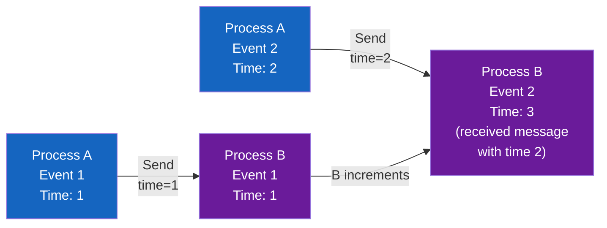
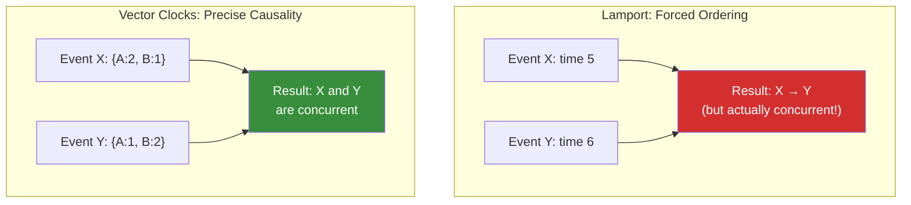
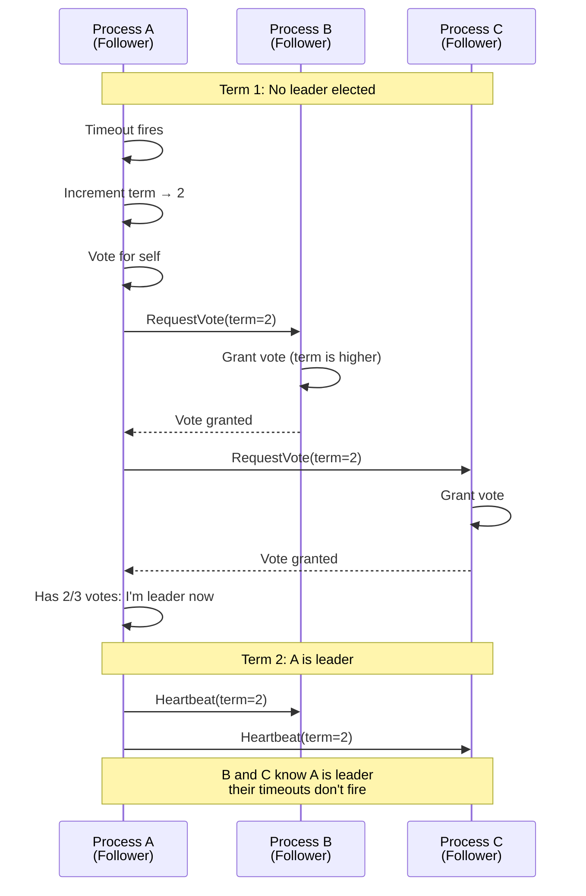

# Distributed Fundamentals

**Prerequisites:** [Consistency Models](consistency-models.md), [Replication](replication.md)

[← Distributed Systems](index.md)

---

## Why This Exists

You have three database replicas. A user updates their profile on replica A. The update has not yet reached replica B. A network partition occurs — A and B are disconnected. Both accept writes. Then the partition heals.

Now you have two conflicting versions of the profile. Your system needs to:
- Detect that a conflict happened
- Decide which version wins (and communicate why)
- Possibly merge them
- Ensure all replicas agree on the outcome

This document teaches the primitives that make consensus possible: logical time (so causality is measurable), leader election (so one replica can decide), and distributed locks (so only one thing changes at a time).

---

## The Core Problem: Machines Cannot Share Time

**In a single machine:**
```python
x = 1     # Timestamp: T1
y = x + 1 # Timestamp: T2, and T2 > T1
```

Clear causality: y depends on x.

**Across machines:**
```
Machine A: x = 1  (clock says 10:00:00.000)
Machine B: y = 2  (clock says 10:00:00.001, but is actually 50ms faster than A)

Question: Did x = 1 happen before y = 2?
Answer: Depends whose clock you trust (and you cannot trust any of them).
```

Physical clocks drift. NTP gets you within milliseconds, not microseconds. **You cannot rely on physical time for causality.**

Solution: **logical time** — a counter that increases with every event, so causality is provable without trusting any clock.

---

## Lamport Clocks: Counting Events

### The Idea

Each process maintains a counter, incremented on every event. When communicating, processes exchange counters and advance their own:

```
Process A                    Process B
Counter: 0                   Counter: 0

Event: Send message          
Counter: 1                   
  ↓ Message (carry counter=1)
                             Receive message
                             Counter: max(0, 1) + 1 = 2
                             
Event: Another action        
Counter: 2                   
                             Event: Another action
                             Counter: 3
```

**Lamport timestamp = (logical_counter, process_id)**

The process_id is the tiebreaker:
- Event at A with counter 5: `(5, A)`
- Event at B with counter 5: `(5, B)`
- `(5, A) < (5, B)` because A < B lexicographically

### Visual: Lamport Clocks Over Time



### The Limitation

Lamport clocks tell you *some* ordering, but not complete causality. Example:

```
Event X at process A: time (5, A)
Event Y at process B: time (5, B)

These never communicate with each other. 
Neither sees the other's events.

Which happened first? Lamport says X < Y (because A < B).
But actually, they're concurrent — neither caused the other.
```

**Lamport clocks preserve order when there's a message, but lie about concurrent events.**

---

## Vector Clocks: Tracking Causality Precisely

Vector clocks fix this by tracking the history of every process:

```python
# Vector clock is a dict: process → count
Process A clock: {A: 0, B: 0}
Process B clock: {A: 0, B: 0}

# Process A has an event
Process A increments its own: {A: 1, B: 0}

# Process A sends a message to B (carries its clock)
Process B receives: {A: 1, B: 0}
Process B merges (take max of each): {A: 1, B: 1}
Process B increments its own: {A: 1, B: 2}

# Process B has another event
Process B increments: {A: 1, B: 3}
```

### Causality Detection

Event X = `clock {A: 1, B: 2}` happened before event Y = `clock {A: 1, B: 3}` if:
- X's clock[i] ≤ Y's clock[i] for all i, and
- At least one clock[i] is strictly less

```python
X = {A: 1, B: 2}
Y = {A: 1, B: 3}

For each process:
  X[A] = 1 ≤ Y[A] = 1 ✓
  X[B] = 2 < Y[B] = 3 ✓
  
Result: X happened before Y (there's a causal path)
```

If neither dominates, they're **concurrent**:

```python
X = {A: 2, B: 1}
Y = {A: 1, B: 2}

X[A] = 2 > Y[A] = 1  (X knows more than Y about A)
Y[B] = 2 > X[B] = 1  (Y knows more than X about B)

Result: X and Y are concurrent (no causal path between them)
```

### Visual: Vector Clocks Detect Concurrency



---

## Distributed Locks: Ensuring One Writer

**Problem:** Two processes both try to update a resource. Without coordination, both succeed with conflicting changes.

```
Process A: Read x=1; write x=2
Process B: Read x=1; write x=3

Result: x=3 (B's write wins, but A's read was stale)
```

### Naive Solution: Central Coordinator

One machine holds "the lock":

```python
class Lock:
    def __init__(self):
        self.holder = None
    
    def acquire(self, process_id):
        if self.holder is None:
            self.holder = process_id
            return True
        return False
    
    def release(self, process_id):
        if self.holder == process_id:
            self.holder = None
```

**Problem:** If the coordinator crashes, nobody can acquire or release locks.

### Redlock: Distributed Lock with Multiple Coordinators

Use a quorum (majority) of coordinators. To acquire a lock, you must contact the majority:

```
Process A tries to acquire lock:
  → Contact coordinator 1: Grant (ok, A holds lock)
  → Contact coordinator 2: Grant (ok, A holds lock)
  → Contact coordinator 3: Grant (ok, A holds lock)
  
A has 3/5 coordinators: A holds the lock

Meanwhile, Process B tries:
  → Contact coordinator 1: Deny (A holds it)
  → Contact coordinator 2: Deny (A holds it)
  → Contact coordinator 4: Grant
  → Contact coordinator 5: Grant
  
B has only 2/5: B does NOT hold the lock

If coordinator 3 crashes, A still has 2/3 remaining.
```

**Trade-off:** Network delays increase (contact multiple nodes). Clock skew can still cause "both acquired the lock" if you're not careful about expiration times.

---

## Leader Election: Choosing One Decision-Maker

When a leader fails, how do you elect a new one without it taking 10 minutes or causing a split-brain (two leaders)?

### Raft: The Understandable Consensus Algorithm

Raft divides time into **terms** (each term has at most one leader). A process becomes a leader by winning an election.

**Election Process:**
1. A process's election timeout fires (randomly 150-300ms)
2. It increments its term and votes for itself
3. It requests votes from other processes
4. If it gets a quorum (majority), it becomes leader
5. The leader sends heartbeats to prevent new elections



**Why randomized timeouts prevent split-brain:**

If all processes had the same timeout, they'd all fire at once and deadlock trying to elect. Randomized timeouts mean one process almost always fires first, wins an election, and sends heartbeats before others fire.

### Visual: Raft Terms and Leaders


---

## Split-Brain: When Partitions Create Two Leaders

A network partition divides the cluster:

```
Partition 1: A, B (have 2/3, quorum)
Partition 2: C (has 1/3, not quorum)

A becomes leader in partition 1.
C cannot become leader (doesn't have quorum).

Now partition heals.
A and C both exist.

Who is the real leader? → A (because A's term is higher)
C steps down.
```

**What if the partition kills the leader side?**

```
Partition 1: A (leader, has 1/3, not quorum)
Partition 2: B, C (have 2/3, quorum)

A cannot be reelected (doesn't have quorum).
A's term advances, but A is not leader.

B or C wins election with quorum.
New leader exists in the partition with the majority.

When partition heals, A steps down.
```

**Key insight:** Quorum voting ensures that only one partition can have a valid leader. The partition with the minority cannot elect anyone.

---

## Real-World Scenarios: What Can Go Wrong

### Scenario 1: Clock Skew

```
Coordinator clock is 100ms slow (drifts).
Process A acquires lock with 1-second TTL.

Coordinator thinks: "Lock acquired at T, expires at T+1s"
Process A thinks: "Lock acquired at T, expires at T+1s"

But coordinator is actually 100ms behind.
So the coordinator's T+1s = Process A's T+900ms.

Process A thinks lock expires at T+1s.
Coordinator expires it at T+900ms (100ms before Process A expects).

Process B acquires the lock at T+950ms.

Now both A and B think they hold the lock. ✗
```

**Fix:** Use timers on the client side, not coordinator side. Process A internally increments a counter and only uses the lock while counter < threshold.

### Scenario 2: Leader Election Storms

```
5 processes, all with the same election timeout.
All timeouts fire simultaneously.
All start elections at the same time.
All split votes 5 ways.
No one gets a quorum.

All increment term and retry.
Cycle repeats forever.
```

**Fix:** Randomized timeouts (Raft uses this).

### Scenario 3: Stale Follower Becomes Leader

```
Process A is leader, replicates writes to B and C.
B goes offline (network fault).

A crashes.
B rejoins the network.

B has only seen writes up to T10.
C also has writes up to T20 (it stayed online).

If B becomes leader (faulty election), writes T10-T20 disappear. ✗
```

**Fix:** Raft's leader election requires that a candidate's log is "at least as up-to-date" as others. B's log (T10) is behind C's (T20), so B cannot win the election.

---

## Interview Guide: From Theory to Practice

### What You Must Explain

1. **Why logical time matters:** Physical clocks drift; causality is invisible without logical time.
2. **Lamport clocks solve ordering:** But don't distinguish concurrency (vector clocks do).
3. **Vector clocks solve causality:** But scale poorly (clock size = number of processes).
4. **Quorum voting prevents split-brain:** Majority partition can decide; minority partition cannot.
5. **Randomized election timeouts prevent deadlock:** One process wins, prevents simultaneous elections.
6. **Clock skew breaks TTL-based locks:** TTL must run on the client, not the coordinator.

### Example Question Walkthrough

**Q: "Your three-node cluster was partitioned. Node A and Node B lost connectivity to Node C. After 5 seconds, both A and B think they are leaders and accept writes. What went wrong?"**

**Answer:**
"This sounds like a Raft failure — probably an election quorum bug or a clock skew issue. Here's my diagnosis:

First, I'd check if you're using a majority quorum. With 3 nodes, the majority is 2. So:
- If A and B can both become leader, they must both have gotten 2 votes (themselves + one other).
- That means at least one of A or B did not verify the other's term.

Second, I'd check election timeouts:
- If all three nodes had synchronized timeouts, they'd all fire together and deadlock on the same term forever.
- Did you implement randomized timeouts? (Raft uses 150-300ms randomly.)

Third, I'd check for stale leaders:
- Did A think it was still leader from an old term? Raft requires that every message carries the term, and a process steps down if it sees a higher term.

My fix: Ensure the implementation checks the other node's term before becoming leader. Only become leader if you get votes from a quorum *in the current term*. And use randomized timeouts.

I'd also instrument the code to log term changes and elections so we can see exactly what happened when the partition occurred."

---

## Key Takeaways

!!! success "Remember"
    1. **Physical clocks drift.** Use logical time (counters) to order events causally.
    2. **Lamport clocks order events** but can't distinguish causality from concurrency.
    3. **Vector clocks track causality precisely** (event A happened before B, or they're concurrent).
    4. **Quorum voting prevents split-brain** — only the majority partition can decide.
    5. **Randomized election timeouts prevent election deadlock** — one process usually wins first.
    6. **The partition with the minority cannot elect a leader.** The cluster continues in the majority partition.
    7. **TTL-based locks must run on the client,** not the coordinator (clock skew breaks coordinator-side TTLs).
    8. **Every write carries a term number.** A process steps down if it sees a higher term.

---

## Related Topics

- [Consistency Models](consistency-models.md) — how causality affects user-visible consistency
- [Replication](replication.md) — how writes are coordinated across replicas
- [Raft](raft.md) — the full consensus algorithm with a simulator

**Previous:** [Distributed Systems](index.md) | **Next:** [Raft](raft.md)
