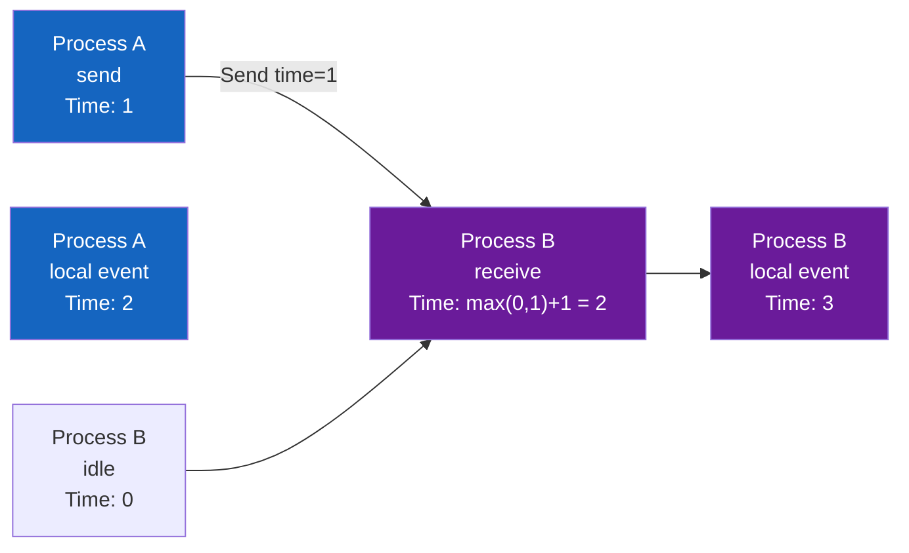
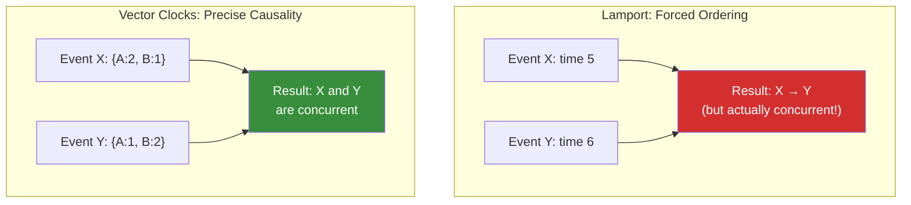
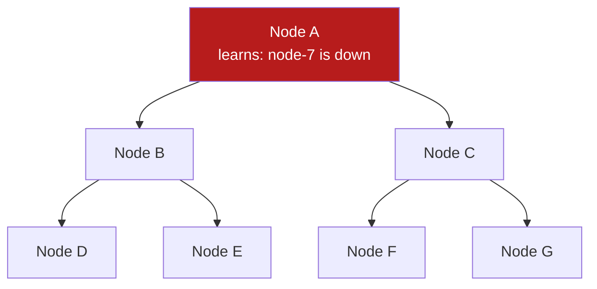
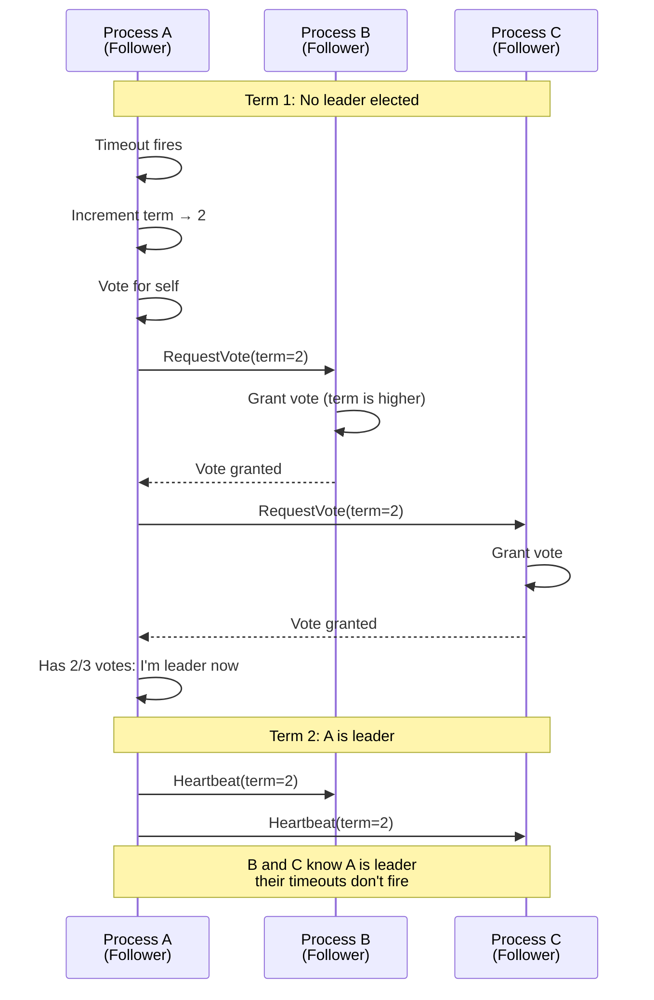
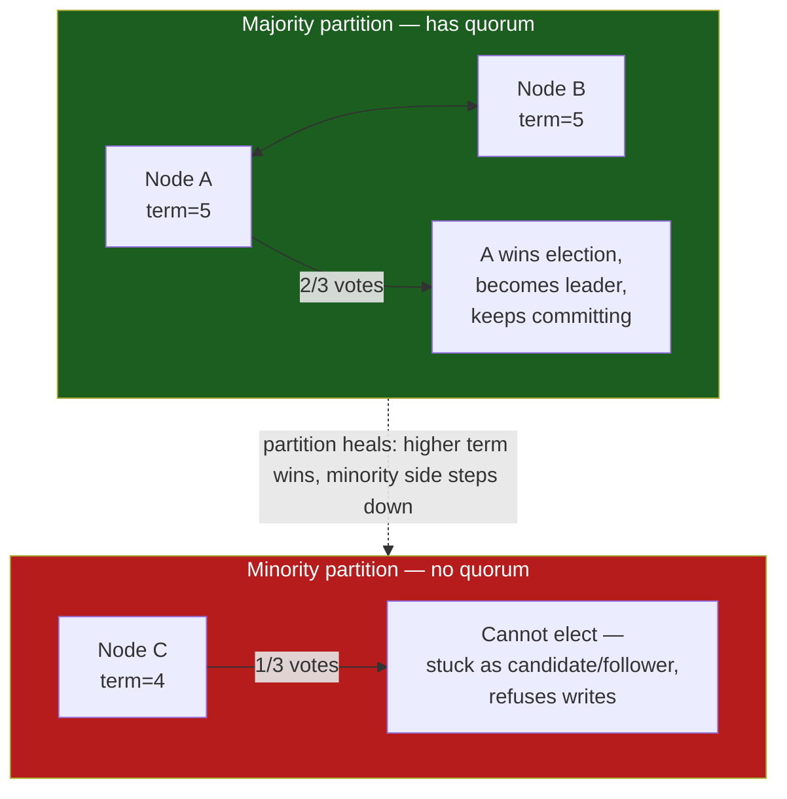
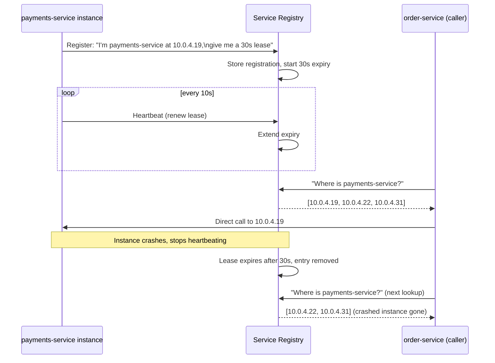
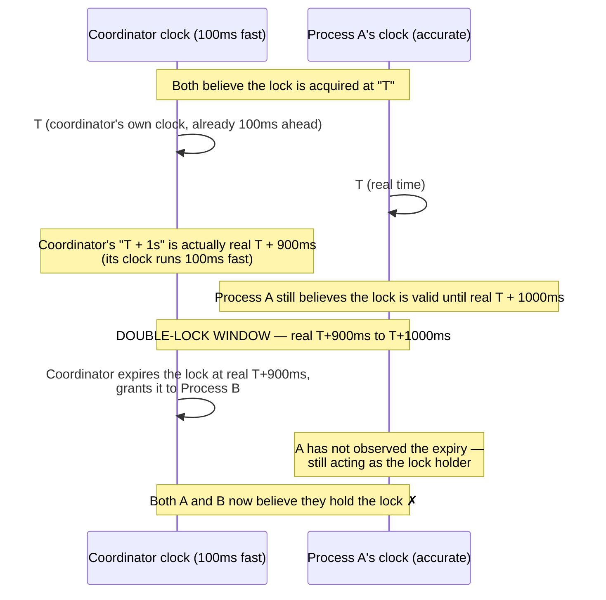

# Distributed Fundamentals

**Prerequisites:** [Consistency Models](consistency-models.md), [Replication](replication.md)

[← Distributed Systems](index.md)

---

## Why This Exists

You have three database replicas. A user updates their profile on replica A. The update has not yet reached replica B. A network partition occurs — A and B are disconnected. Both accept writes. Then the partition heals.

Now you have two conflicting versions of the profile. Your system needs to:
- Detect that a conflict happened
- Decide which version wins (and communicate why)
- Possibly merge them
- Ensure all replicas agree on the outcome

This document teaches the primitives that make consensus possible: logical time (so causality is measurable), leader election (so one replica can decide), and distributed locks (so only one thing changes at a time).

---

## The Core Problem: Machines Cannot Share Time

**In a single machine:**
```python
x = 1     # Timestamp: T1
y = x + 1 # Timestamp: T2, and T2 > T1
```

Clear causality: y depends on x.

**Across machines:**
```
Machine A: x = 1  (clock says 10:00:00.000)
Machine B: y = 2  (clock says 10:00:00.001, but is actually 50ms faster than A)

Question: Did x = 1 happen before y = 2?
Answer: Depends whose clock you trust (and you cannot trust any of them).
```

Physical clocks drift. NTP gets you within milliseconds, not microseconds. **You cannot rely on physical time for causality.**

Solution: **logical time** — a counter that increases with every event, so causality is provable without trusting any clock.

---

## Lamport Clocks: Counting Events

### The Idea

Each process maintains a counter, incremented on every event. When communicating, processes exchange counters and advance their own:

```
Process A                    Process B
Counter: 0                   Counter: 0

Event: Send message          
Counter: 1                   
  ↓ Message (carry counter=1)
                             Receive message
                             Counter: max(0, 1) + 1 = 2
                             
Event: Another action        
Counter: 2                   
                             Event: Another action
                             Counter: 3
```

**Lamport timestamp = (logical_counter, process_id)**

The process_id is the tiebreaker:
- Event at A with counter 5: `(5, A)`
- Event at B with counter 5: `(5, B)`
- `(5, A) < (5, B)` because A < B lexicographically

### Visual: Lamport Clocks Over Time

Receive rule: `local = max(local, message) + 1`. A send of `time=1` into a process at `0` becomes `2`, not `1`.



### The Limitation

Lamport clocks tell you *some* ordering, but not complete causality. Example:

```
Event X at process A: time (5, A)
Event Y at process B: time (5, B)

These never communicate with each other. 
Neither sees the other's events.

Which happened first? Lamport says X < Y (because A < B).
But actually, they're concurrent — neither caused the other.
```

**Lamport clocks preserve order when there's a message, but lie about concurrent events.**

---

## Vector Clocks: Tracking Causality Precisely

Vector clocks fix this by tracking the history of every process:

```python
# Vector clock is a dict: process → count
Process A clock: {A: 0, B: 0}
Process B clock: {A: 0, B: 0}

# Process A has an event
Process A increments its own: {A: 1, B: 0}

# Process A sends a message to B (carries its clock)
# Receive is two steps — do not fold B's increment into the merge:
Process B receives: {A: 1, B: 0}
Process B merges (component-wise max): {A: 1, B: 0}
Process B increments its own once:     {A: 1, B: 1}   # the receive event

# Process B has another local event
Process B increments: {A: 1, B: 2}
```

### Causality Detection

Event X happened before event Y if X's clock[i] ≤ Y's clock[i] for every process, and at least one component is strictly less.

```python
X = {A: 1, B: 1}   # B's receive
Y = {A: 1, B: 2}   # B's next local event

For each process:
  X[A] = 1 ≤ Y[A] = 1 ✓
  X[B] = 1 < Y[B] = 2 ✓

Result: X happened before Y (there's a causal path)
```

If neither dominates, they're **concurrent**:

```python
X = {A: 2, B: 1}
Y = {A: 1, B: 2}

X[A] = 2 > Y[A] = 1  (X knows more than Y about A)
Y[B] = 2 > X[B] = 1  (Y knows more than X about B)

Result: X and Y are concurrent (no causal path between them)
```

### Visual: Vector Clocks Detect Concurrency



---

## Distributed Locks: Ensuring One Writer

**Problem:** Two processes both try to update a resource. Without coordination, both succeed with conflicting changes.

```
Process A: Read x=1; write x=2
Process B: Read x=1; write x=3

Result: x=3 (B's write wins, but A's read was stale)
```

### Naive Solution: Central Coordinator

One machine holds "the lock":

```python
class Lock:
    def __init__(self):
        self.holder = None
    
    def acquire(self, process_id):
        if self.holder is None:
            self.holder = process_id
            return True
        return False
    
    def release(self, process_id):
        if self.holder == process_id:
            self.holder = None
```

**Problem:** If the coordinator crashes, nobody can acquire or release locks.

### Redlock: Distributed Lock with Multiple Coordinators

Use a quorum (majority) of coordinators. To acquire a lock, you must contact the majority:

```
Process A tries to acquire lock:
  → Contact coordinator 1: Grant (ok, A holds lock)
  → Contact coordinator 2: Grant (ok, A holds lock)
  → Contact coordinator 3: Grant (ok, A holds lock)
  
A has 3/5 coordinators: A holds the lock

Meanwhile, Process B tries:
  → Contact coordinator 1: Deny (A holds it)
  → Contact coordinator 2: Deny (A holds it)
  → Contact coordinator 4: Grant
  → Contact coordinator 5: Grant
  
B has only 2/5: B does NOT hold the lock

If coordinator 3 crashes, A still has 2/3 remaining.
```

**Trade-off:** You pay extra round trips. Redlock is also **controversial** as a correctness story: Martin Kleppmann's critique is that pause/GC after you think you still hold the lock, plus dependence on loosely synchronized clocks, can still produce two holders. Redis's own docs treat it as best-effort mutual exclusion, not a linearizable lock.

**What actually makes a distributed lock safe:** a monotonically increasing **fencing token** (ZooKeeper zxid, etcd revision, Raft log index) that the lock service returns on acquire. Every write to the resource includes the token; the resource **rejects** any write whose token is stale. That stops a delayed former holder from writing after its TTL expired — which no amount of "run the timer on the client" can do. See [leases](#leases-a-lock-with-a-built-in-expiry-contract) and [Consensus & Raft](raft.md).

---

## Leases: A Lock With a Built-In Expiry Contract

Redlock's clock-skew problem (Scenario 1 below) points at a deeper issue: **a plain lock has no answer to "what if the holder crashes and never releases it?"** Someone has to detect the crash and clean up — and detecting a crash reliably in a distributed system is itself unsolved (you can't tell "crashed" apart from "just slow" without waiting an unbounded amount of time).

A **lease** is a lock that expires automatically, so the system never depends on the holder cooperating to release it, and never depends on perfectly detecting a crash either — it just waits out the clock.

```python
class Lease:
    def __init__(self, duration_seconds):
        self.holder = None
        self.expires_at = None
        self.duration = duration_seconds

    def acquire(self, process_id, now):
        if self.holder is None or now >= self.expires_at:
            self.holder = process_id
            self.expires_at = now + self.duration
            return True
        return False

    def renew(self, process_id, now):
        # Holder must actively renew before expiry, or lose the lease.
        if self.holder == process_id and now < self.expires_at:
            self.expires_at = now + self.duration
            return True
        return False
```

```
Process A acquires a 10-second lease at T=0. Expires at T=10 unless renewed.

Process A crashes at T=3 (no clean release, no heartbeat, nothing).

T=10: lease expires automatically. Any process can now acquire it.
       Nobody had to detect that A crashed — the clock did the work.

If A had NOT crashed, it renews at T=8 (before expiry), extending to T=18.
```

**Why this changes the failure mode compared to a plain lock**: a plain lock held by a crashed process is held forever, unless something external notices and force-releases it. A lease held by a crashed process is held for, at most, one lease duration — bounded, known in advance, and requires nobody to actively detect the crash.

**The clock-skew trap doesn't disappear, it changes shape**: if the lease-holder's clock runs slow relative to the lock-service's clock, the lock service can expire the lease *before* the holder believes it has expired — now two processes can believe they hold the lease simultaneously (this is exactly Scenario 1 below). The fix is the same principle used for JWT/cert expiry in [Zero Trust Architecture](../security/zero-trust-architecture.md): keep lease durations short relative to realistic clock drift, and have the holder renew well before its *own* believed expiry, not wait until the last moment.

**Where leases show up in practice**: Kubernetes uses leases for leader election among controller replicas (`coordination.k8s.io/Lease`); Chubby (Google) and etcd/Consul use them as the primitive underneath distributed locks and service registration — "this service instance is alive" is itself a lease that must be renewed via heartbeat, or the registration expires. That's the bridge to Service Discovery, below.

---

## Gossip Protocols: Spreading Information Without a Coordinator

Leader election and quorum locks assume you can reach a majority of nodes directly. **Gossip protocols solve a different problem: how does information (node membership, a config change, "node X is down") spread through a *large* cluster (hundreds or thousands of nodes) without every node talking to every other node?**

### The Idea: Epidemic Spread

```
Every few hundred milliseconds, each node picks a few random peers and
shares what it knows ("node 7 is down", "config version is now 42").

Round 0: Node A learns "node 7 is down"
Round 1: A tells 2 random peers (say B, C). Now 3 nodes know.
Round 2: B, C each tell 2 random peers. Now up to 7 nodes know.
Round 3: Up to 15 nodes know.
Round N: Information has spread to roughly 2^N nodes.
```



**This is exponential propagation with no central coordinator and no single point of failure** — unlike a leader broadcasting to every follower directly (which fails if the leader is unreachable from part of the cluster), gossip keeps spreading through whatever paths are actually alive, self-healing around partial network failures.

### Why Not Just Broadcast From One Node?

```
Direct broadcast: Node A sends "node-7 is down" to all 1000 nodes directly.
  Problem: A is now a bottleneck (1000 connections) and a single point of
  failure (if A can't reach some subset due to a partial network issue,
  those nodes never learn).

Gossip: A tells a few peers, they tell a few more, etc.
  No node is a bottleneck. Even if some paths are broken, the epidemic
  spread finds alternate routes through the surviving mesh of gossip
  exchanges — the same resilience property that makes actual epidemics
  hard to contain by blocking any single carrier.
```

**Cost**: gossip is *eventually* consistent, not immediate — it takes O(log N) rounds for information to reach the whole cluster, so there's a real window where different nodes have different views of the world (exactly the read-after-write staleness problem from replication lag, just for membership/config state instead of application data). And gossip needs conflict resolution for concurrent updates — vector clocks or version numbers, same primitive covered earlier in this page, applied to membership state instead of application state.

**Used by**: Cassandra and DynamoDB-style databases for cluster membership and failure detection; Consul and Serf for service discovery; SWIM-based protocols in many service meshes.

---

## Paxos vs. Raft: Two Answers to the Same Problem

[Consensus & Raft](raft.md) covers Raft's mechanics in depth. Worth placing it next to its older sibling, Paxos, because "why not just use Paxos" is a real interview question.

```
Paxos (1989, Lamport): proven correct, but famously hard to understand
  and even harder to implement correctly from the paper alone — the
  original paper is notorious for being nearly unreadable, and production
  Paxos implementations (Google's Chubby) required substantial engineering
  beyond the paper to be practical.

Raft (2014): explicitly designed as "Paxos, but understandable." Same
  guarantees (safety under any number of node failures short of a
  majority, liveness once a majority can communicate), but decomposed
  into separable sub-problems: leader election, log replication, and
  safety — each easier to reason about and implement correctly than
  Paxos's single monolithic protocol.
```

| | Paxos | Raft |
|---|---|---|
| Core guarantee | Same as Raft — majority quorum agreement | Same — majority quorum agreement |
| Structure | Single protocol handling election + agreement together | Explicitly separated: leader election, log replication, safety |
| Leader | Implicit / optional (Multi-Paxos adds one for efficiency) | Mandatory, explicit part of the protocol from the start |
| Real-world track record | Chubby, Spanner's internals | etcd, Consul, CockroachDB, Kafka's KRaft mode |
| Why one over the other | Rarely chosen new today — mostly legacy systems built before Raft existed | The default choice for new systems — same guarantees, dramatically easier to implement correctly and to debug |

**Interview signal**: "They provide the same guarantee — safety with any minority of failures, progress once a majority can talk to each other. Raft is preferred for new systems because its explicit leader and separated sub-problems make it tractable to actually implement correctly; Paxos shows up mostly in systems built before Raft existed, or in variants (Multi-Paxos, Fast Paxos) tuned for specific performance properties Raft doesn't optimize for." (Don't claim Raft is "better" in the abstract — it's better *to implement correctly*, which is a real and underrated axis.)

---

## Leader Election: Choosing One Decision-Maker

When a leader fails, how do you elect a new one without it taking 10 minutes or causing a split-brain (two leaders)?

### Raft: The Understandable Consensus Algorithm

Raft divides time into **terms** (each term has at most one leader). A process becomes a leader by winning an election.

**Election Process:**
1. A process's election timeout fires (randomly 150-300ms)
2. It increments its term and votes for itself
3. It requests votes from other processes
4. If it gets a quorum (majority), it becomes leader
5. The leader sends heartbeats to prevent new elections



**Why randomized timeouts prevent split-brain:**

If all processes had the same timeout, they'd all fire at once and deadlock trying to elect. Randomized timeouts mean one process almost always fires first, wins an election, and sends heartbeats before others fire.

### Visual: Raft Terms and Leaders


---

## Split-Brain: When Partitions Create Two Leaders

A network partition divides the cluster:



```
Partition 1: A, B (have 2/3, quorum)
Partition 2: C (has 1/3, not quorum)

A becomes leader in partition 1.
C cannot become leader (doesn't have quorum).

Now partition heals.
A and C both exist.

Who is the real leader? → A (because A's term is higher)
C steps down.
```

**What if the partition isolates the current leader?**

```
Partition 1: A (was leader, has 1/3, not quorum)
Partition 2: B, C (have 2/3, quorum)

A still *believes* it is leader — Raft does not magically step it down
or bump its term just because it is isolated. It cannot commit
(no majority to replicate to). Clients talking to A stall or time out.

B or C times out, starts an election, wins with quorum, and becomes
leader in a *higher* term. That majority partition keeps committing.

When the partition heals, A sees a higher term on a heartbeat/vote
request and *then* steps down. See [Consensus & Raft](raft.md).
```

**Key insight:** Quorum voting ensures only one partition can **commit**. The minority side may still have a stale leader that thinks it is in charge; it just cannot complete a majority write.

---

## Service Discovery: Finding a Node Whose Address Keeps Changing

Everything above assumes processes already know how to reach each other. In practice, in a system with autoscaling, rolling deploys, and crash-restarts, **a service's set of live instances and their IP addresses changes constantly.** Service discovery is where leases and gossip stop being abstract primitives and become the plumbing that makes "call the payments service" actually work.

### The Naive Approach and Why It Breaks

```
✗ Hardcode IPs: payments-service lives at 10.0.4.12
  Autoscaling adds instance 10.0.4.19 → nobody calling the hardcoded
  IP ever reaches it. A deploy replaces 10.0.4.12 with a new instance
  at a new IP → every caller breaks until manually updated.
```

### The Registry Pattern



**This is a lease, exactly as described above, applied to "am I alive" instead of "do I hold this lock."** An instance's registration is only valid as long as it keeps renewing — if it crashes, nobody has to detect the crash explicitly; the lease simply expires and the registry stops returning that address to callers.

**Why not have the registry poll every instance instead of instances heartbeating in?** Polling means the registry needs to know every instance to poll in the first place (chicken-and-egg for newly started instances) and scales the registry's outbound connections with cluster size. Heartbeat-in scales better — each instance only ever talks to the registry, not the other way around.

### Client-Side vs. Server-Side Discovery

```
Client-side discovery: caller queries the registry directly, then picks
  an instance itself (as in the diagram above). Caller needs registry-aware
  logic and its own load-balancing policy (round robin, least-connections).
  Used by: Netflix Eureka + Ribbon, Consul with client-side lookups.

Server-side discovery: caller sends the request to a fixed address (a
  load balancer or service mesh sidecar), which itself queries the registry
  and forwards the request. Caller code stays simple — just "call
  payments-service" — the registry-awareness lives in the infrastructure layer.
  Used by: Kubernetes Services (kube-proxy handles this transparently),
  most service mesh sidecars (Istio/Envoy) as covered in
  [Modern Protocols & Service Mesh](../networking/modern-protocols-service-mesh.md).
```

**Interview signal**: "Kubernetes's own Service abstraction is server-side discovery — a Service gets a stable virtual IP, and kube-proxy/the mesh sidecar handles the actual instance selection and rotation as pods come and go, so calling code never touches the registry directly. That's usually the right default; client-side discovery earns its complexity when you need discovery logic the platform doesn't give you (custom load-balancing weights, cross-region-aware routing)."

### How Registries Stay Consistent With Many Nodes

A production-scale registry (Consul, etcd-backed) is itself a distributed system, and uses exactly the primitives from earlier in this page: **Raft or Paxos for the strongly-consistent core** (so registrations don't get lost or duplicated), often with **gossip for propagating membership/health info cheaply** across a larger set of read replicas that don't need to be part of the consensus group. This is the practical payoff of learning consensus and gossip as separate tools — a real system usually layers them, using the expensive strongly-consistent mechanism only where correctness truly requires it, and the cheap eventually-consistent mechanism everywhere else.

---

## Real-World Scenarios: What Can Go Wrong

### Scenario 1: Clock Skew

A **slow** coordinator clock (lags real time) expires **late** — it thinks less time has passed. The dangerous direction for double-hold is a **fast** clock: the coordinator thinks more time has passed and expires the lock **early**, while the holder still believes it is valid.

```
Coordinator clock is 100ms *fast* (ahead of real time).
Process A acquires a lock with a 1-second TTL.

Coordinator thinks: "acquired at T, expires at T+1s"
Real time when the coordinator's clock hits T+1s: T+900ms.

Coordinator expires the lock at real T+900ms and grants it to B.
Process A still believes it holds the lock until real T+1000ms.

Double-hold window: real T+900ms to T+1000ms. ✗
```



**Fix:** Do not try to "run the TTL on the client." A client-side timer does not stop the coordinator from granting the lock to B, and a GC pause can make A write *after* its own timer. The coordinator (or lock service) expires the lease; **every write carries a fencing token**; the resource rejects stale tokens. Clock-dependent TTLs remain a liveness mechanism, not a safety mechanism.

### Scenario 2: Leader Election Storms

```
5 processes, all with the same election timeout.
All timeouts fire simultaneously.
All start elections at the same time.
All split votes 5 ways.
No one gets a quorum.

All increment term and retry.
Cycle repeats forever.
```

**Fix:** Randomized timeouts (Raft uses this).

### Scenario 3: Stale Follower Becomes Leader

```
Process A is leader, replicates writes to B and C.
B goes offline (network fault).

A crashes.
B rejoins the network.

B has only seen writes up to T10.
C also has writes up to T20 (it stayed online).

If B becomes leader (faulty election), writes T10-T20 disappear. ✗
```

**Fix:** Raft's leader election requires that a candidate's log is "at least as up-to-date" as others. B's log (T10) is behind C's (T20), so B cannot win the election.

---

## Interview Guide: From Theory to Practice

### What You Must Explain

1. **Why logical time matters:** Physical clocks drift; causality is invisible without logical time.
2. **Lamport clocks solve ordering:** But don't distinguish concurrency (vector clocks do).
3. **Vector clocks solve causality:** But scale poorly (clock size = number of processes).
4. **Quorum voting prevents split-brain:** Majority partition can decide; minority partition cannot.
5. **Randomized election timeouts prevent deadlock:** One process wins, prevents simultaneous elections.
6. **Clock skew breaks TTL-only locks:** a *fast* coordinator expires early and can double-grant. Safety is a fencing token on every write, not moving the timer to the client.
7. **Leases bound the damage of a crash without requiring anyone to detect it:** a lock held by a dead process is held forever; a lease held by a dead process expires on its own.
8. **Gossip trades immediacy for scale:** no single coordinator, no bottleneck, but information takes O(log N) rounds to reach everyone — eventually consistent by design.
9. **Raft and Paxos give the same guarantee; Raft is chosen for new systems because it's tractable to implement correctly**, not because it's theoretically stronger.
10. **Service discovery is leases and gossip applied to "is this instance alive," not a separate concept** — a registration is a lease; large registries often layer consensus (correctness) with gossip (cheap propagation).

### Example Question Walkthrough

**Q: "Your three-node cluster was partitioned. Node A and Node B lost connectivity to Node C. After 5 seconds, both A and B think they are leaders and accept writes. What went wrong?"**

**Answer:**
"This sounds like a Raft failure — probably an election quorum bug or a clock skew issue. Here's my diagnosis:

First, I'd check if you're using a majority quorum. With 3 nodes, the majority is 2. So:
- If A and B can both become leader, they must both have gotten 2 votes (themselves + one other).
- That means at least one of A or B did not verify the other's term.

Second, I'd check election timeouts:
- If all three nodes had synchronized timeouts, they'd all fire together and deadlock on the same term forever.
- Did you implement randomized timeouts? (Raft uses 150-300ms randomly.)

Third, I'd check for stale leaders:
- Did A think it was still leader from an old term? Raft requires that every message carries the term, and a process steps down if it sees a higher term.

My fix: Ensure the implementation checks the other node's term before becoming leader. Only become leader if you get votes from a quorum *in the current term*. And use randomized timeouts.

I'd also instrument the code to log term changes and elections so we can see exactly what happened when the partition occurred."

---

## Key Takeaways

!!! success "Remember"
    1. **Physical clocks drift.** Use logical time (counters) to order events causally.
    2. **Lamport clocks order events** but can't distinguish causality from concurrency.
    3. **Vector clocks track causality precisely** (event A happened before B, or they're concurrent).
    4. **Quorum voting prevents split-brain** — only the majority partition can decide.
    5. **Randomized election timeouts prevent election deadlock** — one process usually wins first.
    6. **The minority partition cannot *commit*.** An isolated old leader may still believe it is leader until it sees a higher term; it just cannot gather a majority.
    7. **TTL-only locks are not safe under clock skew or GC pauses.** Expire on the lock service; fence every write with a monotonic token. Redlock is best-effort, not a linearizable lock.
    8. **Every write carries a term number.** A process steps down if it sees a higher term.
    9. **A lease is a lock with automatic expiry** — nobody needs to detect a crash; the clock bounds the damage.
    10. **Gossip spreads membership/config info without a coordinator**, at the cost of eventual (not immediate) consistency across the cluster.
    11. **Paxos and Raft solve the same problem** — prefer Raft for new systems for implementability, not because the guarantee differs.
    12. **Service discovery = leases (instance registration) + gossip or consensus (propagating that registry) — the primitives above aren't abstract, this is where they're used daily.**

---

## Related Topics

- [Consistency Models](consistency-models.md) — how causality affects user-visible consistency
- [Replication](replication.md) — how writes are coordinated across replicas
- [Raft](raft.md) — the full consensus algorithm with a simulator
- [DDIA Concepts](../databases/ddia-concepts.md) — quorum reads/writes and consensus in the context of database replication specifically
- [Zero Trust Architecture](../security/zero-trust-architecture.md) — short-lived credentials as the security analogue of leases
- [Modern Protocols & Service Mesh](../networking/modern-protocols-service-mesh.md) — server-side service discovery via sidecar proxies in practice

**Previous:** [Distributed Systems](index.md) | **Next:** [Raft](raft.md)
