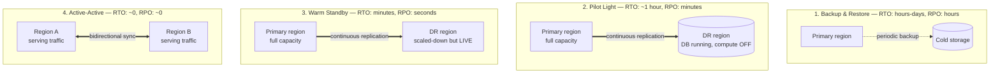
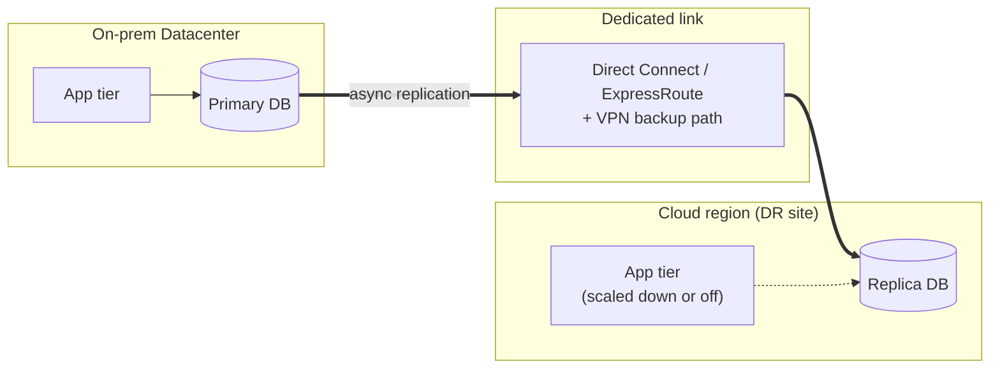

# Multi-Region Architecture & Disaster Recovery

**Prerequisites:** [Replication](replication.md), [Consistency Models](consistency-models.md)

[← Distributed Systems](index.md) | **Previous:** [Raft](raft.md)

---

## Why This Exists

A single-region system has one region-sized SPOF (see [Single Points of Failure](../reliability/single-points-of-failure.md), applied at the largest possible scale): the AWS `us-east-1` outage, the datacenter that loses power, the fire suppression system that floods the server floor. None of these are exotic — they've all happened. The question a DR strategy answers isn't "can this happen" — it's **"when it happens, how much data do we lose, and how long are we down?"**

Those two numbers have names:

- **RTO (Recovery Time Objective)** — how long can the system be down before recovery completes?
- **RPO (Recovery Point Objective)** — how much data (measured in time) can be lost — i.e., how stale is the most recent backup/replica you fail over to?

Both can be driven toward zero. Neither is free — and the cost curve isn't linear, it's closer to exponential as RTO/RPO approach zero. **The senior skill here is picking a point on that curve deliberately, tied to an actual business requirement, instead of reflexively saying "multi-region active-active" because it sounds impressive.**

---

## Mental Model: Two Dials, One Cost Curve

```
Cost / complexity
        │                                                    ● Active-Active
        │                                          ● Warm Standby
        │                                ● Pilot Light
        │                    ● Backup & Restore
        └────────────────────────────────────────────────────────
          RTO: days          hours        minutes        seconds
          RPO: hours          minutes      seconds        ~0
```

Each tier to the right buys you a smaller RTO/RPO by keeping *more infrastructure warm, more data replicated, in more places, all the time* — which is exactly what costs money and adds operational surface area. There is no tier that's simply "better" than another; there's only the tier that matches what the business actually needs, which is why the first question in any DR design is "what's the RTO/RPO requirement," not "what pattern should we use."

---

## The Four DR Tiers



- **Backup & restore:** back up data periodically, store it (ideally in a different region/provider than the primary), and rebuild everything from scratch on disaster. Cheapest, slowest — RTO is however long it takes to provision infrastructure and restore data, which for a large database is measured in hours, sometimes days.
- **Pilot light:** the smallest possible version of the system runs permanently in the DR site — usually just the database, kept in sync via continuous replication — while compute stays off until needed. On disaster, you scale up compute around the already-warm data. RTO drops because the slowest part (data) is already there.
- **Warm standby:** a scaled-down but fully functional copy runs continuously in the DR site, capable of handling some traffic already. Failover means scaling it up and redirecting traffic, not building it from nothing.
- **Active-active:** both (or more) regions run at full capacity, serving live traffic simultaneously, with bidirectional replication. There's no "failover" step for reads/writes to the healthy region — traffic just stops routing to the dead one. This is also the hardest tier to get right: bidirectional writes mean you've taken on the multi-leader conflict problem (see [Replication](replication.md) and [CRDTs](../architecture-patterns/crdts.md) if writes need to merge automatically).

!!! warning "RPO is bounded by your replication method, not your ambition"
    Asynchronous replication (the common case across regions, because synchronous cross-region replication adds real latency to every write) means the DR copy is always *some* amount behind. RPO ≈ replication lag at the moment of failure, and lag spikes under load — the worst time for your DR copy to be stale is exactly during the incident that's causing the failover.

---

## Cloud ↔ Datacenter Scenarios

Multi-region DR is usually taught as cloud-region-to-cloud-region. In practice, a large fraction of real DR architectures are **hybrid** — one side is a cloud region, the other is an on-prem datacenter — and this combination has failure modes the pure-cloud version doesn't.



**Why this pairing is common, and why it isn't symmetric:**

- **DC primary, cloud DR site** — the most common shape. Standing up a *second physical datacenter* purely as a cold DR target is expensive and slow to provision; a cloud region gives you elastic, pay-for-what-you-use pilot-light or warm-standby capacity without a second lease and a second hardware refresh cycle. This is frequently the first cloud workload a DC-heavy org runs — DR, not the primary app.
- **Cloud primary, DC DR site** — less common, but real: regulated industries where data residency, a specific compliance certification, or a contractual requirement mandates that a recoverable copy exist on infrastructure the company physically controls, independent of any single cloud vendor. Also shows up as insurance against a full cloud-provider-account-level failure (billing dispute, account suspension, provider-wide outage) that a same-vendor multi-region setup doesn't protect against.
- **Mid-migration (both are "primary" for a while)** — during a lift-and-shift or replatform, the DC and the cloud region run in parallel, often with the DC as source of truth and the cloud side catching up via replication until cutover. This is DR infrastructure and migration infrastructure using the identical mechanism (continuous replication + a cutover runbook) for different purposes — worth naming explicitly when asked, since interviewers sometimes conflate "migration plan" and "DR plan" and the honest answer is "they share a replication pipeline, but the failback story is different."

**What's different from cloud-to-cloud DR:**

| Concern | Cloud-to-cloud | Cloud-to-DC (hybrid) |
|---|---|---|
| Network path | Same provider backbone, low/predictable latency | Dedicated link (Direct Connect / ExpressRoute) or VPN over the public internet — higher, less predictable latency, and now a *third* thing that can fail besides the two sites |
| Bandwidth cost | Often free/cheap within a provider | Metered egress in both directions, plus the dedicated link's own cost |
| Provisioning speed on failover | Elastic — spin up more compute in seconds/minutes | Bounded by physical capacity already racked in the DC; you cannot "auto-scale" a datacenter mid-incident |
| Failback | Symmetric — same tooling both directions | Often asymmetric — cloud-side automation (autoscaling, IaC) doesn't have a DC-side equivalent, so failback is frequently a manual, longer, separately-tested procedure |
| Split-brain risk | Real, but same failure domain characteristics | Higher — a Direct Connect/VPN outage that doesn't take down either site independently is a distinct partition scenario (both sides are healthy and serving, but can't see each other) |

!!! tip "The interview tell"
    A candidate who says "we'll just replicate to the cloud for DR" without naming the link (Direct Connect vs. VPN-over-internet), its bandwidth/latency budget, and *what happens if the link itself is what fails* (independent of either site being down) hasn't actually designed the hybrid case — they've designed the cloud-to-cloud case and assumed it transfers.

---

## Failback Is Harder Than Failover

Failover gets the attention because it's the dramatic, time-pressured half. **Failback — returning to the original primary once it's healthy again — is usually the part that gets skipped in the design and then discovered the hard way during the actual incident.**

- Every write accepted by the DR site *during* the outage now has to reconcile with the original primary before it can resume serving — if the DR site took writes (warm standby or active-active), that's a second multi-leader conflict problem, not just "switch DNS back."
- Failback in the DC-as-DR-target direction is often manual and untested, because DR drills tend to test failover (the scary direction) and skip failback (the "we'll figure it out" direction) — which means the first real failback is happening under the additional pressure of "we've now been running degraded for however long the DR window lasted."
- **The only credible claim is "we've tested failover *and* failback, on a schedule."** "We have a replica" and "we have successfully failed over and back within our RTO in the last quarter" are different claims, and only the second one is evidence.

---

## Realistic Example

A payments company runs its primary stack in an on-prem datacenter (regulatory requirement: card data must stay on infrastructure they directly control) and a warm-standby DR site in a cloud region connected via a dedicated Direct Connect link with a VPN failover path. Database changes replicate asynchronously to the cloud region (RPO target: 30 seconds under normal load). Quarterly, they run a full failover drill: redirect a slice of production traffic to the cloud DR site, verify correctness, then fail back — and track actual RTO/RPO achieved against the target, not just "did the drill complete." Two things they learned from drills, not from design review: their DNS TTL was longer than their RTO target (fixed by lowering it and adding a traffic-manager health check instead of relying on DNS alone), and their failback runbook assumed the DC's connection pool would recover cleanly, which it didn't under real load — surfaced only because they actually failed back under load, not just failed over.

---

## Trade-offs

| Tier | RTO | RPO | Cost | When it's the right call |
|---|---|---|---|---|
| Backup & restore | Hours–days | Hours | Lowest | Non-critical internal tools; cost sensitivity outweighs downtime pain |
| Pilot light | ~1 hour | Minutes | Low–moderate | Most line-of-business apps; acceptable to be down briefly |
| Warm standby | Minutes | Seconds | Moderate–high | Customer-facing systems where an hour of downtime is a real incident |
| Active-active | ~0 | ~0 | Highest | Payments, safety-critical, or systems where *any* downtime breaches an SLA that has real financial teeth |

---

## Interview Questions

=== "Foundation"
    **Q: What's the difference between RTO and RPO?**

    "RTO is how long you can be down before you're recovered — a time duration. RPO is how much data you can afford to lose, measured as a time window — how stale the data is when you fail over. They're set independently: you could have a fast failover (low RTO) to a replica that's badly lagging (high RPO), or a slow failover (high RTO) to a replica that's perfectly current (low RPO). Both come from the business requirement, not from what's technically convenient to build."

=== "Senior"
    **Q: Your DR replica is asynchronous. During a real regional outage, how much data do you actually lose, and how would you find out?**

    "RPO in practice equals replication lag at the moment of failure, not the number in the design doc — and lag isn't constant, it spikes exactly when write volume is high, which correlates with exactly the kind of load that can precede or accompany an incident. I'd instrument replication lag as a first-class metric with alerting, not just assume the steady-state number holds. To find out how much was actually lost after a failover, I'd compare the last committed write timestamp on the DR replica against the primary's write log up to the moment it went unreachable — that gap is the real RPO for that specific incident, and it should get reported alongside the postmortem, not estimated from the SLA target."

=== "Staff"
    **Q: The company's primary infrastructure is an on-prem datacenter for regulatory reasons, but leadership wants a cloud DR site. Walk through the design decisions.**

    "First I'd pin down the actual RTO/RPO requirement — that decides the tier (pilot light vs. warm standby vs. active-active), and I wouldn't default to the most expensive one without a number backing it. Then the network path: Direct Connect or ExpressRoute as primary with a VPN-over-internet fallback, because the link between DC and cloud is now a distinct failure domain from either site individually — a link outage where both sites are healthy but can't talk to each other is a real scenario, not an edge case. I'd budget bandwidth and latency for the replication method chosen (async, almost certainly, given the physical distance and cost of synchronous cross-site writes), and treat replication lag as an alertable metric, not a design-time assumption.

    The part I'd push hardest on is failback, because it's the part that gets skipped: if the cloud DR site took writes during the outage (anything above pilot-light), those writes need to reconcile with the DC primary before failback, and DC-side automation for that reconciliation usually doesn't exist to the same maturity as cloud-side tooling — so I'd design and *test* the failback path explicitly, not assume it's the failover path in reverse. And I'd insist on a quarterly drill that measures actual achieved RTO/RPO against target, including failback, because 'we have a DR site' and 'we've proven we can use it under load and come back' are different claims, and only a tested drill produces the second one."

---

## Key Takeaways

!!! success "Remember"
    1. **RTO and RPO are two independent dials, both driven by business requirement, not by technical preference** — "multi-region active-active" is a cost decision, not a default best practice.
    2. **The four DR tiers (backup & restore → pilot light → warm standby → active-active) trade cost and complexity for smaller RTO/RPO** — pick the point on that curve the requirement actually demands.
    3. **RPO with async replication ≈ replication lag at failure time, which spikes under load** — instrument it, don't assume the steady-state number.
    4. **Cloud-to-DC hybrid DR adds a third failure domain (the link itself) and asymmetric tooling** — Direct Connect/ExpressRoute vs. VPN fallback, and cloud-side automation that often has no DC-side equivalent.
    5. **Failback is harder than failover and gets skipped in most designs** — any write accepted by the DR site during the outage has to reconcile before failback; only a drill that tests both directions is real evidence the plan works.

---

**See also:** [Replication](replication.md) for the mechanics of keeping copies in sync, [Single Points of Failure](../reliability/single-points-of-failure.md) for the redundancy levers this page applies at region scale, [CRDTs](../architecture-patterns/crdts.md) for merging concurrent writes in an active-active topology.

**Previous:** [Raft](raft.md)
