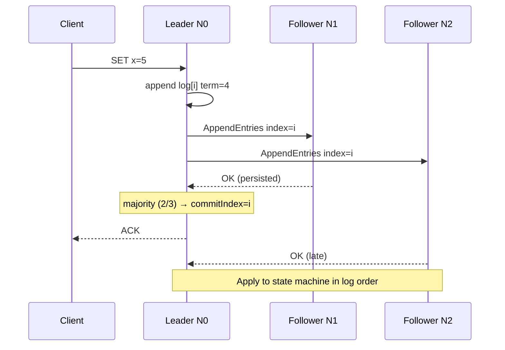

# Consensus & Raft

**Prerequisites:** [Replication](replication.md), [CAP Theorem](cap-theorem.md)

[← Replication](replication.md) | [Next: Database Sharding →](../databases/sharding.md)

---

## Why This Exists

You have **3 servers** holding the same config / lock / metadata. Clients must not see two truths.

```
3 replicas, all accept writes?     → split brain (two values of x)
only one accepts?                  → who? how do clients find them?
that one dies?                     → who takes over, and is the last write there?
two nodes think they are leader?   → same split brain, now with elections
disks differ after a partition?    → which log is law?
```

This is **consensus**: one history, despite crashes and delayed packets. Raft is the algorithm you can actually implement and explain.

!!! tip "Mental Model"
    Raft is a **replicated state machine**. The leader sequences client writes into a log. Followers copy the log. A majority (`⌊n/2⌋+1`) must persist an entry before it is **committed**. After commit, every future leader already has that entry — so the value cannot disappear.

    `leader = sequencer` · `term = epoch` · `majority = commit` · `timeout = election`

---

## Naive System → What Breaks

**Primary + 2 sync replicas, operator-picked primary.**

| Event | Break |
|-------|--------|
| Primary dies | Humans promote a replica. RTO = minutes. Did it have the last write? |
| Network blip | Old primary comes back, still accepts writes. Two primaries. |
| "Async replica is fine" | Promoted replica is missing 40 ms of writes. Money vanished. |
| All three vote forever | No timeout randomization → split votes → no leader → unavailability |

You need **automatic, safe** leader election and a rule that a new leader cannot forget committed entries. That rule *is* Raft.

---

## The Concept

Raft has three roles and a monotonically increasing **term**:

| Role | What it does |
|------|----------------|
| **Follower** | Silent. Answers RPCs. If election timeout fires with no heartbeat → candidate |
| **Candidate** | Increments term, votes for self, `RequestVote`s others. Majority → leader. Else → follower |
| **Leader** | Heartbeats (`AppendEntries`), accepts client writes, replicates log, advances **commit index** |

Safety, in one line: **a leader for term T commits only with a majority that voted in term T, and voters refuse anyone with a shorter / older log.**

Quorum for 3 nodes = 2. For 5 = 3. Even clusters waste a node (4 nodes still die if 2 are gone).

---

## Architecture



---

## Mechanics

### Terms and election timeout

Time is sliced into **terms**. At most one leader per term. Followers start a randomized timeout (e.g. 150–300 ms). Randomization breaks split votes: two candidates rarely time out together twice.

Heartbeat interval ≪ timeout (e.g. 50 ms vs 150–300 ms). If you invert that, healthy leaders get murdered.

### Voting rules

A follower grants a vote in term T only if:

1. It has not voted for someone else in T.
2. The candidate's log is **at least as up-to-date** — higher last-log term, or same term and last-log index ≥ local.

This is the safety hinge. A node that missed committed entries cannot win.

### Replicated log, match, commit

Each log entry is `(index, term, command)`. Leader tracks `nextIndex` / `matchIndex` per follower. It ships from `nextIndex`. On reject (term/index mismatch) it decrements and retries — **log matching** walks back to the fork and overwrites the follower's uncommitted tail.

**commitIndex** = highest index known to be stored on a majority. Leader may only count entries **from its own term** toward commit (the Figure-8 / "old-term entry" rule). Followers learn commitIndex on the next heartbeat and **apply** in order.

### Majority quorum

```
n=3  majority=2   survive 1 death or 1 partition
n=5  majority=3   survive 2
n=7  majority=4   survive 3   — more WAN chatter, slower commit
```

A partitioned leader of 1 cannot commit (no majority). It still *thinks* it is leader until it sees a higher term. Clients talking to it stall or time out — **CP**: consistent, not available.

### Membership (brief)

Adding a node with a blank log is dangerous (it can win and wipe). Raft uses joint consensus. In interviews: "I will not live-add voters without a two-phase membership change."

---

## Realistic Example With Numbers

etcd / Kubernetes control plane, 3 nodes, 1 ms LAN, 50 ms heartbeat, 200 ms timeout.

```
Client write                  1 RTT to leader  +  1 RTT majority fsync
LAN 1 ms + SSD fsync 1 ms     ≈ 3–5 ms p50 commit
Leader disk stall 200 ms      commit p99 = 200 ms; election if heartbeats slip
Leader process killed         followers time out ~200 ms, elect, +1 RTT
                              unavailability window ≈ 200–400 ms
Partition 1 node              2-node majority keeps committing
Partition 2 nodes from leader old leader uncommitted; new leader in majority
5-node cross-region (80 ms)   commit ≥ 80 ms  (majority may need a remote)
```

Throughput: serialize on the leader. A few 10k small commits/s on LAN is plausible; 100k needs batching (`MaxBatch`). The leader CPU and disk are the ceiling — not "the cluster."

---

## Interactive Explainer

Run the cluster, kill the leader, partition N1, heal. Watch **term**, **leader**, **commit**.

<div class="sim-container">
  <div class="sim-title">Raft Election Simulator</div>
  <div class="sim-controls">
    <button class="sim-btn success" onclick="window._raft && window._raft.run()">Run</button>
    <button class="sim-btn" onclick="window._raft && window._raft.pause()">Pause</button>
    <button class="sim-btn" onclick="window._raft && window._raft.step()">Step</button>
    <button class="sim-btn" onclick="window._raft && window._raft.reset()">Reset</button>
    <button class="sim-btn danger" onclick="window._raft && window._raft.killLeader()">Kill Leader</button>
    <button class="sim-btn danger" onclick="window._raft && window._raft.partition(1)">Partition N1</button>
    <button class="sim-btn success" onclick="window._raft && window._raft.heal()">Heal Network</button>
  </div>
  <canvas id="raft-canvas" class="sim-canvas" style="width:100%;height:280px;"></canvas>
  <div class="sim-stats">
    <div class="sim-stat"><div class="sim-stat-label">Term</div><div class="sim-stat-value" id="raft-term">0</div></div>
    <div class="sim-stat"><div class="sim-stat-label">Leader</div><div class="sim-stat-value" id="raft-leader">—</div></div>
    <div class="sim-stat"><div class="sim-stat-label">Commit</div><div class="sim-stat-value" id="raft-commit">0</div></div>
  </div>
  <div class="sim-log" id="raft-log"></div>
</div>

---

## Failure Modes

| Failure | Symptom | Why Raft is safe / what still hurts |
|---------|---------|-------------------------------------|
| Leader crash | Brief unavailability | New leader has all committed entries |
| Isolated leader | Writes hang | Cannot get majority; clients must retry elsewhere |
| Split vote | Extra term, no leader for a timeout | Randomization; increase timeout variance |
| Slow disk on leader | Heartbeats late → extra elections | Dedicated disk; tune timeout; check fsync p99 |
| Clock jump | Timeouts fire early | Use monotonic clocks; Raft does not need synced clocks |
| Uncommitted tail on old leader | Overwritten after rejoin | Correct — never ACKed to client |
| 2 of 3 dead | Cluster **read-only / down** | You bought 1-fault tolerance, not 2 |

!!! warning "Production Trap"
    Stretching a 3-node Raft across two regions (2+1) means a single region outage can steal majority *or* leave you with a leader that cannot commit. Either 3 AZs in one region, or 5 nodes with a real quorum story. "DR node" that is a voter is how you page yourself.

---

## Production Debugging

```
CPU         leader 90%, followers 10%     expected — serialize / serialize apply
Memory      unbounded raft log in RAM     snapshot / compact; etcd backend size
Disk        fsync p99 > election timeout  elections loop; WAL on fast disk
Network     loss between voters           term climbs; "election storm"
Queue depth propose channel full          apply slower than accept; backpressure
Lag         follower matchIndex behind    snapshot catch-up; slow disk
Pools       client conns to old leader     falsetimeout; refresh endpoints
p50/p95/p99 p50 4ms p99 250ms             disk / election / HOL on apply
Error rate  "no leader" / 503             quorum loss or election flap
Timeouts    client < 2× election timeout  false fail + retry duplicate
Retries     non-idempotent propose        apply twice unless request id
GC          300ms pause on leader         looks like death; followers elect
Locks       apply mutex                   commitIndex advances, apply stalls
```

Watch: `term`, `leader changes / min`, `commit index`, `propose latency`, `fsync latency`, `peer RTT`, `lost contact`.

---

## Scaling Limits

- **Write throughput = one leader's disk + apply CPU.** Scale *reads* via followers (stale) or a cache. Do not put user chat messages in Raft.
- Cluster size 3 or 5. 7 is rare. 100 is not Raft, it is a gossip problem.
- Log must snapshot or you OOM / slow restart.
- WAN Raft: commit latency ≥ median RTT to a majority. Physics, not config.
- A 3-node cluster's availability ceiling is "survive one fault." Two simultaneous faults = outage. That is the contract.

---

## Trade-offs

| Dimension | Raft (CP quorum) | Single primary + async replica | Gossip / AP |
|-----------|------------------|--------------------------------|-------------|
| Latency | Majority RTT + fsync | Local fsync | Local |
| Throughput | Leader-bound | Primary-bound, higher | Highest |
| Availability | Down if no majority | Up if primary up | Up during partition |
| Consistency | Linearizable if you read from leader | Lose ACKed writes on failover | Eventual |
| Durability | Majority disk | One disk | Best-effort |
| Complexity | High (correctness) | Low | High (merge) |
| Cost | 3–5 small nodes | 2 nodes | Many cheap nodes |
| Ops | Terms, disks, membership | Failover runbooks | Conflict tools |

---

## Interview Questions

=== "Foundation"
    **Q: How does Raft elect a leader?**

    "Followers wait a random election timeout. On expiry a node becomes candidate, increments its term, votes for itself, and asks peers. A peer grants the vote if it has not voted in that term and the candidate's log is at least as complete. Majority wins; the leader heartbeats so timeouts reset. Random timeouts make split votes unlikely to persist."

=== "Senior"
    **Q: A leader is partitioned from both followers. What do clients see? Can the isolated leader commit?**

    "It cannot commit — no majority. In-flight writes stall. Followers elect a new leader in a higher term. When the old leader sees that term it steps down and truncates any uncommitted tail. Clients must time out and retry against the new leader. This is the CAP choice: we refuse to create a second history."

=== "Staff"
    **Q: etcd elections every 10s in prod. How do you debug, and would you move to 5 nodes across two regions?**

    "Election loops are almost never 'Raft is broken.' I look at leader fsync p99 vs heartbeat, GC pauses, packet loss, and whether the timeout is 150ms on a noisy NIC. Fix the I/O and GC before touching algorithm knobs. Five nodes across two regions: commit now depends on the WAN if the majority spans regions, and a region cut can still leave you without quorum depending on the 3+2 split. I'd rather 3 nodes in 3 AZs in one region plus an async backup than a 2+2+1 fiction. If we need regional quorum, that's a different product (Spanner / multi-raft shards), not a bigger etcd."

---

## Reasoning Exercises

1. Why does a 4-node Raft still only tolerate **one** failure? Draw the majority.
2. The leader replicates entry `(index=10, term=3)` to one follower and dies before the other. Can the new leader drop index 10? Does the client have an ACK?
3. You need 1M writes/s of click events. Why is "put it in Raft" the wrong sentence? What *does* belong in Raft in that system?
4. Design a linearizable read. Why is "read any follower" wrong? What is a read index / lease?

---

## Key Takeaways

!!! success "Remember"
    1. One leader per term sequences the log; majority persist ⇒ commit.
    2. Election safety comes from log-uptodate voting, not from "the oldest node."
    3. Isolated leaders cannot commit — that is the feature.
    4. Raft is for metadata / config / locks. User data usually needs sharding *plus* per-shard Raft.
    5. Election storms are disks, GC, and networks — tune timeouts last.

**Previous:** [Replication](replication.md) | **Next:** [Database Sharding](../databases/sharding.md)

!!! info "Staff Engineer Lens"
    Consensus is an availability budget you spend on a tiny, precious dataset. Staff engineers fight to keep the Raft surface small: membership, feature flags, shard map — not the click stream. Every extra byte in etcd is a future election at 3 a.m.

!!! note "Interview Insight 🎯"
    Draw three boxes and a log before naming Raft. Walk a leader death, then a partition. If you can show why the committed entry survives and the uncommitted one may not, you have the offer-level answer. Name-dropping "strong leader" without commitIndex is trivia.
